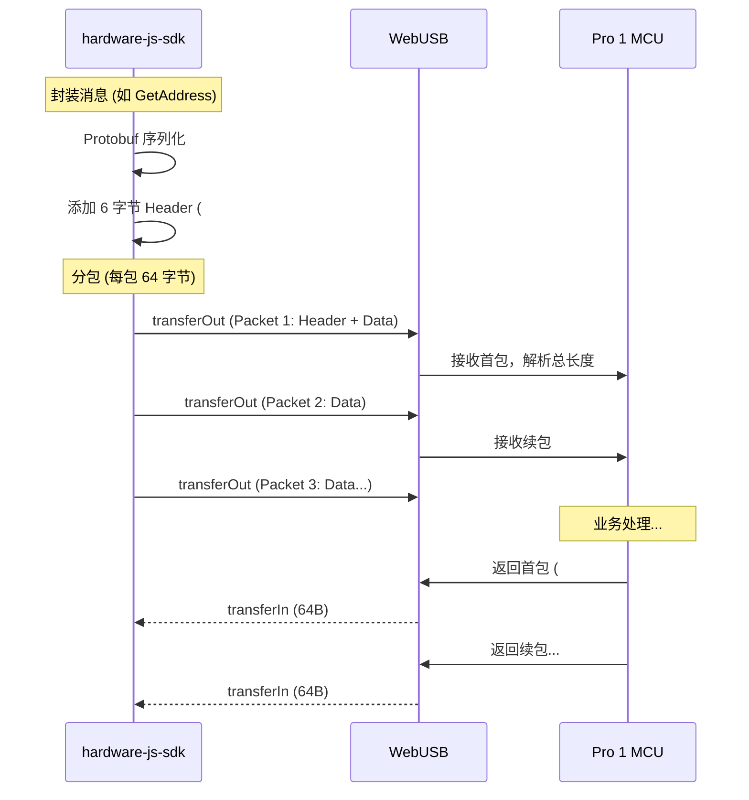
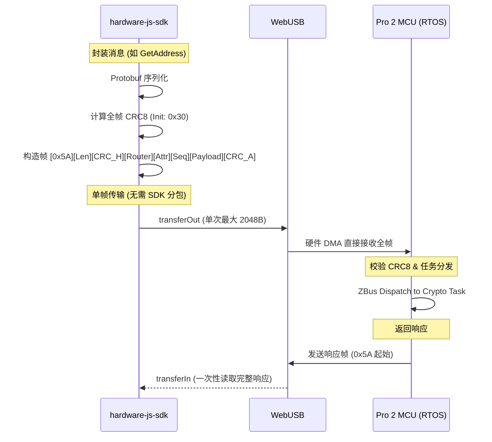

# OneKey Pro 1 vs Pro 2 协议深度对比与 SDK 接入指南

## 1. GetFeatures 字段详表与差异分析

下表对比了 Pro 1 (Legacy) 与 Pro 2 (Proto V0) 的 `Features` 消息字段。**加粗部分**表示 Pro 2 中新增、变更或具有重大逻辑差异的字段。

| 字段名 | Pro 1 (Legacy) | Pro 2 (Proto V0) | 说明 |
| :--- | :--- | :--- | :--- |
| `vendor` | "onekey.so" | "onekey.so" | 保持一致。 |
| `major_version` | 固件主版本 | 固件主版本 | 逻辑一致。 |
| `device_id` | 字符串 (Legacy ID) | **UUID 字符串** | Pro 2 采用标准 UUID 格式。 |
| `model` | "Pro" | "Pro" | 均为 Pro 系列。 |
| **`onekey_serial`** | 不支持 | **UUID 硬件序列号** | **Pro 2 新增**，用于唯一标识物理硬件。 |
| **`se_type`** | 不支持 | **SE 芯片型号枚举** | **Pro 2 新增**，区分 SE608A 等不同 SE 芯片。 |
| **`se_state`** | 不支持 | **SE 运行状态** | **Pro 2 新增**，标识 SE 处于 Boot 还是 App 模式。 |
| **`se_ver`** | 字符串 | **结构化版本号** | Pro 2 的 SE 版本信息更详细，支持子系统判定。 |
| **`ble_ver`** | 字符串 | **结构化版本号** | Pro 2 蓝牙固件版本，用于判定 BLE 功能支持。 |
| **`bootloader_version`**| 不支持 | **独立版本号** | **Pro 2 新增**，用于判定是否支持极速固件更新。 |
| `initialized` | bool | bool | 逻辑一致。 |
| `unlocked` | bool | bool | 逻辑一致。 |
| **`session_id`** | 随机字符串 | **ZBus Session ID** | Pro 2 中该 ID 与内部实时任务队列绑定。 |
| **`capabilities`** | 基础功能枚举 | **扩展功能枚举** | Pro 2 增加了对新链（如 Sui, Aptos）的原生支持标识。 |
| **`request_id`** | **不支持** | **4 字节整型** | **核心差异**：Pro 2 在链路层支持异步请求标识。 |

---

## 2. OnekeyFeatures (10025/10026) 专项对比

`OnekeyFeatures` 是 OneKey 硬件特有的扩展接口，用于提供比标准 `Features` 更深度的硬件全栈状态。

### 2.1 字段深度定义 (Pro 2 强化版)
在 Pro 2 中，由于采用了 **RTOS + 多子系统** 架构，该接口返回的信息大幅增加。

| 字段分类 | 关键字段 | Pro 1 (Legacy) | Pro 2 (Proto V0) | 说明 |
| :--- | :--- | :--- | :--- | :--- |
| **基础信息** | `onekey_device_type` | PRO (5) | PRO (5) | 保持一致。 |
| **版本控制** | `onekey_boot_version` | 基础版本 | **含 Build ID 的详细版本** | 用于判定固件包兼容性。 |
| **序列号** | `onekey_serial_no` | 硬件 SN | **UUID 格式 SN** | 物理层面的唯一标识。 |
| **多 SE 状态** | **`onekey_se01_state`** | 仅支持单 SE | **支持 01-04 四个槽位** | **Pro 2 核心改动**：支持查询多个安全芯片状态。 |
| | **`onekey_se01_ver`** | 单一字符串 | **结构化版本信息** | 细化了 SE 内部固件版本。 |
| **连接信息** | `onekey_ble_name` | 蓝牙名称 | 蓝牙名称 | 逻辑一致。 |

### 2.2 Pro 2 内部实现逻辑
*   **异步获取**：不同于 Pro 1 的静态读取，Pro 2 的 `OnekeyGetFeatures` 会触发一次内部的 **ZBus 广播**。
*   **任务协同**：`Foreground` 任务接收请求后，会向 `SE Agent` 任务请求最新的安全芯片状态，汇总后再通过 USB 返回。
*   **SDK 建议**：在 Pro 2 连接后，应**优先调用 `OnekeyGetFeatures`**，以获取最完整的硬件拓扑信息。

---

## 3. 私有协议扩展 (Private Range: 60000+)

Pro 2 引入了一系列专门用于工程测试和文件管理的私有协议（基于 `webusb_test.html` 整理）：

| Message ID | 消息名称 | 用途 |
| :--- | :--- | :--- |
| 60206 | `Ping` | 新协议连通性测试。 |
| 60800 | `FixPermission` | 修复 eMMC 文件系统权限。 |
| 60801 / 60802 | `PathInfo` / `Query` | 查询设备内部文件信息。 |
| 60804 / 60805 | `FileRead` / `Write` | **极速文件传输**：单包可达 2048B。 |
| 61000 | `FirmwareUpdate` | 触发 V3 固件更新流程。 |

---

## 4. 通讯时序图对比

### 2.1 Pro 1: Legacy 64 字节分包模式
Pro 1 受到物理 HID 报告大小限制，必须进行严格的分包。



### 2.2 Pro 2: Proto V0 长帧模式
Pro 2 利用新协议消除了分包开销，支持高达 2048 字节的单帧传输。



---

## 3. SDK 协议自动探测逻辑 (Dynamic Detection)

鉴于 Pro 1 未来也可能升级支持新协议，SDK **不能**仅依赖 PID 来写死协议。建议采用以下探测流程：

### 3.1 探测流程 (Handshake)
1.  **尝试新协议**：SDK 初始化后，先发送一个 **Proto V0 (0x5A)** 格式的 `GetFeatures`。
2.  **监听首字节**：
    *   如果返回数据以 `0x5A` 开头 -> **确认为 Pro 2 协议模式**。
    *   如果返回数据以 `0x3F` (WebUSB) 开头，且后续为 `0x23 0x23` -> **确认为 Legacy 模式**。
3.  **持久化标志**：在当前 `Device` 实例中记录 `protocolType`，后续 `Call` 直接调用对应序列化器。

### 3.2 伪代码实现
```typescript
async function detectProtocol(device) {
  try {
    // 1. 尝试用新协议打招呼
    const probePacket = Pro2Serializer.buildProbePacket();
    await device.transferOut(probePacket);

    const res = await device.transferIn(64);
    const firstByte = res.data.getUint8(0);

    if (firstByte === 0x5A) {
      return 'PROTO_V0';
    } else if (firstByte === 0x3F) {
      return 'LEGACY';
    }
  } catch (e) {
    // 容错处理：默认回退到 Legacy
    return 'LEGACY';
  }
}
```

## 4. 接入建议

*   **无状态处理**：虽然 Pro 2 内部支持状态，但为了兼容性，SDK 建议依然在 `acquire` 后执行一次协议探测 + `GetFeatures`。
*   **字节序陷阱**：再次提醒，新协议所有的 `Length` 和 `MessageID` 均为 **Little-Endian (小端)**，这与 Legacy 的大端序完全相反。

---
*文档版本：2026-03-18*
