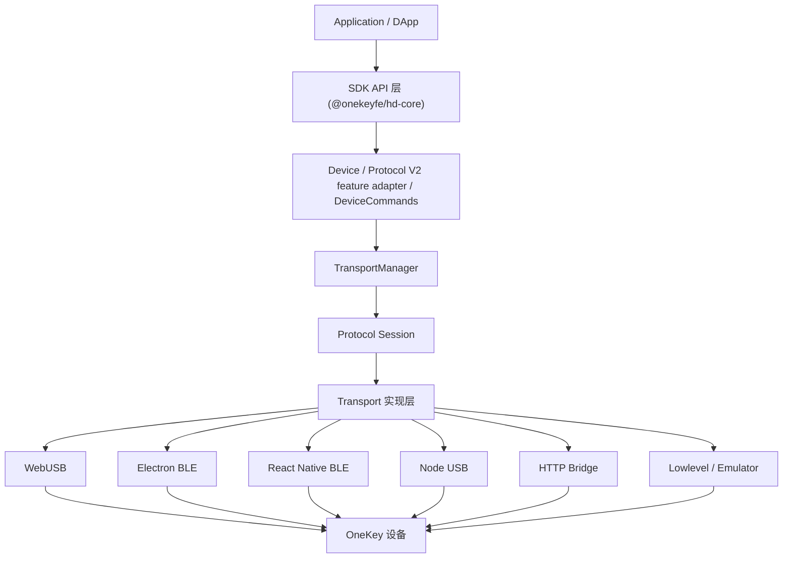
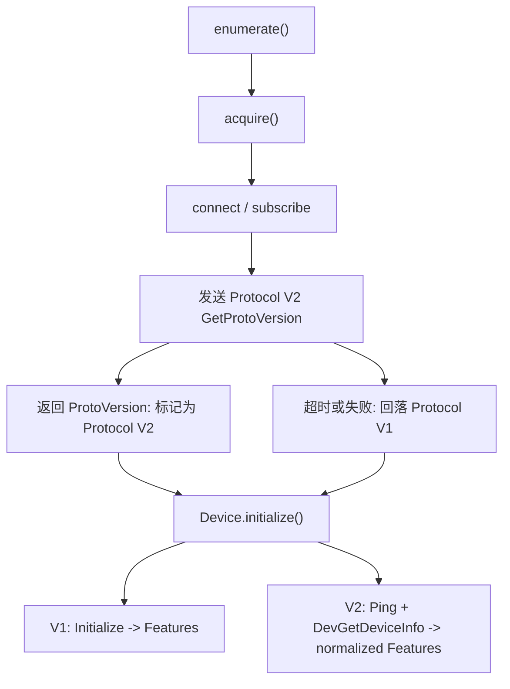
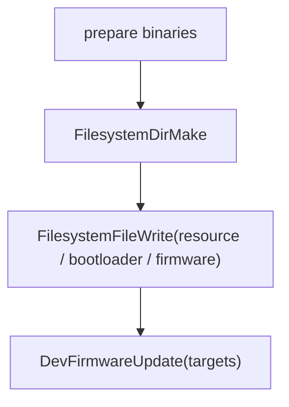

# OneKey Hardware SDK 架构概览

## 核心分层

Hardware SDK 的目标是让应用层只感知统一 API，不需要关心设备型号、传输介质或底层协议版本。

## 协议分层

当前 SDK 同时维护两套设备通信协议：

| 协议        | 设备范围                                | 传输方式            | 主要能力                                                    |
| ----------- | --------------------------------------- | ------------------- | ----------------------------------------------------------- |
| Protocol V1 | Classic / Mini / Touch / Pro 等现有设备 | USB、BLE、Bridge 等 | 钱包业务能力，`Initialize -> Features` 握手，签名和地址派生 |
| Protocol V2 | Pro2                                    | USB、BLE            | 系统能力，文件系统、固件更新、设备重启、协议探测            |

协议选择是传输层内部职责。外部调用方不需要显式选择 V1 或 V2，也不应该依赖 PID、设备名或 USB descriptor 来判断协议。

协议公共逻辑集中在 `packages/hd-transport` 的 Protocol Session 层：

- `ProtocolV2Session`：负责 V2 encode、frame 写入、frame 读取、decode、超时和统一日志。
- `ProtocolV2FrameAssembler`：负责 BLE/USB 分片后的 `0x5A` frame 重组和长度校验。
- `probeProtocolV2()`：负责连接后主动 `GetProtoVersion` 探测和失败回退钩子。

WebUSB、Electron BLE、React Native BLE 只负责各自的物理连接、读写、订阅和平台错误映射，不再各自复制 V2 协议会话逻辑。

## Protocol V2 Feature Adapter

`packages/core/src/protocols/protocol-v2/features.ts` 负责把 Protocol V2 设备信息归一成 SDK 现有 `Features` 视图：

| 协议 | 数据来源                  | 归一化输出                                |
| ---- | ------------------------- | ----------------------------------------- |
| V1   | `Initialize -> Features`  | 原生 `Features`                           |
| V2   | `Ping + DevGetDeviceInfo` | Protocol V2 `DeviceInfo` 映射到 `Features` |
| V2 fallback | USB/BLE descriptor | 最小 `Features`，保证 connectId/uuid 稳定 |

这样 `Device.toMessageObject()`、事件输出、固件判断和上层 API 都继续读取统一字段，而不需要在每个业务方法里理解 Protocol V2 的 `DeviceInfo` schema。

## 自动协议探测

支持 Protocol V2 的传输实现会在 `acquire()` 后主动探测协议：

这样可以解决共享 PID 或 descriptor 不稳定带来的误判问题，并保持现有 V1 设备零回归。

## TransportManager 职责

`TransportManager` 负责初始化当前运行环境对应的 transport，并在初始化时同时配置：

- 默认 V1 protobuf schema：`messages.json`
- Protocol V2 protobuf schema：`messages-pro2.json`

V1 设备仍可在 `Initialize` 后通过 `TransportManager.reconfigure(features)` 切换到适配固件版本的 schema。V2 设备不走 `Initialize/GetFeatures`，因此不依赖 features 重新选择协议；协议选择由 transport 的 `getProtocolType(path)` 返回。

## Device 层职责

`Device.acquire()` 完成后会从 transport 读取检测到的协议类型，并写回 `originalDescriptor.protocolType`。后续 `Device.initialize()` 基于该字段选择初始化路径：

- V1：发送 `Initialize`，使用真实 `Features`
- V2：发送 `Ping` 验证链路，再用 `DevGetDeviceInfo` 生成统一 `Features`

Protocol V2 当前没有传统 `GetFeatures`。为了保证事件和后续 API 能使用同一套设备标识，feature adapter 会始终填充 `device_id`、`serial_no` 和 `onekey_serial_no`，并尽量补齐 firmware、bootloader、BLE、SE、label 和 passphrase 状态字段。

## Protocol V2 文件和固件更新链路

Protocol V2 固件更新使用系统消息：

`DevFirmwareUpdate.targets` 必须包含所有需要安装的文件，包括 resource、bootloader 和 firmware。SDK 不假设固件端会隐式扫描已写入路径。

## 包职责速查

| 包                                   | 职责                                                 |
| ------------------------------------ | ---------------------------------------------------- |
| `packages/core`                      | SDK API、Device 生命周期、固件更新流程、事件输出     |
| `packages/hd-transport`              | protobuf 加载、V1/V2 encode/decode、Protocol Session、类型定义 |
| `packages/hd-transport-web-device`   | WebUSB 和 Electron BLE transport                     |
| `packages/hd-transport-react-native` | React Native BLE transport                           |
| `packages/hd-common-connect-sdk`     | 根据 env 选择 transport，向桌面/Web 示例暴露统一入口 |
| `submodules/firmware-pro2`           | Pro2 protobuf schema 来源                            |

## 设计原则

- 协议判断必须基于连接后的设备响应，而不是静态 PID、名称或 descriptor。
- Pro2 支持 USB 和 BLE，WebUSB、Electron BLE 和 React Native BLE 都应自动选择 Protocol V2。
- 协议探测、V2 frame 重组和 V2 call 路由应复用 Protocol Session 层，避免在具体 transport 中重复实现。
- Electron BLE 默认入口是 `desktop-web-ble`，不再提供按设备型号拆分的 env alias。
- V1 schema 兼容逻辑和 V2 schema 路由逻辑分离，避免为了新协议改动现有设备的初始化路径。
- Device 层通过 Protocol V2 feature adapter 暴露统一 `Features`，业务方法不直接消费 Protocol V2 原始 `DeviceInfo`。
