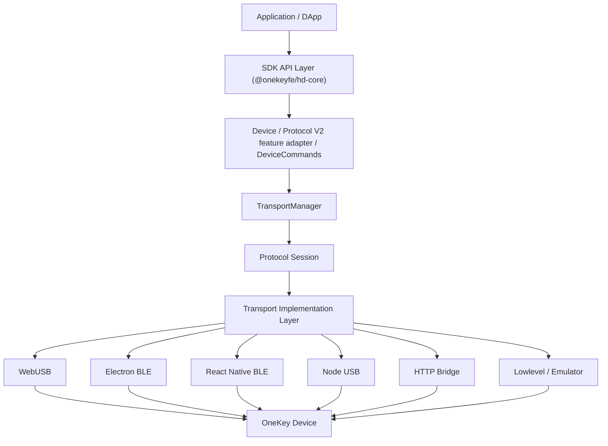
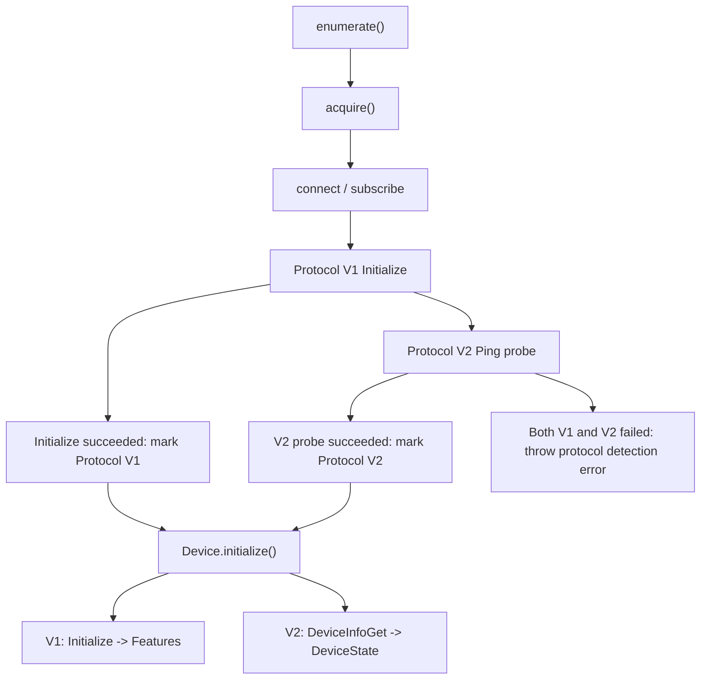
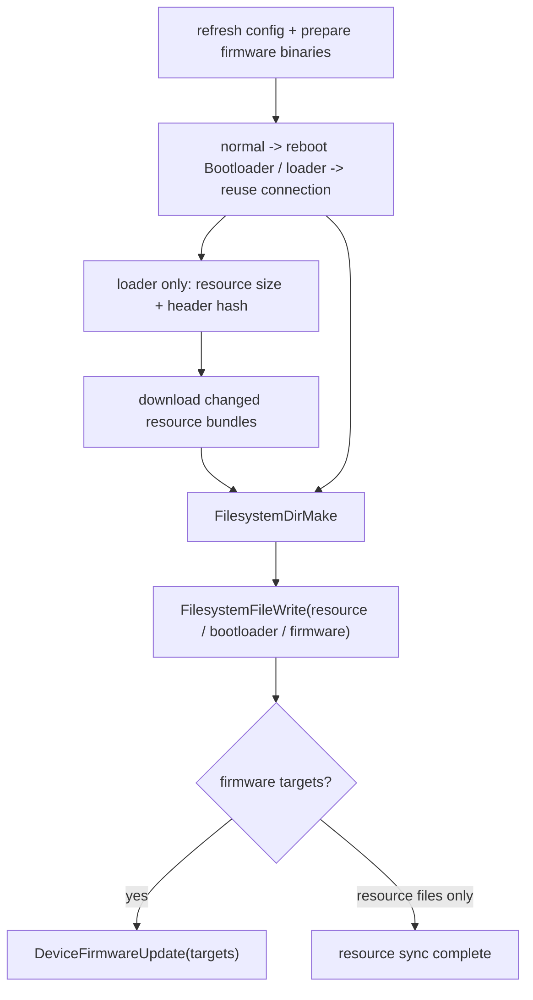

# OneKey Hardware SDK Architecture Overview

## Core Layers

The Hardware SDK's goal is to let the application layer see only a unified API, without needing to care about device model, transport medium, or underlying protocol version.

## Protocol Layers

The current SDK maintains two device communication protocols at the same time:

| Protocol    | Device Range                                        | Transport           | Main Capabilities                                                   |
| ----------- | --------------------------------------------------- | ------------------- | ------------------------------------------------------------------- |
| Protocol V1 | Existing devices such as Classic / Mini / Touch / Pro | USB, BLE, Bridge, etc. | Wallet business capabilities, `Initialize -> Features` handshake, signing and address derivation |
| Protocol V2 | Pro2, Neo; later extendable to models such as Pro   | USB, BLE            | Device info, wallet Session, filesystem, settings, firmware update, and protocol probing |

Protocol selection is an internal transport-layer responsibility. External callers do not need to choose V1 or V2 explicitly, and should not rely on PID, device name, or USB descriptor to determine the protocol.

Shared protocol logic is concentrated in the Protocol Session layer of `packages/hd-transport`:

- `ProtocolV2Session`: handles V2 encode, frame write, frame read, decode, timeout, and unified logging.
- `ProtocolV2FrameAssembler`: reassembles BLE/USB-fragmented `0x5A` frames and validates length.
- `ProtocolV2LinkManager`: reuses Sessions per device, serializes calls, and invalidates the Link after a fatal error.
- `ProtocolV2SequenceCursor`: keeps frame sequence numbers incrementing across ordinary disconnects and reconnects, and clears them only when Transport is disposed.
- `probeProtocolV2()`: shared V2 probe helper that sends `Ping { message: 'protocol-v2-probe' }` and runs failure cleanup hooks.

Each transport's `detectProtocol()` chooses the first V1/V2 probe order from as-yet-unconfirmed internal hints. A caller-supplied
`connectProtocol` is a strict expectation and must be verified by an active response of the corresponding protocol; after the first live
probe confirms a protocol, both the descriptor and App-persisted results become strict expectations for later connections and no longer
fall back to the other protocol. Only an explicit `forceProtocolDetection` causes a single call to ignore the binding and probe again.

WebUSB, Electron BLE, React Native BLE, and lowlevel BLE are responsible only for their own physical connection, read/write, subscribe/bridge, and platform error mapping; they no longer each duplicate V2 protocol session logic.

Long-lived design constraints are recorded in [SDK Key Architecture Decisions](./decisions.md).

## Unified DeviceState

`DeviceStateStore` is the single source of truth for device identity, version, settings, and runtime status. V1/V2 Mappers only convert protocol responses into unified patches; legacy `Features` are a live projection of the unified state:

| Protocol | Data Source                                              | Standard Output | Compatibility Output              |
| -------- | -------------------------------------------------------- | --------------- | --------------------------------- |
| V1       | `Initialize -> Features`                                 | `DeviceState`   | `getFeatures()` projection (V1 only) |
| V2       | `Ping` probe + `DeviceInfoGet/ProtocolInfo/DeviceStatus` | `DeviceState`   | `getFeatures()` is not supported  |

`getDeviceState()` and `DEVICE.STATE` share the same complete snapshot. In normal mode, `DeviceStatus` is read only when a runtime/status
refresh is explicitly requested; bootloader/romloader modes skip that command automatically.

Public refresh scopes are defined by business semantics; callers do not need to understand the underlying protocol commands:

| scope      | V1 Data Source                    | V2 Data Source                                              |
| ---------- | --------------------------------- | ----------------------------------------------------------- |
| `runtime`  | `GetFeatures`                     | `DeviceStatusGet` in normal mode                            |
| `settings` | `GetFeatures`                     | `DeviceStatusGet + DeviceSettingsGet` in normal mode        |
| `firmware` | `GetFeatures + OnekeyGetFeatures` | `DeviceInfoGet` for all-component version/build ID/hash; plus status in normal mode |

Unified fields follow these semantics:

- `identity.label` stores only the user-set real label; it does not fall back to BLE name or model.
- `identity.bleName` stores only the advertised/connected name.
- The user-facing display name continues to use the compatibility device object's `name`; `DeviceState.identity` does not store derived display fields.
- The V1 raw `model` is used only for protocol compatibility, not as a product display name.
- Protocol V2 device model comes from `DeviceInfo.hw.Device_type` and must not be inferred as Pro2 merely from the V2 protocol.
- Whether a Protocol V2 SE image exists does not determine the main MCU run mode; when an application image exists, keep normal or the already-confirmed onboarding mode.
- `raw` is merged field-by-field by protocol source key and is used only by SDK-internal compatibility logic; wallet session is used only for Core runtime recovery. Public `getDeviceState()` and `DEVICE.STATE` expose neither.

## Automatic Protocol Detection

Transport implementations that support Protocol V2 actively probe the protocol after `acquire()`. With no V2 hint, they verify V1 first and, after V1
fails, then probe V2; with a V2 hint or V2 connection cache they verify V2 first and still fall back to verifying V1 on failure. Explicit
`connectProtocol='V1'` or `'V2'` is a strict expectation: only the specified protocol is verified, and a mismatch fails:

This avoids misclassification caused by shared PIDs or unstable descriptors, and avoids treating an unresponsive unknown device as V1.

## TransportManager Responsibilities

`TransportManager` initializes the transport for the current runtime environment and, at initialization, also configures:

- Default V1 protobuf schema: `messages.json`
- Protocol V2 protobuf schema: `messages-protocol-v2.json`

V1 devices can still switch to a firmware-version-matched schema after `Initialize` via `TransportManager.reconfigure(features)`. V2 devices do not go through `Initialize/GetFeatures`, so they do not reselect protocol based on features; protocol selection is returned by the transport's `getProtocolType(path)`.

## Device Layer Responsibilities

After `Device.acquire()` completes, the detected protocol type is read from the transport and written back to
`originalDescriptor.protocolType`. That field is only a hint on the next connection; on the current live connection it is the sole protocol
result used for capability checks. Subsequent `Device.initialize()` chooses the initialization path from this field:

- V1: send `Initialize` and use the real `Features`
- V2: Transport acquire has already confirmed the link with a `Ping` probe; initialization then reads, in order, `DeviceInfoGet` without a status
  target, a `ProtocolInfoRequest` with eventless wallet session always enabled, and `DeviceStatusGet` only in normal
  mode when the capability has been declared

Protocol V2 has no traditional `GetFeatures`. Public callers uniformly read `getDeviceState()`; raw `DeviceInfoGet`, `DeviceStatusGet`, and `DeviceSettingsGet` remain SDK-internal only. Device identity is based on the semantic distinction of `serialNo/deviceId`.

## Protocol V2 File and Firmware Update Path

Protocol V2 firmware update uses system messages:

Application mode only allows the host to access `vol1:/wallpapers`, `vol1:/portfolio`, and `vol1:/nft`; reading
`vol0:/bundles/**` returns `Path not allowed`. Therefore version checks in normal mode leave resource status as
`unknown`; `FirmwareUpdateV4` first switches to Bootloader, then compares resource size and file-header hashes via `FilesystemPathInfoQuery` and
`FilesystemFileRead`, and finally downloads and writes only resources that differ. If the device is already in
Bootloader or Romloader, the current loader connection is reused and reboot is not repeated.

`DeviceFirmwareUpdate.targets` contains only firmware that needs to be installed. Each `RESC .okpkg` in the resource ZIP carries the
full device path in the OKPP header's `flexible_metadata` and is synced via `FilesystemFileWrite`. Ordinary resource
headers point to the final path; boot resource headers point directly at the `.staging` path so the next boot can replace them before mount,
avoiding FatFs refusing overwrite because the file is already open.
When resources are updated alone, an empty install request is not sent. The SDK does not assume the firmware will implicitly scan other already-written paths.

A remote production upgrade must first generate a `FirmwareUpdatePlan` from the latest config; after the host downloads, it then generates a
`PreparedPlan` with a complete receipt. File size and SHA-256 must match the remote Plan exactly. The execution stage treats `PreparedPlan` as the single source of truth;
component references, upgrade targets, and expected versions need not be passed again by the caller, and must not re-depend on online release records that may have changed.
`hostBindingGeneration` may only be submitted together with a complete `preparedPlan`; the old calling style that reused a registered generation for
non-Prepared component updates is no longer accepted.

Local development upgrades are strictly separated from remote Plans: components can still be passed via the per-component `ArrayBuffer` fields of `firmwareUpdateV4`;
the full resource ZIP is passed via `resourceArchiveBinary`. Core parses the ZIP directly, compares RESC headers on the device,
and writes only packages that differ; this path does not read remote config and is no longer wrapped into an in-memory PreparedPlan. Core walks all
`.okpkg` entries in the ZIP, ignores other entries, and before modifying the device validates each package's `RESC` header, package size, self-described path, and path uniqueness;
the device still performs final verification and enablement of signed packages.
The old bare-file parameters `resourceFiles` and `resourceBundleArtifacts` were removed in the Protocol V2 alpha stage. New callers must
migrate to `resourceArchiveBinary` or a complete `PreparedPlan`; the SDK no longer maintains a second per-file resource input and remote-release binding flow.
Local files must not be used as a remote Plan override to bypass remote receipt verification.

## Package Responsibility Quick Reference

| Package                              | Responsibility                                                 |
| ------------------------------------ | -------------------------------------------------------------- |
| `packages/core`                      | SDK API, Device lifecycle, firmware update flow, event output  |
| `packages/hd-transport`              | protobuf loading, V1/V2 encode/decode, Protocol Session, type definitions |
| `packages/hd-transport-web-device`   | WebUSB and Electron BLE transport                              |
| `packages/hd-transport-react-native` | React Native BLE transport                                     |
| `packages/hd-common-connect-sdk`     | Select transport by env and expose a unified entry to desktop/Web examples |
| `submodules/firmware-pro2`           | Source of Pro2 protobuf schema                                 |

## Design Principles

- Protocol decisions must be based on post-connect device responses, not static PID, name, or descriptor.
- Current Pro2 supports USB and BLE; WebUSB, Electron BLE, and React Native BLE should all select
  Protocol V2 from live responses, and must not assume Pro always uses V1.
- Protocol probing, V2 frame reassembly, and V2 call routing should reuse the Protocol Session layer, avoiding duplicated implementations in concrete transports.
- The default Electron BLE entry is `desktop-web-ble`; env aliases split by device model are no longer provided.
- V1 schema compatibility logic and V2 schema routing logic are separated, avoiding changes to existing-device initialization paths for a new protocol.
- The Device layer exposes a unified `DeviceState` through Protocol Mappers; `Features` is retained only for Protocol V1 compatibility, and business methods do not consume Protocol V2 raw `DeviceInfo` directly.

See [Protocol V1/V2 Transport Protocol](../protocol/protocol-v1-v2.md) for transport protocol details; see [SDK Core Runtime](../sdk/core-runtime.md) and [Pro2 Field Migration](../sdk/pro2-field-migration.md) for Core runtime and field adaptation.
