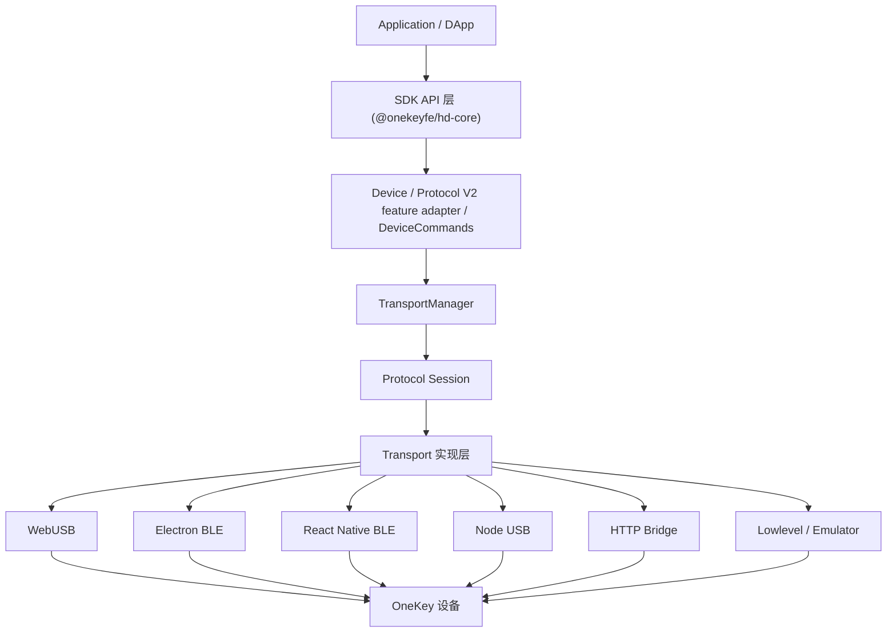
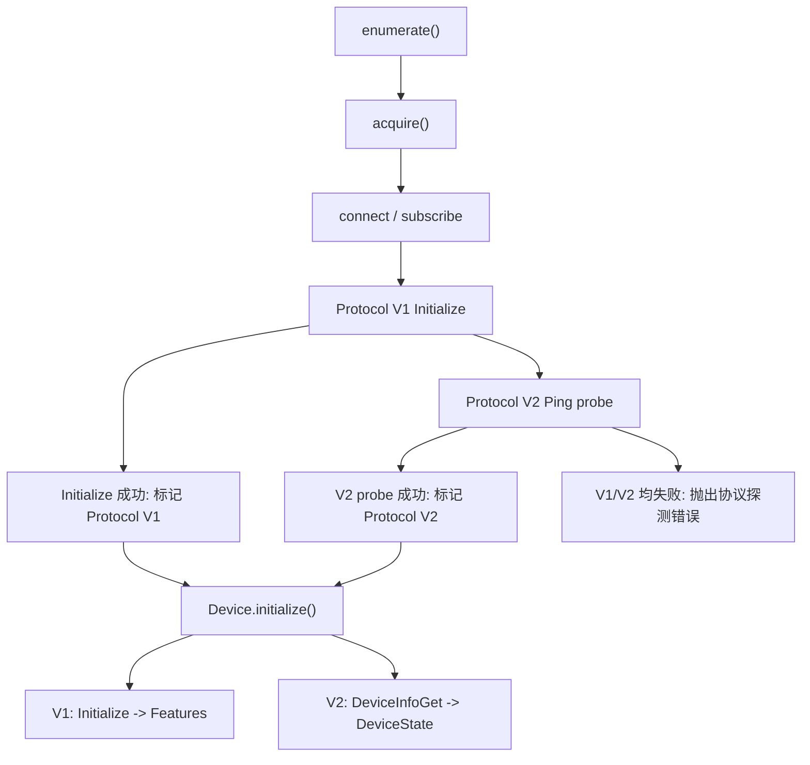
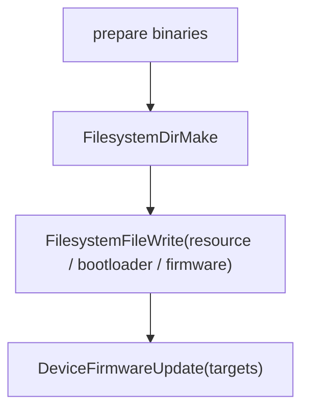

# OneKey Hardware SDK 架构概览

## 核心分层

Hardware SDK 的目标是让应用层只感知统一 API，不需要关心设备型号、传输介质或底层协议版本。

## 协议分层

当前 SDK 同时维护两套设备通信协议：

| 协议        | 设备范围                                | 传输方式            | 主要能力                                                    |
| ----------- | --------------------------------------- | ------------------- | ----------------------------------------------------------- |
| Protocol V1 | Classic / Mini / Touch / Pro 等现有设备 | USB、BLE、Bridge 等 | 钱包业务能力，`Initialize -> Features` 握手，签名和地址派生 |
| Protocol V2 | Pro2                                    | USB、BLE            | 设备信息、钱包 Session、文件系统、设置、固件更新和协议探测  |

协议选择是传输层内部职责。外部调用方不需要显式选择 V1 或 V2，也不应该依赖 PID、设备名或 USB descriptor 来判断协议。

协议公共逻辑集中在 `packages/hd-transport` 的 Protocol Session 层：

- `ProtocolV2Session`：负责 V2 encode、frame 写入、frame 读取、decode、超时和统一日志。
- `ProtocolV2FrameAssembler`：负责 BLE/USB 分片后的 `0x5A` frame 重组和长度校验。
- `ProtocolV2LinkManager`：按设备复用 Session、串行调用，并在致命错误后使 Link 失效。
- `ProtocolV2SequenceCursor`：让普通断开和重连后的帧序号继续递增，Transport dispose 时再清除。
- `probeProtocolV2()`：公共 V2 probe helper，发送 `Ping { message: 'protocol-v2-probe' }` 并执行失败清理钩子。

各 transport 的 `detectProtocol()` 根据 hint 和连接缓存选择 V1/V2 probe 顺序。显式 `connectProtocol='V1'` 会验证 V1；显式 `connectProtocol='V2'` 用于上层已经确认协议的重连路径，直接记录 V2 并跳过重复探测。

WebUSB、Electron BLE、React Native BLE 和 lowlevel BLE 只负责各自的物理连接、读写、订阅/桥接和平台错误映射，不再各自复制 V2 协议会话逻辑。

长期有效的设计约束集中记录在 [SDK 关键架构决策](./decisions.md)。

## 统一 DeviceState

`DeviceStateStore` 是设备身份、版本、设置和运行状态的唯一状态源。V1/V2 Mapper 只负责把协议响应转换为统一 patch；旧版 `Features` 仅由统一状态即时投影：

| 协议 | 数据来源                       | 标准输出      | 兼容输出                      |
| ---- | ------------------------------ | ------------- | ----------------------------- |
| V1   | `Initialize -> Features`       | `DeviceState` | `getFeatures()` 投影（仅 V1） |
| V2   | `Ping` probe + `DeviceInfoGet` | `DeviceState` | 不支持 `getFeatures()`        |

`getDeviceState()` 和 `DEVICE.STATE` 共享同一份完整快照。`getDeviceState()` 只读取缓存或执行最小初始化；调用方只有显式调用 `refreshDeviceState({ scope: 'runtime' })` 时才会发送 `DeviceStatusGet`。

公共刷新范围按业务语义定义，调用方不需要理解底层协议命令：

| scope      | V1 数据来源                       | V2 数据来源                                  |
| ---------- | --------------------------------- | -------------------------------------------- |
| `basic`    | `GetFeatures`                     | `DeviceInfoGet` 基础 target                  |
| `firmware` | `GetFeatures + OnekeyGetFeatures` | `DeviceInfoGet` 全组件 version/build ID/hash |
| `settings` | `GetFeatures`                     | `DeviceSettingsGet`                          |
| `runtime`  | `GetFeatures`                     | normal 模式下显式 `DeviceStatusGet`          |

统一字段遵循以下语义：

- `identity.label` 只保存用户设置的真实 label，不使用 BLE 名称或型号兜底。
- `identity.bleName` 只保存广播/连接名称。
- `identity.displayName` 是派生展示值，优先级为 `label -> bleName -> 稳定产品名`。
- V1 原始 `model` 只用于协议兼容，不作为产品展示名。
- Protocol V2 的 SE 镜像存在与否不决定主控运行模式；应用镜像存在时保持 normal 或已确认的 onboarding mode。
- `raw` 按协议来源键字段级合并，只供 SDK 内部兼容逻辑使用；钱包 session 也只用于 Core 运行时恢复。公共 `getDeviceState()` 和 `DEVICE.STATE` 均不暴露二者。

## 自动协议探测

支持 Protocol V2 的传输实现会在 `acquire()` 后主动探测协议。没有 V2 hint 时默认先验证 V1，V1 失败后再 probe V2；有 V2 hint 或 V2 连接缓存时会先验证 V2。显式 `connectProtocol='V1'` 会验证 V1，显式 `connectProtocol='V2'` 则信任上层已经确认的协议，用于固件升级重启后的重连：

这样可以解决共享 PID 或 descriptor 不稳定带来的误判问题，并避免把没有响应的未知设备错误归类为 V1。

## TransportManager 职责

`TransportManager` 负责初始化当前运行环境对应的 transport，并在初始化时同时配置：

- 默认 V1 protobuf schema：`messages.json`
- Protocol V2 protobuf schema：`messages-protocol-v2.json`

V1 设备仍可在 `Initialize` 后通过 `TransportManager.reconfigure(features)` 切换到适配固件版本的 schema。V2 设备不走 `Initialize/GetFeatures`，因此不依赖 features 重新选择协议；协议选择由 transport 的 `getProtocolType(path)` 返回。

## Device 层职责

`Device.acquire()` 完成后会从 transport 读取检测到的协议类型，并写回 `originalDescriptor.protocolType`。后续 `Device.initialize()` 基于该字段选择初始化路径：

- V1：发送 `Initialize`，使用真实 `Features`
- V2：Transport acquire 已用 `Ping` probe 确认链路；初始化再用不含 status target 的 `DeviceInfoGet` 建立 `DeviceState`

Protocol V2 没有传统 `GetFeatures`。公共调用方统一读取 `getDeviceState()`；原始 `DeviceInfoGet`、`DeviceStatusGet` 和 `DeviceSettingsGet` 只保留在 SDK 内部。设备身份以 `serialNo/deviceId` 的语义区分为准。

## Protocol V2 文件和固件更新链路

Protocol V2 固件更新使用系统消息：

`DeviceFirmwareUpdate.targets` 必须包含所有需要安装的文件，包括 resource、bootloader 和 firmware。SDK 不假设固件端会隐式扫描已写入路径。

## 包职责速查

| 包                                   | 职责                                                           |
| ------------------------------------ | -------------------------------------------------------------- |
| `packages/core`                      | SDK API、Device 生命周期、固件更新流程、事件输出               |
| `packages/hd-transport`              | protobuf 加载、V1/V2 encode/decode、Protocol Session、类型定义 |
| `packages/hd-transport-web-device`   | WebUSB 和 Electron BLE transport                               |
| `packages/hd-transport-react-native` | React Native BLE transport                                     |
| `packages/hd-common-connect-sdk`     | 根据 env 选择 transport，向桌面/Web 示例暴露统一入口           |
| `submodules/firmware-pro2`           | Pro2 protobuf schema 来源                                      |

## 设计原则

- 协议判断必须基于连接后的设备响应，而不是静态 PID、名称或 descriptor。
- Pro2 支持 USB 和 BLE，WebUSB、Electron BLE 和 React Native BLE 都应自动选择 Protocol V2。
- 协议探测、V2 frame 重组和 V2 call 路由应复用 Protocol Session 层，避免在具体 transport 中重复实现。
- Electron BLE 默认入口是 `desktop-web-ble`，不再提供按设备型号拆分的 env alias。
- V1 schema 兼容逻辑和 V2 schema 路由逻辑分离，避免为了新协议改动现有设备的初始化路径。
- Device 层通过 Protocol Mapper 暴露统一 `DeviceState`；`Features` 只保留给 Protocol V1 兼容，业务方法不直接消费 Protocol V2 原始 `DeviceInfo`。

传输协议细节见 [Protocol V1/V2 传输协议](../protocol/protocol-v1-v2.md)；Core 的运行时和字段适配见 [SDK Core 运行时](../sdk/core-runtime.md) 与 [Pro2 字段迁移](../sdk/pro2-field-migration.md)。
