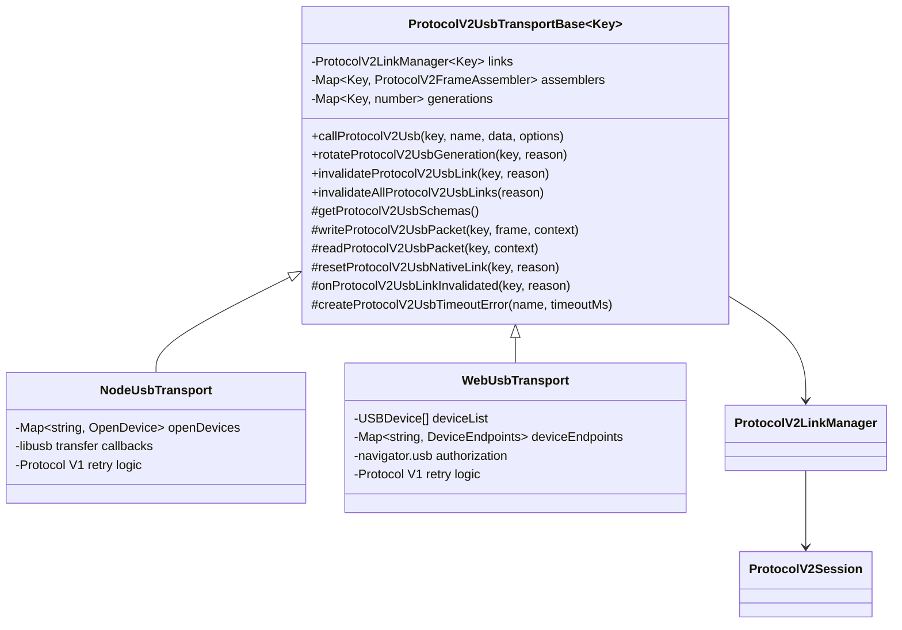
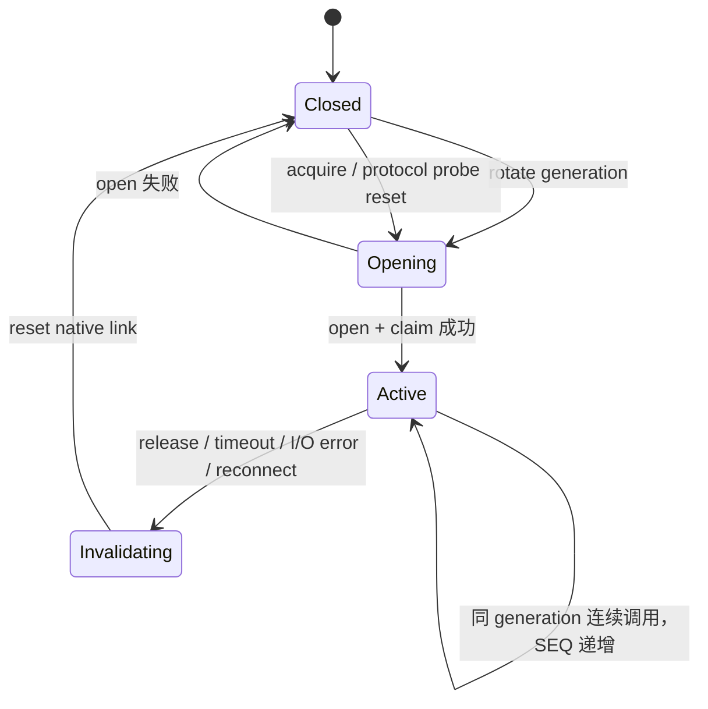

# Protocol V2 USB Transport 统一基类设计

## 1. 背景

`NodeUsbTransport` 与 `WebUsbTransport` 当前分别维护以下 Protocol V2 状态：

- `Map<path, ProtocolV2Session>`；
- `Map<path, ProtocolV2FrameAssembler>`；
- `Map<path, timeoutMs>`；
- USB 断开、重连和探测失败后的清理逻辑。

两套实现能够让连续调用递增 SEQ，但只覆盖了正常调用路径。当前主要缺口是：

1. timeout 和 assembler reset 在 `ProtocolV2Session` 串行队列之外执行，并发调用会互相覆盖状态；
2. release、schema 重配和 USB generation 变化没有统一失效旧 Session；
3. 超时后的原生 `transferIn` 可能继续存活并消费下一次调用的响应；
4. Node USB 会在单次 Protocol V2 业务调用内部自动重连和重发，非幂等命令存在重复执行风险；
5. Node USB 与 WebUSB 的生命周期实现已经形成重复维护点。

三种 BLE Transport 已接入共享 `ProtocolV2LinkManager`。USB 应复用相同 Link 语义，同时保留 libusb 与浏览器 WebUSB 的平台差异。

## 2. 目标

### 功能目标

- 为 Node USB 与 WebUSB 提供统一的 Protocol V2 USB 抽象基类。
- 每个 Transport 实例独立持有 Link Manager，不使用进程级全局状态。
- 同一设备 path 严格串行调用，不同 path 可以并行。
- release、reconnect、schema reset、timeout 和原生 I/O 错误能够失效旧 Link。
- Link 重建后继续使用该 path 的 Sequence Cursor。
- 先通过 Node USB 单元测试和 Pro2 6136 真机验证，再迁移 WebUSB。

### 非功能目标

- Protocol V1、设备枚举、WebUSB 用户授权和平台原生 I/O 不进入共享基类。
- 不在 SDK 内自动重试完整的 Protocol V2 业务命令。
- 不记录 Protocol V2 原始 protobuf payload，延续现有日志脱敏规则。
- 固件升级吞吐不得因抽象层增加无意义的分包、日志或延迟。

## 3. 非目标

- 不修改 Pro2 固件、bootloader 或 protobuf 协议定义。
- 不把 Node libusb 和浏览器 `USBDevice` 封装成统一原生设备类型。
- 不重构 Protocol V1 的分包、重连和重试策略。
- 不支持同一设备多个并发在途 Protocol V2 请求。
- 不在本轮引入跨 Transport 的 USB 设备池或全局 Session Manager。

## 4. 方案选择

### 方案 A：只修正 timeout 与 assembler reset

保留两个 Transport 的 Session Map，只把 timeout 改为 Call Context，并把 assembler reset 移入 `prepareCall`。

优点：改动最小。

缺点：release、generation、fatal error 和迟到读取仍由两套代码分别维护，无法消除架构重复。

### 方案 B：共享 Controller，Transport 继续使用组合模式

新增 `ProtocolV2UsbLinkController`，由 Node USB 和 WebUSB 作为字段持有。

优点：不改变继承关系。

缺点：Transport 仍需重复暴露大量转发方法，平台实现可以绕过 Controller 直接修改 assembler 或 generation。

### 方案 C：统一 Protocol V2 USB 抽象基类

新增 `ProtocolV2UsbTransportBase<Key>`，Node USB 与 WebUSB 继承该类。基类拥有所有 V2 Link 状态，子类只能通过受保护 API 改变 generation 或调用 Link。

优点：生命周期边界清晰，能够约束两个 Transport 使用相同的失效规则；当前仍处于开发阶段，迁移成本可控。

缺点：两个 Transport 需要增加继承关系；基类 API 必须克制，避免吸收 V1 或平台设备管理职责。

### 决策

采用方案 C。共享范围严格限定为 Protocol V2 USB Link，不创建全功能 USB Transport 基类。

## 5. 架构



## 6. 基类职责

新文件：

`packages/hd-transport/src/protocols/v2/usb-transport-base.ts`

建议接口：

```ts
export type ProtocolV2UsbTransportBaseOptions = {
  router: number;
  maxFrameBytes: number;
  logPrefix: string;
};

export abstract class ProtocolV2UsbTransportBase<Key> {
  protected constructor(options: ProtocolV2UsbTransportBaseOptions);

  protected abstract getProtocolV2UsbSchemas(): ProtocolV2Schemas;
  protected abstract getProtocolV2UsbLogger(): ProtocolV2SessionOptions['logger'];
  protected abstract writeProtocolV2UsbPacket(
    key: Key,
    frame: Uint8Array,
    context: ProtocolV2CallContext
  ): Promise<void>;
  protected abstract readProtocolV2UsbPacket(
    key: Key,
    context: ProtocolV2CallContext
  ): Promise<Uint8Array>;
  protected abstract resetProtocolV2UsbNativeLink(key: Key, reason: string): Promise<void>;
  protected onProtocolV2UsbLinkInvalidated(_key: Key, _reason: string): Promise<void> | void {}
  protected abstract createProtocolV2UsbTimeoutError(name: string, timeoutMs: number): Error;

  protected callProtocolV2Usb(
    key: Key,
    name: string,
    data: Record<string, unknown>,
    options?: TransportCallOptions
  ): Promise<MessageFromOneKey>;

  protected rotateProtocolV2UsbGeneration(key: Key, reason: string): Promise<number>;
  protected invalidateProtocolV2UsbLink(key: Key, reason: string): Promise<void>;
  protected invalidateAllProtocolV2UsbLinks(reason: string): Promise<void>;
  protected disposeProtocolV2UsbLinks(reason: string): Promise<void>;
}
```

基类内部规则：

1. `rotateProtocolV2UsbGeneration` 必须在原生 USB close/open/claim 之前调用。
2. rotation 先失效旧 Link，再增加 generation，并创建新的 assembler。
3. `prepareCall` 在 Link 队列内 reset 当前 assembler。
4. `writeFrame` 和 `readFrame` 在原生 I/O 前后校验 generation。
5. `readFrame` 由基类循环读取子类提供的数据块并完成 frame assembly。
6. `timeoutMs` 只通过 `ProtocolV2CallContext` 传递，不使用额外 Map。
7. 所有抛出的传输、超时、generation 和 frame 错误均为 link-fatal；protobuf `Failure` 仍作为正常响应返回。
8. Link 失效时先标记 Link 不可用，再 reset assembler、调用子类关闭原生连接，最后调用 `onProtocolV2UsbLinkInvalidated` 清理平台协议状态。
9. Link 失效保留 Sequence Cursor；Transport dispose 才清除 Cursor。

## 7. USB generation 生命周期



必须先失效旧 Link，再创建新原生连接。禁止在旧 Link 仍活动时直接替换 endpoint 或 `USBDevice`。

## 8. Node USB 平台实现

`NodeUsbTransport` 继承基类，只实现 libusb hook：

- `writeProtocolV2UsbPacket`：单次调用 `OutEndpoint.transfer`，失败直接抛出，不自动重连和重发。
- `readProtocolV2UsbPacket`：调用 `InEndpoint.transfer`。libusb 自身的短周期 `TIMED_OUT` 仅表示尚无数据时，可以在同 generation 内继续等待；最终调用超时由 `ProtocolV2Session` 控制。
- `resetProtocolV2UsbNativeLink`：release interface、close device，并删除 `openDevices` 中的旧引用。
- acquire、探测协议切换和 reconnect 在原生 open 前调用 `rotateProtocolV2UsbGeneration`。
- Protocol V1 的 `sendAllChunksWithRetry`、`transferInWithRetry` 和 reconnect lock 保持不变。

Node USB 不再为 Protocol V2 使用：

- `protocolV2Sessions`；
- `protocolV2ReadTimeouts`；
- V2 write 内部 reconnect/retry；
- V2 read timeout 内部直接重建 Session。

## 9. WebUSB 平台实现

`WebUsbTransport` 继承同一基类，只实现浏览器 hook：

- `writeProtocolV2UsbPacket`：调用当前 path 对应 `USBDevice.transferOut`。
- `readProtocolV2UsbPacket`：调用当前 path 对应 `USBDevice.transferIn`，返回本次读取的数据块。
- `resetProtocolV2UsbNativeLink`：release interface 并 close 当前 `USBDevice`；浏览器不支持 AbortSignal 的在途 `transferIn` 通过关闭设备隔离。
- connect、reset、claim 前调用 `rotateProtocolV2UsbGeneration`。
- `promptDeviceAccess`、`getDevices`、mock serial path 和 endpoint discovery 保留在子类。
- Protocol V1 的分包和 retry 保持不变。

WebUSB 不再为 Protocol V2 使用：

- `protocolV2Sessions`；
- `protocolV2ReadTimeouts`；
- Transport 队列外的 assembler reset；
- V2 read 的自定义迟到 Promise 永久挂起逻辑。

## 10. 错误与重试语义

### Link-fatal

- Protocol V2 response timeout；
- USB transferIn/transferOut 错误；
- USB device close、disconnect 或 generation 变化；
- frame 长度、CRC 或 assembly 错误；
- 原生连接引用不存在。

处理顺序：

1. 当前调用失败；
2. Manager 标记 Link invalid；
3. 拒绝或隔离 pending read；
4. reset assembler；
5. 关闭原生 USB 连接；
6. 删除已探测协议，要求上层重新 acquire。

### 不自动重试业务调用

Protocol V2 的 `FirmwareUpdate`、文件写入和安全芯片升级命令可能不是幂等操作。SDK 不判断某次 transfer error 是否发生在设备已处理命令之前，因此不得自动重发完整 frame。

允许重试的范围：

- enumerate、open、claim 等尚未发送业务命令的连接准备阶段；
- Node libusb 在同一 generation 内等待输入时出现的短周期 endpoint timeout；
- 上层明确重新 acquire 后重新发起的操作。

## 11. SEQ 规则

- Cursor key 为设备 path。
- 同 path 的 Cursor 在 release、reconnect、probe reset 和 schema reconfigure 后保留。
- 不同 Transport 实例不共享 Cursor。
- 不同 path 分别从 1 开始。
- `disposeProtocolV2UsbLinks` 清除所有 Cursor。
- 允许因写入失败或探测失败出现 SEQ 间隙，不回退或复用旧值。

该规则延续当前 USB Session Map 在普通 release/reacquire 场景中的实际连续 SEQ 行为，并与 BLE LinkManager 保持一致。

## 12. 测试设计

### 共享基类测试

新增：

`packages/hd-transport/__tests__/protocol-v2-usb-transport-base.test.js`

覆盖：

- 同 path 连续调用递增 SEQ；
- 不同 path 状态隔离；
- assembler reset 发生在串行队列内部；
- 两个并发调用分别获得自己的 timeout context；
- generation rotation 立即终止旧调用；
- release/reconnect 保留 Cursor；
- dispose 清除 Cursor；
- link-fatal 调用关闭原生连接。

### Node USB 测试

新增：

`packages/hd-transport-usb/__tests__/protocol-v2-link.test.ts`

使用 mock libusb Device、Interface 和 Endpoint 覆盖：

- acquire 后 Protocol V2 probe 与业务调用连续 SEQ；
- release/reacquire 保留 Cursor；
- 并发调用不覆盖 timeout；
- transfer error 不自动重发业务 frame；
- response timeout 关闭旧 device；
- reconnect 后旧 endpoint callback 不能影响新 Link；
- Protocol V1 路径保持原有行为。

### WebUSB 测试

新增：

`packages/hd-transport-web-device/__tests__/webusb-protocol-v2-link.test.ts`

使用 mock `navigator.usb` 和 `USBDevice` 覆盖：

- acquire、probe 和连续调用 SEQ；
- 每次调用使用独立 timeout context；
- release 时终止 pending read；
- reconnect 后旧 `transferIn` 结果被隔离；
- 不同 path 可以并行；
- Protocol V1 与用户授权路径不变。

## 13. 真机验证

### Node USB 优先

目标设备：Pro2 6136。

验证顺序：

1. CLI search 与 acquire；
2. 独立 Ping；
3. 独立 DeviceInfoGet；
4. 同一 Transport 100 轮 `Ping -> DeviceInfoGet`；
5. release/reacquire 后确认 SEQ 连续；
6. 使用 `/Users/caikaisheng/Downloads/pro2-dev` 执行 `firmwareUpdateV4` 并记录传输速率；
7. 验证超时或拔插后必须重新 acquire，旧读取不吞掉新响应。

### WebUSB

Node USB 验证通过后，使用本地浏览器测试页：

1. 用户手势授权设备；
2. Ping 与 DeviceInfoGet；
3. 连续调用与 release/reacquire；
4. 固件升级前置探测；
5. 在确认 Node USB 固件升级结果正常后，再执行完整 WebUSB `firmwareUpdateV4`。

## 14. 实施顺序

1. 新增共享基类及共享测试。
2. Node USB 接入基类并删除重复 Session 状态。
3. 完成 Node USB 单元测试、构建和 6136 真机验证。
4. 根据 Node USB 结果修正基类，不在 WebUSB 中复制补丁。
5. WebUSB 接入基类并新增浏览器 USB mock 测试。
6. 完成 WebUSB 真机验证、全量回归和自审。
7. 每个阶段使用独立提交，最终推送 `feat/pro2-usb-ble`。

## 15. 风险与缓解

| 风险                                      | 影响                     | 缓解                                                                           |
| ----------------------------------------- | ------------------------ | ------------------------------------------------------------------------------ |
| 基类吸收平台职责                          | Node/WebUSB 耦合、难维护 | 只抽象 V2 Link；原生设备、V1、授权和枚举保留在子类                             |
| 关闭设备不能立即取消 pending read         | 下一调用响应被旧读取消费 | Link 失效后要求新 generation；旧调用结果在前后 generation 校验中被丢弃         |
| 移除 V2 自动重试降低表面成功率            | 瞬时 USB 错误直接暴露    | 优先保证非幂等命令安全；由上层重新 acquire 后决定是否重试                      |
| Node libusb endpoint timeout 被误判 fatal | 长操作过早断开           | 同 generation 内把 libusb 短周期 timeout 当作继续等待，最终超时由 Session 控制 |
| 固件升级吞吐下降                          | 升级时间增加             | V2 frame 仍单次写入，不增加 pacing；关闭高频 payload 日志并实测速率            |
| 继承层次过度扩张                          | 后续修改困难             | 基类只提供受保护的 V2 方法，不定义 Transport 公共接口实现                      |

## 16. ADR-004：统一 Protocol V2 USB 抽象基类

### 状态

已接受。

### 上下文

Node USB 与 WebUSB 已出现同构的 Session、timeout、assembler 和 reconnect 生命周期代码。此前 ADR-003 为控制 BLE 修复范围而暂不迁移 WebUSB；随着共享 LinkManager 稳定和 USB 重复逻辑风险被确认，该决策的阶段性条件已经结束。

### 决策

Node USB 与 WebUSB 继承 `ProtocolV2UsbTransportBase<Key>`。基类统一拥有 Protocol V2 Link 状态，平台子类只提供原生 packet I/O 与连接 reset hook。

### 正向结果

- 两种 USB Transport 使用相同的 SEQ、串行化和失效语义。
- timeout 不再通过共享 Map 旁路传递。
- Node USB 可以先验证抽象，再复用到 WebUSB。
- 后续 Protocol V2 生命周期修复只需要修改共享基类。

### 负向结果

- Node USB 与 WebUSB 增加继承关系。
- USB 稳定路径需要重新执行固件升级和吞吐回归。
- Protocol V2 transfer error 不再自动隐藏，调用方会更早看到真实链路错误。

### 备选方案

- 保留两套 Session Map：无法解决生命周期重复，拒绝。
- 使用组合 Controller：约束力不足，平台实现仍能绕过共享状态，拒绝。
- 统一全部 USB Transport：会把 V1、授权和枚举带入基类，范围过大，拒绝。

### 被取代的决策

本 ADR 取代 `2026-07-13-protocol-v2-ble-link-manager-design.md` 中的 ADR-003“本轮不迁移 WebUSB”。ADR-003 完成了当时限制 BLE 修复范围的目的，但不再代表后续 USB 架构方向。
