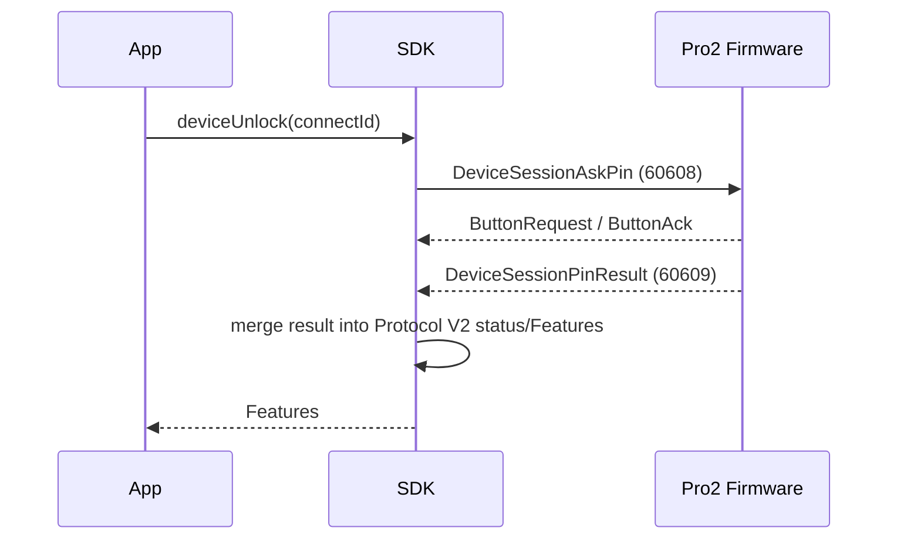
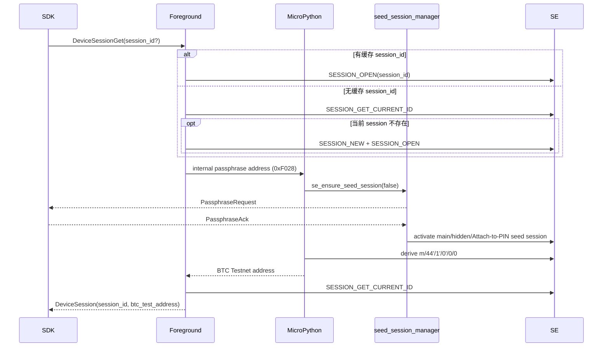

# Protocol V2 解锁与钱包 Session 设计

> 本文已按 2026-07-14 的 Pro2 固件和 SDK 实现更新。完整变更背景见
> `2026-07-14-protocol-v2-passphrase-session-alignment-design.md`。

## 1. 职责边界

Protocol V2 把设备解锁与钱包上下文分成两个独立接口：

| 能力         | 请求/响应                                       | 职责                                                              |
| ------------ | ----------------------------------------------- | ----------------------------------------------------------------- |
| PIN 解锁     | `DeviceSessionAskPin -> DeviceSessionPinResult` | 设备端 PIN 输入，并返回解锁、Attach-to-PIN 和 passphrase 开关状态 |
| 钱包 Session | `DeviceSessionGet -> DeviceSession`             | 恢复或创建 SE session，并返回当前钱包的 BTC Testnet 地址指纹      |
| 状态查询     | `DeviceStatusGet -> DeviceStatus`               | 独立的原始状态查询，不是解锁流程的必要后续调用                    |

`DeviceSessionGet` 不负责解锁。设备锁定时调用该接口会失败，App 仍保持“先
`deviceUnlock`，后 `getPassphraseState`”的顺序。

Transport Link Session、Protocol V2 frame `seq` 和钱包 `session_id` 是不同概念，
不能共用缓存或生命周期。

## 2. 解锁设计



`DeviceSessionPinResult` 包含：

- `unlocked`
- `unlocked_attach_pin`
- `passphrase_protection`

SDK 直接把它们映射到标准 Features：

- `Features.unlocked`
- `Features.unlockedAttachPin`
- `Features.passphraseProtection`

同时更新 `features.raw.protocolV2DeviceInfo.status` 中对应的
`unlocked/unlocked_by_attach_to_pin/passphrase_enabled`。该流程不调用
`DeviceStatusGet`，行为与 Protocol V1 直接消费 `UnLockDeviceResponse` 一致。

如果固件不认识 `DeviceSessionAskPin`，SDK 保留
`Failure_UnexpectedMessage -> DeviceNotSupportMethod` 映射。本轮不为其他旧 API
增加 Protocol V2 守卫。

## 3. 钱包 Session 与 passphraseState

### 3.1 固件流程



最终 `session_id` 必须在 passphrase/Attach-to-PIN 上下文生效后重新读取。不能返回
最初打开或创建的 ID，因为 seed session 选择过程中当前 SE session 可能变化。

### 3.2 PassphraseRequest/Ack

Pro2 仍然使用 `PassphraseRequest/PassphraseAck`。`DeviceSessionGet` 本身不携带
passphrase 字符串，而是通过内部 BTC 地址派生触发 `se_ensure_seed_session(false)`，
再由 `seed_session_manager` 处理：

- Host 输入 passphrase：`PassphraseAck { passphrase }`
- 设备输入 passphrase：`PassphraseAck { on_device: true }`
- 选择已有 Attach-to-PIN 用户：`PassphraseAck { on_device_attach_pin: true }`

因此 `PassphraseRequest/Ack` 是 DeviceSession 完整流程的一部分，不是废弃消息。

### 3.3 passphraseState

`DeviceSession.btc_test_address` 使用 Testnet 路径 `m/44'/1'/0'/0/0` 派生，SDK 将其
作为 `passphraseState`。它用于区分主钱包和不同隐藏钱包，不是用户输入的
passphrase，也不得写入日志。

## 4. Session 缓存模型

V1 与 V2 共用 `DeviceWalletSessionStore`：

```text
deviceKey + passphraseState -> sessionId
```

安全规则：

1. App 持有钱包身份 `passphraseState`，SDK 持有运行期 `sessionId`。
2. 没有 `passphraseState` 时不扫描其他钱包缓存。
3. `initSession=true` 时清理当前内部 session 状态。
4. 返回的 `btc_test_address` 与调用方期望不一致时，清缓存并抛安全错误。
5. App 不需要把 `sessionId` 写入钱包数据库；短生命周期 CLI 可显式预热缓存。

有缓存时：

```text
DeviceSessionGet(cached session_id)
  -> success: 保存固件返回的最终 session_id
  -> invalid session: 清缓存，DeviceSessionGet({}) 重试一次
```

无缓存请求失败时不重试，第二次请求失败时也不继续重试，避免无限循环。

## 5. InvalidSession 表达

Protocol V2 common Failure 要求业务错误使用 subcode。缓存 session 无法由 SE 打开
时固件返回：

```text
code = Failure_ProcessError
subcode = 14
message = Failure_InvalidSession
```

SDK 识别该错误后只删除当前钱包的 session 缓存，再进行一次无 session 请求。SE
请求无法投递、超时或新 session 创建失败仍返回普通 ProcessError，不能误判为缓存
失效。

## 6. Raw API 与高层 API

`deviceStatusGet` 和 `deviceSessionGet` 是低副作用 Raw API：

- `deviceStatusGet` 返回原始 `DeviceStatus`，不自动更新 Features。
- `deviceSessionGet` 接受可选 `sessionId` 并返回原始 `DeviceSession`，不自动写钱包缓存。

高层行为由以下入口负责：

- `Device.unlockDevice()`：解锁并合并 PinResult。
- `getProtocolV2WalletSession()`：缓存恢复、InvalidSession 重试、地址校验和缓存更新。
- `getPassphraseStateWithRefreshDeviceInfo()`：对外统一返回
  `passphraseState/newSession/unlockedAttachPin`。

## 7. 非目标

- 不恢复旧的 `UnLockDevice/UnLockDeviceResponse(10030/10031)`。
- 不恢复旧的 `GetPassphraseState/PassphraseState(10028/10029)`。
- 不为 Protocol V2 不支持的旧 API 增加守卫。
- 本轮不向 V2 host 传递 `allowCreateAttachPin`；等待硬件侧接口合入。
- 不改变 Protocol V1 的 unlock、passphrase 和 session 行为。

## 8. 验证要求

- Protocol V2 unlock 只发送 `DeviceSessionAskPin`，不发送 `DeviceStatusGet`。
- `DeviceSession` 同时返回 `session_id` 和 `btc_test_address`。
- 缓存 session 失效时恰好重试一次。
- 主钱包请求不会隐式复用隐藏钱包 session。
- Protocol V1 unlock 测试保持原调用序列。
- `task_foreground_obj` 在最新 `firmware-pro2/dev` 基线上可编译。
