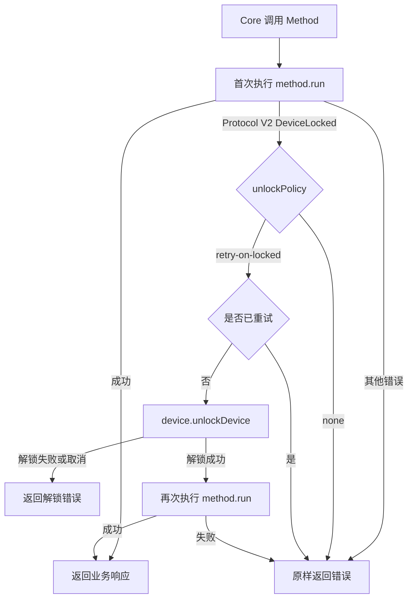

# Protocol V2 受保护方法自动解锁重试设计

## 1. 背景

OneKey Pro2 的 Protocol V2 将部分敏感操作改为“设备必须已解锁”才能执行。设备在锁定状态收到这类请求时，会返回：

```text
Failure_ProcessError / subcode 9 / "Device locked"
```

Protocol V1 的 Pro 系列没有同样的统一错误语义，现有 SDK 也没有集中处理“方法因设备锁定而失败”的执行层。若在每个 API 中通过 `features.unlocked` 判断并主动调用 `deviceUnlock`，会产生以下问题：

- `features.unlocked` 是缓存状态，不是可靠的实时权限判断；
- 查询与真实调用之间仍存在重新锁定的竞态；
- 每个方法重复实现解锁逻辑，容易出现行为差异；
- SDK 需要复制固件的字段级权限规则，长期容易与固件漂移；
- `DeviceSettingsSet` 是否需要解锁取决于具体字段，无法仅靠方法名静态判断。

因此，SDK 需要新增统一的 Protocol V2 受保护调用处理层。

## 2. 目标

### 2.1 功能目标

- 识别 Protocol V2 固件返回的结构化 `DeviceLocked` 错误；
- 对显式声明允许自动解锁的方法，调用 `device.unlockDevice()` 后重试原方法；
- 每次业务调用最多自动重试一次；
- 不依赖 `features.unlocked` 决定是否提前解锁；
- 保持 Protocol V1 的现有行为不变；
- 将策略集中在 Core 调度层，避免每个 Method 重复实现。

### 2.2 非功能目标

- 安全：只有明确加入策略的方法才能触发 PIN 解锁交互；
- 可维护：固件新增受保护方法时，只需声明策略，无需复制执行流程；
- 可观测：日志能够区分首次调用、解锁和重试；
- 可测试：错误映射、重试次数、调用顺序和协议隔离均可独立验证；
- 兼容：不改变现有 API 签名与 Protocol V1 调用路径。

## 3. 方案对比

### 3.1 方案 A：调用前查询状态

执行受保护方法前先调用 `DeviceStatusGet`，发现锁定后调用 `deviceUnlock`。

优点：

- 调用流程直观；
- 可以在业务请求发送前展示解锁交互。

缺点：

- 每次至少增加一次 USB/BLE 往返；
- 状态查询和业务调用之间存在竞态；
- 需要提前判断哪些参数组合需要解锁；
- 设备状态缓存与固件实时状态可能不一致；
- 增加 BLE 场景的时延和失败面。

结论：不采用。

### 3.2 方案 B：所有 DeviceLocked 错误全局自动重试

任意 Protocol V2 方法收到 subcode 9 后都自动解锁并重试。

优点：

- 实现集中且简单；
- 新固件方法无需额外声明。

缺点：

- 后台查询或低层调试方法可能意外触发 PIN 交互；
- 无法明确哪些 API 承诺自动解锁；
- 对未来具有不可重试副作用的方法风险较高。

结论：不采用。

### 3.3 方案 C：声明式策略 + DeviceLocked 后解锁重试

Method 显式声明 `unlockPolicy = 'retry-on-locked'`。首次调用收到结构化 DeviceLocked 错误后，由 Core 调度层解锁并重试一次。

优点：

- 无额外状态查询；
- 以固件实时判断为准；
- 能处理 `DeviceSettingsSet` 这类字段级权限；
- 自动交互范围可审计；
- Protocol V1 与未声明方法不会受影响。

缺点：

- 受保护方法需要显式声明策略；
- SDK 必须保留固件 Failure 的结构化字段；
- 必须严格控制重试次数和可重试范围。

结论：采用方案 C。

## 4. 总体架构



设计分为三层：

1. Transport/DeviceCommands：保留并映射固件 Failure 的结构化信息；
2. Method 元数据：声明该方法是否允许自动解锁重试；
3. Core 执行器：统一执行首次调用、解锁和单次重试。

## 5. 错误模型

### 5.1 当前问题

`DeviceCommands._filterCommonTypes()` 当前主要使用 `Failure.code` 和 `Failure.message`，未保留 Protocol V2 的 `Failure.subcode`。最终错误通常退化为：

```text
RuntimeError: Failure_ProcessError,Device locked
```

依赖消息字符串判断存在本地化、文案变更和同名错误误判风险。

### 5.2 新增错误类型

新增 SDK 错误码：

```ts
HardwareErrorCode.DeviceLocked
```

错误参数保留固件原始字段：

```ts
type ProtocolV2FailureMetadata = {
  failureCode?: FailureType | string;
  subcode?: number;
  firmwareMessage?: string;
};
```

当满足以下条件时映射为 `DeviceLocked`：

```text
Failure.code == Failure_ProcessError
Failure.subcode == DeviceError_DeviceLocked (9)
```

`message === "Device locked"` 仅可作为旧固件兼容回退，不作为首要判断依据。回退必须同时限制为 Protocol V2 和 `Failure_ProcessError`。

### 5.3 错误传播

- 首次调用返回 DeviceLocked 且方法允许重试：错误暂不暴露给调用方；
- 解锁取消：返回标准 `PinCancelled`、`ActionCancelled` 或实际解锁错误；
- 解锁失败：不执行原方法重试；
- 第二次仍返回 DeviceLocked：原样返回 `DeviceLocked`，禁止再次解锁；
- 其他错误：保持原有映射和传播方式。

## 6. Method 策略声明

在 `BaseMethod` 增加：

```ts
type UnlockPolicy = 'none' | 'retry-on-locked';

unlockPolicy: UnlockPolicy = 'none';
```

需要自动处理的 Method 在 `init()` 中声明：

```ts
this.unlockPolicy = 'retry-on-locked';
```

选择 opt-in 而非 opt-out，原因是解锁会产生用户可见的 PIN 交互，不能由未知或后台方法隐式触发。

### 6.1 首批方法

首批声明 `retry-on-locked`：

- `DeviceSettingsGet`
- `DeviceSettingsSet`
- `DeviceSettingsPageShow`

其中：

- `DeviceSettingsGet` 固件明确要求设备已解锁；
- `DeviceSettingsPageShow` 的所有页面均要求已解锁；
- `DeviceSettingsSet` 同时支持受保护与非受保护字段，由固件决定是否返回 DeviceLocked。SDK 不做字段白名单预判。

其他方法必须依据 firmware-pro2 的协议说明和实际错误行为逐步加入，不在本次设计中推测性扩展。

## 7. Core 统一执行器

在 Core 当前调用 `method.run()` 的统一位置引入内部执行函数，例如：

```ts
async function runMethodWithUnlockRetry(method: BaseMethod, device: Device) {
  try {
    return await method.run();
  } catch (error) {
    if (!shouldUnlockAndRetry(method, device, error)) {
      throw error;
    }

    await device.unlockDevice();
    return method.run();
  }
}
```

判断条件必须全部满足：

```ts
device.isProtocolV2() === true
method.unlockPolicy === 'retry-on-locked'
error.errorCode === HardwareErrorCode.DeviceLocked
当前执行尚未发生自动重试
```

重试计数应是单次 Method 执行的局部变量，不写入设备全局状态，也不暴露为可由调用方修改的 payload 参数。

### 7.1 为什么放在 Core 而不是 DeviceCommands

`DeviceCommands` 只理解协议消息，不应决定是否触发 PIN UI 或重放业务方法。若在 `typedCall()` 中自动重试，会存在以下问题：

- 不知道当前 Method 是否允许自动解锁；
- 无法安全重建高层方法的完整执行上下文；
- 一个 Method 可能包含多个 typedCall，重试单个消息不等于重试完整方法；
- 会混淆协议层和业务交互层职责。

因此 DeviceCommands 只负责结构化错误，Core 负责策略和重试。

## 8. 并发与生命周期

现有调用在 `device.run(inner, runOptions)` 和请求队列内串行执行。自动解锁与第二次 `method.run()` 必须保持在同一次 `inner` 执行中，从而保证：

- 不释放当前设备会话；
- 其他调用不能插入解锁和重试之间；
- Method 的 `dispose()` 只在最终完成后执行；
- 请求取消仍作用于同一个请求上下文；
- 日志和响应 ID 保持一致。

不得把原请求放回公共队列重新调度，否则可能造成顺序变化、重复 UI 和响应 ID 生命周期错误。

## 9. 幂等性与安全边界

自动重试仅针对明确的 `DeviceLocked`。该错误表示固件在执行业务副作用之前拒绝请求，因此可以安全重放。

仍需遵守以下约束：

- 每次业务调用最多自动重试一次；
- 不对超时、断连、Busy、ActionCancelled 等错误自动重试；
- 不把字符串包含 `locked` 的普通 RuntimeError 视为 DeviceLocked；
- 未声明策略的方法不自动触发 PIN；
- 解锁成功不代表业务调用成功，第二次调用错误必须原样返回；
- 用户取消解锁时不得继续发送原业务请求。

## 10. 日志与可观测性

统一记录以下事件，避免记录 PIN 或敏感数据：

```text
ProtocolV2 unlock retry triggered: method=<name>, subcode=9
ProtocolV2 unlock completed: method=<name>
ProtocolV2 method retry completed: method=<name>, success=<boolean>
```

日志应关联现有 `responseID`、Method instance ID 和 Device instance ID。解锁取消属于正常交互结果，使用 debug/info 级别；异常解锁失败使用 warn/error 级别。

## 11. Protocol V1 兼容性

Protocol V1 行为保持不变：

- `deviceSettings` 继续发送 `ApplySettings`；
- `deviceChangePin`、`deviceWipe` 等继续使用旧消息；
- Protocol V1 Failure 不参与 subcode 9 自动解锁规则；
- `deviceSettingsPageShow` 继续由 `requireProtocolV2` 阻止在旧设备上调用。

本设计不尝试把新旧 API 合并为单一参数模型。统一的是 SDK 内部执行策略，而不是固件协议或公开业务语义。

## 12. 测试设计

### 12.1 错误映射测试

- `Failure_ProcessError + subcode 9` 映射为 `HardwareErrorCode.DeviceLocked`；
- 错误 params 保留 code、subcode 和 message；
- 同样文案但非 subcode 9 不映射为 DeviceLocked；
- Protocol V1 原错误映射不变。

### 12.2 Core 执行器测试

- 首次成功：不调用 `unlockDevice`，只执行一次 Method；
- 首次 DeviceLocked：先执行 Method，再解锁，再执行 Method；
- 未声明策略：DeviceLocked 直接返回；
- Protocol V1：即使出现相似错误也不自动解锁；
- 解锁失败或取消：Method 不重试；
- 第二次 DeviceLocked：不进行第三次调用；
- 第二次返回其他错误：原样返回；
- 调用顺序严格为 `run → unlock → run`。

### 12.3 Settings 集成测试

- `DeviceSettingsGet` 锁定后自动解锁重试；
- `DeviceSettingsPageShow(DevicePassphrase)` 锁定后自动解锁重试；
- `DeviceSettingsSet` 非受保护字段首次成功，不触发解锁；
- `DeviceSettingsSet` 受保护字段返回 DeviceLocked 后自动解锁重试；
- 现有 Protocol V1 `deviceSettings(usePassphrase)` 测试保持通过。

## 13. 迁移与清理

实现统一执行器后，删除 `DeviceSettingsPageShow.run()` 中基于 `features.unlocked` 的预检查：

```ts
if (this.device.features?.unlocked === false) {
  await this.device.unlockDevice();
}
```

不应在其他 Method 中新增类似检查。后续发现新的 subcode 9 方法时，只需要：

1. 确认 DeviceLocked 表示业务副作用尚未开始；
2. 为 Method 声明 `unlockPolicy = 'retry-on-locked'`；
3. 增加锁定、解锁和单次重试测试。

## 14. ADR-001：采用错误驱动的声明式自动解锁策略

### 状态

已接受。

### 上下文

Protocol V2 的受保护操作由固件通过 DeviceLocked 错误表达。SDK 需要在不依赖缓存状态、不增加每次调用往返、且不让所有方法隐式触发 PIN 的前提下提供统一体验。

### 决策

采用 Method 显式声明 `retry-on-locked`，Core 在收到结构化 DeviceLocked 后调用 `device.unlockDevice()`，并最多重试原 Method 一次。

### 备选方案

- 调用前查询 `DeviceStatusGet`：因额外时延、竞态和规则复制而拒绝；
- 所有 DeviceLocked 全局重试：因交互范围不可控而拒绝；
- 每个 Method 自行处理：因重复、难审计和行为漂移而拒绝。

### 影响

正面影响：

- 固件成为实时权限判断的单一事实来源；
- 解锁策略集中、可审计、可测试；
- 支持参数级动态权限；
- 不影响 Protocol V1。

负面影响：

- 需要扩展错误模型并保留 subcode；
- 新增受保护方法时必须显式声明策略；
- 调用方可能在首次失败后看到 PIN 交互，文档需明确此行为。

## 15. 验收标准

- SDK 不再通过 `features.unlocked` 为受保护方法做预解锁判断；
- Protocol V2 subcode 9 被映射为结构化 `DeviceLocked` 错误；
- 只有声明 `retry-on-locked` 的方法会触发自动解锁；
- 自动执行顺序为首次调用、解锁、单次重试；
- 解锁取消和第二次失败能够正确返回；
- Protocol V1 行为和测试无回归；
- Settings 首批三个新方法覆盖自动解锁策略；
- 全部新增单元测试、Protocol V2 回归测试和 Core 构建通过。
