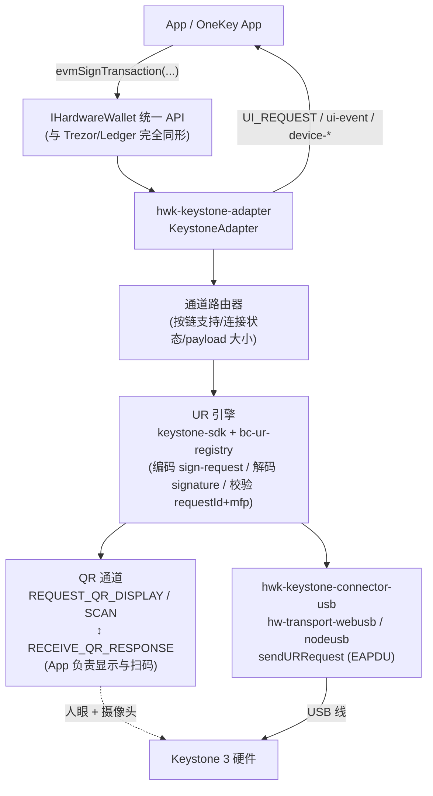
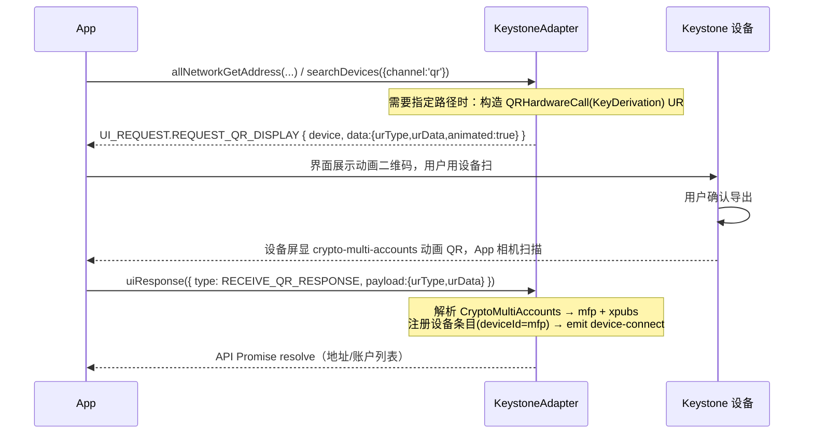
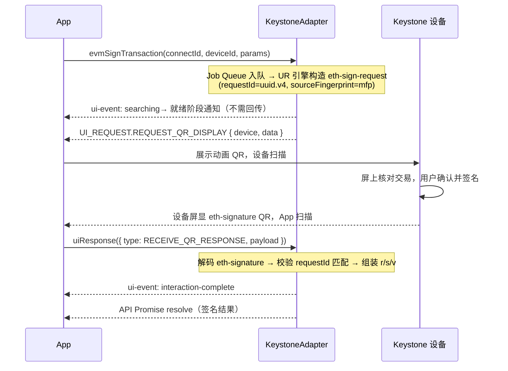
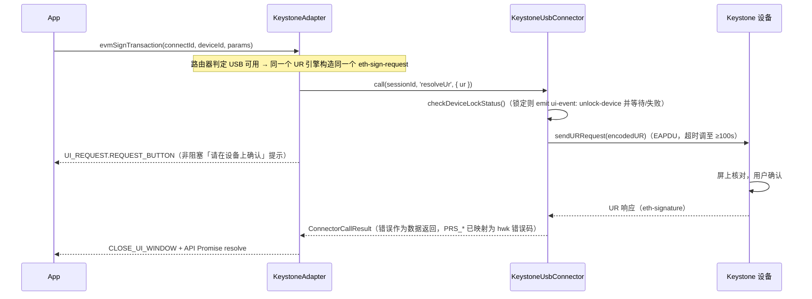
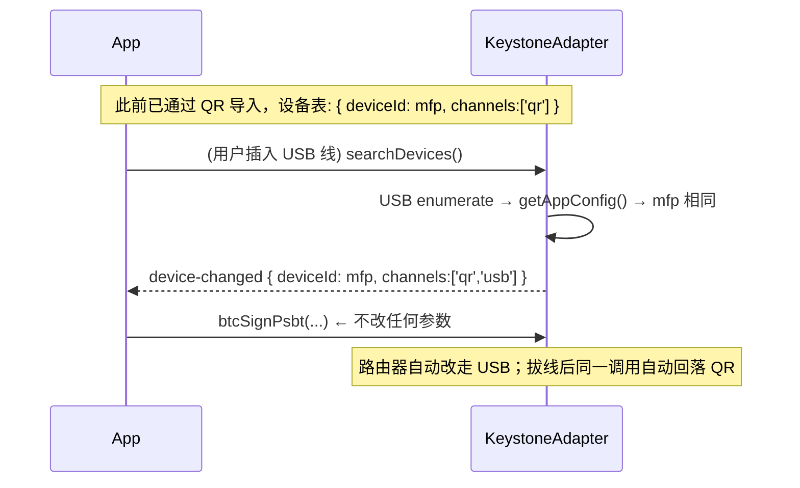

# Keystone 接入架构设计（QR + USB 双通道）

> - 文档状态：设计提案，阶段 0-4 已实施（分支 `feat/keystone-integration`，基于 `onekey` @ 37b9354dc）
> - 事实核验日期：2026-08-20（仓库代码 + Keystone 官方源码/文档均已按当日版本核验；阶段 1/2 对照本机已安装的
>   `@keystonehq/keystone-sdk@0.4.1` 实际编译产物复核，个别签名与最初调研有出入，均以本次复核为准）；
>   阶段 3/4 于 2026-08-25 补充实施
> - 目标读者：Hardware JS SDK 维护者

## 实施进度

- **阶段 0（类型扩宽）已完成**：`hwk-adapter-core` 的 `VendorType`/`ConnectionType`/`TransportType`/
  `DetectableHardwareVendor`/`AllNetworkDeviceIdentity` 已加 `keystone`/`qr` 成员；USB VID/PID
  检测（`0x1209`/`0x3001`，且要求两者同时匹配——`0x1209` 是共享的 pid.codes 开源硬件 VID）已加入
  `deviceIdentity.ts`；单测覆盖新增分支。
- **阶段 1（UR 引擎抽取）已完成**：`packages/hwk-keystone-adapter` 的 `KeystoneUrEngine`
  ——对 `@keystonehq/keystone-sdk`（裸构造，非 `.create()`）的薄封装，覆盖 multi-accounts/单 hdkey 解析、
  KeyDerivation 请求构造、EVM/BTC(PSBT+消息签名)/SOL 的签名请求构造与签名解析、EVM 离线地址派生
  （`generateAddressFromXpub`）。依赖版本锁定为 `@keystonehq/keystone-sdk@0.4.1`（与仓库内
  `react-native-demo/air-gap` 已验证可用的版本一致）。
- **阶段 2（QR 事件循环 + Adapter 骨架）已完成**：`KeystoneAdapter` 实现完整 `IHardwareWallet`
  （§3 的"QR 不实现 IConnector"决定落地——纯事件驱动，不持有 connector）。要点：
  - **冷启动两跳流程已实现**：`connectId`/`deviceId` 为空时，签名类方法先隐式发一次 `qr-hardware-call`
    KeyDerivation 请求拿到 mfp，再发真正的签名请求——对调用方就是一次普通方法调用，内部按需 1~2 次
    二维码往返。已同步过的钱包（`_devices` 按 mfp 缓存）跳过第一跳。
  - **两种缓存粒度分开处理**：签名类方法（`evmSignTransaction` 等）只需要 mfp，走 `_ensureMfpKnown`
    （按账户级路径探测同步一次即可，不挑剔具体路径）；`evmGetAddress` 需要真实账户 xpub，走
    `_ensureAccountSynced`（按账户路径三段精确缓存）。**这两者最初被写混过**——签名方法一度错误复用了
    按叶子路径缓存的 `_ensureAccountSynced`，导致每次签名都触发多余的重新同步；已修正。
  - **2026-08-25 修正**：`_ensureMfpKnown` 曾直接把 `CHAIN_FINGERPRINT_PATHS.evm`（5 段叶子路径
    `m/44'/60'/0'/0/0`）原样发给设备做 KeyDerivation 探测，而不是像 `DEFAULT_IMPORT_SCHEMAS`/
    `_ensureAccountSynced` 那样截断成账户级路径。经 Keystone 官方文档
    （`dev.keyst.one/docs/integration-tutorial-advanced/multichain`）与 `@keystonehq/keystone-sdk`
    源码双重核验：ETH 账户级路径应为 3 段 `m/44'/60'/0'`——已修正为对
    `CHAIN_FINGERPRINT_PATHS[chain]` 统一走 `splitAccountPath` 截断（`btc`/`sol` 本就是 3 段，截断后
    不变）。新增回归测试锁定该路径值。BTC 侧的 44'/49'/84' 账户路径本就正确，已用同一批文档核验确认；
    BIP-48 多签路径（`m/48'/.../1'`、`/2'`）目前不支持，是范围内从未覆盖的已知缺口，非本次修正对象。
  - EVM 地址派生：账户级（3 段）xpub 缓存 + `deriveEvmAddressFromXpub` 离线算叶子地址，不为
    `showOnDevice` 做设备回显（诚实标注为已知缺口，不是静默遗漏）。
  - BTC：`btcSignPsbt`/`btcSignMessage`/`btcGetMasterFingerprint` 已实现；`btcGetAddress`/
    `btcGetPublicKey`/`btcSignTransaction` 显式返回 `MethodNotSupported`（各自原因见代码注释：前两者
    缺脚本类型感知的 xpub→地址派生，后者缺 host 侧 PSBT 构造）。
  - TRON：2026-08-25 补上 `tronGetAddress`/`tronSignTransaction`（`tronSignMessage` 仍
    `MethodNotSupported`，见下）。**不用 `@keystonehq/keystone-sdk` 自带的 `sdk.tron`**（那是另一套
    gzip+protobuf 协议，响应字段语义没法验证）——改用 `urEngine/TronSignRequest.ts`/`TronSignature.ts`，
    直接照抄 app-monorepo 的 `packages/qr-wallet-sdk`（已在生产环境验证过的 TRON QR 集成）：一个纯 CBOR
    的 `tron-sign-request`/`tron-signature` UR 对（registry type 5201/5202），跟 eth/sol 同形状，带裸
    `signature` 字段。`tronSignTransaction` 只接 `rawTxHex`（标准 TRON protobuf tx，Ledger 那套输入），
    设备自己解码显示，不做客户端预解析，所以没有 BTC 那种"只支持 3 种合约类型"的限制。`tronSignMessage`
    留空——`signType` 有 `SignMessage`/`SignMessageV2` 两种，具体哪个对应真机的"签消息"没验证，宁可不猜。
  - 新增 `qrTimeoutMs` 构造选项（默认沿用 registry 的 10 分钟默认值），使超时路径可测。
  - 单测 16 个（`KeystoneAdapter.test.ts`），全部通过真实 UR 编解码模拟设备端（不 mock adapter 内部）：
    导入、冷/热启动签名、EVM 地址派生、BTC PSBT、SOL 签名、requestId 不匹配拒绝、mfp 不匹配拒绝
    （fail-closed）、取消、超时、getChainFingerprint/btcGetMasterFingerprint 缓存复用。
- **阶段 3（USB connector）已完成**：`packages/hwk-keystone-connector-usb`——`IConnector` 从零实现
  （`KeystoneUsbConnectorBase`，`_subpath/webusb.ts`/`_subpath/nodeusb.ts` 分包裸露 `TransportWebUSB`/
  `TransportNodeUSB`）。要点：
  - `connect()` 打开 transport 后立刻 `CMD_GET_DEVICE_VERSION` 拿 `walletMFP`，以 mfp 本身作为
    `sessionId`/`deviceId`（USB 侧不需要单独的 connectId 前缀——mfp 天然唯一）；若调用方传入
    `deviceId` 且与实际不符，fail-closed 报 `DeviceMismatch`。
  - `call()` 的 `'resolveUr'` 方法把 `{urType,urData}`（十六进制 CBOR，与 QR 事件同一约定）编成
    bech32 UR 串发 `CMD_RESOLVE_UR`，解码响应回同一形状——`KeystoneAdapter` 可以对两条通道复用同一个
    `KeystoneUrEngine` 构造出的请求。
  - 错误映射（`mapKeystoneUsbError`）覆盖 `PRS_*`（设备拒绝/锁定/钱包不匹配）与 `ERR_*`（超时/设备未
    找到/payload 过大/不支持）；对已经是 `HwkError` 的输入直接透传（幂等），避免连接器内部已经正确
    构造的错误被二次映射丢失原始 code。
  - 超时默认调至 100s（SDK 自身默认 15s 对真实设备确认来说太短）。
  - `cancel()`/`uiResponse()` 均为文档化的 no-op——USB 无协议级取消，PIN/passphrase 全部走设备触屏。
  - 单测 9 个：searchDevices（无 mfp 的原始枚举）、connect（含 mfp 不符 fail-closed）、
    resolveUr/checkLockStatus 往返（真实 UR 编解码）、错误映射、未知 session。
- **阶段 4（双通道归并与路由）已完成**：`KeystoneAdapter` 构造函数新增可选 `usbConnector: IConnector`
  （与 Trezor/Ledger 完全一致的依赖注入模式——`hwk-keystone-adapter` 不依赖 `hwk-keystone-connector-usb`
  包本身，由宿主 app 组装并注入，`packages/hwk-keystone-adapter` 的 `package.json` 无需新增依赖）。要点：
  - `KeystoneDeviceRecord` 新增 `usbSessionId`/`qrSynced` 两个字段；`_resolveUr()` 是唯一的通道路由
    点——`record.usbSessionId` 存在时优先走 USB（`IConnector.call(sessionId,'resolveUr',ur)`），否则走
    QR 事件循环；`switchTransport('qr'|'usb')` 可显式钉住，不传合法值则清空钉住回到 auto。
  - **USB 必须显式连接，QR 保持全隐式**：QR 侧冷启动流程不变（`connectId`/`deviceId` 传 null 即可）；
    USB 侧因为 WebUSB 拾取器要求用户手势，`searchDevices()` 只做描述符级枚举（不 open+claim，不产生
    mfp），必须调用方显式 `connectDevice(usb枚举返回的connectId)` 才会真正打开设备学到 mfp——这也正是
    "QR 天生没有扫描设备步骤，USB 必须有"这一现状在实现层面的直接体现。
  - **按 mfp 归并，不用 `createCombinedConnector`**（该工具明确不去重，服务的是"一厂两传输各自成条目"
    场景，与本方案相反）：`connectDevice()` 学到 mfp 后，若 `_devices` 已有同 mfp 的 QR 条目就原地升级
    （emit `device-changed`，不是第二次 `device-connect`）；否则新建一条 USB-only 条目。
  - `disconnectDevice()`：USB 断开后，若该 mfp 曾经 QR 同步过（`record.qrSynced`）→ 降级为 QR-only 条目
    （`device-changed`）；从未 QR 同步过的纯 USB 条目 → 整条移除（`device-disconnect`）。
  - `_ensureAccountSynced`/`_ensureMfpKnown` 在目标钱包已有 USB session 时，其隐式 KeyDerivation 同步
    也会走 USB（不再局限于签名/取地址请求本身）——但 USB `connect()` 本身已经用 `getAppConfig` 学到了
    mfp，所以 `_ensureMfpKnown` 通常直接命中缓存，完全不需要额外同步往返（比 QR 冷启动更快一跳）。
  - `DeviceInfo.raw.availableChannels`（新增，非核心类型改动，纯 `raw` 透传字段）在双通道归并后同时列出
    `['qr','usb']`，供 App 展示。
  - 单测新增 6 个（`describe('USB channel', ...)`）：USB-only 新建、QR+USB 归并（事件序列断言）、
    signing/getAddress 走 USB 而非 QR、`switchTransport('qr')` 钉住、断开降级为 QR-only、断开整条移除
    （纯 USB 从未 QR 同步）——共 40 个测试全部通过（真实 UR 编解码 fake `IConnector`，非 mock adapter
    内部）。
  - 真机验证：QR 导入 → 插 USB 签名 → 拔线 QR 签名的完整闭环仍未做（USB 全链路只能真机验证）。
- 阶段 5（demo/文档）部分完成：`hwk-browser-demo-keystone`（独立于 Trezor/Ledger 的 `hwk-browser-demo`，
  不触碰后者）新增 "Search USB Device" 按钮（`requestKeystoneUsbPermission()` 触发浏览器 WebUSB
  拾取器 → `searchDevices()` → `connectDevice()`），与原有的直接调用 `evmGetAddress`/`btcGetAddress`
  （QR 隐式冷启动）并存；`docs/sdk/events.md` 的 hwk 段落尚未更新。

## 0.5 与 app-monorepo 现状的关系（2026-08-25 新增，待决策）

跨仓库核验（`app-monorepo`，OneKey 主 App，独立仓库）发现两件事，直接影响本方案下一步怎么走：

1. **`hardware-js-sdk` 的 `hwk-*` 栈目前完全没有被 app-monorepo 消费**——搜遍全仓库找不到任何
   `@onekeyfe/hwk-*` 依赖；唯一还在用的是遗留 `@onekeyfe/hd-*`（`apps/cli`）。
2. **app-monorepo 已经有一套完整、生产可用的 Keystone 集成**，且与本方案完全独立：`packages/qr-wallet-sdk`
   直接包一层 `@keystonehq/keystone-sdk` + `@keystonehq/bc-ur-registry-eth`（`src/chains/AirGap{Btc,Eth,Sol,Tron}SDK.ts`），
   喂给专属的 `EVaultKeyringTypes.qr` keyring 类型（`KeyringQrBase` + 各链 `packages/kit-bg/src/vaults/impls/{btc,evm,...}/KeyringQr.ts`），
   与 Trezor/Ledger/OneKey 走的 `hw` keyring 类型完全分离。这条链路已经验证了本方案的核心判断——
   **xpub 是硬性依赖，没有 xpub 就没有回退到"逐个地址问设备"的路径**（每处消费点找不到 xpub 直接
   `throw OneKeyLocalError('xpub not found')`）——但也意味着**本方案目前是在重新实现一套已经存在且在跑的
   东西**，而不是补一个空白。

   与真实实现相比，本方案（`hwk-keystone-adapter`）目前少两块：
   - **EVM 只支持 Standard 派生（`m/44'/60'/0'/0/{index}`，一个账户级 xpub 打天下）**，不支持
     `qr-wallet-sdk` 也在用的 **LedgerLive 派生**（`m/44'/60'/{index}'/0/0`——每个地址下标对应
     **不同**的账户级 xpub）。`accountKey(hwkChain, path)` 目前假定"一条链一个稳定账户 xpub"，装不下
     LedgerLive 这种"账户号随地址下标变"的形状。
   - **同步策略不同**：真实实现（`ServiceQrWallet.buildGetMultiAccountsParams`）把一条链要用到的所有
     派生模板路径去重后合并成**一次** KeyDerivation 往返；本方案目前每个未缓存路径各自发一次往返
     （`_ensureAccountSynced`），且 BTC 侧不会像真实实现一样默认顺带拿一个 taproot xfp。

   这两块差距不是 bug，是"离生产实现还差多远"的功能缺口，要不要补、什么优先级，取决于本方案最终定位
   （是 `hwk-*` 栈未来要接管 QR 钱包的目标形态，还是独立于 app-monorepo 现状的探索/演示）——**留给用户
   决策，本文档只如实记录差距，不擅自扩大范围去对齐**。

## 0.6 真机验证发现的 KeyDerivation 协议版本问题（2026-08-25，已修复）

第一次接真机（USB）测试 `evmGetAddress` 时报错：`选择的路径不受支持。请在软件钱包中选择一个有效的路径。
(error_code: 5)`。**根因跟路径段数无关**——直接核对 `keystone3-firmware` 源码（`CheckHardwareCallRequestIsLegal`）
和 `@keystonehq/keystone-sdk` 源码确认：`QRHardwareCall`（KeyDerivation 请求的载体）有一个内部协议版本位
`V0`/`V1`；固件对 `V0` 请求的校验逻辑**只认 Cardano 路径**（历史包袱——这套"host 主动要任意路径 xpub"的
机制最早只为 Cardano 做），其他任何链的路径一律拒绝，跟路径是几段完全无关。`generateKeyDerivationCall` 不传
`version` 时默认建出 `V0` 请求——而我们锁定的 `@keystonehq/keystone-sdk@0.4.1` 这个版本的 SDK 压根没有
`version` 这个参数（那时 `QRHardwareCall` 只有 `type/params/origin` 三个字段），所以完全没有能力发出 `V1`
请求，从第一次接真机测试起就必然失败。

修复：

- `@keystonehq/keystone-sdk`：`0.4.1` → `0.12.3`（当前 npm 最新版，确认已支持 `version: QRHardwareCallVersion.V1`）。
- `@keystonehq/bc-ur-registry`（devDep）：`0.6.4` → `0.8.0`；`@keystonehq/bc-ur-registry-sol`（devDep）：
  `0.6.2` → `0.9.3`——均是 `keystone-sdk@0.12.3` 自己声明的依赖版本，跟着一起升，避免同包两份实例。
- `@keystonehq/bc-ur-registry-eth`：`0.15.2` → `0.22.1`（不是 `0.22.0`——`0.22.0` 的官方发布包本身有个真实
  bug：`src/EthBatchSignRequest.ts` 里把 `import { EthSignRequest } from "./EthSignRequest"` 误写成
  `from "EthSignRequest"`（少了相对路径前缀），打包后 `require('EthSignRequest')` 直接炸模块加载；`0.22.1`
  这个补丁版本修复了这个笔误，已核实其 dist 产物不再有这行坏 require）。
- `KeystoneUrEngine.buildKeyDerivationRequest` 现在显式传 `version: QRHardwareCallVersion.V1`。
- 逐一核对了 0.4.1→0.12.3 跨度里我们实际用到的每个 API（`parseMultiAccounts`/`parseHDKey` 的
  `Account`/`MultiAccounts` 字段形状、`eth`/`btc`/`sol` 三个子 SDK 的 `generateSignRequest`/`parseSignature`
  签名、`CryptoHDKey`/`CryptoMultiAccounts`/`CryptoCoinInfo`/`CryptoKeypath`/`PathComponent` 等测试夹具用到
  的构造函数）——全部保持兼容，唯一真正的行为变化就是 KeyDerivation 请求的 `version` 位。
- 升级前对 4 个新增/变更的包版本都过了一遍供应链检查（`npm pack --ignore-scripts`，查生命周期脚本、
  `child_process`/`eval`/网络请求等危险模式）——干净；唯一命中的网络调用是 `KeystoneSDK.static create()`
  内部的 `fetch(CONFIG_URL)`，跟已知的"必须用裸构造、不能用 `.create()`"结论完全一致，没有新增风险。
- `hwk-keystone-adapter`、`hwk-keystone-connector-usb` 单测（41 + 9 个）、typecheck、lint、build 全部通过；
  新增回归测试直接解码 `qr-hardware-call` UR 断言 `getVersion() === QRHardwareCallVersion.V1`，防止这个
  版本位被静默改回去。

## 0. 范围声明

- **目标运行时/传输**：浏览器 WebUSB、Electron Node USB、React Native（QR 通道全平台，无物理传输）。
- **设备家族/协议**：Keystone 3 系列；协议为 BC-UR（CBOR）承载的 Keystone 空气隔离协议。USB 通道用 EAPDU 帧承载**同一套 UR 数据**，与 Trezor Protocol V1/V2 完全无关。
- **落点**：`hwk-*` 多厂商 Adapter 栈（`hd-*` 栈不动——它是 Trezor 线协议形状，QR 设备放不进去，也无需放）。
- **目标**：App 调用与 Trezor/Ledger 完全一致的 `IHardwareWallet` API；QR 交互经由预留的 `REQUEST_QR_DISPLAY / REQUEST_QR_SCAN / RECEIVE_QR_RESPONSE` UI 事件闭环；USB 与 QR 识别为**同一逻辑设备**，可随时切换。
- **非目标**：不改 OneKey 自家设备的 QR（Keystone 协议）/USB（Trezor 协议）双轨现状；不做固件、不碰 `hd-*` 公共 API；本文不含发布计划。

## 1. 现状盘点：三项已有资产 + 一个缺口

### 资产 A：QR UI 事件接口早已预埋（从未被触发）

`hwk-adapter-core` 里存在一套**完整定义、类型齐全、公开导出、但全仓库无人 emit** 的 QR 接口：

| 内容 | 位置 |
| --- | --- |
| `QrDisplayData { urType; urData; animated }`、`QrResponseData { urType; urData }` | `packages/hwk-adapter-core/src/types/qr.ts`（整个文件） |
| `REQUEST_QR_DISPLAY: 'ui-request-qr-display'`、`REQUEST_QR_SCAN: 'ui-request-qr-scan'` | `src/events/ui-request.ts:12-13` |
| `RECEIVE_QR_RESPONSE: 'receive-qr-response'` | `src/events/ui-request.ts:34` |
| 事件联合与 payload map（携带 `DeviceInfo`） | `src/types/wallet.ts:153-157, 259-266` |
| **动态路由**：一个响应类型按 pending 状态匹配 DISPLAY 或 SCAN | `src/utils/UiRequestRegistry.ts:76-84` |

字段名就是 BC-UR 词汇（`urType/urData/animated`），说明当年预留时就是按 UR 空气隔离钱包设计的。**本方案不发明新交互协议，直接点亮这套预留接口。**

### 资产 B：可复用的 UR 编解码实现（游离在 workspace 之外）

`packages/connect-examples/react-native-demo/air-gap/` 有一套基于 `@keystonehq/keystone-sdk` 的完整 QR 签名闭环（ETH/BTC/SOL，含动画 QR 播放与相机扫描解码）。注意：

- 该目录**不是 yarn workspace 成员**，不被任何 package 引用，不参与 CI；
- `sdk/OneKeyRequestDeviceQR.ts` 的 `onekey-app-call-device` 是 **OneKey 私有 UR 类型**（README 明确警告第三方不得实现），抽取时必须剥离，Keystone adapter 不得携带。

### 资产 C：无稳定硬件 ID 的身份模式已有先例（Ledger）

- `DeviceCapabilities.persistentDeviceIdentity: false`（`src/types/device.ts`）——Ledger WebHID 每次会话 ID 都变，就是这么声明的；
- `getChainFingerprint`（`src/types/wallet.ts:416-420`）+ `deriveDeviceFingerprint`（`src/types/fingerprint.ts:36-38`）——在固定路径派生地址取 SHA-256 前 16 hex 作为厂商无关指纹，注释明说是为无稳定 ID 的设备准备的。

### 缺口

- `VendorType = 'trezor' | 'ledger'`、`ConnectionType = 'usb' | 'ble'`、`DetectableHardwareVendor`、`AllNetworkDeviceIdentity`（两臂联合）都是封闭联合，无 keystone/qr 成员（`src/types/device.ts:1-5`、`src/utils/deviceIdentity.ts:1`、`src/types/wallet.ts:95-106`）；
- 没有任何 `hwk-keystone-*` 包；`IConnector` 尚无非 Trezor/Ledger 协议的从零实现先例。

## 2. Keystone 官方 SDK 事实速查（已核验源码）

> 基线：`ur-registry@bd8f4081`、`keystone-sdk-base@cda9c6ed`、`keystone-sdk-web@e29137b9`、`keystone-sdk-usb@74f2bcaa`、`keystone3-firmware@6ab436a2`；开发者文档 dev.keyst.one。

### 2.1 两条通道，一种数据

- **QR 通道**：`@keystonehq/keystone-sdk`（0.12.3）+ `@keystonehq/bc-ur-registry(-<chain>)`。账户同步 UR：`crypto-hdkey` / `crypto-account` / `crypto-multi-accounts`；签名 UR：`eth-sign-request → eth-signature` 等，按链各有一对。`requestId` 为钱包生成的 UUID v4（16 字节，CBOR tag 37），签名响应原样带回用于配对。
- **USB 通道**：`@keystonehq/hw-transport-webusb`（浏览器）/ `hw-transport-nodeusb`（Electron/Node）+ `hw-app-*`。官方文档原话：USB 也用 UR 编码，「已接 QR 的软件可直接复用」。帧格式为自定义 **EAPDU**（64 字节帧、INS/P1/P2 各 2 字节，**与 Ledger APDU 不兼容**），核心命令 `CMD_RESOLVE_UR`；`hw-app-base.sendURRequest(encodedUR)` 是通用桥——把本来该显示成二维码的 UR 字符串直接发过去，返回同样的 UR。`hw-app-eth` 的 Ledger 风格 API 只是 UR 之上的一层皮（内部构造同一个 `EthSignRequest`）。
- USB 设备标识：VID `0x1209` / PID `0x3001`。

### 2.2 跨通道身份（关键结论）

| 标识 | QR 通道 | USB 通道 | 结论 |
| --- | --- | --- | --- |
| **mfp（种子主指纹, xfp）** | `CryptoMultiAccounts.masterFingerprint`、`crypto-hdkey` 的 `origin.sourceFingerprint` | `getAppConfig().mfp`（walletMFP）、每次 `getPubkey/getURAccount` 都带 | **唯一双通道可靠键** |
| `deviceId`（`hex(sha256²(serial))[0..40]`） | 仅特定钱包品牌 QR 同步菜单填充（okx/bitget 等固件路径） | **固件传 `None`**（`generate_key_derivation_ur` 显式传空；官方 QR-USB.md 示例读它实际拿不到） | 只做 QR 侧 enrichment，不可依赖 |
| `device`（型号串 "Keystone 3 Pro"） | 有 | 有 | 非唯一，仅展示 |
| 序列号 | 无 | **无 API 可读** | 不可用 |

**警示**：mfp 标识的是**种子**不是硬件——Keystone 3 支持多助记词，passphrase 也会改变 mfp。因此本方案把「设备身份」明确定义为「钱包身份」（详见 §4）。

### 2.4 `QrDisplayData.urData` 的具体语义（阶段 1 落地时确定）

预留类型 `QrDisplayData { urType; urData; animated }` 只有**单个** `urData: string` 字段，但大 payload
的动画二维码需要多帧。核对 `react-native-demo/air-gap` 的实现（`AnimatedQrView.tsx` 接收 `parts: string[]`，
由 App 自己用 `UREncoder` 分帧）确认：**分帧节奏是 UI 关注点，不应该被塞进事件 payload**。因此约定：

- `urData` = **十六进制编码的原始 CBOR 载荷**（等价于 `ur.cbor.toString('hex')`），**不是** `ur:type/...`
  bech32 串，**不是**预分帧的多帧数组。
- `animated` 只是提示：这个 payload 大概率需要多帧渲染，App 侧拿到 `{urType, urData}` 后自己用
  `new UR(Buffer.from(urData,'hex'), urType)` + `UREncoder` 决定单帧还是动画多帧。
- `KeystoneUrEngine`（`packages/hwk-keystone-adapter/src/urEngine/`）的 `KeystoneUr { urType; urData }`
  类型就是这个约定的直接实现，阶段 2 把它套进 `QrDisplayData`/`QrResponseData` 时无需转换。

### 2.3 链覆盖与交互约束

- QR 支持 20+ 链（全集）；USB 已发布 hw-app：ETH/EVM、SOL、BTC（包名是 `hw-app-bitcoin`）、Cosmos、ADA、TRON、AVAX，另有通用 `sendURRequest`。**没有 USB-only 的链**；NEAR/XRP/Aptos/Sui/TON 等仅 QR。
- USB 签名仍需设备端确认（`CMD_RESOLVE_UR` 走固件同一套 GUI 确认流），SDK 默认超时仅 15s，官方示例调到 100s——**必须调大**。无进度回调，唯一钩子是 `disconnectListener`。
- USB 单请求上限 ~200×64B ≈ 12.5KB（超出报 `ERR_DATA_TOO_LARGE`）——大 PSBT 需回落 QR 或预先判断。
- 锁屏时 `checkDeviceLockStatus()`；解析拒绝 `PRS_PARSING_REJECTED(0x04)`、锁定拒绝 `PRS_PARSING_DISALLOWED(0x06)`、钱包不匹配 `PRS_PARSING_MISMATCHED_WALLET(0x08)`（完整表见 keystone-sdk-usb `docs/Status_Codes.md`）。
- Transport 每条命令 打开→发送→关闭，无持久会话；WebUSB 首次需用户手势授权。
- **`KeystoneSDK.create()` 会联网拉 `keyst.one` 配置，必须用裸 `new KeystoneSDK()`。**

## 3. 总体架构：一个 Adapter、两条通道、一套 API

要点：

1. **UR 引擎是唯一业务核心**。签名请求的构造、响应的解析校验对两条通道完全一致；通道只是「这串 UR 怎么送达设备」的运输问题。这正是 Keystone 与 OneKey 现状的本质区别——OneKey QR 走 Keystone 协议而 USB 走 Trezor 协议,两轨数据天然不通，才被迫出现两套设备身份；Keystone 两通道同数据同身份，**必须趁设计期把「一个逻辑设备、两条运输通道」固化下来**。
2. **QR 不实现 `IConnector`**。`IHardwareWallet` 契约并不强制 adapter 持有 connector（现有两家都持有只是惯例）。QR 通道没有字节流、没有 enumerate、没有 acquire，硬套 `IConnector` 会制造一堆空转方法；它就是「UI 事件循环 + UR 编解码」。USB 通道则正常实现 `IConnector`（第一个非 Trezor/Ledger 的从零实现）。
3. **Adapter 内部自己做双通道归并**，不用 `createCombinedConnector`（它的既定策略是同一设备两通道**不去重**、各自成条目，与 Keystone 的诉求相反；它服务的是「Trezor 一厂两传输」场景）。

## 4. 设备身份设计（摒弃双协议旧包袱的核心）

### 4.1 身份键

| hwk 字段 | Keystone 取值 | 说明 |
| --- | --- | --- |
| `DeviceInfo.deviceId` | **mfp（8 位小写 hex）** | 双通道一致；即「钱包身份」。passphrase / 多助记词 → 不同 mfp → 不同逻辑设备条目，语义上等同 OneKey 的隐藏钱包按 `passphraseState` 分身，行为自洽 |
| `DeviceInfo.connectId` | QR 侧 `keystone-qr:<mfp>`；USB 侧沿用连接器路径（WebUSB device 句柄派生） | 运输路由键，通道各自独立 |
| `DeviceInfo.vendor` | `'keystone'` | 需扩宽 `VendorType` |
| `DeviceInfo.connectionType` | `'qr'` 或 `'usb'`（当前调用实际使用的通道） | 需给 `ConnectionType` 增加 `'qr'` |
| `capabilities.persistentDeviceIdentity` | `true` | mfp 是持久的（与 Ledger 的 false 不同）；QR 侧一次同步后即可离线复原设备条目 |
| `getChainFingerprint` | 正常实现：QR 侧用已同步 xpub 本地派生指纹路径地址；USB 侧 `getPubkey` | 与 Ledger 模式对齐，供 App 的厂商无关设备档案使用 |
| QR 专属 `deviceId`（serial hash） | 若某次 QR 同步刚好带了就存入 `raw` | 仅 enrichment，**不参与身份判定**（USB 拿不到） |

### 4.2 USB ↔ QR 归并规则

1. USB 插入并完成 `getAppConfig()` → 得到 `mfp`；
2. 若 adapter 设备表中已有同 mfp 的 QR 设备条目 → **合并为同一条目**，`availableChannels: ['qr','usb']`，emit `device-changed`（不是新的 `device-connect`）；
3. USB 拔出 → 条目退回 QR-only（若该 mfp 曾经 QR 同步过），emit `device-changed`；只有从未 QR 同步过的纯 USB 设备才 emit `device-disconnect`；
4. USB 侧发现 mfp 与 App 传入的目标 `deviceId` 不符（用户在设备上切换了助记词/passphrase）→ 按 fail-closed 处理：报 `DeviceCheckDeviceIdError` 类错误，不静默改绑（与 `hd-*` 的 deviceId 实时校验决策一致）。固件侧同样会以 `PRS_PARSING_MISMATCHED_WALLET` 拒绝错误 mfp 的签名请求，双保险。

### 4.3 通道路由策略

默认 `auto`：**USB 可用且该链固件支持 USB 且 payload ≤ 帧上限 → USB；否则 QR**。宿主可用 `switchTransport('usb' | 'qr')` 显式锁定（现有接口，Trezor/Ledger 里是空 stub，Keystone 里第一次真正实现）。同一调用内**不做跨通道自动重试**——签名有副作用，USB 失败就把错误交给 App，由用户决定换通道重发（符合「不自动重放有副作用命令」的仓库红线）。

## 5. 交互时序（点亮预留事件的方式）

四条主流程。所有等待型请求必须**先 `UiRequestRegistry.wait()` 再 emit**（`docs/sdk/events.md:486` 规则），超时默认 10 分钟，取消/超时/任务结束/断开时清理；任务经 Job Queue 串行化。

### 5.1 首次导入（「添加账户/地址」，QR）

对应你描述的流程：App 发起调用 → SDK 发 UI request → App(Model) 处理后 uiResponse 回来 → SDK 继续走。

设备主动导出（用户直接在设备菜单里打开二维码）则走纯扫码分支：`REQUEST_QR_SCAN`（payload 无展示数据）→ 同一个 `RECEIVE_QR_RESPONSE` 收尾——这正是 `UiRequestRegistry` 预写好的动态路由的用途。

### 5.2 签名（QR 通道）

App 侧体感与调 Trezor 完全一致：同名方法、同样的事件订阅方式，只是中间弹的不是 PIN 键盘而是二维码窗口。

### 5.3 签名（USB 通道）

### 5.4 通道切换 / 同设备识别

## 6. API 对齐与错误语义

- **方法面**：实现 `IHardwareWallet`（`src/types/wallet.ts:371-433`）全量 + 链接口 `IEvmMethods / IBtcMethods / ISolMethods / ITronMethods / IWalletStateMethods`，`IDeviceManagerMethods` 中不适用者（固件安装等）返回能力不支持错误。`HARDWARE_METHOD_CATALOG`（`src/utils/methodCatalog.ts:8`）无厂商维度，无需新表。
- **事件面**：复用现有四族事件；Keystone 专属事件若需要（如「QR 同步完成」）按 `TREZOR_` 前缀惯例命名为 `device-keystone-*`（`src/events/device.ts:15-17` 的约定）。
- **能力查询**：QR-only 链在 USB 锁定模式下调用 → 返回明确的「该链仅支持 QR 通道」错误码，App 可据此引导切换，而不是笼统失败。
- **错误映射**：`PRS_PARSING_REJECTED → 用户取消`；`PRS_PARSING_DISALLOWED → 设备锁定`；`PRS_PARSING_MISMATCHED_WALLET → 钱包身份不匹配（fail-closed）`；`ERR_DATA_TOO_LARGE → 提示走 QR`。QR 侧扫描结果 `requestId` 不匹配 → 丢弃并继续等待（防串单），超时由注册表兜底。
- **取消**：App 关 QR 窗口 → `uiResponse({type: UI_RESPONSE.CANCEL})` 或 `cancel()`；adapter 清理 pending 等待项与队列任务。USB 侧无协议级 cancel，只能放弃等待并关闭传输（transport 本就每命令一开一关）。
- **安全红线**：UR 里是完整待签 payload——**日志只准记 urType 与字节长度，禁止记 urData**；mfp 可记（等同公开 xfp）；测试夹具只用公开测试向量，禁止真实种子材料。

## 7. 类型扩宽清单（跨进程契约，单独一个 commit）

| 文件 | 改动 |
| --- | --- |
| `src/types/device.ts:1` | `VendorType` + `'keystone'` |
| `src/types/device.ts:3-5` | `ConnectionType` + `'qr'`；`TransportType` + `'qr'` |
| `src/utils/deviceIdentity.ts:1,43-74` | `DetectableHardwareVendor` + `'keystone'`；USB VID `0x1209`/PID `0x3001` 检测臂 |
| `src/types/wallet.ts:95-106` | `AllNetworkDeviceIdentity` 增加 `vendor:'keystone'` 臂（mfp 必填） |
| `src/types/connector.ts:226-261` | `IHardwareBridge` 随 `VendorType` 扩宽自然生效，核对序列化面 |

均为加法改动；`IHardwareWallet.vendor` 本就是 `string`，无需动。

## 8. 实施任务分解

> 每阶段验收 = 列出的验证命令通过；迭代期用 focused 包测试，提交前 `yarn agent:check --profile commit`。

| # | 任务 | 产出 | 验收/验证 |
| --- | --- | --- | --- |
| 0 ✅ | 类型扩宽（§7） | `hwk-adapter-core`：`device.ts`/`wallet.ts`/`deviceIdentity.ts` 加法改动 | `yarn workspace @onekeyfe/hwk-adapter-core test`（106 通过）；`deviceIdentity.test.ts` 增补 Keystone VID/PID + 厂商名断言 |
| 1 ✅ | UR 引擎抽取 | `packages/hwk-keystone-adapter`：`KeystoneUrEngine`（依赖 `@keystonehq/keystone-sdk@0.4.1` 裸构造），含 KeyDerivation 请求 + EVM 离线地址派生 | 单测（非 mock，对真实 SDK 编解码结构化往返）：multi-accounts/hdkey 解析含 mfp、eth/btc(PSBT)/sol 的 sign-request 构造 + signature 解析、KeyDerivation 请求编码、EVM 地址派生；固定合成字节，非真实密钥 |
| 2 ✅ | QR 通道 + Adapter 骨架 | `packages/hwk-keystone-adapter`：`KeystoneAdapter implements IHardwareWallet`、设备表（mfp 键）、Job Queue、`REQUEST_QR_DISPLAY/SCAN` 循环、冷启动两跳同步、`qrTimeoutMs` 可配置超时；App-facing `importFromQr()` | 单测 16 个，模拟 uiResponse 闭环（真实 UR 编解码，非 mock）：导入、EVM 冷/热启动签名、EVM 地址派生、BTC PSBT、SOL 签名、requestId 不匹配拒绝、mfp 不匹配 fail-closed、取消、超时、不支持方法返回 MethodNotSupported、getChainFingerprint/btcGetMasterFingerprint 缓存复用。`hwk-demo` 真机联调未做——留给阶段 5 |
| 3 ✅ | USB connector | `packages/hwk-keystone-connector-usb`：`IConnector` 从零实现，wrap `hw-transport-webusb`/`nodeusb`；锁定检查、超时、PRS_*/ERR_* 错误映射 | 单测 9 个（错误映射、mfp 不符 fail-closed、resolveUr/checkLockStatus 往返）全部通过；`hwk-demo` web 端真机 USB 签名**未做**（无物理设备） |
| 4 ✅ | 双通道归并与路由 | Adapter 内 mfp 归并、`device-changed`、`switchTransport` 实装、`_resolveUr` 统一路由点 | 单测新增 6 个（合并/断开降级或移除/USB 优先路由/`switchTransport` 钉住）全部通过；真机：QR 导入 → 插 USB 签名 → 拔线 QR 签名的完整闭环**未做**（USB 全链路只能真机验证） |
| 5 部分 | Demo、文档、事件契约固化 | `hwk-browser-demo-keystone` 新增 "Search USB Device" 按钮，QR/USB 并存 | vite build + tsc 通过；`docs/sdk/events.md` 的 hwk 段落**未更新**；`yarn agent:check --profile pr`/`yarn check-versions` 未跑 |

依赖顺序：0 → 1 → {2, 3 可并行} → 4 → 5。

## 9. 测试矩阵

| 维度 | 覆盖 |
| --- | --- |
| 通道 | QR（display→scan、scan-only）、WebUSB、NodeUSB |
| 链 | EVM（tx/typed-data/personal）、BTC（PSBT，含 >12.5KB 走 QR 的用例）、SOL、TRON（首批四链，与现有链接口对齐） |
| 身份 | 同 mfp 双通道归并；passphrase 换 mfp 视作新设备；USB 侧 mfp 与目标不符 fail-closed |
| 交互 | 取消（App/设备两侧）、注册表超时、设备锁定、WebUSB 授权拒绝、扫到无关 QR/串单 requestId |
| 需要真机 | USB 全链路（EAPDU 无模拟器）、设备端确认/拒绝、多助记词切换。QR 编解码可离线单测，扫描闭环需真机 |

## 10. 风险与回滚

- **全部为新增包 + 加法类型改动**，不触碰任何既有调用路径；回滚 = 撤销新包与类型成员，无兼容性残留。
- Keystone 依赖链风险：`@keystonehq/sdk`、`animated-qr` 已在官方仓库进 `__deprecated/`（npm 未标）——**不依赖它们**，只用 `keystone-sdk` + `bc-ur-registry-*` + `hw-transport-*`/`hw-app-base`；锁定版本，新依赖过 npm 供应链检查。
- USB 覆盖受固件版本制约（`sendURRequest` 按链在固件端把关）——路由器把「固件拒绝」映射为可识别错误并回落提示，不硬编码固件版本表。
- `deviceId`（serial hash）未来若固件在 USB 路径补上，可作为第二身份键平滑增强，当前设计不依赖它。

## 11. 待定决策（均给出默认建议）

1. **首批链**：建议 EVM + BTC + SOL + TRON（对齐现有 hwk 链接口全集）。
2. **USB 平台**：建议 WebUSB + NodeUSB 双发（Electron 桌面是 OneKey 主战场）。
3. **QR 设备持久化**：设备表由 App 持久化（mfp + 已同步 xpubs），adapter 提供 import/export 快照接口;还是 adapter 自持存储?建议**App 持久化、adapter 无状态**，与 hwk 现有「adapter 不落盘」惯例一致。
4. **`REQUEST_QR_DISPLAY` 是否要新增进度反馈**（多帧动画 QR 扫描进度）：建议首版不加，`animated: true` 已够 App 侧自行渲染。
