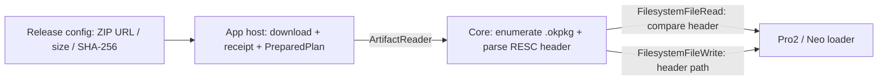

# Pro2 / Neo 资源更新架构

## 当前合约

Protocol V2 资源发布物是一个 ZIP 容器。ZIP 没有目录结构或 Manifest 合约；SDK 递归遍历其中
所有文件，只处理扩展名为 `.okpkg` 的条目，并忽略 hash report、build metadata 及其他文件。

每个资源包必须使用当前 OKPP header：

- `header_magic` 为 `OKPP`；
- `type_magic` 为 `RESC`；
- `header_version` 为 `1`；
- `header_len` 为 `0x5f90`，且 `header_len + payload_len` 等于文件大小；
- `flexible_metadata` 是零填充 ASCII，直接保存设备上的完整写入路径；
- `payload_hash`、`header_hash` 和 `payload_version` 用于比较设备上的现有包。

允许的路径为 `vol0:/bundles/**/*.okpkg`、`vol0:/loaders/rom/**/*.okpkg`，以及 boot resource
专用 staging 路径：

```text
vol0:/loaders/bootloader/boot_resource.okpkg.staging
```

ZIP 内不能有两个包声明相同的设备路径。ZIP 条目名仅用于日志和显示，不参与设备路径推导。

## 数据流



远程更新由 release config 只描述整个 ZIP 的 URL、大小和 SHA-256。Desktop 与 React Native host
下载并物化 ZIP 后生成 `PreparedPlan`；Core 再从经过 receipt 绑定的 ZIP 字节解析各个 RESC 包。
本地更新通过 `resourceArchiveBinary` 进入同一套本地 Plan、PreparedPlan、receipt 与
`ArtifactReader` 流程，不依赖远程 release。

Core 在 loader 模式读取设备现有文件的当前 OKPP header。大小、版本、payload hash 和 header hash
全部一致时跳过传输；`forcedUpdateRes` 会强制重传。boot resource 的写入目标是 staging 文件，
但比对的是已挂载的 live `boot_resource.okpkg`：hash 一致则只清掉残留 staging，不再传包。

## 责任边界

- firmware-pro2 构建工具负责把正确设备路径写入每个 RESC header，并在发布归档前重新解析验证。
- App host 负责 ZIP 的下载、整体大小/SHA-256 校验、持久化和 `ArtifactReader` 生命周期。
- Hardware SDK Core 负责 ZIP 遍历、RESC header/路径校验、去重、按需比较和传输编排。
- Electron BLE、React Native BLE、WebUSB 与 Node USB transport 只负责连接和字节传输，不解析资源包。
- 设备固件负责包签名、header hash、payload hash 的最终认证及 boot resource staging 提升。

## 失败条件

以下情况必须在首次设备写入前失败：ZIP 无 `.okpkg`、条目数量或展开大小超过限制、包不是当前
`RESC` 格式、包长度不一致、路径为空/越界/包含 traversal、或路径重复。ZIP 中非 `.okpkg` 文件
不会导致失败，也不会传给设备。
