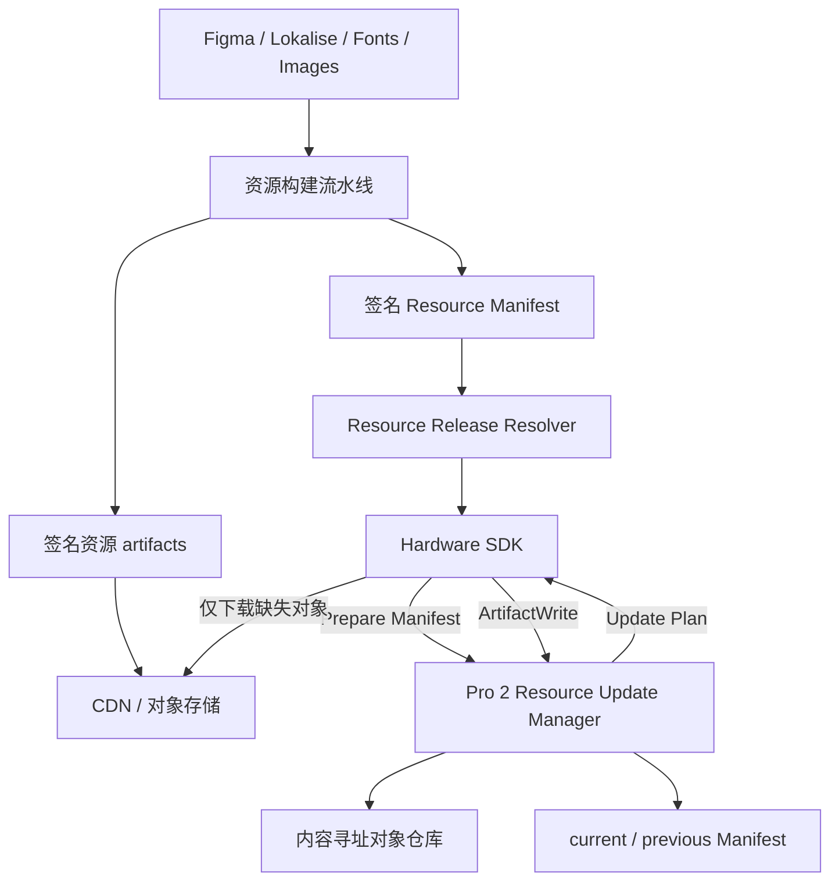
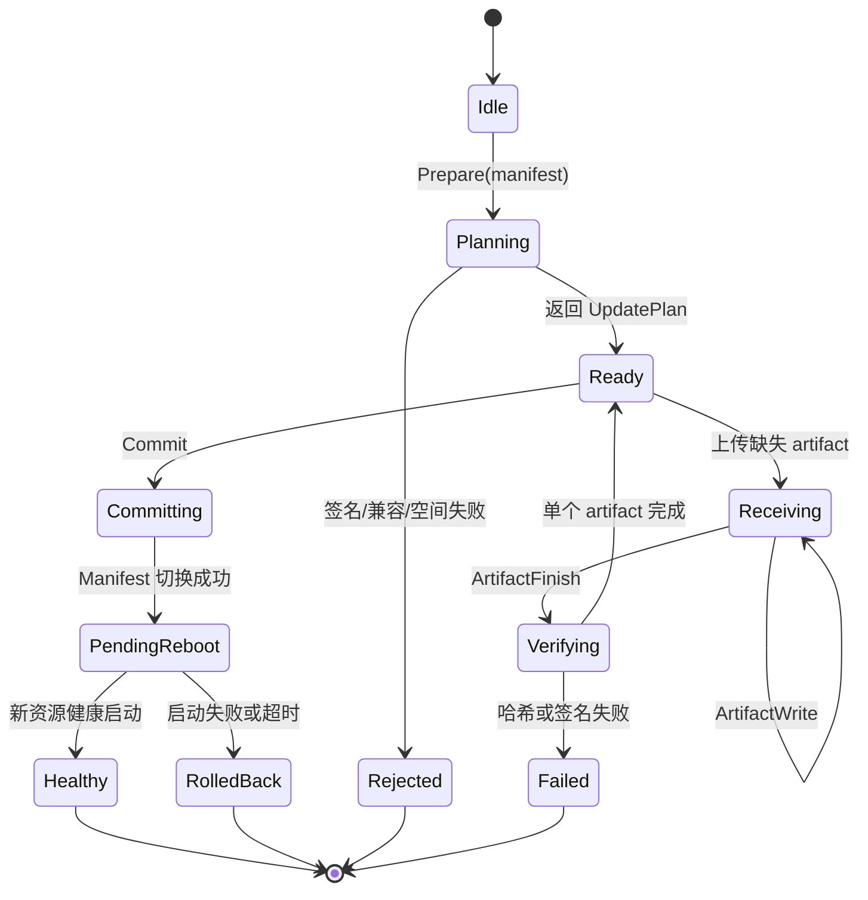

# Pro 2 资源更新架构设计

## 1. 文档信息

- 状态：待硬件、SDK、服务端、前端联合评审
- 设计范围：OneKey Pro 2 运行时、Bootloader UI 和 Romloader UI 资源更新
- 不包含：主控固件、Bootloader、蓝牙固件、SE 固件和 Romloader 本体升级
- 推荐方案：设备规划、内容寻址、按需传输、原子切换

配套示例：

- [Resource Manifest 示例](./examples/resource-manifest.v1.json)
- [Protocol V2 协议草案](./examples/resource-update.v1.proto)
- [SDK 与前端类型示例](./examples/frontend-types.ts)
- [前端交互与状态示例](./frontend-flow.md)

## 2. 背景

当前 Pro 2 资源构建已经可以生成多个独立资源产物，包括多个图片、动画、壁纸、翻译和字体 `.okpkg`，以及 Bootloader/Romloader 使用的资源树。

但资源更新元数据目前分散在多个位置：

1. 固件资源构建配置决定资源如何拆包。
2. 发布配置重复维护资源名称、URL、设备路径、版本和哈希。
3. SDK 理解资源列表并直接写入具体设备路径。
4. 固件资源管理器硬编码资源包路径、挂载顺序和校验策略。

这种模式存在以下问题：

- 增减或重新拆分资源包时，需要同时修改构建工具、发布配置、SDK 和固件。
- SDK 和发布系统知道过多设备文件系统细节。
- 所有资源包跟随 Core 固件版本，不能准确表达单个资源是否变化。
- 直接覆盖文件缺少完整的资源集事务和回滚能力。
- 前端展示粒度与物理文件拆分绑定，后续调整成本高。
- 用户可能重复传输实际没有变化的大型字体、图片或动画资源。

## 3. 设计目标

### 3.1 必须实现

1. SDK 不配置资源版本、设备路径和资源包数量。
2. 发布配置不逐项手工维护资源版本、路径和哈希。
3. 设备决定资源是否需要、如何存储、如何校验和如何切换。
4. 资源拆包数量变化不要求修改 SDK 和前端。
5. 只传输设备缺少的资源对象。
6. 更新中断或校验失败时继续使用旧资源集。
7. 前端仍可按“界面、语言、字体、动画、壁纸、启动资源”等逻辑分组展示进度。
8. 资源升级只有 Plan ZIP、PreparedPlan 与 ArtifactReader 一条执行路径。

### 3.2 暂不作为第一版目标

1. 不要求对单个 `.okpkg` 实现二进制差分。
2. 不要求设备直接访问互联网或 CDN。
3. 不要求每个图片、字体文件成为独立下载对象。
4. 不在第一版统一主固件与资源更新协议。
5. 不允许远端 Manifest 任意关闭设备安全校验。

## 4. 核心设计原则

### 4.1 分离四种概念

| 概念          | 含义                                     | 所有者         |
| ------------- | ---------------------------------------- | -------------- |
| 资源源文件    | Figma、Lokalise、TTF、PNG、GIF 等输入    | 设计与资源团队 |
| 资源 artifact | 可独立下载和复用的签名 `.okpkg` 或 crate | 构建流水线     |
| 逻辑分组      | 前端展示和统计使用的稳定分类             | 产品与协议     |
| 设备布局      | artifact 在设备上的存储、挂载和切换方式  | 设备固件       |

逻辑分组不等于物理文件。一个“语言资源”分组可以包含多个语言 artifact；物理 artifact 数量变化时，前端仍只展示稳定分组。

### 4.2 内容哈希是资源身份

资源版本用于展示和兼容判断，内容哈希用于判断是否需要传输。只要新旧 Manifest 引用相同 `content_hash`，设备就复用本地对象，不重新下载，也不复制文件。

### 4.3 SDK 是通用传输器

SDK 只负责：

1. 获取发布服务返回的 Manifest。
2. 把 Manifest 交给设备规划。
3. 下载设备标记为缺失的 artifact。
4. 按设备返回的会话和 artifact ID 分块传输。
5. 转换设备状态为公共前端事件。

SDK 不负责推导设备路径、判断资源包数量、决定挂载顺序和校验策略、删除旧资源或决定回滚。

### 4.4 设备是安装策略所有者

设备负责 Manifest 签名和兼容性检查、本地对象清单和空间检查、更新计划、artifact 验证、Manifest 原子切换、启动健康确认和垃圾回收。

## 5. 总体架构



## 6. Resource Manifest

### 6.1 Manifest 职责

Manifest 是一次资源发布的机器可读描述，必须由构建流水线自动生成并签名。

示例文件使用 JSON 方便评审；正式 wire payload 推荐使用确定性 protobuf 编码后签名，避免 JSON 字段顺序、空白和数值格式造成签名不一致。发布服务可额外提供 JSON 视图供人阅读，但设备验签以确定性二进制 Manifest 为准。

Manifest 描述：

- 发布标识、格式版本和资源 Schema 版本。
- 兼容设备和最低固件要求。
- artifact 的逻辑 ID、分组、角色、大小和内容哈希。
- CDN 对象定位键。
- artifact 之间的可选依赖。

Manifest 不描述：

- `vol0:/...` 设备路径或 staging 路径。
- 任意文件覆盖路径。
- 是否跳过签名验证。
- 设备私有挂载参数。

### 6.2 artifact 标识

`artifact_id` 是构建与协议层的稳定逻辑标识，例如 `ui-images`、`translations-zh-hans` 和 `font-noto-sc`。设备不能把未经验证的 `artifact_id` 直接作为文件路径，而应使用角色、内容哈希和内部规则生成存储位置。

### 6.3 版本策略

建议同时保留：

| 字段              | 用途                                 |
| ----------------- | ------------------------------------ |
| `release_id`      | 标识一次完整资源发布                 |
| `display_version` | 前端和日志展示                       |
| `content_hash`    | 判断内容是否相同、对象存储和最终校验 |

不再要求所有 artifact 使用 Core 固件版本作为 `payload_version`。第一版以内容哈希作为真实身份，避免引入复杂的单包版本递增服务。

### 6.4 发布服务

设备本身不能访问互联网，因此“发现最新资源”仍由 App/SDK 与发布服务完成。

建议提供统一解析接口：

```text
GET /v1/resource-releases/resolve
  ?model=pro2
  &hardware_revision=...
  &firmware_version=...
  &bootloader_version=...
  &channel=stable
```

返回签名 Manifest、artifact 临时下载 URL 和有效期。发布系统只维护渠道和发布关系，artifact 元数据由构建产物自动导入，不允许人工重复填写。

## 7. 设备内容寻址仓库

### 7.1 推荐目录模型

```text
vol0:/resource-store/
├── objects/
│   ├── sha3-512-001122....okpkg
│   ├── sha3-512-aabbcc....okpkg
│   └── sha3-512-ddeeff....crate
├── manifests/
│   ├── current.manifest
│   ├── previous.manifest
│   └── pending.manifest
├── staging/
│   └── <session-id>/
└── state/
    ├── verified-objects.db
    └── boot-health.dat
```

路径只是设备内部设计示例，不进入公共 SDK API。

### 7.2 对象复用

假设当前 Manifest 使用对象 A、B、C、D，新 Manifest 使用 A、B、E、F：

- A、B 已存在：不传输。
- E、F 缺失：只传输 E、F。
- C、D 仍由 `previous.manifest` 引用：暂不删除。
- 新版本健康启动后，垃圾回收不再被 current/previous 引用的对象。

### 7.3 空间计算

设备在返回计划前计算：

```text
required_space = 缺失对象总大小
               + staging 开销
               + Manifest 开销
               + 安全余量
```

空间不足时，应在大文件传输前返回当前可用空间、需要空间、可安全回收空间以及是否可以自动清理后重试。

## 8. 更新协议

完整字段草案见 [resource-update.v1.proto](./examples/resource-update.v1.proto)。

### 8.1 状态机



### 8.2 Prepare 和计划

SDK 通过 `DeviceResourceUpdatePrepare(manifest)` 把 Manifest 原始字节交给设备。设备验签、检查兼容性和 artifact 角色、比对本地对象、计算空间并创建会话，然后返回计划。

计划中的 artifact 状态：

| 状态            | 含义             | SDK 行为               |
| --------------- | ---------------- | ---------------------- |
| `PRESENT`       | 本地已有并已验证 | 跳过下载               |
| `REQUIRED`      | 本地缺失         | 下载并上传             |
| `RECEIVING`     | 已有部分数据     | 从设备偏移继续         |
| `INVALID_LOCAL` | 本地对象损坏     | 重新上传               |
| `INCOMPATIBLE`  | 当前设备不支持   | 停止升级               |
| `NO_SPACE`      | 空间不足         | 展示错误或请求安全清理 |

计划同时返回完整资源集、本次实际传输、对象复用节省字节数，以及每个逻辑分组的传输量。

### 8.3 Artifact Write

SDK 按设备协商的 chunk 大小发送 `session_id`、`artifact_id`、绝对 `offset` 和数据。设备返回已经持久化的绝对偏移，SDK 必须以设备返回值为准。

第一版需要支持 USB/BLE 不同 chunk 上限、绝对偏移续传、重连后的 session 恢复、artifact 级重试、会话超时和显式取消。

### 8.4 Artifact Finish

完整上传后，设备执行：

1. 文件长度检查。
2. `content_hash` 检查。
3. `.okpkg` 或 crate 容器结构检查。
4. 容器签名检查。
5. artifact 角色与容器类型匹配检查。
6. 将 staging 文件移动为内容寻址对象。

任何一步失败都不能更新 active Manifest。

### 8.5 Commit

只有所有 `REQUIRED` artifact 都完成验证后，设备才接受 Commit：

1. 写入并同步 `pending.manifest`。
2. 保存当前 Manifest 为 `previous.manifest`。
3. 通过安全 rename 或双槽状态记录切换 `current.manifest`。
4. 写入 pending boot health 状态。
5. 根据资源类型决定是否重启。

不能采用逐个覆盖 live 文件的提交方式。

## 9. 启动、健康检查和回滚

资源管理器不再硬编码所有资源包路径，而是验证 `current.manifest`，按设备定义的角色顺序处理 artifact，根据内容哈希找到对象，然后挂载资源。

Manifest 可以描述逻辑角色和依赖，但最终挂载顺序、安全策略仍由固件控制。

### 9.1 安装时验证、启动时快速确认

- artifact 安装完成时必须完整验签和校验哈希。
- 已验证对象记录包含内容哈希、长度、容器头摘要和验证策略版本。
- 启动时确认 active Manifest 引用的是已验证对象。
- 设备安全策略变化时可以强制重新验证。

这样可以减少启动时间，又不让远端 Manifest 控制是否跳过安全验证。

### 9.2 健康确认和回滚

至少满足 Manifest 成功加载、必选 artifact 全部存在、核心 UI 成功挂载、基础字体和默认语言可读取后，才能把新资源标记为健康。

如果连续启动失败、资源缺失或挂载失败，设备切回 `previous.manifest`，记录回滚原因，并向 SDK 返回最近资源更新失败状态。

## 10. 资源拆分策略

### 10.1 原则

资源包拆分需要平衡变化频率、单包大小、启动开销、下载请求数、签名验证成本和失败重试成本。不要按单个文件拆包，也不要回到一个完整资源大包。

### 10.2 推荐初始拆分

| artifact                  | 逻辑分组    | 建议内容             | 原因                 |
| ------------------------- | ----------- | -------------------- | -------------------- |
| `ui-images`               | `interface` | 常用图片、图标、插画 | 中等频率、启动必需   |
| `ui-animations`           | `animation` | GIF 和动画资源       | 体积较大、非核心     |
| `wallpapers-default`      | `wallpaper` | 内置壁纸             | 大文件、变化独立     |
| `translations-latin`      | `language`  | 拉丁语系翻译         | 体积小，可先合并     |
| `translations-zh-hans` 等 | `language`  | CJK 或单语言翻译     | 降低局部文案更新流量 |
| `font-roobert`            | `font`      | 基础字体             | 稳定、启动必需       |
| `font-noto-sc/tc/jp/kr`   | `font`      | 按字符集拆分 Noto    | 体积大、变化低       |
| `bootloader-ui`           | `boot`      | Bootloader 使用资源  | 独立安装和切换       |
| `romloader-ui`            | `boot`      | Romloader 启动画面   | 独立安全角色         |

首次实施可以沿用当前六个 `.okpkg`，先验证协议和内容寻址模型，再调整拆分。

### 10.3 包数量约束

建议构建工具对过小、过大或过多 artifact 给出警告。例如小于 32 KiB、超过 16 MiB 或总数超过约 32 个时提示评估。具体阈值需要根据真实资源大小、BLE 速度和设备挂载时间测量，不固化为协议限制。

## 11. 传输量优化

### 11.1 第一版：artifact 级去重

第一版只传 `content_hash` 不在设备对象仓库中的 artifact。它与现有 `.okpkg` 签名格式兼容，不要求设备重建压缩包，易于断点续传和失败重试。

### 11.2 可选第二版：块级增量

只有上线数据证明大型 artifact 仍频繁产生高传输量时，再研究固定块哈希、内容定义分块或服务端差分补丁。

任何块级方案都必须重建完整 artifact、重新验证完整哈希和容器签名、支持完整包回退，并且不能修改 live 对象。块级增量不进入 v1 协议承诺。

## 12. 前端管理

前端只消费稳定的逻辑状态，不消费物理路径。建议展示资源发布版本、当前阶段、逻辑分组状态、实际传输量、完整资源大小、节省量、连接方式和是否需要重启。

详细示例见 [frontend-flow.md](./frontend-flow.md)。

## 13. 错误处理

| 错误              | 是否可重试 | 处理方式                      |
| ----------------- | ---------- | ----------------------------- |
| Manifest 签名失败 | 否         | 停止并上报发布安全错误        |
| 设备不兼容        | 否         | 提示先升级固件或 Bootloader   |
| CDN 下载失败      | 是         | SDK 网络重试                  |
| USB/BLE 断开      | 是         | 重连后查询 session 和 offset  |
| artifact 哈希失败 | 是         | 删除 staging 对象并重新上传   |
| artifact 签名失败 | 否         | 停止并上报产物安全错误        |
| 空间不足          | 条件可重试 | 设备安全清理后重新规划        |
| Commit 失败       | 是         | 保持旧 Manifest，重新查询状态 |
| 新资源启动失败    | 自动处理   | 设备回滚 previous Manifest    |

SDK 错误中不应暴露或要求前端处理设备路径。

## 14. 兼容和迁移

### 14.1 能力协商

设备信息增加：

```text
resource_update_protocol = 1
resource_manifest_versions = [1]
resource_store = CONTENT_ADDRESSED
resource_resume_supported = true
```

SDK 的 Pro2 资源升级只接受 Plan 中的资源 ZIP，并通过 PreparedPlan 与 ArtifactReader 执行。

### 14.2 分阶段落地

#### 阶段 1：构建 Manifest 和 SDK 过渡适配

- 构建流水线自动输出 artifact 元数据和签名 Manifest。
- 发布服务自动导入 Manifest。
- SDK 不再消费人工配置的每包版本和哈希。
- 旧设备继续使用现有目标路径。
- 验证发布系统、指标和前端逻辑分组。

#### 阶段 2：设备资源规划协议

- 新增 Prepare/Plan/Write/Finish/Commit/Status。
- 建立内容寻址对象仓库。
- 实现 current/previous Manifest。
- SDK 移除新协议路径中的设备文件系统知识。
- 加入断点续传和回滚。

#### 阶段 3：资源拆分调优

- 根据发布历史统计 artifact 变化率。
- 拆分大型 Noto 字体和翻译资源。
- 根据 BLE 更新耗时调整包大小。
- 评估是否需要块级增量。

### 14.3 单一路径约束

Pro2 资源不提供按文件直传或独立资源包绑定接口。发布配置只登记资源 ZIP 的 URL、大小和
SHA-256；Host 统一下载并物化 ZIP，SDK 只消费 PreparedPlan 中的条目引用。

## 15. 团队边界

### 硬件/固件团队

- 实现 Resource Update Protocol、Manifest 验签和角色白名单。
- 实现内容寻址对象仓库、事务提交、启动挂载和回滚。
- 定义 Bootloader/Romloader 资源的安全安装策略。

### 资源构建团队

- 自动生成 artifact、Manifest、内容哈希、大小、分组和兼容信息。
- 保证 artifact 可重复构建，避免非确定性字节变化。
- 上传 artifact 并登记发布服务。

### 发布服务团队

- 根据设备信息和渠道解析目标 Manifest。
- 生成短期 artifact 下载 URL。
- 支持灰度、暂停和回滚到旧 Manifest。

### SDK 团队

- 实现协议编排、下载、分块传输和断点恢复。
- 统一 USB/BLE 进度并保留旧设备兼容路径。
- 向前端输出稳定的分组事件和错误。

### 前端团队

- 展示计划、实际传输量、节省量和分组进度。
- 不依赖 artifact 数量和设备路径。
- 处理断线恢复、空间不足和设备回滚结果。

## 16. 可观测性

每次资源升级建议记录 release ID、Manifest 摘要、设备版本、连接方式、完整资源字节数、实际传输字节数、复用节省字节数、artifact 各阶段耗时、重试和续传数据，以及 Commit、健康检查和回滚结果。

关键指标：

```text
传输节省率 = 1 - 实际传输字节数 / 完整资源集字节数
```

## 17. 测试策略

### 17.1 构建侧

- 相同输入生成相同 artifact 哈希。
- 任一输入变化只影响预期 artifact。
- Manifest 大小和哈希与上传对象一致。
- Manifest 签名可被设备测试实现验证。

### 17.2 固件侧

- Manifest 签名、版本和兼容性边界测试。
- 本地对象 present/missing/corrupted 组合测试。
- 空间不足、垃圾回收和续传测试。
- Artifact Finish 校验失败测试。
- Commit 各写入点断电测试。
- current Manifest 损坏和 previous 回滚测试。
- 必选资源缺失时的安全启动测试。

### 17.3 SDK 侧

- USB/BLE 分块和绝对偏移测试。
- CDN 失败、设备断开和 session 恢复测试。
- 多 artifact 进度聚合测试。
- 新旧协议能力分流测试。
- 新协议中不存在设备路径拼接测试。

### 17.4 端到端场景

1. 初次完整资源安装。
2. 只修改一门语言。
3. 只修改一张壁纸。
4. 修改基础图片但字体不变。
5. 调整资源拆包数量，SDK 不升级。
6. BLE 传输中断并恢复。
7. 上传完成但 Commit 前断电。
8. Commit 后首次启动失败并回滚。
9. CDN 对象与 Manifest 哈希不一致。
10. 旧固件走兼容路径。

## 18. 验收标准

- SDK 新协议实现中没有资源设备路径常量。
- 发布配置中没有逐包版本、设备路径和哈希。
- 增减 artifact 不需要修改 SDK 和前端。
- 单语言变更不会重新传输图片和字体。
- 传输中断后可以从设备确认的偏移恢复。
- 校验失败、Commit 失败或断电不会破坏当前资源集。
- 新资源启动失败时设备可以自动回滚。
- 前端能够展示逻辑分组和节省流量。
- 旧固件现有资源升级流程仍可使用。

## 19. 推荐默认决策

为避免实现阶段再次分叉，本方案先确定以下默认选择。联合评审只有发现明确硬件限制或安全问题时才调整。

1. Manifest 使用独立的资源发布签名密钥，算法第一版采用 Ed25519；密钥 ID 和轮换机制独立于 artifact 签名密钥。
2. artifact 内容哈希第一版采用 SHA3-512，与现有资源容器保持一致；协议保留算法枚举以便未来迁移。
3. active Manifest 使用双槽状态记录，每槽包含单调序号、Manifest 摘要、状态和 CRC；启动时选择最高有效序号，不只依赖文件 rename 的断电语义。
4. 固件保留资源角色白名单和固定挂载阶段；每个角色内部的 artifact 数量和内容由 Manifest 动态描述。
5. Core、Bootloader UI 和 Romloader UI 资源进入同一 Manifest，但使用不同角色和设备安装器；它们不是同一种挂载方式。
6. 更新前最低可用空间按“缺失 artifact 总大小 + Manifest/状态开销 + max(4 MiB, 10% 安全余量)”计算，并保留 previous Manifest 引用的对象。
7. Resource Update V1 完成 Commit 后统一重启并进行健康检查，不在第一版实现热切换。
8. 灰度发布、暂停和紧急撤回统一由 Resource Release Resolver 承载，现有固件 config 只保留旧设备兼容入口。

## 20. 推荐结论

采用“设备资源规划协议 + 签名 Manifest + 内容寻址对象仓库 + 原子 Manifest 切换”。

第一版只做 artifact 级增量，不做 `.okpkg` 内部差分。先沿用现有资源拆分也可以获得对象复用、事务更新和 SDK 解耦能力；上线后再根据真实传输数据拆分大型字体、翻译和图片包。

这个方案把变化最频繁的资源拆分策略留在硬件资源构建侧，把安全和安装策略留在设备侧，把下载和传输留在 SDK，把稳定的逻辑分组留给前端，四层职责清晰且可以独立演进。
