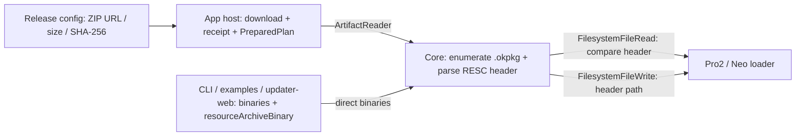

# Pro2 / Neo Resource Update Architecture

## Current contract

Protocol V2 resource releases are a ZIP container. The ZIP has no directory layout or Manifest
contract. The SDK recursively walks every file, processes only `.okpkg` entries, and ignores hash
reports, build metadata, and other files.

Each resource package must use the current OKPP header:

- `header_magic` is `OKPP`
- `type_magic` is `RESC`
- `header_version` is `1`
- `header_len` is `0x5f90`, and `header_len + payload_len` equals the file size
- `flexible_metadata` is zero-padded ASCII that stores the full on-device write path
- `payload_hash`, `header_hash`, and `payload_version` are used to compare the package already on
  the device

Allowed paths are `vol0:/bundles/**/*.okpkg`, `vol0:/loaders/rom/**/*.okpkg`, and the boot-resource
staging path:

```text
vol0:/loaders/bootloader/boot_resource.okpkg.staging
```

A ZIP cannot contain two packages that declare the same device path. ZIP entry names are only used
for logs and display; they do not derive the device path.

## Data flow



There are two update paths:

- **Remote (app-monorepo):** release config describes the ZIP URL, size, and SHA-256. The desktop
  and React Native hosts download the archive, build a `PreparedPlan`, and call
  `firmwareUpdateV4({ preparedPlan, hostBindingGeneration })`. Core then parses each RESC package
  from the receipt-bound ZIP bytes.
- **Local (CLI, examples, firmware-updater-web):** callers pass component `ArrayBuffer`s and/or
  `resourceArchiveBinary`. Core parses the ZIP, compares headers, and writes changed packages. This
  path does not wrap the ZIP in a memory `PreparedPlan`.

Core reads the current OKPP header of each on-device file while in loader mode. Transfer is skipped
when size, version, payload hash, and header hash all match. `forcedUpdateRes` forces a rewrite.
Boot resource is written to the staging file, but comparison uses the mounted live
`boot_resource.okpkg`: if that hash already matches, leftover staging is deleted and the package is
not transferred again.

## Responsibility boundaries

- firmware-pro2 build tools write the correct device path into each RESC header and re-parse the
  archive before publishing.
- The App host downloads the ZIP, verifies overall size/SHA-256, persists it, and owns the
  `ArtifactReader` lifecycle.
- Hardware SDK Core walks the ZIP, validates RESC headers/paths, deduplicates, compares on demand,
  and orchestrates transfer.
- Electron BLE, React Native BLE, WebUSB, and Node USB transports only move bytes. They do not parse
  resource packages.
- Device firmware owns package signatures, header hash, payload hash, and boot-resource staging
  promotion.

## Failure conditions

These must fail before the first device write: the ZIP has no `.okpkg`, entry count or expanded size
exceeds limits, a package is not current `RESC`, package length is inconsistent, a path is empty,
out of bounds, or contains traversal, or two packages share a path. Non-`.okpkg` files in the ZIP
do not fail the update and are not sent to the device.
