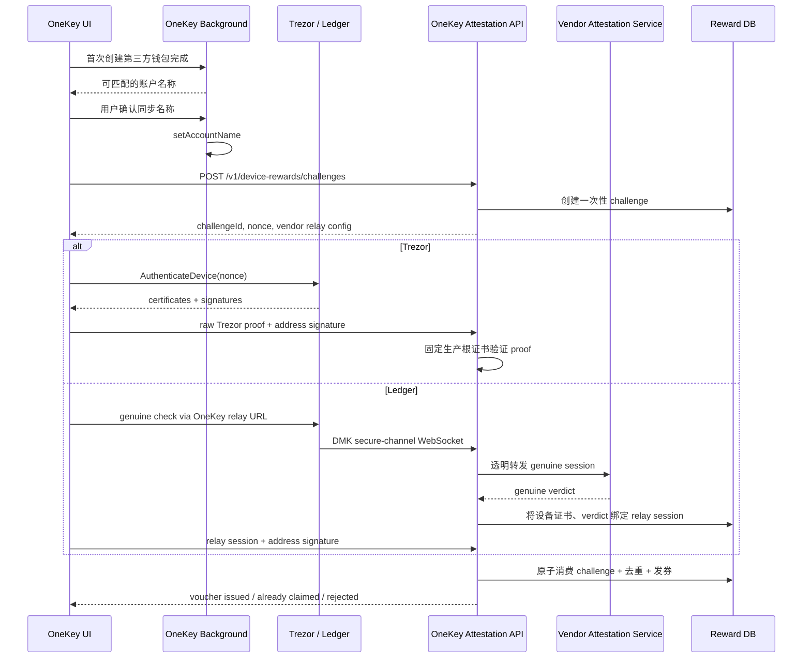

# 第三方硬件钱包首次添加、设备认证与优惠券绑定

## 1. 目标与不可违反的边界

本方案只在用户**首次创建一个新的 Trezor 或 Ledger 钱包**后触发，不在导入已存在钱包、重新连接设备、普通签名或 App 启动时重复弹出。

流程包含两个互不阻塞的可选步骤：

1. 从厂商客户端读取能够与新钱包账户匹配的本地名称，经用户确认后同步到 OneKey。
2. 用户主动领取活动优惠券。领取必须同时证明：
   - 当前账户地址的控制权；
   - 当前连接的是通过厂商认证的真实物理设备；
   - 设备认证来自本次服务端创建、未过期且未使用的 challenge。

以下数据**不能单独作为发券依据**：

- 客户端提交的 `verified: true`；
- 客户端提交的 DSID / `deviceId`；
- 钱包地址签名；
- Ledger/Trezor 的普通设备特征、序列号或 USB/BLE 标识。

地址签名只证明当前钱包种子能够控制该地址，同一助记词可以出现在软件钱包或另一台硬件钱包中，不能证明物理设备身份。

## 2. 总体流程



## 3. API

所有接口都要求 OneKey 登录态。后端从登录态取得 `userId`，不得接受客户端自行传入 `userId`。

### 3.1 创建 challenge

`POST /v1/device-rewards/challenges`

请求：

```json
{
  "version": 1,
  "vendor": "trezor",
  "campaignId": "third-party-hardware-2026",
  "walletAddAttemptId": "opaque-client-attempt-id",
  "walletId": "hw-...",
  "accountAddress": "0x...",
  "networkId": "evm--1"
}
```

响应：

```json
{
  "version": 1,
  "challengeId": "opaque-server-id",
  "challengeHex": "64 lowercase hex characters",
  "expiresAt": 1785000000000,
  "audience": "onekey-device-voucher",
  "purpose": "first-wallet-add",
  "addressMessage": {
    "version": 1,
    "challengeId": "opaque-server-id",
    "campaignId": "third-party-hardware-2026",
    "walletAddAttemptId": "opaque-client-attempt-id",
    "accountAddress": "canonical address",
    "networkId": "evm--1",
    "expiresAt": 1785000000000,
    "audience": "onekey-device-voucher",
    "purpose": "first-wallet-add"
  },
  "ledgerRelay": null
}
```

Ledger 响应的 `ledgerRelay` 为：

```json
{
  "attestationSessionId": "opaque-relay-session-id",
  "webSocketUrl": "wss://attestation.onekeycn.com/v1/ledger/session/<single-use-token>"
}
```

要求：

- `challengeHex` 使用 CSPRNG 生成 32 bytes；
- challenge TTL 建议 5 分钟；
- `walletAddAttemptId` 只用于幂等和关联，不能证明这是首次添加；
- 服务端必须根据账户/钱包历史或可信的首次添加事件判断活动资格；
- 同一用户、设备、活动的并发 challenge 数量要限流；
- `webSocketUrl` 内的 token 不写日志、不进埋点、不持久化到客户端配置。
- App background 只接受当前环境对应的
  `wss://attestation.<api-domain>/v1/ledger/session/<single-use-token>`，拒绝任意
  WSS origin、query、fragment、userinfo 和非预期 path；生产为
  `attestation.onekeycn.com`，测试为 `attestation.onekeytest.com`。

### 3.1.1 “首次添加”的权威判定

App 的 `FinalizeWalletSetup` 仅负责“只在本次确实生成了新 wallet id 时展示 UI”，这个
本地条件不能成为服务端资格证明。现有第三方钱包流程也不会写入旧的 OneKey hardware
creation-record API。因此：

- `walletAddAttemptId`、`walletId` 和客户端时间戳都只能用于关联/幂等；
- 服务端必须使用已登录 OneKey ID、campaign、规范化地址、最终验证出的 vendor DSID
  和历史 claim 记录判定“首次”；
- 如果业务要求的是“服务端已知的首次创建事件”，必须由可信账户同步/注册服务先写入
  append-only creation event，并由 challenge 服务读取；不能新增一个由客户端任意调用的
  `mark-created` 接口；
- 在可信 creation event 尚未接通时，资格应降级为“该用户、设备、地址、campaign
  从未成功领取”，或直接返回 `not_eligible`，不得把客户端的首次弹窗当依据。

### 3.2 提交 claim

`POST /v1/device-rewards/claims`

共同字段：

```json
{
  "version": 1,
  "challengeId": "opaque-server-id",
  "inviteCode": "optional-code",
  "addressSignature": {
    "scheme": "evm-personal-sign",
    "address": "0x...",
    "signature": "0x..."
  }
}
```

Trezor evidence：

```json
{
  "vendor": "trezor",
  "scheme": "trezor-authenticate-device-v1",
  "deviceModelHint": "T3W1",
  "proof": {
    "optiga_certificates": ["hex DER"],
    "optiga_signature": "hex",
    "tropic_certificates": ["hex DER"],
    "tropic_signature": "hex",
    "mcu_certificates": ["hex DER"],
    "mcu_signature": "hex"
  }
}
```

Ledger evidence：

```json
{
  "vendor": "ledger",
  "scheme": "ledger-genuine-relay-v1",
  "attestationSessionId": "opaque-relay-session-id"
}
```

Ledger 客户端提交的 `verified`、`deviceId`、`attestationPubKey` 只能用于诊断，不出现在 claim contract 中。权威 verdict 和 DSID 必须来自后端保存的 relay session。

成功响应：

```json
{
  "status": "issued",
  "claimId": "opaque-claim-id",
  "voucher": {
    "campaignId": "third-party-hardware-2026",
    "code": "server-issued-code",
    "expiresAt": 1789000000000
  }
}
```

业务状态使用稳定枚举：

- `issued`
- `already_claimed`
- `challenge_expired`
- `challenge_consumed`
- `address_signature_invalid`
- `device_proof_invalid`
- `device_not_genuine`
- `ledger_session_incomplete`
- `not_eligible`
- `campaign_unavailable`

认证失败使用正常业务响应或明确的 4xx，不把证书解析错误、上游响应内容或内部 DSID 泄露给客户端。

## 4. 服务端验证

### 4.1 规范化地址消息

后端返回完整 `addressMessage` 对象，客户端使用项目的 `stableStringify` 后签名。后端必须用完全相同的字段顺序、UTF-8 编码和签名 scheme 重新构造消息，不能验证客户端上传的任意 message。

地址签名至少绑定：

- `challengeId`
- `campaignId`
- `walletAddAttemptId`
- `accountAddress`
- `networkId`
- `expiresAt`
- `audience`
- `purpose`

后端验证签名恢复出的地址、challenge 内保存的地址和 claim 地址三者一致。UTXO、Solana 等链应使用各自明确的签名 scheme，不能把 EVM 规则泛化。

### 4.2 Trezor

1. 从数据库读取 challenge 原始 32-byte nonce；
2. 限制每个证书、证书链和请求体大小，拒绝畸形或超大 DER；
3. 使用后端内置、版本化的生产 root 集合及吊销表；
4. 验证证书链角色、有效期、签名算法与 nonce 签名；
5. 从证书推导型号，客户端的 `deviceModelHint` 只做一致性检查；
6. T3W1 至少按当前 Trezor Connect 生产策略强制验证 Optiga + Tropic；
   `mcu_*` 字段可随 raw proof 保存，但在后端采用 MCU/ML-DSA 前必须先对齐
   Trezor 官方库的版本化策略和测试向量，不能使用客户端自创条件；
7. 不接受 debug/staging root；
8. 从已验证证书推导权威 vendor DSID：
   - 有 subject serial：`trezor:v1:<serial>`；
   - 否则：`trezor:v1:<sha256(optiga-device-public-key)>`。

当前 SDK 的本地验证用于即时 UX；后端必须独立验证同一份 raw proof。生产发券代码不得使用 `dangerouslyAllowDebugKeys`。

### 4.3 Ledger

Ledger DMK genuine check 的 secure channel 位于设备与 Ledger HSM 之间，公开 action 只给出 genuine verdict，不能把客户端布尔值转换成 OneKey 可验证证明。因此：

推荐实现是“服务端拥有 Genuine Check 状态机”，而不是客户端运行 DMK 后上传结果：

1. 后端创建一次性 session、challenge 和短期鉴权 token；
2. App 只负责 USB/BLE APDU 转发，不解释、不修改、不决定结果；
3. 后端运行 Ledger DMK `GenuineCheckDeviceAction`，其 transport 通过上述
   双向通道把 APDU 发给 App，再由 App 发给物理设备；
4. 后端自己的 DMK 实例得到 `isGenuine` 和同一会话中的 attestation
   `deviceId`，并把它们原子绑定到 session；
5. 会话完成后立即失效，断线不能续用，APDU 序号、方向、大小和总量都要限制；
6. 权威 DSID 为 `ledger:v1:<sha3_256(device-attestation-public-key)>`；
7. 上游断开、协议缺失、无法确定 freshness 或 `isGenuine=false` 时一律拒绝发券。

另一条可接受路线是 Ledger 向 OneKey 服务端返回带 nonce/audience 的厂商签名
JWS/COSE receipt。单纯透明代理 Ledger WSS、由客户端计算 `isGenuine`，除非安全评审能
证明服务端可独立观察并绑定最终 verdict，否则仍然不够；客户端
`{ verified: true, deviceId }` 永远不能作为发券证据。

#### 4.3.1 后端需要独立实现的 DMK 状态机

App Monorepo 不再内置 Node/WSS/DMK 参考服务。客户端只保留真机集成检查；后端团队
需要使用自己的服务框架、鉴权、存储和部署方式独立实现下面的状态机与 WSS contract。

后端运行官方 `GenuineCheckDeviceAction`，通过自定义 DMK `TransportFactory` 把每条
APDU 交给 WSS 客户端，客户端再用已连接的 USB/BLE session 发给物理 Ledger。后端
同时直连 Ledger 官方 HSM endpoint，因此验证时必须联网。

推荐持久化状态机：

| 状态       | 允许事件                                          | 下一个状态                   |
| ---------- | ------------------------------------------------- | ---------------------------- |
| `CREATED`  | App 使用一次性 token 建立 WSS                     | `CONNECTED`                  |
| `CONNECTED`| 首条合法 `hello(version, device metadata)`        | `RUNNING`                    |
| `RUNNING`  | 服务端 `apdu-request` / App `apdu-response`       | `RUNNING`                    |
| `RUNNING`  | DMK `Completed(isGenuine=true, deviceId present)` | `GENUINE`                    |
| `RUNNING`  | `isGenuine=false`                                 | `NOT_GENUINE`                |
| 任意非终态 | 超时、断线、乱序、超限、DMK/HSM/设备错误          | `FAILED` / `EXPIRED`         |
| `GENUINE`  | claim 事务验证地址签名并成功发券                  | `CONSUMED`                   |
| 任意终态   | 重连、重复 token、重复 claim                      | 拒绝，状态不回退             |

WSS 消息：

```text
App -> Server: hello
Server -> App: ready
Server -> App: apdu-request(requestId, apduHex, timeoutMs)
App -> Server: apdu-response(requestId, dataHex, statusCodeHex)
App -> Server: apdu-error(requestId, message)
Server -> App: interaction / result / error
```

后端实现必须约束：

- 32-byte CSPRNG token、单次消费、默认 TTL 5 分钟；
- 严格版本/字段/hex/model 校验；
- 同时最多一条未完成 APDU，requestId 必须匹配，拒绝乱序；
- 单 APDU 最大 8 KiB、单会话最多 256 次、单次超时最大 60 秒；
- `isGenuine=false` 时丢弃任何 `deviceId`；
- 只有服务端保存的 Promise/数据库 session 能完成 claim，客户端 `result` 不具备授权力。

生产必须使用 Redis/数据库保存 ticket，把连接暴露为 TLS `wss://`，接入 OneKey
登录态、限流、审计和多实例 sticky routing。
同一 attestation session 的 WSS 与 DMK runner 必须由同一 worker 拥有，或用严格有序的
消息队列转发。

### 4.4 当前客户端最小集成检查的边界

- Trezor：background 生成 32-byte challenge，SDK 让设备签名并验证生产证书链。
- Ledger：SDK 直接运行官方 DMK Genuine Check 并连接 Ledger HSM。
- 两条路径成功后只生成本地开发券，用于验证 UI 和设备通讯。
- 客户端结果不是后端可信凭证。生产后端不能相信客户端提交的
  `{ verified, deviceId }`，必须按前文自己验证或见证完整会话。

### 4.5 平台与联网矩阵

| 厂商方案                            | macOS / Windows / Linux Desktop | 浏览器插件        | iOS / Android                   | 验证时联网                        |
| ----------------------------------- | ------------------------------- | ----------------- | ------------------------------- | --------------------------------- |
| Trezor 本地证书验证                 | 支持，USB/BLE 取 proof          | WebUSB 可用时支持 | 有对应 USB/BLE transport 时支持 | 不需要；拿到 proof 后可完全离线验 |
| Trezor 后端发券                     | 支持                            | 支持              | 支持                            | 需要连接 OneKey 后端提交 proof    |
| Ledger 客户端集成检查               | 支持 WebHID/BLE                 | 支持对应 transport| 支持对应 transport              | 必须连接 Ledger HSM               |
| Ledger 生产服务端 DMK + APDU bridge | 支持                            | 支持              | 支持                            | 必须连接 OneKey 后端和 Ledger HSM |

操作系统不是主要限制，真正的限制是该端是否具备对应 USB/BLE transport。Trezor
One / Model T 没有本方案需要的制造商安全元件证明，不能参加“原厂设备认证发券”；
Ledger 没有公开支持的离线制造商验真流程，必须 fail closed 地依赖在线厂商服务。

## 5. 数据模型与事务

建议表：

```sql
create table device_reward_challenge (
  id uuid primary key,
  user_id text not null,
  vendor text not null,
  campaign_id text not null,
  wallet_add_attempt_id text not null,
  wallet_id_hash bytea not null,
  account_address text not null,
  network_id text not null,
  nonce_ciphertext bytea not null,
  expires_at timestamptz not null,
  consumed_at timestamptz,
  created_at timestamptz not null
);

create unique index device_reward_challenge_attempt_uq
  on device_reward_challenge(user_id, campaign_id, wallet_add_attempt_id);

create table device_attestation_session (
  id uuid primary key,
  challenge_id uuid not null references device_reward_challenge(id),
  vendor text not null,
  state text not null,
  vendor_dsid_ciphertext bytea,
  claim_key bytea,
  assurance text,
  expires_at timestamptz not null,
  completed_at timestamptz
);

create table device_reward_claim (
  id uuid primary key,
  challenge_id uuid not null unique references device_reward_challenge(id),
  user_id text not null,
  campaign_id text not null,
  claim_key bytea not null,
  address_claim_key bytea not null,
  voucher_id text not null unique,
  created_at timestamptz not null,
  unique(campaign_id, claim_key),
  unique(campaign_id, address_claim_key)
);
```

`claimKey = HMAC-SHA256(serverKey, vendorDsid)`。数据库按 claimKey 去重，减少直接持久化可跨应用追踪的第三方设备指纹。确需审计原始 DSID 时应单独加密、限制访问并配置保留期限。

发券必须在一个事务中完成：

1. `SELECT ... FOR UPDATE` challenge；
2. 检查用户、活动、地址、有效期和未消费状态；
3. 验证地址签名；
4. 验证设备 evidence / 读取已完成 relay session；
5. 推导 claimKey 并插入唯一约束；
6. 创建或占用 voucher；
7. 标记 challenge consumed；
8. 提交事务。

并发请求中只能有一个成功。网络重试返回同一个 `claimId/voucher`，不得再发一张。

## 6. 账户名称同步

名称同步不是发券认证的一部分，也不上传厂商完整数据库。

### Ledger Live

Desktop 主进程读取 Ledger Live 的 `app.json`，只返回最小化候选：

- `name`
- `address`

当前实现只读取 `currency.id === "ethereum"` 且具有地址的账户，`xpub`、源账户 id
和完整账户对象不会跨越 Electron main/background IPC。匹配规则：

1. 规范化 EVM 地址完全相同；
2. 同一地址出现多个不同名称时不建议同步；
3. UTXO/其他 EVM currency 暂不处理，避免跨链同地址误匹配。

当 Ledger Live 开启密码且账户字段为加密字符串时，返回 `encrypted_source`，不索取、保存或尝试破解 Ledger Live 密码。

### Trezor Suite

Trezor Suite 的本地 `.mtdt` 标签为加密数据，需要设备执行 `CipherKeyValue` 派生 metadata master key；现代 Suite 也可能只使用 Dropbox、Google Drive 或 suite-sync。实现必须区分：

- `available`
- `no_matches`
- `encrypted_source`
- `cloud_source_requires_authorization`
- `unsupported_source`

没有取得 provider 授权或设备密钥时不得展示“已同步”。云端 provider 集成是独立后端/OAuth 工作，不应由本地文件读取逻辑伪装完成。

只有用户确认的候选名称调用 `setAccountName`。不得覆盖用户已在 OneKey 明确修改过的名称；冲突时逐项展示来源和目标名称。

## 7. App 触发条件

App 在开始创建钱包前记录 wallet IDs，创建结束后只在发现全新的 Trezor/Ledger wallet 时设置 post-add task：

```text
vendor is trezor or ledger
AND createdWalletId not in existingWalletIds
AND postAddTask(walletId, campaignId) has never completed
```

弹窗顺序：

1. 账户名称候选确认；
2. 活动说明与用户同意；
3. challenge、设备交互、地址签名、claim；
4. 成功或明确的可重试错误。

用户跳过、认证失败、厂商服务离线都不能阻止钱包创建或进入首页。普通重连和历史钱包恢复不触发活动弹窗。

## 8. 日志、隐私与可观测性

禁止日志记录：

- nonce、relay token、完整 WSS URL；
- 原始证书链或签名；
- 原始 DSID / attestation public key；
- Ledger Live/Trezor Suite 完整账户数据；
- voucher code。

允许的结构化字段：

- challenge/claim 的内部 UUID；
- vendor、model family、状态枚举；
- 经过批准的错误码；
- 分阶段耗时；
- 脱敏 campaignId。

必须有以下监控：

- challenge 创建、过期、消费率；
- 每个厂商的 proof 验证失败率；
- Ledger 上游与 relay 完成率；
- 唯一约束冲突率；
- voucher 事务回滚率；
- 同一用户/IP/设备 claimKey 的异常频率。

## 9. 上线门槛

- Trezor：challenge 置换、重放、错用户、过期、debug root、错链、缺
  Optiga（T3W1 还缺 Tropic）、畸形/超大 DER 全部拒绝；
- Ledger：伪造 `{verified:true, deviceId}` 必须拒绝；relay session 过期、错用户、重放、APDU 篡改、non-genuine、缺 certificate、并发双提交全部拒绝；
- 两端：地址签名与 challenge 不匹配、活动重复领取、事务中途失败不发券；
- 名称同步：只在首次新建钱包触发、只改用户确认项、加密/云端来源不误报成功；
- 安全评审确认生产 root、吊销更新、Ledger 上游条款与凭据管理；
- 灰度阶段提供 kill switch，可分别关闭 Trezor、Ledger 或整个活动。
