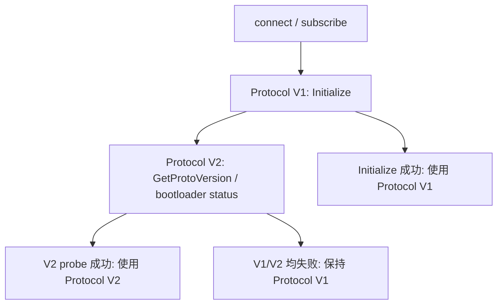
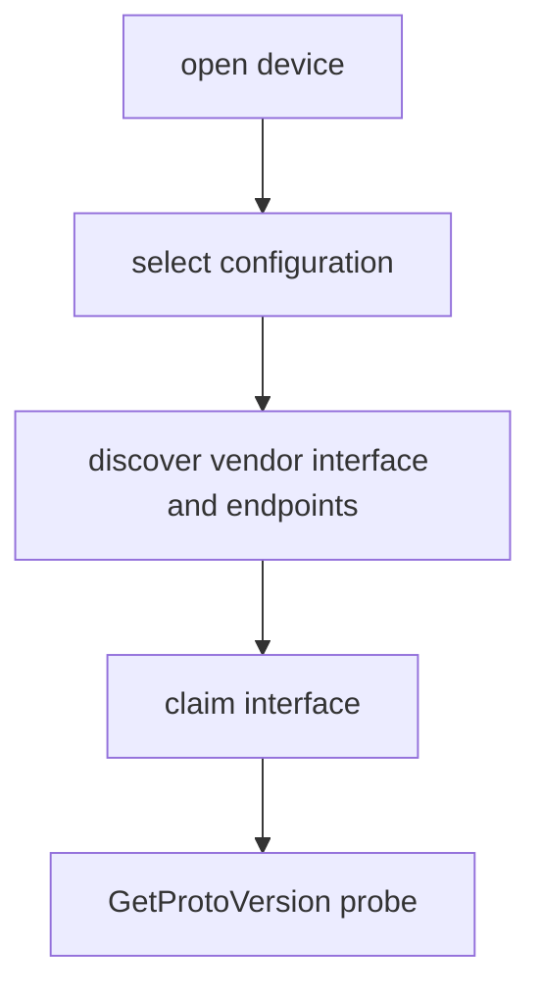
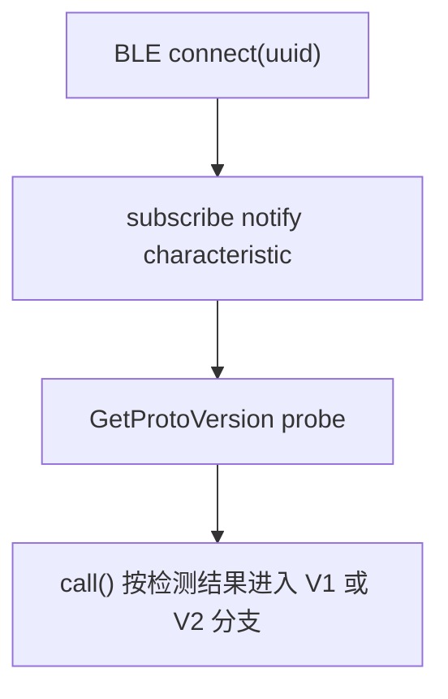
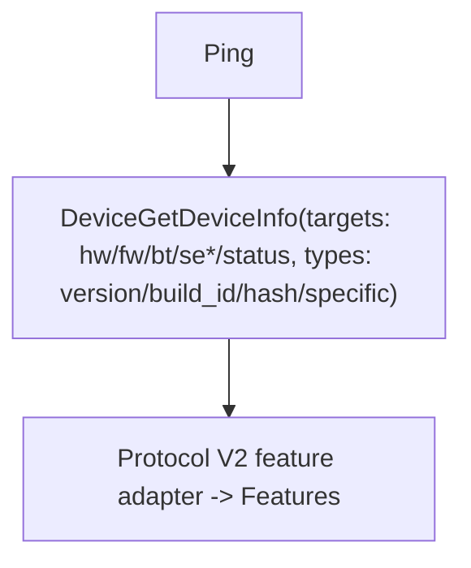

# OneKey Protocol V2

本文档描述 WebUSB、Electron BLE、React Native BLE 和 lowlevel BLE 上使用的 Protocol V2。Protocol V2 目前服务 Pro2，主要覆盖协议探测、文件系统、固件更新和设备重启。

## 与 Protocol V1 的关系

Protocol V1 仍服务 Classic / Mini / Touch / Pro 等现有设备。它支持 USB 和 BLE，并依赖 `Initialize -> Features` 建立设备上下文。

Protocol V2 服务 Pro2。Pro2 同样支持 USB 和 BLE，但不走传统 `Initialize/GetFeatures`，而是通过 `GetProtoVersion` 和 `Ping` 建立链路可用性。

## 主动协议探测

SDK 不使用 PID、productName 或 descriptor 作为唯一判断依据。支持 Protocol V2 的 transport 会在连接后做主动探测：如果调用方显式传入 `connectProtocol`，就只验证指定协议；否则默认先用 Protocol V1 `Initialize` 验证现有设备，失败后再发送 Protocol V2 `GetProtoVersion` / bootloader status probe。这样现有 V1 设备保持原路径，未知名称或 bootloader 名称不稳定的 Pro2 也能回落到 V2。



当显式要求 `V2` 时，SDK 会直接 probe V2；当枚举或缓存已经标记为 `V2` 时，也会优先验证 V2。WebUSB 在 V2 probe 失败后会重置连接，避免失败帧影响后续调用；BLE 探测失败后清空 V2 接收缓存，并继续使用 V1 BLE 分包逻辑。

## 帧格式

Protocol V2 使用 `0x5A` 起始字节和两段 CRC8。

```
┌──────┬──────┬──────┬───────────┬────────┬──────┬─────┬─────────────┬─────┐
│ 0x5A │ LenL │ LenH │ HeaderCRC │ Router │ Attr │ Seq │ Payload     │ CRC │
└──────┴──────┴──────┴───────────┴────────┴──────┴─────┴─────────────┴─────┘
   1B     1B    1B        1B        1B      1B    1B    N bytes       1B
```

| 字段        | 说明                                   |
| ----------- | -------------------------------------- |
| `0x5A`      | SOF                                    |
| `LenL/LenH` | little-endian total frame length       |
| `HeaderCRC` | 对前 3 字节计算 CRC8                   |
| `Router`    | 传输通道，USB 为 `0`，BLE UART 为 `1`  |
| `Attr`      | packet source 和 data type             |
| `Seq`       | 1-255 递增序号                         |
| `Payload`   | protobuf message type + protobuf bytes |
| `CRC`       | 对除最后 CRC 外的整帧计算 CRC8         |

当前 SDK 使用的最大 V2 frame 长度是 `4608` bytes，文件写入 chunk size 是 `4096` bytes。

### CRC8 说明

`HeaderCRC` 和末尾 `CRC` 是 Protocol V2 wire protocol 的必需字段，不是调试信息，也不是设备业务数据。设备端会校验 host 发出的 frame，SDK 端也会校验设备返回的 frame；缺失或计算不一致时，常见结果是设备不响应、返回错误，或 SDK 在 decode 阶段抛出 CRC mismatch。

SDK 的实现放在 `packages/hd-transport/src/protocols/v2/crc8.ts`。其中 `CRC8_TABLE` 是 256 项预计算查表，等价于按位计算同一个 CRC8 算法。保留查表有两个原因：

- 与固件侧 `crc8` 实现保持逐字节一致，减少多语言实现时的参数漂移。
- 避免每个 frame 都重新按位计算，尤其是文件写入和固件更新会发送大量 frame。

如果使用 SDK 提供的 WebUSB、Electron BLE、React Native BLE 或 lowlevel transport，应用层和原生 BLE 插件不需要自己计算 CRC8。lowlevel 原生侧可以直接把 BLE notification chunk 的 hex 字符串返回给 JS SDK，也可以返回已经重组好的完整 `0x5A` frame；无论哪种方式都不要去掉 header、payload 或末尾 CRC，CRC8 的计算和校验由 `hd-transport` 完成。

只有在完全绕过 SDK、自己实现 Protocol V2 encode/decode 时，才需要在 Kotlin、Swift 或其他语言里实现同样的 CRC8 算法。此时可以使用查表，也可以按位计算，但输出必须与 SDK 的 `crc8(data, len)` 完全一致。

## protobuf payload

Protocol V2 frame 的 payload 格式：

```
┌──────────┬──────────┬────────────────────┐
│ TypeIdL  │ TypeIdH  │ Protobuf payload   │
└──────────┴──────────┴────────────────────┘
    1B         1B          N bytes
```

`messageTypeId` 是 little-endian `uint16`。SDK 按消息 ID 选择 schema：

- `messageTypeId >= 60000`：使用 `messages-protocol-v2.json`
- `messageTypeId < 60000`：使用 `messages.json`

发送时优先在 Protocol V2 schema 里查找消息名，找不到再回退 V1 schema。

## Protocol V2 message 表

| Message                      | ID    | 方向           | 用途               |
| ---------------------------- | ----- | -------------- | ------------------ |
| `GetProtoVersion`            | 60200 | Host -> Device | 协议探测           |
| `ProtoVersion`               | 60201 | Device -> Host | 协议版本响应       |
| `Ping`                       | 60206 | Host -> Device | 链路检查           |
| `Success`                    | 60207 | Device -> Host | 通用成功响应       |
| `Failure`                    | 60208 | Device -> Host | 通用失败响应       |
| `DeviceGetDeviceInfo`           | 60600 | Host -> Device | 查询 Protocol V2 设备信息 |
| `DeviceInfo`                 | 60601 | Device -> Host | Protocol V2 设备信息响应  |
| `DeviceReboot`                  | 60400 | Host -> Device | 设备重启           |
| `FilesystemPathInfo`         | 60801 | Device -> Host | 文件或目录信息     |
| `FilesystemPathInfoQuery`    | 60802 | Host -> Device | 查询文件或目录     |
| `FilesystemFile`             | 60803 | Device -> Host | 文件数据或写入进度 |
| `FilesystemFileRead`         | 60804 | Host -> Device | 读取文件           |
| `FilesystemFileWrite`        | 60805 | Host -> Device | 写入文件           |
| `FilesystemFileDelete`       | 60806 | Host -> Device | 删除文件           |
| `FilesystemDir`              | 60807 | Device -> Host | 目录列表响应       |
| `FilesystemDirList`          | 60808 | Host -> Device | 列目录             |
| `FilesystemDirMake`          | 60809 | Host -> Device | 创建目录           |
| `FilesystemDirRemove`        | 60810 | Host -> Device | 删除目录           |
| `DeviceFirmwareUpdate`          | 61000 | Host -> Device | 触发固件安装       |
| `DeviceFirmwareInstallProgress` | 61001 | Device -> Host | 固件安装进度       |
| `DeviceGetFirmwareUpdateStatus` | 61002 | Host -> Device | 查询更新状态       |
| `DeviceFirmwareUpdateStatus`    | 61003 | Device -> Host | 更新状态响应       |

## WebUSB

WebUSB 使用 Router `0`。连接后流程：



endpoint/interface discovery 来自 USB descriptor，但只用于 I/O 路由，不用于协议判断。

## BLE

Electron BLE、React Native BLE 和 lowlevel BLE 使用 Router `1`。桌面默认 env 是 `desktop-web-ble`，React Native 移动端默认 env 是 `react-native`，原生 WebView/Swift/Kotlin/Flutter 集成使用 `lowlevel`。这些 transport 内部都自动支持 V1/V2。



BLE 写入会按 GATT write 能力拆成小块，接收端会按 V2 frame length 重组完整 `0x5A` 帧。React Native BLE 和 Electron BLE 在 transport 内部从 notify callback 组帧；lowlevel transport 会在 JS 侧从 `receive()` 返回的 hex chunk 继续重组 V1/V2，因此原生插件可以返回单个 BLE notification，也可以返回完整 V1 message / V2 frame。

V2 的 encode/decode、超时、探测和 frame 重组由 `hd-transport` 的 Protocol Session 层统一实现。BLE transport 只负责把完整 V2 frame 切成平台可写入的小包，并把 notification bytes 喂给 `ProtocolV2FrameAssembler`。

## 设备信息归一化

Protocol V2 不支持 V1 的 `GetFeatures`。SDK 初始化时使用：



`Protocol V2 feature adapter` 会把 `DeviceInfo.hw.serial_no` 写入 `device_id`、`serial_no`、`onekey_serial_no`，并把 `fw.app`、`fw.boot`、`fw.board`、`bt.app`、`se*`、`status` 映射到现有 `Features` 字段。这样上层事件、connectId/uuid、固件判断和业务 API 不需要直接理解 Protocol V2 的原始 schema。

## 文件写入

`FilesystemFileWrite` 的核心字段：

```protobuf
message FilesystemFile {
  required string path = 1;
  optional uint32 offset = 2;
  optional uint32 total_size = 3;
  optional bytes data = 4;
  optional uint32 processed_byte = 6;
}

message FilesystemFileWrite {
  required FilesystemFile file = 1;
  required bool overwrite = 2;
  required bool append = 3;
  optional uint32 ui_percentage = 4;
}
```

SDK 上传时第一块使用 `overwrite=true, append=false`，后续块使用 `overwrite=false, append=true`。响应必须是 `FilesystemFile`。

## 固件更新

Protocol V2 固件更新使用 `DeviceFirmwareUpdate`：

```protobuf
message DeviceFirmwareTarget {
  required DeviceFirmwareTargetType target_id = 1;
  required string path = 2;
}

message DeviceFirmwareUpdate {
  repeated DeviceFirmwareTarget targets = 1;
}
```

target 映射：

| target                 | 含义       |
| ---------------------- | ---------- |
| `TARGET_ROMLOADER`     | romloader  |
| `TARGET_BOOTLOADER`    | bootloader |
| `TARGET_FIRMWARE_P1`   | 主固件 P1  |
| `TARGET_FIRMWARE_P2`   | 主固件 P2  |
| `TARGET_COPROCESSOR`   | 蓝牙/协处理器固件 |
| `TARGET_SE`            | SE 固件    |
| `TARGET_RESOURCE`      | 资源包     |

SDK 会先把 resource、bootloader、firmware 写入 `vol1:`，再把所有需要安装的路径传入 `DeviceFirmwareUpdate.targets`。

## schema 来源

| 文件                                                 | 来源                                                           |
| ---------------------------------------------------- | -------------------------------------------------------------- |
| `packages/hd-transport/messages-protocol-v2.json`           | `submodules/firmware-pro2/sys/protobuf/onekey_protocol/latest` |
| `packages/core/src/data/messages/messages-protocol-v2.json` | 同上，同步到 core 运行时数据                                   |
| `packages/hd-transport/src/types/messages.ts`        | 由 protobuf 生成脚本输出，包含 Protocol V2 类型联合             |

当前 Pro2 子模块跟随 `origin/dev_romloader_split`，因为该分支包含 romloader split 相关 schema 和 `Filesystem*/DeviceFirmwareUpdate` 消息。

## 实现入口

| 模块                      | 入口                                                                  |
| ------------------------- | --------------------------------------------------------------------- |
| V2 CRC8 / frame encode/decode | `packages/hd-transport/src/protocols/v2/`                         |
| V1/V2 schema 路由         | `packages/hd-transport/src/serialization/protobuf/`                   |
| V2 session / frame 组装   | `packages/hd-transport/src/protocols/v2/session.ts`、`frame-assembler.ts` |
| Protocol V2 feature adapter      | `packages/core/src/protocols/protocol-v2/features.ts`          |
| WebUSB 自动探测           | `packages/hd-transport-web-device/src/webusb.ts`                      |
| Electron BLE 自动探测     | `packages/hd-transport-web-device/src/electron-ble-transport.ts`      |
| React Native BLE 自动探测 | `packages/hd-transport-react-native/src/index.ts`                     |
| lowlevel BLE 自动探测     | `packages/hd-transport-lowlevel/src/index.ts`                         |
| env 到 transport 映射     | `packages/hd-common-connect-sdk/src/index.ts`                         |
| Protocol V2 初始化分支           | `packages/core/src/device/Device.ts`                                  |
| Protocol V2 固件更新             | `packages/core/src/api/FirmwareUpdateV4.ts`                           |
