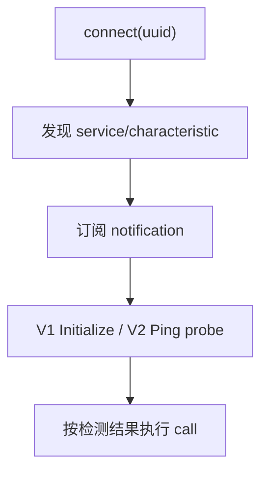

# BLE Transport

> - 文档状态：当前实现
> - 最后核验：2026-07-15

## 支持实现

| 实现             | 平台桥接                          | 数据形态                                  |
| ---------------- | --------------------------------- | ----------------------------------------- |
| Electron BLE     | noble / desktop API               | hex 字符串写入与 notification             |
| React Native BLE | BLE PLX                           | base64 characteristic 写入与 notification |
| lowlevel BLE     | Kotlin、Swift、Flutter 等原生插件 | `send/receive` hex 桥接                   |

三种实现都使用 BLE UART Router `1`，并共享 `ProtocolV2LinkManager`、`ProtocolV2Session` 和 `ProtocolV2FrameAssembler`。

## 连接流程

probe 顺序可受 V2 hint 或连接缓存影响，但设备名只用于排序，不能直接得出协议结论。

## 写入分包

Protocol V2 在协议层仍是完整 `0x5A` frame；BLE Transport 再按平台允许的 GATT write 大小拆成多个小包。拆包不能改变 frame 内容、CRC 或 sequence。

当前边界：

- BLE V2 完整帧最大 2048 字节。
- `FilesystemFileWrite` 默认文件数据块为 1800 字节。
- `FilesystemFileRead` 默认数据块为 900 字节。
- GATT 小包大小和写入节流由具体 BLE 实现负责。

## 接收组帧

notification 可能只包含完整帧的一部分，也可能连续带来多个帧。Transport 将每个 notification byte chunk 交给 assembler，并使用 `drain()` 提取所有完整帧。

lowlevel 原生插件可以返回单个 notification chunk，也可以返回已经拼好的完整帧，但必须保留完整 `0x5A` 帧内容。JS 层仍负责 V1/V2 识别、长度和 CRC 校验。

## 订阅与旧通知隔离

BLE 重连或重新订阅时会轮换 notification token/generation。旧 callback、迟到 notification 和旧 pending read 必须被丢弃，防止污染新 Link。

第一次协议 probe 失败后，BLE Transport 通常会：

1. 使当前 V2 Link 失效。
2. 清空 V1 buffer、V2 assembler 和 frame queue。
3. 取消旧订阅并重新订阅。
4. 再尝试另一套协议。

## lowlevel 插件契约

`LowlevelTransportSharedPlugin.send(uuid, data, options?)` 的 `options.highVolume` 用于提示原生层抑制高频文件传输日志。它不改变发送语义。原生插件不应自行实现 protobuf、CRC 或业务重试。

公共错误与重试原则见 [Link、Session 与错误边界](../v2/link-and-session.md)。
