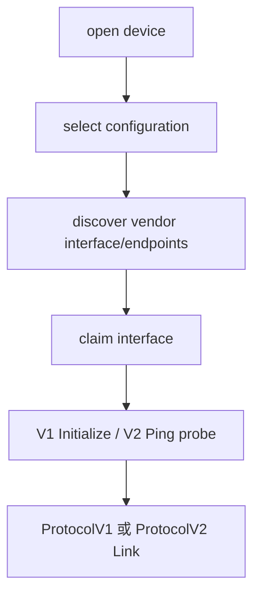

# WebUSB 与 Node USB

> - 文档状态：当前实现
> - 最后核验：2026-07-15

## 共同模型

WebUSB 和 Node USB 使用 USB Router `0`，并复用公共 V2 USB Transport 基础能力。两者差异主要在浏览器 WebUSB API 与 Node/libusb I/O，不在 V2 wire protocol。

## 设备发现与 endpoint

- 设备过滤器负责列出 OneKey USB 设备，但 PID 不决定 V1/V2。
- Transport 从 USB descriptor 发现 vendor-class interface 和 IN/OUT endpoint。
- descriptor 只用于 I/O 路由；协议必须通过真实设备响应确认。
- 发现失败时可使用兼容的 legacy endpoint 默认值，但仍不能据此推断协议。

## V2 读写

- USB 直接发送完整 `0x5A` frame，不使用 V1 的 64 字节 report 分包格式。
- 接收端把 `transferIn`/endpoint 数据交给 `ProtocolV2FrameAssembler`，可从一次读取中提取一个或多个完整帧。
- 通用 V2 frame 上限为 4608 字节。
- 文件写入默认每个 protobuf 请求携带最多 4000 字节文件数据。

## Generation 与恢复

每次 open、claim、reset 或 reconnect 都可能切换 generation。旧 generation 的异步读写完成后必须被拒绝，不能进入新 Link。

V2 probe 或 link-fatal 错误后，USB Transport 会重置 assembler、pending read 和协议缓存，并按平台需要关闭或重建设备连接。已经发送的业务帧不会由 Transport 自动重发。

## WebUSB 特有边界

- `requestDevice/getDevices` 受浏览器授权模型约束。
- WebUSB 需要处理 configuration、interface claim、endpoint halt 和设备 reset。
- 页面层只接收结构化 Transport 日志；高频文件调用不逐块输出 payload。

## Node USB 特有边界

- Node USB 通过 libusb endpoint 读写。
- open/claim/release 的资源生命周期由 Node Transport 管理。
- Node USB 与 WebUSB 应共享相同的 V2 Session、Link 和错误语义，避免平台行为漂移。

公共错误与重试原则见 [Link、Session 与错误边界](../v2/link-and-session.md)。
