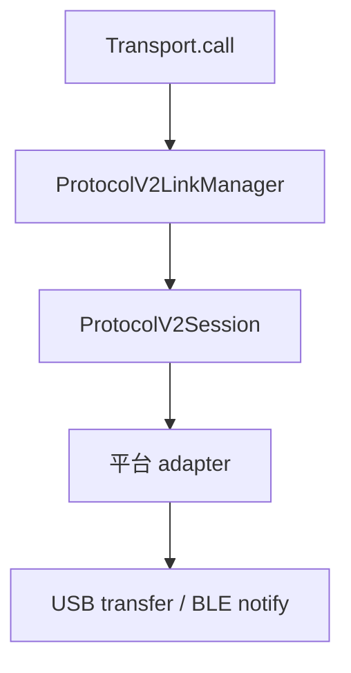

# Protocol V2 Link、Session 与错误边界

> - 文档状态：当前运行时实现
> - 最后核验：2026-07-15
> - 实现入口：`packages/hd-transport/src/protocols/v2/`

## 分层

| 组件                       | 职责                                                                         |
| -------------------------- | ---------------------------------------------------------------------------- |
| `ProtocolV2LinkManager`    | 按设备 key 复用 Link，串行调用，保存 Sequence Cursor，按错误分类使 Link 失效 |
| `ProtocolV2Session`        | protobuf 编码、sequence 分配、写帧、读帧、ACK 跳过、响应类型匹配和超时取消   |
| `ProtocolV2FrameAssembler` | 把平台 chunk 重组成完整 V2 frame                                             |
| `ProtocolV2LinkAdapter`    | 提供 generation、prepare、write、read、reset 与平台错误映射                  |

## 调用串行化

同一设备 Link 上的协议调用必须串行。当前响应匹配主要依靠消息类型和顺序；并发调用可能互相消费响应。Manager 和 Session 都保留串行保护，错误不会打断后续队列链。

## Sequence Cursor

- sequence 取值为 1-255，达到 255 后回到 1，永不使用 0。
- Cursor 按 Transport 实例和设备 key 隔离。
- Link 失效、普通断开或重建时保留 Cursor，因此允许出现序号间隙，但不回退到 1。
- Transport dispose 时清理 Cursor、调用队列和全部 Link。

## 响应处理

Session 会忽略协议 ACK，并继续读取 protobuf 响应。调用方可声明：

- `expectedTypes`：允许结束本次调用的响应类型。
- `intermediateTypes`：进度等中间响应类型。
- `onIntermediateResponse`：消费中间状态但不结束调用。

`Failure`、按钮、PIN、passphrase、word 等交互响应属于公共终止类型。Session 只负责识别和返回，不在传输协议层决定 UI 或业务处理方式。

## 超时与取消

响应超时会标记当前读循环取消，防止单纯 `Promise.race` 留下后台读任务继续消费下一次调用的帧。写入阶段由具体 Transport 拥有完成语义；公共层当前不对写入强加短 watchdog，避免底层仍在发送大帧时上层提前进入下一次调用。

## Link 失效

Transport 根据平台错误把异常分类为 `link-fatal` 或 `recoverable`。对 link-fatal 错误：

1. 从 Manager 删除活动 Link。
2. 标记旧 Link 不可继续读写。
3. 调用 adapter `reset(reason)`。
4. 清理 assembler、pending read、订阅或底层连接状态。

Transport 不自动重放已经发送的请求帧。部分消息可能产生设备侧副作用，是否重试必须由了解幂等性的上层调用方决定。

## Generation

USB open/claim/reset/reconnect 和 BLE 重新订阅会形成新的连接 generation。旧 generation 的迟到 I/O 或 notification 不得进入新 Link。具体 generation 管理由平台 Transport 实现。

设计理由见：

- [ADR-001：Protocol V2 Link 生命周期](../../architecture/decisions/001-protocol-v2-link-lifecycle.md)
- [ADR-002：Protocol V2 Transport 边界](../../architecture/decisions/002-protocol-v2-transport-boundaries.md)
