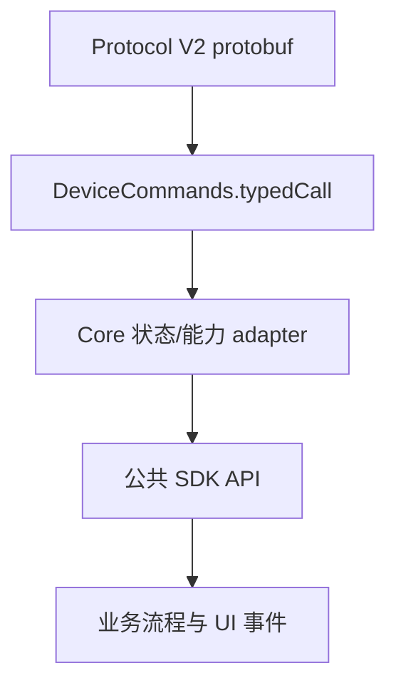

# SDK Core 运行时与 Protocol V2 适配

> 文档类型：核心机制
> 适用读者：Core、Transport 与 App 硬件接入维护者
> 内容状态：兼容迁移中
> 代码范围：`packages/core`
> 最后代码核验：2026-07-27
> 前置阅读：[SDK 架构概览](../architecture/overview.md)

本页描述“协议消息如何进入 SDK 公共能力”，不重复壁纸、设备设置、固件升级等完整用户流程。

Pro2 的字段迁移、拆分和 Feature 缺口见 [Pro2 字段迁移](./pro2-field-migration.md)。传输帧、协议探测和 USB/BLE 实现见 [Protocol V1/V2 传输协议](../protocol/protocol-v1-v2.md)。

## 适配层级



## 设备信息与 DeviceState

V2 不支持传统 `GetFeatures`。Core 在初始化时发送默认范围的 `DeviceInfoGet`，并把结果映射进 Device 内唯一的 `DeviceState`。外部无需理解 `DeviceProfile` 或 V2 原始消息。

| 调用                                    | 语义                                                                     |
| --------------------------------------- | ------------------------------------------------------------------------ |
| 初始化 adapter                          | 请求 hw、fw、coprocessor 基础字段，并更新 Device 内唯一 DeviceState 缓存 |
| `getDeviceState()`                      | 默认刷新运行状态并返回 V1/V2 统一的完整 `DeviceState` 快照               |
| `getDeviceState({ scope: 'settings' })` | 刷新运行状态和设置                                                       |
| `getDeviceState({ scope: 'firmware' })` | 刷新运行状态、身份、完整版本与校验信息                                   |

`scope` 是可选参数；省略时等价于 `scope: 'runtime'`。这里的 scope 只决定本次读取需要主动刷新的数据分区，不裁剪返回值：三种 scope 最终都会返回完整的公共 `DeviceState` 快照。`runtime` 在 Protocol V1 刷新 `GetFeatures`，在 Protocol V2 normal 模式刷新 `DeviceStatusGet`；bootloader / romloader 模式会跳过不支持的状态命令并返回当前可用快照。

原始 `DeviceSettingsGet` 不属于公共 API，只供 SDK 内部 `getDeviceState({ scope: 'settings' })`
流程使用；Pro2 Debug 的状态诊断只保留 `deviceInfoGet` 与 `deviceStatusGet`。

### 状态消费与兼容 Selector 边界

外部业务层以 `getDeviceState()` 和 `DEVICE.STATE` 为统一入口。Protocol V1 的
`getFeatures()` 只用于旧接入兼容；外部不调用
`buildProtocolV1FeaturesPayload/buildProtocolV2FeaturesPayload`，也不直接消费
Transport protobuf 类型。

Core 包根保留以下设备信息 selector，供仍持有兼容 `Features` 的调用方渐进迁移：

| API / 字段                             | 当前语义                                        | 兼容状态                                                |
| -------------------------------------- | ----------------------------------------------- | ------------------------------------------------------- |
| `getDeviceSerialNo()`                  | 读取稳定的物理设备序列号                        | 规范名称                                                |
| `getFirmwareType()`                    | 读取 Universal / Bitcoin-only 固件类型          | 保留原名                                                |
| `getDeviceFirmwareVersion()`           | 读取主固件版本                                  | 规范名称                                                |
| `getDeviceBootloaderVersion()`         | 读取 bootloader 版本                            | 规范名称                                                |
| `getDeviceBLEFirmwareVersion()`        | 读取 BLE / coprocessor 固件版本                 | 保留原名和大写 `BLE`                                    |
| `getDeviceBoardloaderVersion()`        | 读取 board / romloader 版本                     | 保留历史拼写，不增加 `getDeviceBoardVersion`            |
| `KnownDevice.serialNo`                 | 初始化后的稳定物理设备身份                      | 规范字段                                                |
| `SearchDevice.serialNo`                | 已初始化设备的序列号；未连接的 BLE 扫描结果为空 | 规范字段                                                |
| `getDeviceUUID()` / `KnownDevice.uuid` | 初始化后与 `serialNo` 相同                      | 废弃兼容；新业务不再使用                                |
| `SearchDevice.uuid`                    | 历史混合字段；BLE 扫描时可能是 Transport UUID   | 废弃兼容；路由使用 `connectId`，硬件身份使用 `serialNo` |

为兼容业务侧已有的手写 mock 和持久化旧对象，`serialNo` 在当前 TypeScript
类型中暂时可选；当前 SDK 返回的 `KnownDevice` 一定带字符串值，`SearchDevice`
一定带字符串或 `null`。未连接的 BLE 扫描结果只知道 Transport UUID/MAC，
因此 `serialNo` 为 `null`，后续连接路由继续使用 `connectId`。

selector 的运行时兼容层可读取当前规范化 `Features` 和旧 Protocol V1 `Features`；
`DeviceFeaturesInput` 与旧字段解析不作为包根公共类型导出，业务层不负责协议归一化。

Core 内持有 `Device` 的业务流程使用 Device getter，避免把当前设备状态与另一个
`Features` 快照混在同一次判断中；处理离线快照、Release 配置或兼容投影的纯函数使用上述
selector。

## 状态与 PIN 解锁

- `DeviceInfoGet` 默认不请求 status target，也不会隐式补发 `DeviceStatusGet`。
- 每次公共 `getDeviceState()` 读取都会在 normal 模式刷新 `DeviceStatus`，调用方不需要管理缓存刷新参数。
- bootloader / romloader 模式不会发送 `DeviceStatusGet`。
- 公共 `DeviceState` 与 `DEVICE.STATE` 不包含协议 raw 数据或钱包 `session_id`；两者只在 Core 内部用于 V1 兼容和会话恢复。
- V2 PIN 解锁使用 `DeviceSessionAskPin -> Success`，随后刷新 `DeviceStatus`，以获得设备确认的解锁与 Passphrase/Attach PIN 状态。
- 受保护方法是否允许单次解锁后重试，由方法显式声明；Transport 不重放业务请求。

## 统一设置与 DeviceState 更新

公共 `deviceSettings` 是 OneKey V1/V2 的协议无关写入入口。Core 根据协议选择
`ApplySettings` 或 `DeviceSettingsSet`，成功后把已确认参数合并进唯一的 DeviceState 缓存。
原始 V2 `DeviceSettingsGet/Set` 与 `DeviceSettingsPageShow` 只作为 SDK 内部命令保留，不生成 `CoreApi` 便捷方法。

设置能力按当前协议源定义：

| 能力范围 | 公共参数 |
| -------- | -------- |
| V1/V2 共有 | `label`、`language`、`usePassphrase`、`autoLockDelayMs`、`autoShutdownDelayMs`、`hapticFeedback`、`bluetoothEnabled` |
| 仅 V1 | `homescreen`、`passphraseSource`、`displayRotation`、`passphraseAlwaysOnDevice`、`safetyChecks`、`experimentalFeatures`、`changeBrightness` |
| 仅 V2 | `brightness`、`airgapMode`、`animationEnabled`、`tapToWake`、`deviceNameDisplayEnabled`、`fidoEnabled`、`usbLockEnabled`、`randomKeypad` |

`bluetoothEnabled` 在 V1/V2 分别映射为 `use_ble` / `bt_enable`。当前 Protocol V2
protobuf 没有 `experimental_features`，所以该参数只支持 V1。请求包含当前协议不支持的字段时，
Core 会在发送任何命令前返回参数错误，避免同一请求中的其他字段被部分应用。

`getDeviceSettingsCapabilities(deviceType, protocol)` 是字段、语言、时长选项、数值范围和设备端确认
要求的单一公共来源；调用方必须传入已通过设备响应确认的协议，不能从 PID 或设备名推断。
Protocol V2 的自动锁屏和自动关机使用 `0x10000000` 表示“永不”，Protocol V1 仍使用 `0`。
`safetyChecks` 在公共写入参数、`DeviceState` 和事件中统一使用数值枚举
`Strict=0`、`PromptAlways=1`、`PromptTemporarily=2`。

每次实际状态变化都会发送 `DEVICE.STATE`。宿主应用应监听该事件并持久化完整状态，
不需要为 label、language、auto-lock 等字段分别维护手工数据库 patch。Protocol V1 额外发送
兼容事件 `DEVICE.FEATURES`；Protocol V2 不发送该事件。设置读取与写入事件分别使用
`settings-read` 和 `settings-write` 来源。

详见 [钱包 Session 与设备安全](../device/wallet-session-and-security.md) 和 [SDK 关键架构决策](../architecture/decisions.md#受保护方法的单次解锁重试)。

## 钱包 Session

公共钱包 Session API 按协议明确分层：

| 公共 API                 | 语义                                                                  |
| ------------------------ | --------------------------------------------------------------------- |
| `getPassphraseState()`   | 无参数 Legacy Protocol V1 当前钱包状态入口；Protocol V2 返回不支持    |
| `openWalletSession()`    | Protocol V1/V2 统一钱包入口；支持标准、隐藏、Attach-to-PIN 与显式恢复 |
| `clearSessionCache()`    | 仅清除 `DeviceWalletSessionStore`，不发送设备协议命令                 |
| 原始 `DeviceSessionGet`  | 仅为 Core 内部 Protocol V2 设备命令，不是可调用的 SDK API            |

当前没有“只读查询设备当前打开哪个钱包”的公共需求，因此不提供
`deviceSessionGet/getWalletSessionState`。`getDeviceState()` 只返回 Passphrase、Attach PIN
等设备功能和运行状态，不返回钱包身份。App 在 `openWalletSession()` 成功后保存返回的
`deviceId + walletType + passphraseState`；Core 单独保存并管理内部 `sessionId`。

Core 先把公共钱包意图归一化，再映射到各协议：

```text
标准钱包
  -> V1: PassphraseRequest 自动回复空字符串
  -> V2: 使用默认空 Passphrase 上下文，不打开隐藏钱包 DeviceSession

隐藏钱包 / Attach-to-PIN
  -> V1: GetPassphraseState -> PassphraseRequest / PassphraseAck
  -> V2: 设备端 PIN/Passphrase/Attach PIN 解锁选择 -> DeviceSessionGet({})

恢复隐藏钱包
  -> V1: 按 passphraseState 校验并复用兼容 Session
  -> V2: DeviceSessionGet({ session_id })
```

显式调用只使用 `mode` 表达意图，不能再混入旧参数：

| `mode`          | 可携带的钱包绑定             | 行为             |
| --------------- | ---------------------------- | ---------------- |
| `standard`      | 无                           | 打开标准钱包     |
| `select-hidden` | 无                           | 重新选择隐藏钱包 |
| `resume-hidden` | `deviceId + passphraseState` | 恢复指定隐藏钱包 |

为了支持 App 按设备分流的调试迁移，未传 `mode` 时保留旧参数归一化，优先级如下：

1. `useEmptyPassphrase=true`：进入 `standard`，优先于其他旧字段。
2. 否则 `initSession=true`：进入 `select-hidden`；如果同时提供旧
   `passphraseState`，Core 只使当前设备上该钱包的旧 Session 失效。
3. 否则完整提供 `deviceId + passphraseState`：进入 `resume-hidden`。
4. 否则没有钱包绑定：进入 `select-hidden`；绑定字段不完整则返回参数错误。

`useEmptyPassphrase=false` 和 `initSession=false` 不会单独选择模式。显式 `mode` 与
`useEmptyPassphrase/initSession` 混用，或给 `standard/select-hidden` 携带钱包绑定，
都会返回 `CallMethodInvalidParameter`，避免同一请求存在两个流程意图。

`openWalletSession()` 的成功结果以 `walletType` 作为判别字段：

| `walletType` | `passphraseState` | 含义                                   |
| ------------ | ----------------- | -------------------------------------- |
| `standard`   | `null`            | 标准钱包没有可供隐藏钱包恢复使用的标识 |
| `hidden`     | 非空字符串        | 当前隐藏钱包标识，可与 `deviceId` 持久化 |

因此 `{ walletType: 'standard', passphraseState: null }` 是完整、正确的成功结果，不表示
设备漏回字段。诊断日志可以对非空 `passphraseState` 脱敏，但必须保留 `null`，避免把标准
钱包误显示成存在一个被隐藏的钱包标识。

参数校验失败也遵循 Core 的统一响应结构，不以 rejected Promise 暴露裸异常。例如
`resume-hidden` 缺少 `deviceId` 时返回：

```json
{
  "success": false,
  "payload": {
    "error": "Missing required parameter: deviceId",
    "code": "CallMethodInvalidParameter"
  }
}
```

`openWalletSession({ mode: 'resume-hidden' })` 在 Protocol V1/V2 都只接收
`deviceId + passphraseState`。Core 按该 key 从唯一 Store 读取内部 `sessionId`：
V1 通过 `Initialize.session_id` 恢复，V2 通过 `DeviceSessionGet({ session_id })` 恢复。
缓存不存在时 Core 返回 `HardwareErrorCode.WalletSessionInvalid`；固件拒绝缓存 Session
时，Core 清理当前隐藏钱包缓存并透传规范化的固件错误，不会暗中切换钱包。
`DeviceSessionGet` 成功时必须同时返回非空
`session_id + btc_test_address`，否则 Core 将其视为不完整响应，而不是标准钱包。

`clearSessionCache()` 对 V1 和 V2 执行相同的 Core 本地操作：

- 没有参数时清除全部设备和钱包的缓存。
- 只传 `deviceId` 时清除该设备的全部钱包缓存。
- 同时传 `deviceId + passphraseState` 时只清除指定钱包缓存。
- 不修改 `DeviceState` 或协议 raw 快照，也不执行 Lock、Cancel 或设备端 Session Close。

V1 被清理的是由 `Initialize/Features` 或 `GetPassphraseState` 获得的本地 `session_id`
映射；V2 被清理的是由 `DeviceSessionGet` 返回的本地 `session_id` 映射。下次打开钱包时，
Core 会重新执行对应协议的钱包 Session 建立或恢复流程。

App 迁移时只替换“打开/切换钱包”阶段：V1 继续调用 Legacy `getPassphraseState()`，
V2 调用 `openWalletSession()`。地址、签名和 `preInitialize` 仍沿用原来的
`passphraseState` / `useEmptyPassphrase` 参数，不应在每条业务指令前重复打开 Session。
因此 App 的钱包 key 无需加入 `sessionId`；V1/V2 的 `sessionId` 都由 Core 统一按
`deviceId + passphraseState` 管理。

`openWalletSession()` 的返回值同样不包含 `sessionId`。兼容 `Features.session_id/sessionId`
只用于旧 V1 投影和 Core 内部迁移，不复制到设备消息顶层，也不属于新业务接口。

详见 [钱包 Session 与设备安全](../device/wallet-session-and-security.md) 和 [SDK 关键架构决策](../architecture/decisions.md#钱包-session-所有权与缓存键)。

## 文件能力

原始文件、目录、路径、权限修复和格式化方法都不属于公共 `CoreApi`。App 应调用受控业务
接口，例如 `uploadPortfolio`、`deviceUploadWallpaper` 和 `firmwareUpdateV4`；这些方法
固定目标目录、校验输入，并在 Core 内部编排分片。Transport 只发送已经编码好的单个请求帧。

## 固件更新

需要区分两层 API：

| 层级                        | 职责                                                                                      |
| --------------------------- | ----------------------------------------------------------------------------------------- |
| 内部 `DeviceFirmwareUpdate` | 规范化 targets，发送 `DeviceFirmwareUpdateRequest`，接收中间 `DeviceFirmwareUpdateStatus` |
| 高层固件升级                | 校验包、创建目录、分块暂存 resource/bootloader/firmware、触发安装、轮询、处理断连与重连   |

“功能拆分”应记录在本适配页和对应业务文档，不能写进帧格式或 Transport 文档。

完整流程见 [Pro2 设备管理](../business/pro2-device-management.md)。

## Protocol V2 公共边界

正式业务应使用按业务语义组织的公共 API。Pro2 调试阶段仍临时公开部分底层开发接口，
由 App 按设备分流；这些接口同样显式声明在 `CoreApi` 中，不使用隐藏的 internal 分发表：

| 分类           | 正式业务 API                                             | 调试阶段临时公开的开发 API                                |
| -------------- | -------------------------------------------------------- | --------------------------------------------------------- |
| 状态           | `getDeviceState`                                         | `deviceInfoGet`、`deviceStatusGet`                        |
| 设置           | `deviceSettings`、`deviceChangePin`、`deviceWipe`        | 无                                                        |
| 钱包 Session   | `openWalletSession`、`clearSessionCache`                 | 无；`deviceSessionOpen` 不是 SDK API                      |
| 固件           | `firmwareUpdateV4` 等高层流程                            | `deviceFirmwareUpdate`、`deviceGetFirmwareUpdateStatus`   |
| 文件维护       | `uploadPortfolio`、`deviceUploadWallpaper`、高层固件升级 | `file*`、`dir*`、`pathInfo`、权限修复与格式化命令         |
| 协议与工厂调试 | 无                                                       | `protocolInfoRequest`、`ping`、`deviceFactoryInfoGet/Set` |

`getFeatures`、`getOnekeyFeatures` 仅作为 Protocol V1 兼容入口保留并标记废弃，新接入使用 `getDeviceState`。

## 其他 Protocol V2 专属能力

`deviceGetOnboardingStatus` 与 `uploadPortfolio` 是明确的 Pro2 独立公共能力。
`deviceReboot`、`deviceUploadWallpaper` 也继续公开；它们统一通过 Protocol V2 设备守卫。
原始文件系统方法只保留在 Core 内部调度，不进入 App 可见的 `CoreApi`。面向用户的行为分别记录在：

- [Pro2 设备管理](../business/pro2-device-management.md)
- [设备能力矩阵](../device/capabilities.md)
