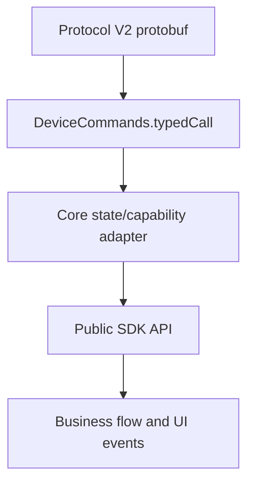

# SDK Core runtime and Protocol V2 adaptation

> Document type: core mechanism
> Audience: Core, Transport, and App hardware-integration maintainers
> Status: compatibility migration in progress
> Code scope: `packages/core`
> Last code review: 2026-07-30
> Read first: [SDK architecture overview](../architecture/overview.md)

This page describes how protocol messages enter public SDK capabilities. It does not repeat full user flows such as wallpaper, device settings, or firmware update.

Pro2 field migration, splits, and Feature gaps are in [Pro2 field migration](./pro2-field-migration.md). Transport frames, protocol probing, and USB/BLE implementations are in [Protocol V1/V2 transport](../protocol/protocol-v1-v2.md).

## Adaptation layers



## Device info and DeviceState

V2 does not support classic `GetFeatures`. During init, Core sends a default-scope `DeviceInfoGet`, then reads `ProtocolInfo` to decide whether the device is running application, bootloader, or romloader, and maps the result into the single `DeviceState` on Device. `DeviceStatus` is read only in application mode when `supported_messages` declares support. Callers do not need to understand `DeviceProfile` or raw V2 messages.

| Call | Meaning |
| --- | --- |
| Init adapter | Request basic device info and protocol run stage; read live status by capability and update the unique DeviceState cache |
| `getDeviceState()` | Default: refresh runtime status and return the unified V1/V2 full `DeviceState` snapshot |
| `getDeviceState({ scope: 'settings' })` | Refresh runtime status and settings |
| `getDeviceState({ scope: 'firmware' })` | Refresh runtime status, identity, full versions, and verification info |

`scope` is optional. Omitting it is `scope: 'runtime'`. Scope only chooses which partitions this read actively refreshes; it does not trim the return value. All three scopes still return a full public `DeviceState` snapshot. `runtime` refreshes `GetFeatures` on Protocol V1 and `DeviceStatusGet` on Protocol V2 normal mode. Bootloader / romloader skip unsupported status commands and return the currently available snapshot.

Raw `DeviceSettingsGet` is not a public API. It is only used inside `getDeviceState({ scope: 'settings' })`. Pro2 Debug status diagnostics keep only `deviceInfoGet` and `deviceStatusGet`.

### State consumption and compatibility selector boundary

External business code uses `getDeviceState()` and `DEVICE.STATE` as the unified entry. Protocol V1 `getFeatures()` is legacy compatibility only. External code does not call `buildProtocolV1FeaturesPayload` / `buildProtocolV2FeaturesPayload`, and does not consume Transport protobuf types directly.

The Core package root keeps these device-info selectors so callers that still hold compatibility `Features` can migrate gradually:

| API / field | Current meaning | Compatibility |
| --- | --- | --- |
| `getDeviceSerialNo()` | Stable physical serial | Canonical name |
| `getFirmwareType()` | Universal / Bitcoin-only firmware type | Original name kept |
| `getDeviceFirmwareVersion()` | Main firmware version | Canonical name |
| `getDeviceBootloaderVersion()` | Bootloader version | Canonical name |
| `getDeviceBLEFirmwareVersion()` | BLE / coprocessor firmware version | Original name and uppercase `BLE` kept |
| `getDeviceBoardloaderVersion()` | Board / romloader version | Historical spelling kept; no `getDeviceBoardVersion` |
| `KnownDevice.serialNo` | Stable physical identity after init | Canonical field |
| `KnownDevice.status` | Current transport use state | `available` / `used` / `occupied` for connection UI |
| `SearchDevice.serialNo` | Serial of an initialized device; empty for unconnected BLE scan results | Canonical field |
| `getDeviceUUID()` / `KnownDevice.uuid` | Same as `serialNo` after init | Deprecated compatibility; new business must not use it |
| `SearchDevice.uuid` | Historical mixed field; BLE scan may be a Transport UUID | Deprecated compatibility; routing uses `connectId`, hardware identity uses `serialNo` |

To keep handwritten mocks and persisted legacy objects working, `serialNo` is temporarily optional in the TypeScript types. Current SDK `KnownDevice` always returns a string. `SearchDevice` always returns a string or `null`. Unconnected BLE scan results only know a Transport UUID/MAC, so `serialNo` is `null` and later connection routing still uses `connectId`.

The runtime compatibility layer of these selectors can read both current normalized `Features` and legacy Protocol V1 `Features`. `DeviceFeaturesInput` and old-field parsing are not exported as package-root public types. Business code does not own protocol normalization.

Core business flows that hold a `Device` use Device getters, so current device state is not mixed with another `Features` snapshot in the same decision. Pure functions that handle offline snapshots, release config, or compatibility projections use the selectors above.

## Status and PIN unlock

- `DeviceInfoGet` does not request the status target by default. After reading `ProtocolInfo`, init decides whether to send `DeviceStatusGet`.
- Every public `getDeviceState()` read refreshes `DeviceStatus` in normal mode. Callers do not manage cache-refresh flags.
- The binary segment of `build_fingerprint` only identifies application / bootloader / romloader. `supported_messages` is the capability source. Do not derive capability from version, commit, or PROD/DEV.
- Bootloader / romloader modes do not send `DeviceStatusGet`.
- Core internally uses mutually exclusive `isBootloader()` / `isRomloader()`. Compatibility field `bootloaderMode` only means a generic loader and cannot distinguish the two modes. Romloader firmware update uses the current link and does not send `DeviceReboot(Bootloader)`.
- `isRomloader()` and that direct-update behavior apply only to Pro2 + Protocol V2. Classic Pro Protocol V1 boardloader keeps its original flow and does not convert to romloader.
- Public `DeviceState` and `DEVICE.STATE` do not include protocol raw data or wallet `session_id`. Those stay inside Core for V1 compatibility and Session resume.
- V2 PIN unlock uses `DeviceSessionAskPin -> Success`, then refreshes `DeviceStatus`. If a wallet Session is needed, it then calls `DeviceSessionGet`.
- Methods that need a wallet Session auto-enter pre-call unlock via `useDevicePassphraseState`. Non-wallet management methods may use `unlock-before-run` explicitly. Both read fresh Status before Wallet Session, Safety Check, and business I/O, verify target device identity, then unlock if needed. `DeviceLocked` during the business phase fails immediately. Core and Transport do not replay the business request.

## Unified settings and DeviceState updates

Public `deviceSettings` is the protocol-agnostic write entry for OneKey V1/V2. Core chooses `ApplySettings` or `DeviceSettingsSet` from the protocol, then merges confirmed parameters into the unique DeviceState cache. Raw V2 `DeviceSettingsGet` / `Set` and `DeviceSettingsPageShow` remain internal SDK commands and do not generate `CoreApi` convenience methods.

Settings capability is defined by the current protocol source:

| Capability | Public params |
| --- | --- |
| Shared V1/V2 | `label`, `language`, `usePassphrase`, `autoLockDelayMs`, `autoShutdownDelayMs`, `hapticFeedback`, `bluetoothEnabled` |
| V1 only | `homescreen`, `passphraseSource`, `displayRotation`, `passphraseAlwaysOnDevice`, `safetyChecks`, `experimentalFeatures`, `changeBrightness` |
| V2 only | `brightness`, `airgapMode`, `animationEnabled`, `tapToWake`, `deviceNameDisplayEnabled`, `fidoEnabled`, `usbLockEnabled`, `randomKeypad` |

`bluetoothEnabled` maps to `use_ble` on V1 and `bt_enable` on V2. Current Protocol V2 protobuf has no `experimental_features`, so that param is V1-only. If a request includes fields the current protocol does not support, Core returns a parameter error before sending any command, so other fields in the same request are not partially applied.

`getDeviceSettingsCapabilities(deviceType, protocol)` is the single public source for fields, languages, duration options, numeric ranges, and on-device confirmation requirements. Callers must pass a protocol confirmed by a device response, not infer it from PID or device name. Protocol V1/V2 auto-lock and auto-shutdown both use `0x10000000` for "never". Core's Protocol V1 send boundary still accepts early SDK 1.2 alpha `0` and normalizes it to the firmware-supported value. `safetyChecks` uses numeric enums in public write params, `DeviceState`, and events: `Strict=0`, `PromptAlways=1`, `PromptTemporarily=2`.

Every actual state change emits `DEVICE.STATE`. Host apps should listen and persist the full state. They do not need separate handmade DB patches for label, language, auto-lock, and similar fields. Protocol V1 also emits compatibility event `DEVICE.FEATURES`. Protocol V2 does not. After a successful Protocol V2 settings write, Core force-refreshes `status` and `settings`. State comes only from device readback, with event sources `device-status` and `settings-read`. Request parameters are not used to generate a `settings-write` patch. Apps may still call `getDeviceState({ scope: 'settings' })` when a settings page opens or refocuses, to discover changes made on-device or by another client.

See [Wallet Session and device security](../device/wallet-session-and-security.md) and [SDK architecture decisions](../architecture/decisions.md#pre-call-unlock-for-protected-methods).

## Wallet Session

Public wallet Session APIs are split by protocol:

| Public API | Meaning |
| --- | --- |
| `getPassphraseState()` | Existing App cross-protocol compatibility entry; V1 keeps the old flow, V2 is mapped by Core onto Ask/Get |
| `openWalletSession()` | Unified V1/V2 wallet entry; supports standard, hidden, Attach-to-PIN, and explicit resume |
| `clearSessionCache()` | Clears only `DeviceWalletSessionStore`; sends no device protocol command |
| Raw Session requests | `DeviceSessionAskPin` / `AskPassphrase` / `Get` are Core-internal orchestration only |

There is currently no public need to "read-only query which wallet the device has open", so there is no raw wallet Session query API. `getDeviceState()` returns Passphrase, Attach PIN, and other device features and runtime status. It does not return wallet identity. After `openWalletSession()` succeeds, the App stores returned `deviceId + walletType + passphraseState`. Firmware `session_id` is written only to Core-internal `DeviceWalletSessionStore` and is not exported on the public response.

Core first normalizes the public wallet intent, then maps it per protocol:

```text
Standard wallet
  -> V1: PassphraseRequest auto-replies with an empty string
  -> V2 first open / state mismatch: negotiate eventless; AskPin(Main) -> Success -> DeviceSessionGet()
  -> V2 unlocked with valid cache: negotiate eventless; DeviceSessionGet(session_id) -> DeviceSession

Hidden wallet / Attach-to-PIN
  -> V1: GetPassphraseState -> PassphraseRequest / PassphraseAck
  -> V2: REQUEST_PASSPHRASE selection -> AskPassphrase or AskPin(AttachToPin)
         -> Success -> DeviceStatusGet -> DeviceSessionGet()

Resume hidden wallet
  -> V1: Initialize without wallet-binding fields to verify live deviceId,
         then verify passphraseState and reuse the compatibility Session
  -> V2: DeviceSessionGet({ session_id })
```

Explicit calls use only `mode` for intent. Do not mix in legacy params:

| `mode` | Wallet binding allowed | Behavior |
| --- | --- | --- |
| `standard` | None | Open the standard wallet |
| `select-hidden` | None | Re-select a hidden wallet |
| `resume-hidden` | `deviceId + passphraseState` | Resume the specified hidden wallet |

To support App debug migration that still branches by device, omitting `mode` keeps legacy-param normalization, in this order:

1. `useEmptyPassphrase=true`: enter `standard`, ahead of other legacy fields.
2. Else `initSession=true`: enter `select-hidden`. If legacy `passphraseState` is also provided, Core only invalidates that wallet's old Session on the current device.
3. Else a complete `deviceId + passphraseState`: enter `resume-hidden`.
4. Else no wallet binding: enter `select-hidden`. Incomplete binding fields return a parameter error.

`useEmptyPassphrase=false` and `initSession=false` do not select a mode by themselves. Mixing explicit `mode` with `useEmptyPassphrase` / `initSession`, or giving `standard` / `select-hidden` a wallet binding, returns `CallMethodInvalidParameter`, so one request cannot carry two flow intents.

Successful `openWalletSession()` results use `walletType` as the discriminator:

| `walletType` | `passphraseState` | Meaning |
| --- | --- | --- |
| `standard` | `null` | Device default empty-Passphrase context |
| `hidden` | Non-empty string | Hidden-wallet identity returned by the device |

Pro2 standard wallets still use `btc_test_address` from the hardware `DeviceSession` to build an internal index, but that fingerprint is not exposed to the App. Hidden-wallet public `passphraseState` comes from the same hardware response. Core does not invent wallet identity from Features, descriptors, or the Store. Cross-protocol wallet type is only `walletType`. When Pro2 needs unlock, wallet type follows device state after unlock and refresh, not the pre-unlock `passphraseProtection` snapshot.

Parameter-validation failures also use Core's unified response shape and are not exposed as a rejected Promise with a raw exception. For example, `resume-hidden` without `deviceId` returns:

```json
{
  "success": false,
  "payload": {
    "error": "Missing required parameter: deviceId",
    "code": "CallMethodInvalidParameter"
  }
}
```

`openWalletSession({ mode: 'resume-hidden' })` accepts only `deviceId + passphraseState` on both Protocol V1 and V2. Core reads the internal `sessionId` from the unique Store by that key: V1 resumes through `Initialize.session_id`, V2 through `DeviceSessionGet({ session_id })`. Missing V1 cache returns `HardwareErrorCode.WalletSessionInvalid`. Missing V2 cache, firmware rejecting the cached Session, or a returned wallet fingerprint mismatch causes Core to clear that handle and re-select the target wallet in the same public call. Success requires the final `passphraseState` to match the business binding. A successful `DeviceSessionGet` must return non-empty `session_id + btc_test_address`; otherwise Core treats it as an incomplete response, not a standard wallet.

Standard wallets do not require the App to supply a wallet binding. Core keeps a standard-wallet internal index `deviceKey -> { passphraseState, sessionId }` in the same Store. First open or a locked device uses `DeviceSessionAskPin(Main)` to get the standard Session. An unlocked device with a valid index reuses `DeviceSessionGet(session_id)`. Cache expiry rebuilds inside the same explicit standard-wallet call. If the returned address does not match the cache, Core rebuilds once with `AskPin(Main) -> Get()`. If the address still mismatches, it clears the standard index and stops the business call. None of this clears hidden-wallet records on the same device.

`clearSessionCache()` is the same Core-local operation on V1 and V2:

- No params: clear every device and wallet cache.
- `deviceId` only: clear every wallet cache for that device.
- `deviceId + passphraseState`: clear only that wallet cache.
- `passphraseState` alone: return `CallMethodInvalidParameter`; do not fall back to a global clear.
- Do not mutate `DeviceState` or protocol raw snapshots, and do not send Lock, Cancel, or on-device Session Close.

V1 clears local `session_id` mappings obtained from `Initialize` / `Features` or `GetPassphraseState`. V2 clears local `session_id` mappings returned by `DeviceSessionGet`. The next wallet open re-runs that protocol's Session establish or resume flow.

When a Protocol V1 business call supplies both `deviceId` and a wallet binding, Core first sends `Initialize` without `session_id` / `passphrase_state` to get live device identity. Only if live `deviceId` matches the caller does it send a second `Initialize` to reuse that wallet's cached Session. Identity mismatch returns `DeviceCheckDeviceIdError` immediately and does not send an old device or old-init-lifecycle Session to the current hardware. Every wallet business method that accepts `deviceId` should enable the same identity check before the business command.

New Apps should prefer `openWalletSession()` at the "open/switch wallet" stage. Existing V1/V2 integrations may keep using compatibility `getPassphraseState()`. Address, signing, and `preInitialize` still use the original `passphraseState` / `useEmptyPassphrase` params and should not reopen a Session before every business command. The App wallet key therefore does not include `sessionId`. V1/V2 `sessionId` is owned by Core under `deviceId + passphraseState`.

### App Passphrase integration

Apps already using the Pro V1 `getPassphraseState()` flow keep the same public call shape and business data model when they add Pro2:

```ts
const result = await HardwareSDK.getPassphraseState({
  connectId,
  deviceId,
});

if (result.success) {
  const { passphraseState } = result.payload;
  // Still use deviceId + passphraseState as the wallet reference.
}
```

The App must not choose protocol by model or PID, and must not send `DeviceSessionAskPin` / `DeviceSessionAskPassphrase` / `DeviceSessionGet` itself. After device-response probing, Core routes automatically:

| App intent | Pro V1 firmware flow | Pro2 Protocol V2 firmware flow |
| --- | --- | --- |
| Standard wallet | Empty-Passphrase compatibility flow | AskPin(Main) -> Success -> Get(), or Get(standard Session) |
| Host Passphrase wallet | `GetPassphraseState -> PassphraseState` | AskPassphrase({ on_device: false, passphrase }) -> Success -> Get() |
| On-device Passphrase wallet | `GetPassphraseState -> PassphraseState` | AskPassphrase({ on_device: true }) -> Success -> Get() |
| Attach-to-PIN | `GetPassphraseState -> PassphraseState` | AskPin(AttachToPin) -> Success -> Get() |
| Resume a selected hidden wallet | Core manages V1 Session reuse | `DeviceSessionGet({ session_id })` |

Pro2 Protocol V2 `DeviceSessionAskPassphrase.on_device` is required. Host input must carry a non-empty `passphrase` and `on_device: false`. On-device input carries only `on_device: true`. Attach-to-PIN does not reuse an empty Passphrase request; it always uses `DeviceSessionAskPin(AttachToPin)`.

Minimum App regression checks:

1. Pro V1 standard, hidden, and Attach-to-PIN flows keep their original behavior.
2. Pro2 can open a hidden wallet through the same `getPassphraseState()` entry and returns a non-empty `passphraseState`.
3. Later address and signing calls keep passing that `passphraseState`. Do not persist, print, or use `sessionId` as a wallet primary key.
4. After wallet switch, disconnect/reconnect, and Session expiry, a `deviceId + passphraseState` Session is not routed to another wallet.

New integrations should use `openWalletSession({ mode })` to express intent explicitly. That is a gradual migration, not a hard prerequisite for Pro2.

Neither standard nor hidden results from `openWalletSession()` include firmware `sessionId`. The public projection of legacy `Features.session_id` / `sessionId` stays empty. Existing controlled OS Keychain records from old CLI can still be preloaded through a compatibility entry, but new public wallet responses no longer create those records.

See [Wallet Session and device security](../device/wallet-session-and-security.md) and [SDK architecture decisions](../architecture/decisions.md#wallet-session-ownership-and-cache-keys).

## File capability

Raw file, directory, path, permission-fix, and format methods are not public `CoreApi`. Apps should call controlled business APIs such as `uploadPortfolio`, `deviceUploadWallpaper`, and `firmwareUpdateV4`. Those methods pin the target directory, validate input, and orchestrate chunks inside Core. Transport only sends already-encoded single request frames.

## Firmware update

There are two API layers:

| Layer | Responsibility |
| --- | --- |
| Internal `DeviceFirmwareUpdate` | Normalize targets, stage them with `DeviceFirmwareUpdateStage`, then send empty `DeviceFirmwareUpdateRequest` to start install |
| High-level firmware update | Verify packages, create directories, chunk-stage resource/bootloader/firmware, trigger install, poll, and handle disconnect/reconnect |

"Feature split" belongs on this adaptation page and the matching business docs. Do not put it in frame-format or Transport docs.

The full flow is in [Pro2 device management](../business/pro2-device-management.md).

## Protocol V2 public boundary

Official business should use public APIs organized by business meaning. Read-only diagnostics may stay temporarily, but low-level commands that change the device, filesystem, or install state must stay inside Core:

| Category | Official business API | Kept read-only / diagnostic API | Core-internal command |
| --- | --- | --- | --- |
| Status | `getDeviceState` | `deviceInfoGet`, `deviceStatusGet` | None |
| Settings | `deviceSettings`, `deviceChangePin`, `deviceWipe` | None | None |
| Wallet Session | `openWalletSession`, `clearSessionCache` | None | `deviceSessionOpen` |
| Firmware | High-level flows such as `firmwareUpdateV4` | `deviceGetFirmwareUpdateStatus` | `deviceFirmwareUpdate` |
| File maintenance | `uploadPortfolio`, `deviceUploadWallpaper`, high-level firmware update | `fileRead`, `dirList`, `pathInfo`, and constrained `dirMake` | `fileWrite`, `fileDelete`, `dirRemove`, `filesystemFormat` / `PermissionFix` |
| Protocol and factory debug | None | `protocolInfoRequest`, `ping`, `deviceFactoryInfoGet` | `deviceFactoryInfoSet` |

`getFeatures` and `getOnekeyFeatures` remain Protocol V1 compatibility entries and are marked deprecated. New integrations use `getDeviceState`.

## Other Protocol V2-only capabilities

`deviceGetOnboardingStatus` and `uploadPortfolio` are explicit Pro2-only public capabilities. `deviceReboot` and `deviceUploadWallpaper` stay public. They all go through Protocol V2 device guards. Raw filesystem methods stay in Core-internal dispatch and do not enter App-visible `CoreApi`. User-facing behavior is recorded in:

- [Pro2 device management](../business/pro2-device-management.md)
- [Device capability matrix](../device/capabilities.md)
