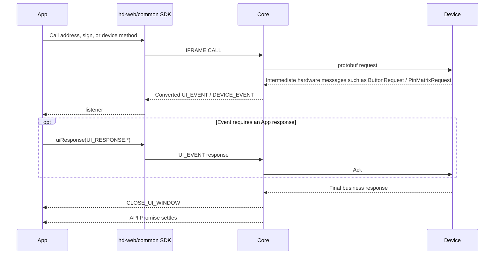
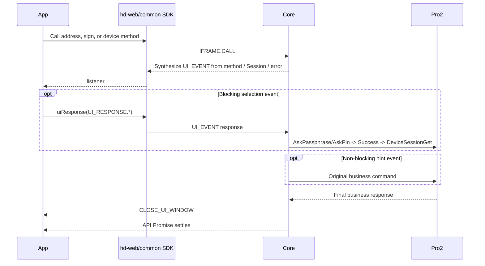

# OneKey `hd-*` SDK public events (SDK → App)

> - Status: Protocol V1 current contract + Protocol V2 common event boundary
> - Last code review: 2026-08-03
> - Scope: `@onekeyfe/hd-core`, `hd-web-sdk`, `hd-common-connect-sdk`
> - Source of truth: `packages/core/src/events`, `packages/core/src/core/index.ts`, and outer SDK event forwarding

This document describes the public events that the OneKey `hd-*` SDK exposes to the App: who generates them, which events pause a call, how the App sends results back, and how device, firmware, and runtime notifications are dispatched.

For Protocol V2 / Pro2, "eventless" means firmware no longer sends UI intermediate messages that wait for a Host ACK. The SDK still collects one wallet-access intent through a Passphrase Event, then actively sends `DeviceSessionAskPin` / `DeviceSessionAskPassphrase` / `DeviceSessionGet`. The current wallet flow follows [SDK Core runtime](./core-runtime.md#wallet-session).

These public events do not all come from hardware. When maintaining events, first distinguish device-protocol intermediate messages, `hd-*` SDK public events, and `hwk-*` Adapter public events.

The new `hwk-*` Adapter uses a different set of event names, types, and wait mechanics. Do not mix those constants with this document.

## Distinguish events by source first

Public `hd-*` events come from six producers:

| Source | Representative events | Emitted directly by hardware? | App action |
| --- | --- | --- | --- |
| V1 hardware-protocol conversion | `REQUEST_PIN`, `REQUEST_PASSPHRASE`, `REQUEST_BUTTON` | Raw messages come from hardware; Core converts them to public events | Show device-interaction UI and call `uiResponse()` when needed |
| V2 Core / coordinator synthesis | The same `REQUEST_*` set | No; generated from params, Session state, or errors | Reuse the same UI; respond only when the event type requires it |
| Core business flow | WebUSB device selection, close-window, business progress, firmware tips | No | Update flow UI; some requests need a response |
| Transport / host environment | Bluetooth, location, WebUSB permission notices | No | Request permission, guide the user, or retry |
| Device and transport lifecycle | `CONNECT`, `DISCONNECT`, `FEATURES` | Not hardware intermediate events | Update the device list and state |
| SDK config and capability calculation | `SUPPORT_FEATURES`, firmware release metadata | No | Update capabilities and upgrade entry points |

Do not treat a constant as "an event that waits for the App" only because it lives in `UI_REQUEST`. `UI_REQUEST` also includes device-mode error markers, and some constants currently have no emit path.

## Message shape and listeners

Core internal messages use:

```ts
type CoreMessage = {
  event: string;
  type: string;
  payload?: unknown;
};
```

The outer SDK dispatches event groups differently:

| Listener | Data received by the listener | Notes |
| --- | --- | --- |
| `HardwareSDK.on(UI_EVENT, listener)` | Full `{ event, type, payload }` | All UI requests and notices |
| `HardwareSDK.on(UI_REQUEST.REQUEST_PIN, listener)` | Event `payload` | One specific UI type |
| `HardwareSDK.on(DEVICE.CONNECT, listener)` | Event `payload` | Device events are forwarded by concrete type |
| `HardwareSDK.on(FIRMWARE_EVENT, listener)` | Full `{ event, type, payload }` | Firmware metadata is listened on the aggregate event |

```ts
HardwareSDK.on(UI_EVENT, message => {
  console.log(message.type, message.payload);
});

HardwareSDK.on(UI_REQUEST.REQUEST_PIN, payload => {
  console.log(payload.device, payload.type);
});

HardwareSDK.on(DEVICE.CONNECT, ({ device }) => {
  console.log(device.connectId);
});
```

Every transport, including React Native BLE and `lowlevel`, normalizes `device` on `DEVICE.CONNECT` / `DEVICE.DISCONNECT` to a serializable `KnownDevice` snapshot. It is not the SDK's live `Device` instance. Business code must not call `run`, `acquire`, `release`, or `commands`, and must not rely on `instanceof Device`. To track post-connect state changes, listen to `DEVICE.STATE`. Protocol V1 compatibility code may keep listening to `DEVICE.FEATURES`.

`connectId` on the snapshot is for later SDK calls and transport routing. `serialNo` identifies the physical device. `uuid` remains only as a deprecated alias of `serialNo`. `status` is the current transport use state: `available` means discovered and idle, `used` means the current SDK session owns it, and `occupied` means another session owns it. Callers must not keep the event object and expect its fields to mutate in place.

`DEVICE_EVENT` is not forwarded by the outer SDK as a public aggregate listener the way `UI_EVENT` is. The outer SDK currently forwards `DEVICE.CONNECT`, `DEVICE.DISCONNECT`, `DEVICE.STATE`, Protocol V1 `DEVICE.FEATURES`, and `DEVICE.SUPPORT_FEATURES`.

## Event lifecycle of one call

### Protocol V1 current flow



Core device calls run through a serial request queue. V1 PIN, V1/V2 Passphrase, and device-selection requests create internal wait items. The API Promise continues only after the App responds, the device flow finishes, or the call is canceled.

### Protocol V2 / Pro2 target flow



V2 does not forge hardware `ButtonRequest` / `PinMatrixRequest` / `PassphraseRequest`. A blocking event's `uiResponse()` is converted into an explicit business command. A non-blocking event only hints the App and does not create a response wait item.

This "conversion" is not renaming protocol messages:

- V1 `PassphraseAck` replies to a firmware intermediate request.
- V2 device Passphrase uses `DeviceSessionAskPassphrase`. Attach PIN uses `DeviceSessionAskPin(AttachToPin)`. Both return `Success`, then Get reads the Session.
- V2 resume uses `DeviceSessionGet({ session_id })`. It has no `PassphraseAck` equivalent.
- A standard wallet's first open or state mismatch calls `DeviceSessionAskPin(Main)`, then Get with empty params.
- `ButtonRequest` / `ButtonAck` are removed in V2 and must not be treated as old names for any new Session request.

## UI requests that must be answered

| UI request | Protocol / source | Main trigger | Response Core waits for | How the result returns to the device / flow |
| --- | --- | --- | --- | --- |
| `REQUEST_PIN` | V1 hardware-message conversion | `PinMatrixRequest` | `RECEIVE_PIN` | `PinMatrixAck` or switch to on-device input |
| `REQUEST_PASSPHRASE` | V1 hardware-message conversion | `PassphraseRequest` | `RECEIVE_PASSPHRASE` | `PassphraseAck` |
| `REQUEST_PASSPHRASE` | V2 WalletSessionCoordinator | First hidden-wallet selection or mismatch recovery | `RECEIVE_PASSPHRASE` | Choose Host Passphrase or Attach PIN; Ask, then Get the Session |
| `REQUEST_DEVICE_IN_BOOTLOADER_FOR_WEB_DEVICE` | Core flow | After a legacy WebUSB update reboots into bootloader | `SELECT_DEVICE_IN_BOOTLOADER_FOR_WEB_DEVICE` | Return the re-authorized `deviceId` to the old firmware flow |
| `REQUEST_DEVICE_FOR_SWITCH_FIRMWARE_WEB_DEVICE` | Core flow | Legacy firmware switch or reconnect | `SELECT_DEVICE_FOR_SWITCH_FIRMWARE_WEB_DEVICE` | Return the re-selected `deviceId` to the old firmware flow |

The two WebUSB device-selection requests are not hardware protocol messages. Protocol V2 `firmwareUpdateV4` currently does not use these events for Pro2 reconnect.

If the App does not respond, these blocking waits do not advance on their own. Legacy Core UI waits have no explicit timeout. V2 synthesized blocking events must be cleaned up on cancel, timeout, disconnect, and method end.

### PIN response

The following `RECEIVE_PIN` path applies to Protocol V1 only. Protocol V2 / Pro2 `REQUEST_PIN` is a non-blocking device-operation hint synthesized before `DeviceSessionAskPin`. It does not accept a PIN response. `Main` maps to `ButtonRequest_PinEntry`. `AttachToPin` maps to `ButtonRequest_AttachPin`.

Locked-retry hints come from the unified interaction coordinator. The payload includes `source='unlock-coordinator'`, `reason='device-locked'`, `deviceOnly=true`, and the triggering method name. Wallet-selection hints come from the wallet Session coordinator. After unlock, the SDK retries at most once inside the original call. The App does not resend the business request. `protocolV2UiMode='none'` only suppresses ordinary method-interaction hints. If `DeviceSessionAskPin` is actually sent, the SDK must still synthesize that PIN hint.

Software input:

```ts
HardwareSDK.uiResponse({
  type: UI_RESPONSE.RECEIVE_PIN,
  payload: '1234',
  ...requestPayload.responseCorrelation,
});
```

Choose on-device input:

```ts
HardwareSDK.uiResponse({
  type: UI_RESPONSE.RECEIVE_PIN,
  payload: '@@ONEKEY_INPUT_PIN_IN_DEVICE',
  ...requestPayload.responseCorrelation,
});
```

V1 `ButtonRequest_PinEntry` and `ButtonRequest_AttachPin` fire the same `REQUEST_PIN` UI hint early, but the real PIN wait is created when the device returns `PinMatrixRequest`. The App should treat duplicate events as updates to the same PIN UI, not as independent response slots.

The response must come from a real user action. Do not auto-reply synchronously inside a `REQUEST_PIN` listener, or the response may arrive before the real wait item exists.

### Passphrase and Attach PIN response

Software Passphrase:

```ts
HardwareSDK.uiResponse({
  type: UI_RESPONSE.RECEIVE_PASSPHRASE,
  payload: {
    value: 'your passphrase',
    passphraseOnDevice: false,
    save: false,
  },
  ...requestPayload.responseCorrelation,
});
```

Enter Passphrase on the device:

```ts
HardwareSDK.uiResponse({
  type: UI_RESPONSE.RECEIVE_PASSPHRASE,
  payload: {
    value: '',
    passphraseOnDevice: true,
    save: false,
  },
  ...requestPayload.responseCorrelation,
});
```

Choose an existing Attach PIN wallet:

```ts
HardwareSDK.uiResponse({
  type: UI_RESPONSE.RECEIVE_PASSPHRASE,
  payload: {
    value: '',
    attachPinOnDevice: true,
    save: false,
  },
  ...requestPayload.responseCorrelation,
});
```

In V1, `attachPinOnDevice` converts to `PassphraseAck.on_device_attach_pin` only when the device's `PassphraseRequest.exists_attach_pin_user` is true.

In V2, the SDK sets `existsAttachPinUser` from `DeviceStatus.attach_to_pin_enabled`. First selection uses `reason='open-wallet'`. When a business call has no local Session and the user must re-confirm the original wallet, it uses `reason='session-recovery'` and carries `expectedPassphraseState`. The final response must still match that wallet identity. A non-empty software value maps to `DeviceSessionAskPassphrase({ passphrase, on_device: false })`. `passphraseOnDevice` maps to `DeviceSessionAskPassphrase({ on_device: true })`. The two requests are mutually exclusive; do not send Host Passphrase together with `on_device: true`. The Host value is NFKD-normalized before send and must be 1–50 valid UTF-8 bytes with no NUL or lone UTF-16 surrogate. Do not use JavaScript `string.length`. `REQUEST_PASSPHRASE`, `REQUEST_PASSPHRASE_ON_DEVICE`, and the matching UI responses are log-blocked events. Do not write plaintext input, `passphraseState`, or `expectedPassphraseState` to SDK/Bridge logs. `attachPinOnDevice` maps to `DeviceSessionAskPin(AttachToPin)`. After Ask succeeds, empty-param `DeviceSessionGet` reads the actual current Session.

## Device interaction that does not need a response

V1 converts these events from hardware `ButtonRequest`. V2 synthesizes them from method lifecycle and device state.

### `REQUEST_BUTTON`

After a V1 device returns `ButtonRequest`, Core:

1. Sends an internal `DEVICE.BUTTON` message and keeps the Button code from the device.
2. Emits `REQUEST_BUTTON` to the App for ordinary confirmation.
3. Automatically sends `ButtonAck` to the device.
4. Waits for the user to confirm on the hardware screen and for the device's final response.

In V2, address/public-key, signing, and device-management methods emit `REQUEST_BUTTON` before entering device interaction and do not send `ButtonAck`. In both protocol versions the App only shows "confirm on device" and must not call `uiResponse()`.

Pro2 settings-page events also carry `source='method-lifecycle'`, `reason`, `completion`, and `page`.

`firmwareUpdateV4` emits the same non-blocking `REQUEST_BUTTON` after `DeviceFirmwareUpdateStage` succeeds and before `DeviceFirmwareUpdateRequest`, with `reason='firmware-update'` and `completion='operation-completed'`. The App only shows the device-confirm hint and does not call `uiResponse()`. Install progress continues through `FIRMWARE_TIP` and `FIRMWARE_PROGRESS`. `completion='page-accepted'` means API success only proves the device page opened, not that the user finished or confirmed the setting.

`uploadPortfolio` is not a device-confirmation flow. Its default `uiMode='silent'` emits no `REQUEST_BUTTON`, `REQUEST_PIN`, `DEVICE_PROGRESS`, or Protocol V2 UI lifecycle event. With `uiMode='progress'`, it emits `DEVICE_PROGRESS` during file staging and `CLOSE_UI_WINDOW` when the operation ends, but still emits no confirmation or unlock request. Only the final `PortfolioUpdate` response determines success or failure.

### `REQUEST_PASSPHRASE_ON_DEVICE`

In V1, after the user chooses on-device input, the device may return `ButtonRequest_PassphraseEntry`, which Core converts to `REQUEST_PASSPHRASE_ON_DEVICE`. In V2, the SDK synthesizes the same-named stage hint before `DeviceSessionAskPassphrase`. Both only update the on-device input UI and do not require a response.

### Close events

| Event | Source | When | App action |
| --- | --- | --- | --- |
| `CLOSE_UI_WINDOW` | Core flow | Call end, cancel, error exit, or next-call init | Dismiss the current hardware-interaction UI |
| `CLOSE_UI_PIN_WINDOW` | Core flow | Passphrase security check done or a batch flow ends | Dismiss only PIN-related UI |

Close events are state notices. They are not a new business failure and do not need a response. When the App receives a close notice, it only dismisses UI idempotently and must not fire a second Cancel. Cancel the current SDK call only when the user actively closes or cancels the interaction. If the user cancels the `firmwareUpdateV4` device-confirm hint, Core first sends a write-only `Cancel` flow-control frame on the current Protocol V2 link, then aborts and releases the original call. That frame is not queued behind a business response that is waiting for device confirmation.

## Progress and intermediate results

| Event | Source | Trigger | Payload focus | How to use it |
| --- | --- | --- | --- | --- |
| `DEVICE_PROGRESS` | SDK calculation | File write, batch address, and similar methods | `progress`, bytes, rate, elapsed time | Show generic device-task progress |
| `PREVIOUS_ADDRESS_RESULT` | SDK | After each address result | `device`, `address`, `path` | Incremental address display; current OneKey App skips this event |
| `FIRMWARE_PROCESSING` | SDK firmware state machine | Firmware-update methods | Current processing type | Switch firmware / ble / bootloader / resource phase |
| `FIRMWARE_PROGRESS` | SDK calculation; some conversion from hardware status | Firmware transfer or install status | `progress`, phase, optional transfer metrics | Update transfer or install progress |
| `FIRMWARE_TIP` | SDK firmware state machine | Download, reboot, confirm, and install stages | `FirmwareUpdateTipMessage` | Show firmware-update stage hints |

`FIRMWARE_PROGRESS` is throttled. Do not expect one event per underlying chunk. During Protocol V2 installation, the SDK maps `DeviceFirmwareUpdateStatus.records[].progress_percent` to overall `progress`. It also exposes `installTargetId`, normalized `installPhase` (`prepare`, `install`, or `verify`), and `installPhaseProgress` from the active record's `phase_info`. Protocol V2 file-transfer stages also attach `transferredBytes`, `totalBytes`, `rateBytesPerSecond`, and `elapsedMs`. Those fields may be absent during install and on older protocol flows.

## Two firmware event channels

### Update process: `UI_EVENT`

`FIRMWARE_PROCESSING`, `FIRMWARE_PROGRESS`, and `FIRMWARE_TIP` are public SDK UI notices for an in-flight firmware update. They are not a hardware-protocol event group. Protocol V2 `DeviceFirmwareUpdateStatus` can be converted into `FIRMWARE_PROGRESS`, but the App still receives a public SDK event.

### Version metadata: `FIRMWARE_EVENT`

| Event | Source | Content |
| --- | --- | --- |
| `FIRMWARE.RELEASE_INFO` | SDK + remote release config | Main-firmware remote version, status, and device info |
| `FIRMWARE.BLE_RELEASE_INFO` | SDK + remote release config | BLE-firmware remote version, status, and device info |

BaseMethod checks and sends both metadata events before a business method runs. That logic currently covers Protocol V1 only. Protocol V2 / Pro2 skips it explicitly; Pro2 firmware update is owned by `firmwareUpdateV4`, including release config and install.

```ts
HardwareSDK.on(FIRMWARE_EVENT, message => {
  if (message.type === FIRMWARE.RELEASE_INFO) {
    console.log(message.payload);
  }
});
```

## Device events

| Event | Source | Actual trigger | Payload |
| --- | --- | --- | --- |
| `DEVICE.CONNECT` | Transport / DevicePool | DevicePool enumerates or initializes a device | `{ device: KnownDevice }` snapshot |
| `DEVICE.DISCONNECT` | Transport / DevicePool | USB unplug, BLE drop, or DevicePool removal | `{ device: KnownDevice }` snapshot |
| `DEVICE.STATE` | Device response or confirmed settings patch | `DeviceState` actually changed | `DeviceStateEvent` |
| `DEVICE.FEATURES` | Protocol V1 compatibility projection | V1 `DeviceState` actually changed | `Features` |
| `DEVICE.SUPPORT_FEATURES` | SDK capability calculation | Extra capabilities computed before BaseMethod runs | `{ inputPinOnSoftware, modifyHomescreen, device }` |

`SUPPORT_FEATURES` is not pushed by hardware. It is business helper data computed from device model and Features.

`DEVICE.STATE` is the unified V1/V2 state-change notice. It may come from a device read, a confirmed Protocol V1 settings patch, or an unlock result. Identical patches are not emitted twice. After a successful Protocol V2 settings write, the SDK force-reads `status` and `settings` and publishes only the device-returned state. New integrations consume the full `DeviceState` and do not need to identify the underlying protocol.

For settings calls, Core updates `DeviceState` and emits `DEVICE.STATE` synchronously before the API Promise completes. Protocol V2 APIs normally wait for the post-write `status + settings` read-back and fail if that read-back fails, even when the device may already have accepted the mutation. Wallpaper upload is the exception: once `DeviceSettingsSet` applies the uploaded file, its cache refresh is best-effort so a transient read failure cannot trigger another large upload. Apps that persist listener events asynchronously must drain that persistence before reading local state. They must not read stale `Features` immediately after the Promise resolves or overwrite device state optimistically from request parameters.

Pro2 `status.passphraseProtection` is authoritative only when the device is unlocked and private Status can be verified. After passphrase is turned off, the device may lock itself; later locked snapshots may leave that field `undefined`. The App should keep the last confirmed value and refresh with `getDeviceState({ scope: 'settings' })` after unlock, instead of treating a locked snapshot as `false`.

`DEVICE.FEATURES` is Protocol V1 compatibility only. Protocol V2 does not emit it and does not support `getFeatures()`.

## Runtime and permission notices

These events are not hardware protobuf messages. They come from transport, the host OS, or browser authorization:

| Event | Source |
| --- | --- |
| `BLUETOOTH_PERMISSION` | React Native / system Bluetooth permission |
| `BLUETOOTH_UNSUPPORTED` | Current runtime does not support BLE |
| `BLUETOOTH_POWERED_OFF` | System Bluetooth is off |
| `BLUETOOTH_CHARACTERISTIC_NOTIFY_CHANGE_FAILURE` | BLE notification subscribe failed |
| `LOCATION_PERMISSION` | Android BLE scan location permission |
| `LOCATION_SERVICE_PERMISSION` | Android location service |
| `WEB_DEVICE_PROMPT_ACCESS_PERMISSION` | Browser needs the user to grant WebUSB access |

Put this group in permission, connection-guidance, or environment-error UI. Do not treat them as on-device screen interaction.

## Response matching and concurrency

Core currently stores wait items in global `_uiPromises`. PIN and Passphrase request payloads carry `responseCorrelation = { interactionId, deviceId }`. The App must echo both fields in `uiResponse()`. Core matches with:

```text
RECEIVE_PIN + interactionId + deviceId -> matching V1 PIN wait
RECEIVE_PASSPHRASE + interactionId + deviceId -> matching Passphrase wait
SELECT_DEVICE_* -> current matching device-selection wait
```

Compatibility and safety:

- New integrations must echo correlation as-is. Incomplete or mismatched correlation is ignored.
- Legacy integrations without correlation are accepted only when that sensitive wait type is unique. Multiple candidates are not guessed.
- `interactionId` uniquely identifies one blocking UI Promise. It is not the V2 page-state-machine `interaction.interactionId` that spans multiple stages.
- `deviceId` prefers the public wallet-lifecycle ID. If device state does not yet provide it, Core uses the current SDK Device instance ID as the correlation echo value. The App must not replace it.
- `uiResponse()` with no matching wait item is ignored.
- Legacy UI waits have no independent timeout. The App must ensure a response or cancel path can run.
- Concurrent same-type sensitive responses across devices can only resolve wait items with the same correlation.
- Cancel, timeout, disconnect, and method end must delete wait items. A late response must not resolve the next call.

The App should still avoid concurrent interaction that is not required by the product. After correlation is echoed correctly, concurrency itself no longer routes a PIN or Passphrase to another device's wait item.

## `UI_REQUEST` constants that are not events

These constants are mainly for `allowDeviceMode`, `requireDeviceMode`, and error messages. They are not sent as ordinary UI events:

- `BOOTLOADER`
- `NOT_IN_BOOTLOADER`
- `NOT_INITIALIZE`
- `SEEDLESS`

`REQUIRE_MODE`, `FIRMWARE_OLD`, `FIRMWARE_NOT_SUPPORTED`, `FIRMWARE_NOT_COMPATIBLE`, `FIRMWARE_NOT_INSTALLED`, `NOT_USE_ONEKEY_DEVICE`, and `INVALID_PIN` currently also have no emit path. Integrators should not register business UI just because they are exported constants.

## Event matrix

| Source | Current / target public events |
| --- | --- |
| V1 hardware-message conversion (current) | `REQUEST_PIN`, `REQUEST_PASSPHRASE`, `REQUEST_BUTTON`, `REQUEST_PASSPHRASE_ON_DEVICE` |
| V2 Core / coordinator synthesis (target) | The same `REQUEST_*` set; blocking selection vs non-blocking hint by source |
| Core host-interaction flow | Two legacy WebUSB device-selection requests, `CLOSE_UI_WINDOW`, `CLOSE_UI_PIN_WINDOW` |
| SDK business state | `DEVICE_PROGRESS`, `PREVIOUS_ADDRESS_RESULT`, `FIRMWARE_PROCESSING`, `FIRMWARE_PROGRESS`, `FIRMWARE_TIP` |
| Transport / host environment | Bluetooth, location, BLE notify, and WebUSB prompt events |
| Transport / device lifecycle | `CONNECT`, `DISCONNECT`, `FEATURES` |
| SDK capability and config calculation | `SUPPORT_FEATURES`, `RELEASE_INFO`, `BLE_RELEASE_INFO` |

## Integration checklist

1. Implement `uiResponse()` for V1 PIN, Passphrase, and WebUSB device selection.
2. For V2, only answer blocking wallet selection with a Passphrase choice. Do not respond to `REQUEST_PIN` / `REQUEST_BUTTON`.
3. Use Event `source/reason` to distinguish V1 hardware conversion from V2 SDK synthesis. Pro2 `REQUEST_PASSPHRASE` may return software input, on-device input, or Attach PIN.
4. Button and on-device Passphrase stage hints are display-only. Do not send a response.
5. Cancel the current call when the user actively closes the interaction UI. On `CLOSE_UI_WINDOW` / `CLOSE_UI_PIN_WINDOW`, only dismiss idempotently.
6. Do not start two calls that need the same UI-response type in parallel.
7. Listen to firmware-update process events; do not wait only for the final API result.
8. Handle environment-permission events separately from device protobuf interaction.
9. Do not treat device-mode constants in `UI_REQUEST` as real events.

## Device-protocol intermediate messages

A V1 device may return intermediate messages that the SDK must consume or acknowledge before the final response. V2 / Pro2 no longer allow UI-class intermediate messages, but still keep business-data and status messages. None of these are public events the App listens to directly.

| Intermediate message | V1 Core behavior | V2 / Pro2 behavior | Possible public event |
| --- | --- | --- | --- |
| `ButtonRequest` | Send Ack or wait for user action by code | Protocol-regression error; the event should be synthesized by the SDK | `REQUEST_BUTTON`, device-interaction hints |
| `PinMatrixRequest` | Create a PIN request and wait for the App | Protocol-regression error; use `DeviceSessionAskPin` | PIN `UI_REQUEST` |
| `PassphraseRequest` | Choose App / device / Attach PIN path | Protocol-regression error; use the split Session requests | Passphrase `UI_REQUEST` |
| Signing data Request/Ack | SDK continues supplying business data | Keep and continue responding | Usually no generic UI event |
| `DeviceFirmwareUpdateStatus` | Update upgrade phase and progress | Keep | Firmware-update progress events |
| `WordRequest` / `EntropyRequest` | Handle under legacy protocol capability | Forbidden; do not synthesize compatibility events | Must not be disguised as supported events |

Device-message enums and values follow protobuf. Conversion follows Core handlers / coordinators. Only results exposed through `HardwareSDK.on()` are `hd-*` public events. The same public event name does not mean the same source or follow-up action. Integrators should follow protocol version and event payload.

## `hwk-*` Adapter event boundary

The multi-vendor Adapter event contract is independent of `hd-*`:

- Device events: connect, disconnect, and state changes.
- `UI_REQUEST`: typed requests that wait for an App response.
- `ui-event`: interaction-stage notices that do not need a response.
- SDK state events: init, permission, or Connector state.

Before emitting a waiting request, the Adapter must register `UiRequestRegistry`, match responses by request type, and clean up on timeout, cancel, task end, and device disconnect. The Job Queue serializes business tasks. Event waits must not replace the task queue.

## Main implementation sources

- `packages/core/src/events/` and each Core method's message handling
- Public event forwarding in `packages/hd-common-connect-sdk/`
- Adapter event types, `UiRequestRegistry`, and Job Queue in `packages/hwk-*`
