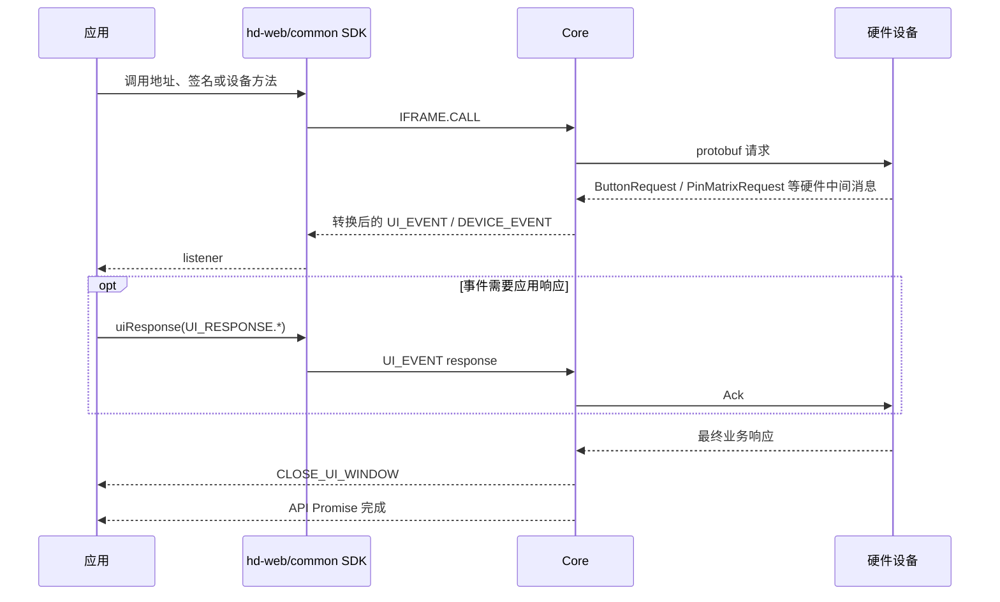

# OneKey `hd-*` SDK 公共事件（SDK → App）

> - 文档状态：当前事件契约
> - 最后代码核验：2026-07-15
> - 适用范围：`@onekeyfe/hd-core`、`hd-web-sdk`、`hd-common-connect-sdk`
> - 事实来源：`packages/core/src/events`、`packages/core/src/core/index.ts` 和 SDK 外层消息转发实现

本文说明 OneKey `hd-*` SDK 对 App 暴露的公共事件：事件由谁生成、哪些事件会暂停调用、应用如何回传结果，以及设备、固件和运行环境通知如何分发。

这些公共事件不都来自硬件。维护事件时必须先区分设备协议中间消息、`hd-*` SDK 公共事件和 `hwk-*` Adapter 公共事件。

新的 `hwk-*` Adapter 使用另一套事件名、类型和等待机制，不能与本文中的常量混用。

## 先按事件来源区分

`hd-*` SDK 对 App 暴露的事件来自五类生成方：

| 来源                      | 代表事件                                              | 是否由硬件直接发出                        | App 主要动作                           |
| ------------------------- | ----------------------------------------------------- | ----------------------------------------- | -------------------------------------- |
| 硬件协议消息转换          | `REQUEST_PIN`、`REQUEST_PASSPHRASE`、`REQUEST_BUTTON` | 原始消息来自硬件；公开 Event 由 Core 转换 | 展示设备交互 UI，必要时 `uiResponse()` |
| Core 业务流程生成         | WebUSB 设备选择、关闭窗口、业务进度、固件提示         | 否                                        | 更新流程 UI，部分请求需要回传          |
| Transport / 系统环境生成  | 蓝牙、定位、WebUSB 权限通知                           | 否                                        | 申请权限、引导用户或重试               |
| 设备与 Transport 生命周期 | `CONNECT`、`DISCONNECT`、`FEATURES`                   | 不是硬件中间 Event                        | 更新设备列表和状态                     |
| SDK 配置与能力计算        | `SUPPORT_FEATURES`、固件 release 元数据               | 否                                        | 更新能力和升级入口                     |

不能只根据常量是否位于 `UI_REQUEST` 中判断它是不是“等待应用响应的事件”。`UI_REQUEST` 还包含设备模式错误标识，部分常量当前也没有实际 emit。

## 消息结构与监听方式

Core 内部消息统一使用：

```ts
type CoreMessage = {
  event: string;
  type: string;
  payload?: unknown;
};
```

外层 SDK 对不同事件组采用不同的分发方式：

| 监听方式                                           | listener 收到的数据             | 说明                     |
| -------------------------------------------------- | ------------------------------- | ------------------------ |
| `HardwareSDK.on(UI_EVENT, listener)`               | 完整 `{ event, type, payload }` | 监听所有 UI 请求和通知   |
| `HardwareSDK.on(UI_REQUEST.REQUEST_PIN, listener)` | 事件的 `payload`                | 只监听一个具体 UI 类型   |
| `HardwareSDK.on(DEVICE.CONNECT, listener)`         | 事件的 `payload`                | 设备事件只按具体类型转发 |
| `HardwareSDK.on(FIRMWARE_EVENT, listener)`         | 完整 `{ event, type, payload }` | 固件元数据按总事件监听   |

```ts
HardwareSDK.on(UI_EVENT, message => {
  console.log(message.type, message.payload);
});

HardwareSDK.on(UI_REQUEST.REQUEST_PIN, payload => {
  console.log(payload.device, payload.type);
});

HardwareSDK.on(DEVICE.CONNECT, ({ device }) => {
  console.log(device.connectId);
});
```

`DEVICE_EVENT` 不会像 `UI_EVENT` 一样作为公共聚合监听被外层 SDK 转发。当前外层只转发 `DEVICE.CONNECT`、`DEVICE.DISCONNECT`、`DEVICE.FEATURES` 和 `DEVICE.SUPPORT_FEATURES`。

## 一次调用的事件生命周期



Core 的设备调用通过请求队列串行执行。PIN、Passphrase 和设备选择请求会创建内部等待项；API Promise 只有在应用响应、设备流程完成或调用被取消后才会继续。

## 必须回传的 UI 请求

| UI 请求                                         | 事件来源      | 主要触发点                                             | Core 等待的响应                                | 结果如何回到设备/流程                                          |
| ----------------------------------------------- | ------------- | ------------------------------------------------------ | ---------------------------------------------- | -------------------------------------------------------------- |
| `REQUEST_PIN`                                   | 硬件消息转换  | `PinMatrixRequest`；部分 ButtonRequest 会先发 PIN 提示 | `RECEIVE_PIN`                                  | 发送 `PinMatrixAck`，或切换为设备端 PIN 输入                   |
| `REQUEST_PASSPHRASE`                            | 硬件消息转换  | `PassphraseRequest`                                    | `RECEIVE_PASSPHRASE`                           | 发送包含软件输入、设备输入或 Attach PIN 选择的 `PassphraseAck` |
| `REQUEST_DEVICE_IN_BOOTLOADER_FOR_WEB_DEVICE`   | Core 流程生成 | 老 WebUSB 升级重启到 bootloader 后                     | `SELECT_DEVICE_IN_BOOTLOADER_FOR_WEB_DEVICE`   | 把重新授权的 `deviceId` 交回旧固件流程                         |
| `REQUEST_DEVICE_FOR_SWITCH_FIRMWARE_WEB_DEVICE` | Core 流程生成 | 老固件切换或重连阶段                                   | `SELECT_DEVICE_FOR_SWITCH_FIRMWARE_WEB_DEVICE` | 把重新选择的 `deviceId` 交回旧固件流程                         |

两个 WebUSB 设备选择请求不是硬件协议消息，Protocol V2 的 `firmwareUpdateV4` 当前也不通过这两个 Event 处理 Pro2 重连。

如果应用不回传，这些等待不会自行进入下一步。旧 Core 的 UI 等待没有显式超时。

### PIN 响应

软件输入：

```ts
HardwareSDK.uiResponse({
  type: UI_RESPONSE.RECEIVE_PIN,
  payload: '1234',
});
```

选择在设备上输入：

```ts
HardwareSDK.uiResponse({
  type: UI_RESPONSE.RECEIVE_PIN,
  payload: '@@ONEKEY_INPUT_PIN_IN_DEVICE',
});
```

`ButtonRequest_PinEntry` 和 `ButtonRequest_AttachPin` 会提前触发同一个 `REQUEST_PIN` UI 提示，但真正的 PIN 等待在设备返回 `PinMatrixRequest` 时建立。应用应把重复事件视为更新同一个 PIN 界面，不要把事件次数理解为独立的响应槽位。

响应应由实际用户操作产生，不要在 `REQUEST_PIN` listener 中同步自动回传，避免响应发生在真正等待项建立之前。

### Passphrase 与 Attach PIN 响应

软件输入 Passphrase：

```ts
HardwareSDK.uiResponse({
  type: UI_RESPONSE.RECEIVE_PASSPHRASE,
  payload: {
    value: 'your passphrase',
    passphraseOnDevice: false,
    save: false,
  },
});
```

在设备上输入 Passphrase：

```ts
HardwareSDK.uiResponse({
  type: UI_RESPONSE.RECEIVE_PASSPHRASE,
  payload: {
    value: '',
    passphraseOnDevice: true,
    save: false,
  },
});
```

选择已有 Attach PIN 钱包：

```ts
HardwareSDK.uiResponse({
  type: UI_RESPONSE.RECEIVE_PASSPHRASE,
  payload: {
    value: '',
    attachPinOnDevice: true,
    save: false,
  },
});
```

`attachPinOnDevice` 只有在设备的 `PassphraseRequest.exists_attach_pin_user` 为真时才会转换成 `PassphraseAck.on_device_attach_pin`。

## 不需要回传的设备交互

本节两个公开 Event 都由硬件 `ButtonRequest` 转换而来。Button code 的事实来源是 protobuf Schema 与 Core 的消息处理分支。

### `REQUEST_BUTTON`

设备返回 `ButtonRequest` 后，Core 会：

1. 发送内部 `DEVICE.BUTTON` 消息，保留设备返回的 Button code。
2. 对普通确认场景向应用发出 `REQUEST_BUTTON`。
3. 自动向设备发送 `ButtonAck`。
4. 等待用户在硬件屏幕上完成确认及设备的最终响应。

应用只需展示“请在设备上确认”，不要调用 `uiResponse()`。

### `REQUEST_PASSPHRASE_ON_DEVICE`

用户选择设备端输入后，设备可能返回 `ButtonRequest_PassphraseEntry`。Core 将其转换为 `REQUEST_PASSPHRASE_ON_DEVICE`，应用只展示设备端输入提示。

### 关闭事件

| 事件                  | 来源          | 触发时机                                   | 应用动作            |
| --------------------- | ------------- | ------------------------------------------ | ------------------- |
| `CLOSE_UI_WINDOW`     | Core 流程生成 | 调用结束、取消、错误退出或下一次调用初始化 | 收起当前硬件交互 UI |
| `CLOSE_UI_PIN_WINDOW` | Core 流程生成 | Passphrase 安全检查完成或批量流程结束      | 只收起 PIN 相关 UI  |

关闭事件是状态通知，不代表一个新的业务失败，也不需要回传。

## 进度和中间结果

| 事件                      | 事件来源                         | 触发点                     | payload 重点                   | 使用方式                                   |
| ------------------------- | -------------------------------- | -------------------------- | ------------------------------ | ------------------------------------------ |
| `DEVICE_PROGRESS`         | SDK 计算                         | 文件写入、批量地址等方法   | `progress`、字节数、速率、耗时 | 展示通用设备任务进度                       |
| `PREVIOUS_ADDRESS_RESULT` | SDK 生成                         | 每次地址结果返回后         | `device`、`address`、`path`    | 增量展示地址；当前 OneKey App 跳过该事件   |
| `FIRMWARE_PROCESSING`     | SDK 固件状态机生成               | 固件升级方法               | 当前处理类型                   | 切换 firmware/ble/bootloader/resource 阶段 |
| `FIRMWARE_PROGRESS`       | SDK 计算；部分由硬件状态消息转换 | 固件传输或安装状态         | `progress`、`progressType`     | 更新传输或安装进度条                       |
| `FIRMWARE_TIP`            | SDK 固件状态机生成               | 下载、重启、确认和安装阶段 | `FirmwareUpdateTipMessage`     | 展示固件升级阶段提示                       |

`FIRMWARE_PROGRESS` 会进行节流，不能依赖每个底层分片都产生一次事件。Protocol V2 安装阶段收到 `DeviceFirmwareUpdateStatus` 时也会发送安装进度。

## 固件事件的两条通道

### 升级过程：`UI_EVENT`

`FIRMWARE_PROCESSING`、`FIRMWARE_PROGRESS` 和 `FIRMWARE_TIP` 属于 SDK 公共 UI 通知，服务于正在执行的固件升级流程。它们不是一组硬件协议事件。Protocol V2 的 `DeviceFirmwareUpdateStatus` 可以被 SDK 转换成 `FIRMWARE_PROGRESS`，但 App 收到的仍是 SDK 公共事件。

### 版本元数据：`FIRMWARE_EVENT`

| 事件                        | 来源                    | 内容                             |
| --------------------------- | ----------------------- | -------------------------------- |
| `FIRMWARE.RELEASE_INFO`     | SDK + 远端 release 配置 | 主固件远端版本、状态和设备信息   |
| `FIRMWARE.BLE_RELEASE_INFO` | SDK + 远端 release 配置 | BLE 固件远端版本、状态和设备信息 |

BaseMethod 在业务方法运行前检查并发送这两类元数据。当前该逻辑只覆盖 Protocol V1；Protocol V2/Pro2 会显式跳过，Pro2 固件升级由 `firmwareUpdateV4` 自己管理 release 配置和安装流程。

```ts
HardwareSDK.on(FIRMWARE_EVENT, message => {
  if (message.type === FIRMWARE.RELEASE_INFO) {
    console.log(message.payload);
  }
});
```

## 设备事件

| 事件                      | 来源                       | 实际触发点                               | payload                                            |
| ------------------------- | -------------------------- | ---------------------------------------- | -------------------------------------------------- |
| `DEVICE.CONNECT`          | Transport / DevicePool     | DevicePool 枚举或初始化出设备            | `{ device }`                                       |
| `DEVICE.DISCONNECT`       | Transport / DevicePool     | USB 拔出、BLE 断开或 DevicePool 移除设备 | `{ device }`                                       |
| `DEVICE.FEATURES`         | 硬件正常响应经 Device 更新 | Device 更新标准 Features                 | `Features`                                         |
| `DEVICE.SUPPORT_FEATURES` | SDK 能力计算               | BaseMethod 运行前计算附加能力            | `{ inputPinOnSoftware, modifyHomescreen, device }` |

`SUPPORT_FEATURES` 不是硬件主动推送。它是 SDK 根据设备型号和 Features 计算出的业务辅助信息。

## 运行环境和授权通知

下面这些事件不是硬件 protobuf 消息，而是 transport、宿主系统或浏览器授权流程产生的通知：

| 事件                                             | 来源                             |
| ------------------------------------------------ | -------------------------------- |
| `BLUETOOTH_PERMISSION`                           | React Native / 系统蓝牙权限      |
| `BLUETOOTH_UNSUPPORTED`                          | 当前运行环境不支持 BLE           |
| `BLUETOOTH_POWERED_OFF`                          | 系统蓝牙关闭                     |
| `BLUETOOTH_CHARACTERISTIC_NOTIFY_CHANGE_FAILURE` | BLE notification 订阅失败        |
| `LOCATION_PERMISSION`                            | Android BLE 扫描定位权限         |
| `LOCATION_SERVICE_PERMISSION`                    | Android 系统定位服务             |
| `WEB_DEVICE_PROMPT_ACCESS_PERMISSION`            | 浏览器需要用户授予 WebUSB 访问权 |

应用应把这一组放在权限、连接引导或环境错误 UI 中，不要当作设备屏幕交互。

## 响应匹配和并发边界

旧 Core 使用全局 `_uiPromises` 保存等待项，匹配键只有 `UI_RESPONSE` 类型：

```text
RECEIVE_PIN -> 当前 PIN 等待
RECEIVE_PASSPHRASE -> 当前 Passphrase 等待
SELECT_DEVICE_* -> 当前对应设备选择等待
```

这带来以下约束：

- 响应中没有 requestId，也不携带 connectId 用于匹配。
- 同一响应类型不能安全地同时服务两个并发交互。
- 正常安全边界依赖 Core 请求队列和设备调用串行化。
- 没有匹配等待项的 `uiResponse()` 会被忽略。
- UI 等待没有独立超时；应用必须确保响应或调用取消路径能够执行。
- 多设备 UI 可以依据请求 payload 展示正确设备，但不能通过响应 payload 指定要解析哪个等待项。

因此，应用层不应自行并行启动两个需要相同 PIN 或 Passphrase 响应的硬件流程。

## `UI_REQUEST` 中并非事件的常量

以下常量主要用于 `allowDeviceMode`、`requireDeviceMode` 和错误信息，不会作为普通 UI 事件发送：

- `BOOTLOADER`
- `NOT_IN_BOOTLOADER`
- `NOT_INITIALIZE`
- `SEEDLESS`

`REQUIRE_MODE`、`FIRMWARE_OLD`、`FIRMWARE_NOT_SUPPORTED`、`FIRMWARE_NOT_COMPATIBLE`、`FIRMWARE_NOT_INSTALLED`、`NOT_USE_ONEKEY_DEVICE` 和 `INVALID_PIN` 当前也没有找到实际 emit 入口。接入方不应仅因为它们存在于导出常量中就注册业务 UI。

## 实际事件矩阵

| 来源                     | 当前实际对外事件                                                                                         |
| ------------------------ | -------------------------------------------------------------------------------------------------------- |
| 硬件消息转换             | `REQUEST_PIN`、`REQUEST_PASSPHRASE`、`REQUEST_BUTTON`、`REQUEST_PASSPHRASE_ON_DEVICE`                    |
| Core Host 交互流程       | 两个旧 WebUSB 设备选择请求、`CLOSE_UI_WINDOW`、`CLOSE_UI_PIN_WINDOW`                                     |
| SDK 业务状态             | `DEVICE_PROGRESS`、`PREVIOUS_ADDRESS_RESULT`、`FIRMWARE_PROCESSING`、`FIRMWARE_PROGRESS`、`FIRMWARE_TIP` |
| Transport / 系统环境     | 蓝牙、定位、BLE notify 和 WebUSB prompt 相关事件                                                         |
| Transport / 设备生命周期 | `CONNECT`、`DISCONNECT`、`FEATURES`                                                                      |
| SDK 能力与配置计算       | `SUPPORT_FEATURES`、`RELEASE_INFO`、`BLE_RELEASE_INFO`                                                   |

## 接入检查清单

1. 同时实现 PIN、Passphrase 和 WebUSB 设备选择的 `uiResponse()`。
2. Button 和设备端 Passphrase 只展示提示，不发送响应。
3. 用 `CLOSE_UI_WINDOW` 和 `CLOSE_UI_PIN_WINDOW` 做幂等关闭，避免反向触发新的 SDK cancel。
4. 不并行启动两个需要同类型 UI 响应的调用。
5. 固件升级同时监听过程事件，不只等待 API 最终返回。
6. 将环境权限事件与设备 protobuf 交互分开处理。
7. 不把 `UI_REQUEST` 中的设备模式常量误当作实际事件。

## 设备协议中间消息

设备可能在最终响应前返回需要 SDK 消费或确认的中间消息。它们不是 App 直接监听的公共事件。

| 中间消息                          | Core 行为                                | 可能产生的公共事件             |
| --------------------------------- | ---------------------------------------- | ------------------------------ |
| `ButtonRequest`                   | 根据 code 发送 Ack 或等待用户操作        | `REQUEST_BUTTON`、设备交互提示 |
| `PinMatrixRequest`                | 创建 PIN 请求并等待 App 回传             | PIN 类 `UI_REQUEST`            |
| `PassphraseRequest`               | 选择设备输入、App 输入或 Attach PIN 路径 | Passphrase 类 `UI_REQUEST`     |
| `DeviceFirmwareUpdateStatus`      | 更新升级阶段和进度                       | 固件升级进度事件               |
| `EntropyRequest` 等未完整支持消息 | 显式返回不支持或进入受控兼容分支         | 不应伪装为已支持事件           |

设备消息的枚举和值以 protobuf 为准，转换行为以 Core handler 为准；只有通过 `HardwareSDK.on()` 暴露的结果才属于 `hd-*` 公共事件。

## `hwk-*` Adapter 事件边界

多厂商 Adapter 的事件契约独立于 `hd-*`：

- 设备事件：连接、断开和状态变化。
- `UI_REQUEST`：等待 App 回传的类型化请求。
- `ui-event`：不需要回传的交互阶段通知。
- SDK 状态事件：初始化、权限或 Connector 状态。

Adapter 在 emit 等待型请求前必须先注册 `UiRequestRegistry`，按请求类型匹配响应，并在超时、取消、任务结束和设备断开时清理。Job Queue 负责业务任务串行化，不能用事件等待机制代替任务队列。

## 主要实现来源

- `packages/core/src/events/` 与各 Core method 的消息处理逻辑
- `packages/hd-common-connect-sdk/` 的公共事件转发
- `packages/hwk-*` 中的 Adapter 事件类型、`UiRequestRegistry` 和 Job Queue
