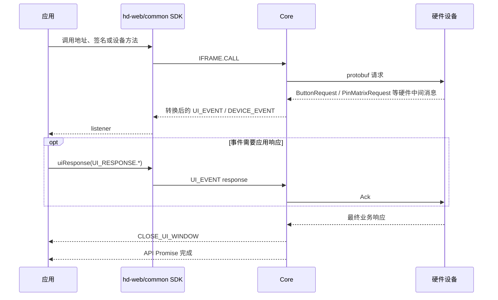
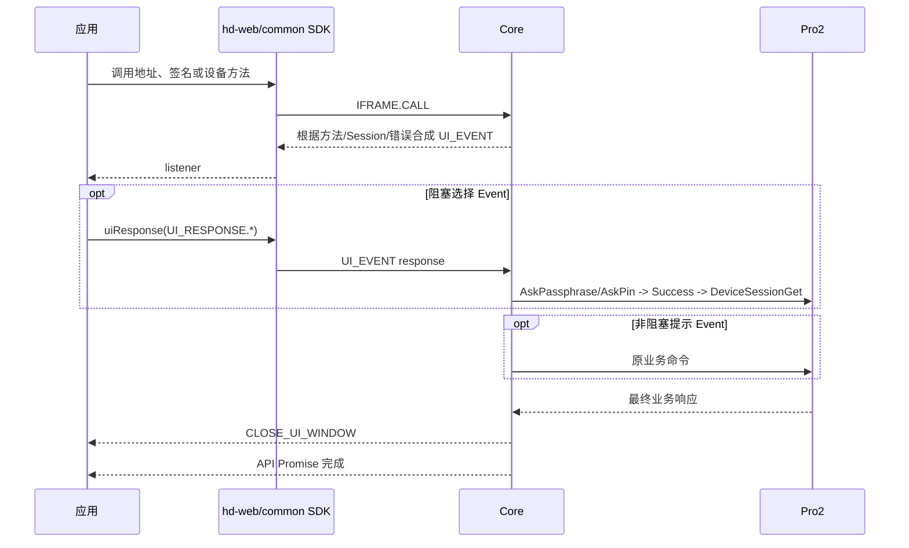

# OneKey `hd-*` SDK 公共事件（SDK → App）

> - 文档状态：Protocol V1 当前契约 + Protocol V2 通用事件边界
> - 最后代码核验：2026-08-03
> - 适用范围：`@onekeyfe/hd-core`、`hd-web-sdk`、`hd-common-connect-sdk`
> - 事实来源：`packages/core/src/events`、`packages/core/src/core/index.ts` 和 SDK 外层消息转发实现

本文说明 OneKey `hd-*` SDK 对 App 暴露的公共事件：事件由谁生成、哪些事件会暂停调用、应用如何回传结果，以及设备、固件和运行环境通知如何分发。

Protocol V2/Pro2 的“无 Event”表示 firmware 不再发送需要 Host ACK 的 UI 中间消息。
SDK 继续通过 Passphrase Event 收集一次钱包访问意图，再主动发送
`DeviceSessionAskPin/DeviceSessionAskPassphrase/DeviceSessionGet`；当前钱包流程以
[SDK Core 运行时](./core-runtime.md#钱包-session) 为准。

这些公共事件不都来自硬件。维护事件时必须先区分设备协议中间消息、`hd-*` SDK 公共事件和 `hwk-*` Adapter 公共事件。

新的 `hwk-*` Adapter 使用另一套事件名、类型和等待机制，不能与本文中的常量混用。

## 先按事件来源区分

`hd-*` SDK 对 App 暴露的事件来自六类生成方：

| 来源                      | 代表事件                                              | 是否由硬件直接发出                        | App 主要动作                           |
| ------------------------- | ----------------------------------------------------- | ----------------------------------------- | -------------------------------------- |
| V1 硬件协议消息转换       | `REQUEST_PIN`、`REQUEST_PASSPHRASE`、`REQUEST_BUTTON` | 原始消息来自硬件；公开 Event 由 Core 转换 | 展示设备交互 UI，必要时 `uiResponse()` |
| V2 Core/协调器合成        | 同一组 `REQUEST_*`                                    | 否；根据参数、Session 状态或错误生成      | 复用同一 UI，按 Event 类型决定是否响应 |
| Core 业务流程生成         | WebUSB 设备选择、关闭窗口、业务进度、固件提示         | 否                                        | 更新流程 UI，部分请求需要回传          |
| Transport / 系统环境生成  | 蓝牙、定位、WebUSB 权限通知                           | 否                                        | 申请权限、引导用户或重试               |
| 设备与 Transport 生命周期 | `CONNECT`、`DISCONNECT`、`FEATURES`                   | 不是硬件中间 Event                        | 更新设备列表和状态                     |
| SDK 配置与能力计算        | `SUPPORT_FEATURES`、固件 release 元数据               | 否                                        | 更新能力和升级入口                     |

不能只根据常量是否位于 `UI_REQUEST` 中判断它是不是“等待应用响应的事件”。`UI_REQUEST` 还包含设备模式错误标识，部分常量当前也没有实际 emit。

## 消息结构与监听方式

Core 内部消息统一使用：

```ts
type CoreMessage = {
  event: string;
  type: string;
  payload?: unknown;
};
```

外层 SDK 对不同事件组采用不同的分发方式：

| 监听方式                                           | listener 收到的数据             | 说明                     |
| -------------------------------------------------- | ------------------------------- | ------------------------ |
| `HardwareSDK.on(UI_EVENT, listener)`               | 完整 `{ event, type, payload }` | 监听所有 UI 请求和通知   |
| `HardwareSDK.on(UI_REQUEST.REQUEST_PIN, listener)` | 事件的 `payload`                | 只监听一个具体 UI 类型   |
| `HardwareSDK.on(DEVICE.CONNECT, listener)`         | 事件的 `payload`                | 设备事件只按具体类型转发 |
| `HardwareSDK.on(FIRMWARE_EVENT, listener)`         | 完整 `{ event, type, payload }` | 固件元数据按总事件监听   |

```ts
HardwareSDK.on(UI_EVENT, message => {
  console.log(message.type, message.payload);
});

HardwareSDK.on(UI_REQUEST.REQUEST_PIN, payload => {
  console.log(payload.device, payload.type);
});

HardwareSDK.on(DEVICE.CONNECT, ({ device }) => {
  console.log(device.connectId);
});
```

所有 transport（包括 React Native BLE 和 `lowlevel`）都会把
`DEVICE.CONNECT` / `DEVICE.DISCONNECT` 中的 `device` 统一为可序列化的
`KnownDevice` 快照。它不是 SDK 内部的实时 `Device` 实例，业务层不应调用
`run`、`acquire`、`release`、`commands` 或依赖 `instanceof Device`。需要跟踪连接后的状态变化时，
应监听 `DEVICE.STATE`；Protocol V1 兼容业务也可以继续监听 `DEVICE.FEATURES`。

快照中的 `connectId` 用于后续 SDK 调用和 transport 路由，`serialNo` 用于识别物理设备；
`uuid` 仅作为 `serialNo` 的废弃兼容别名保留。`status` 表示当前 transport 使用状态：
`available` 为已发现且空闲，`used` 为当前 SDK 会话正在使用，`occupied` 为被其他会话占用。
调用方不应保存事件对象并期待其字段原地更新。

`DEVICE_EVENT` 不会像 `UI_EVENT` 一样作为公共聚合监听被外层 SDK 转发。当前外层转发 `DEVICE.CONNECT`、`DEVICE.DISCONNECT`、`DEVICE.STATE`、Protocol V1 的 `DEVICE.FEATURES` 和 `DEVICE.SUPPORT_FEATURES`。

## 一次调用的事件生命周期

### Protocol V1 当前流程



Core 的设备调用通过请求队列串行执行。V1 PIN、V1/V2 Passphrase 和设备选择请求会创建内部等待项；
API Promise 只有在应用响应、设备流程完成或调用被取消后才会继续。

### Protocol V2 / Pro2 目标流程



V2 不伪造硬件 `ButtonRequest/PinMatrixRequest/PassphraseRequest`。阻塞 Event 的 `uiResponse()` 被转换
为明确业务命令；非阻塞 Event 只提示 App，不建立响应等待项。

这里的“转换”不是把协议消息换名：

- V1 `PassphraseAck` 是对 firmware 中间请求的回复。
- V2 的设备 Passphrase 使用 `DeviceSessionAskPassphrase`，Attach PIN 使用
  `DeviceSessionAskPin(AttachToPin)`；两者返回 `Success`，随后用 Get 读取 Session。
- V2 恢复使用 `DeviceSessionGet({ session_id })`；它没有对应的 `PassphraseAck` 语义。
- 标准钱包首次或状态错配时调用 `DeviceSessionAskPin(Main)`，随后调用空参数 Get。
- `ButtonRequest/ButtonAck` 在 V2 被删除，不能解释成任一新 Session 请求的旧名称。

## 必须回传的 UI 请求

| UI 请求                                         | 协议/来源                   | 主要触发点                         | Core 等待的响应                                | 结果如何回到设备/流程                                       |
| ----------------------------------------------- | --------------------------- | ---------------------------------- | ---------------------------------------------- | ----------------------------------------------------------- |
| `REQUEST_PIN`                                   | V1 硬件消息转换             | `PinMatrixRequest`                 | `RECEIVE_PIN`                                  | `PinMatrixAck` 或切换设备输入                               |
| `REQUEST_PASSPHRASE`                            | V1 硬件消息转换             | `PassphraseRequest`                | `RECEIVE_PASSPHRASE`                           | `PassphraseAck`                                             |
| `REQUEST_PASSPHRASE`                            | V2 WalletSessionCoordinator | 隐藏钱包首次选择或状态错配恢复     | `RECEIVE_PASSPHRASE`                           | 选择 Host Passphrase 或 Attach PIN；Ask 后由 Get 取 Session |
| `REQUEST_DEVICE_IN_BOOTLOADER_FOR_WEB_DEVICE`   | Core 流程生成               | 老 WebUSB 升级重启到 bootloader 后 | `SELECT_DEVICE_IN_BOOTLOADER_FOR_WEB_DEVICE`   | 把重新授权的 `deviceId` 交回旧固件流程                      |
| `REQUEST_DEVICE_FOR_SWITCH_FIRMWARE_WEB_DEVICE` | Core 流程生成               | 老固件切换或重连阶段               | `SELECT_DEVICE_FOR_SWITCH_FIRMWARE_WEB_DEVICE` | 把重新选择的 `deviceId` 交回旧固件流程                      |

两个 WebUSB 设备选择请求不是硬件协议消息，Protocol V2 的 `firmwareUpdateV4` 当前也不通过这两个 Event 处理 Pro2 重连。

如果应用不回传，这些阻塞等待不会自行进入下一步。旧 Core 的 UI 等待没有显式超时；V2 合成阻塞
Event 必须在取消、超时、断连和方法结束时清理。

### PIN 响应

以下 `RECEIVE_PIN` 只适用于 Protocol V1。Protocol V2/Pro2 的 `REQUEST_PIN` 是 SDK 在发送
`DeviceSessionAskPin` 前合成的非阻塞设备操作提示，不接受 PIN 响应。`Main` 映射为
`ButtonRequest_PinEntry`，`AttachToPin` 映射为 `ButtonRequest_AttachPin`。

锁定重试提示由统一交互协调器生成，payload 包含 `source='unlock-coordinator'`、
`reason='device-locked'`、`deviceOnly=true` 和触发方法名；钱包选择提示由钱包 Session 协调器生成。
设备解锁后 SDK 在原调用内最多重试一次，App 不重发业务请求。
`protocolV2UiMode='none'` 只抑制普通方法交互提示；如果实际发送了 `DeviceSessionAskPin`，
SDK 仍必须生成该 PIN 提示。

软件输入：

```ts
HardwareSDK.uiResponse({
  type: UI_RESPONSE.RECEIVE_PIN,
  payload: '1234',
  ...requestPayload.responseCorrelation,
});
```

选择在设备上输入：

```ts
HardwareSDK.uiResponse({
  type: UI_RESPONSE.RECEIVE_PIN,
  payload: '@@ONEKEY_INPUT_PIN_IN_DEVICE',
  ...requestPayload.responseCorrelation,
});
```

V1 的 `ButtonRequest_PinEntry` 和 `ButtonRequest_AttachPin` 会提前触发同一个 `REQUEST_PIN` UI 提示，
但真正的 PIN 等待在设备返回 `PinMatrixRequest` 时建立。应用应把重复事件视为更新同一个 PIN
界面，不要把事件次数理解为独立的响应槽位。

响应应由实际用户操作产生，不要在 `REQUEST_PIN` listener 中同步自动回传，避免响应发生在真正等待项建立之前。

### Passphrase 与 Attach PIN 响应

软件输入 Passphrase：

```ts
HardwareSDK.uiResponse({
  type: UI_RESPONSE.RECEIVE_PASSPHRASE,
  payload: {
    value: 'your passphrase',
    passphraseOnDevice: false,
    save: false,
  },
  ...requestPayload.responseCorrelation,
});
```

在设备上输入 Passphrase：

```ts
HardwareSDK.uiResponse({
  type: UI_RESPONSE.RECEIVE_PASSPHRASE,
  payload: {
    value: '',
    passphraseOnDevice: true,
    save: false,
  },
  ...requestPayload.responseCorrelation,
});
```

选择已有 Attach PIN 钱包：

```ts
HardwareSDK.uiResponse({
  type: UI_RESPONSE.RECEIVE_PASSPHRASE,
  payload: {
    value: '',
    attachPinOnDevice: true,
    save: false,
  },
  ...requestPayload.responseCorrelation,
});
```

V1 中，`attachPinOnDevice` 只有在设备的 `PassphraseRequest.exists_attach_pin_user` 为真时才会转换成
`PassphraseAck.on_device_attach_pin`。

V2 中，SDK 根据 `DeviceStatus.attach_to_pin_enabled` 生成 `existsAttachPinUser`。
首次选择使用 `reason='open-wallet'`；业务调用缺少本地 Session、需要用户重新确认原钱包时使用
`reason='session-recovery'` 并携带 `expectedPassphraseState`，最终响应仍必须与该钱包标识一致。
非空软件值映射为
`DeviceSessionAskPassphrase({ passphrase, on_device: false })`；`passphraseOnDevice` 映射为
`DeviceSessionAskPassphrase({ on_device: true })`。两种请求必须互斥，不能同时携带 Host
Passphrase 与 `on_device: true`。
Host 值在发送前执行 NFKD 规范化，并且规范化后必须为 1–50 个合法 UTF-8 字节、不得包含
NUL 或孤立 UTF-16 surrogate；长度不能用 JavaScript `string.length` 代替。
`REQUEST_PASSPHRASE`、`REQUEST_PASSPHRASE_ON_DEVICE` 以及对应 UI 响应都属于日志阻断事件，
不得把明文输入、`passphraseState` 或 `expectedPassphraseState` 写入 SDK/Bridge 日志。
`attachPinOnDevice` 映射为 `DeviceSessionAskPin(AttachToPin)`；Ask 成功后使用空参数
`DeviceSessionGet` 读取当前实际 Session。

## 不需要回传的设备交互

V1 的这些 Event 由硬件 `ButtonRequest` 转换；V2 目标中由 SDK 根据方法生命周期和设备状态合成。

### `REQUEST_BUTTON`

V1 设备返回 `ButtonRequest` 后，Core 会：

1. 发送内部 `DEVICE.BUTTON` 消息，保留设备返回的 Button code。
2. 对普通确认场景向应用发出 `REQUEST_BUTTON`。
3. 自动向设备发送 `ButtonAck`。
4. 等待用户在硬件屏幕上完成确认及设备的最终响应。

V2 中，地址/公钥、签名和设备管理方法在进入设备交互前直接 emit `REQUEST_BUTTON`，不发送
`ButtonAck`。应用在两个协议版本下都只需展示“请在设备上确认”，不要调用 `uiResponse()`。

Pro2 设置页 Event 还会携带 `source='method-lifecycle'`、`reason`、`completion` 和 `page`。

`firmwareUpdateV4` 在 `DeviceFirmwareUpdateStage` 成功后、发送
`DeviceFirmwareUpdateRequest` 前发出同类非阻塞 `REQUEST_BUTTON`，其中
`reason='firmware-update'`、`completion='operation-completed'`。App 只展示设备确认提示，不调用
`uiResponse()`；安装进度继续通过 `FIRMWARE_TIP` 与 `FIRMWARE_PROGRESS` 通知。
`completion='page-accepted'` 表示 API 成功只证明设备页面已打开，不代表用户已经完成或确认设置。

`uploadPortfolio` is not a device-confirmation flow. Its default `uiMode='silent'` emits no
`REQUEST_BUTTON`, `REQUEST_PIN`, `DEVICE_PROGRESS`, or Protocol V2 UI lifecycle event. With
`uiMode='progress'`, it emits `DEVICE_PROGRESS` during file staging and `CLOSE_UI_WINDOW` when the
operation ends, but still emits no confirmation or unlock request. Only the final `PortfolioUpdate`
response determines success or failure.

### `REQUEST_PASSPHRASE_ON_DEVICE`

V1 用户选择设备端输入后，设备可能返回 `ButtonRequest_PassphraseEntry`，Core 将其转换为
`REQUEST_PASSPHRASE_ON_DEVICE`。V2 在 `DeviceSessionAskPassphrase` 发出前由 SDK 合成同名阶段提示。两者都只
用于更新设备输入 UI，不要求响应。

### 关闭事件

| 事件                  | 来源          | 触发时机                                   | 应用动作            |
| --------------------- | ------------- | ------------------------------------------ | ------------------- |
| `CLOSE_UI_WINDOW`     | Core 流程生成 | 调用结束、取消、错误退出或下一次调用初始化 | 收起当前硬件交互 UI |
| `CLOSE_UI_PIN_WINDOW` | Core 流程生成 | Passphrase 安全检查完成或批量流程结束      | 只收起 PIN 相关 UI  |

关闭事件是状态通知，不代表一个新的业务失败，也不需要回传。App 收到关闭通知时只幂等收起 UI，
不能反向触发第二次 Cancel；只有用户主动关闭/取消交互时才取消当前 SDK 调用。
用户取消 `firmwareUpdateV4` 的设备确认提示时，Core 先在当前 Protocol V2 link 上发送仅写 `Cancel`
流控帧，再中断并释放原调用；该帧不排在等待设备确认的业务响应之后。

## 进度和中间结果

| 事件                      | 事件来源                         | 触发点                     | payload 重点                   | 使用方式                                   |
| ------------------------- | -------------------------------- | -------------------------- | ------------------------------ | ------------------------------------------ |
| `DEVICE_PROGRESS`         | SDK 计算                         | 文件写入、批量地址等方法   | `progress`、字节数、速率、耗时 | 展示通用设备任务进度                       |
| `PREVIOUS_ADDRESS_RESULT` | SDK 生成                         | 每次地址结果返回后         | `device`、`address`、`path`    | 增量展示地址；当前 OneKey App 跳过该事件   |
| `FIRMWARE_PROCESSING`     | SDK 固件状态机生成               | 固件升级方法               | 当前处理类型                   | 切换 firmware/ble/bootloader/resource 阶段 |
| `FIRMWARE_PROGRESS`       | SDK 计算；部分由硬件状态消息转换 | 固件传输或安装状态         | `progress`、阶段及可选传输指标 | 更新传输或安装进度条                       |
| `FIRMWARE_TIP`            | SDK 固件状态机生成               | 下载、重启、确认和安装阶段 | `FirmwareUpdateTipMessage`     | 展示固件升级阶段提示                       |

`FIRMWARE_PROGRESS` 会进行节流，不能依赖每个底层分片都产生一次事件。During Protocol V2
installation, SDK maps `DeviceFirmwareUpdateStatus.records[].progress_percent` to the overall
`progress`. It also exposes `installTargetId`, normalized `installPhase` (`prepare`, `install`, or
`verify`), and `installPhaseProgress` from the active record's `phase_info`.
Protocol V2 文件传输阶段还会附带 `transferredBytes`、`totalBytes`、`rateBytesPerSecond` 和
`elapsedMs`；这些字段在安装阶段及旧协议流程中可能缺省。

## 固件事件的两条通道

### 升级过程：`UI_EVENT`

`FIRMWARE_PROCESSING`、`FIRMWARE_PROGRESS` 和 `FIRMWARE_TIP` 属于 SDK 公共 UI 通知，服务于正在执行的固件升级流程。它们不是一组硬件协议事件。Protocol V2 的 `DeviceFirmwareUpdateStatus` 可以被 SDK 转换成 `FIRMWARE_PROGRESS`，但 App 收到的仍是 SDK 公共事件。

### 版本元数据：`FIRMWARE_EVENT`

| 事件                        | 来源                    | 内容                             |
| --------------------------- | ----------------------- | -------------------------------- |
| `FIRMWARE.RELEASE_INFO`     | SDK + 远端 release 配置 | 主固件远端版本、状态和设备信息   |
| `FIRMWARE.BLE_RELEASE_INFO` | SDK + 远端 release 配置 | BLE 固件远端版本、状态和设备信息 |

BaseMethod 在业务方法运行前检查并发送这两类元数据。当前该逻辑只覆盖 Protocol V1；Protocol V2/Pro2 会显式跳过，Pro2 固件升级由 `firmwareUpdateV4` 自己管理 release 配置和安装流程。

```ts
HardwareSDK.on(FIRMWARE_EVENT, message => {
  if (message.type === FIRMWARE.RELEASE_INFO) {
    console.log(message.payload);
  }
});
```

## 设备事件

| 事件                      | 来源                       | 实际触发点                               | payload                                            |
| ------------------------- | -------------------------- | ---------------------------------------- | -------------------------------------------------- |
| `DEVICE.CONNECT`          | Transport / DevicePool     | DevicePool 枚举或初始化出设备            | `{ device: KnownDevice }` 快照                     |
| `DEVICE.DISCONNECT`       | Transport / DevicePool     | USB 拔出、BLE 断开或 DevicePool 移除设备 | `{ device: KnownDevice }` 快照                     |
| `DEVICE.STATE`            | 设备响应或已确认设置 patch | DeviceState 实际发生变化                 | `DeviceStateEvent`                                 |
| `DEVICE.FEATURES`         | Protocol V1 兼容投影       | V1 DeviceState 实际发生变化              | `Features`                                         |
| `DEVICE.SUPPORT_FEATURES` | SDK 能力计算               | BaseMethod 运行前计算附加能力            | `{ inputPinOnSoftware, modifyHomescreen, device }` |

`SUPPORT_FEATURES` 不是硬件主动推送。它是 SDK 根据设备型号和 Features 计算出的业务辅助信息。

`DEVICE.STATE` 是 V1/V2 的统一状态变更通知。它可能来自设备读取、Protocol V1 设置成功后的
confirmed patch 或解锁结果；相同 patch 不会重复发送。Protocol V2 设置成功后会强制读回
`status` 与 `settings`，只发布设备返回的状态。新接入只消费完整 `DeviceState`，无需识别底层协议。

For settings calls, Core updates `DeviceState` and emits `DEVICE.STATE` synchronously before the
API Promise completes. Protocol V2 APIs normally wait for the post-write `status + settings`
read-back and fail if that read-back fails, even when the device may already have accepted the
mutation. Wallpaper upload is the exception: once `DeviceSettingsSet` applies the uploaded file,
its cache refresh is best-effort so a transient read failure cannot trigger another large upload.
Apps that persist listener events asynchronously must drain that persistence before reading local
state. They must not read stale `Features` immediately after the Promise resolves or overwrite
device state optimistically from request parameters.

Pro2 的 `status.passphraseProtection` 只在设备已解锁、私有 Status 可验证时具有权威值。关闭
passphrase 后设备可能主动锁定，此时后续锁定快照允许该字段为 `undefined`；App 应保留最近一次已确认值，
并在解锁后通过 `getDeviceState({ scope: 'settings' })` 刷新，而不是把锁定快照解释为 `false`。

`DEVICE.FEATURES` 仅用于 Protocol V1 兼容。Protocol V2 不发送该事件，也不支持 `getFeatures()`。

## 运行环境和授权通知

下面这些事件不是硬件 protobuf 消息，而是 transport、宿主系统或浏览器授权流程产生的通知：

| 事件                                             | 来源                             |
| ------------------------------------------------ | -------------------------------- |
| `BLUETOOTH_PERMISSION`                           | React Native / 系统蓝牙权限      |
| `BLUETOOTH_UNSUPPORTED`                          | 当前运行环境不支持 BLE           |
| `BLUETOOTH_POWERED_OFF`                          | 系统蓝牙关闭                     |
| `BLUETOOTH_CHARACTERISTIC_NOTIFY_CHANGE_FAILURE` | BLE notification 订阅失败        |
| `LOCATION_PERMISSION`                            | Android BLE 扫描定位权限         |
| `LOCATION_SERVICE_PERMISSION`                    | Android 系统定位服务             |
| `WEB_DEVICE_PROMPT_ACCESS_PERMISSION`            | 浏览器需要用户授予 WebUSB 访问权 |

应用应把这一组放在权限、连接引导或环境错误 UI 中，不要当作设备屏幕交互。

## 响应匹配和并发边界

当前 Core 使用全局 `_uiPromises` 保存等待项。PIN 和 Passphrase 请求的 payload 会携带
`responseCorrelation = { interactionId, deviceId }`，应用必须把这两个字段原样放回
`uiResponse()`；Core 使用以下匹配键：

```text
RECEIVE_PIN + interactionId + deviceId -> 对应 V1 PIN 等待
RECEIVE_PASSPHRASE + interactionId + deviceId -> 对应 Passphrase 等待
SELECT_DEVICE_* -> 当前对应设备选择等待
```

兼容和安全边界如下：

- 新接入必须原样回传 correlation；不完整或不匹配的 correlation 会被忽略。
- 旧接入不带 correlation 时，只在同类型敏感等待项唯一的情况下兼容；存在多个候选时拒绝猜测。
- `interactionId` 是每个阻塞 UI Promise 的唯一标识，不等同于 V2 页面状态机中跨多个阶段的
  `interaction.interactionId`。
- `deviceId` 优先使用公开的钱包生命周期 ID；设备状态尚未提供该 ID 时，Core 使用当前 SDK Device
  instance ID 作为本次 correlation 的回传值，应用不得自行替换。
- 没有匹配等待项的 `uiResponse()` 会被忽略。
- 旧 UI 等待没有独立超时；应用必须确保响应或调用取消路径能够执行。
- 多设备并发的同类型敏感响应只能解析相同 correlation 的等待项。
- 取消、超时、断连和方法结束必须删除等待项；迟到响应不能解析下一个调用。

应用仍应避免无业务必要的并发交互，但正确回传 correlation 后，并发本身不会再导致 PIN 或
Passphrase 命中另一台设备的等待项。

## `UI_REQUEST` 中并非事件的常量

以下常量主要用于 `allowDeviceMode`、`requireDeviceMode` 和错误信息，不会作为普通 UI 事件发送：

- `BOOTLOADER`
- `NOT_IN_BOOTLOADER`
- `NOT_INITIALIZE`
- `SEEDLESS`

`REQUIRE_MODE`、`FIRMWARE_OLD`、`FIRMWARE_NOT_SUPPORTED`、`FIRMWARE_NOT_COMPATIBLE`、`FIRMWARE_NOT_INSTALLED`、`NOT_USE_ONEKEY_DEVICE` 和 `INVALID_PIN` 当前也没有找到实际 emit 入口。接入方不应仅因为它们存在于导出常量中就注册业务 UI。

## 事件矩阵

| 来源                       | 当前/目标对外事件                                                                                        |
| -------------------------- | -------------------------------------------------------------------------------------------------------- |
| V1 硬件消息转换（当前）    | `REQUEST_PIN`、`REQUEST_PASSPHRASE`、`REQUEST_BUTTON`、`REQUEST_PASSPHRASE_ON_DEVICE`                    |
| V2 Core/协调器合成（目标） | 同一组 `REQUEST_*`；根据来源分为阻塞选择和非阻塞提示                                                     |
| Core Host 交互流程         | 两个旧 WebUSB 设备选择请求、`CLOSE_UI_WINDOW`、`CLOSE_UI_PIN_WINDOW`                                     |
| SDK 业务状态               | `DEVICE_PROGRESS`、`PREVIOUS_ADDRESS_RESULT`、`FIRMWARE_PROCESSING`、`FIRMWARE_PROGRESS`、`FIRMWARE_TIP` |
| Transport / 系统环境       | 蓝牙、定位、BLE notify 和 WebUSB prompt 相关事件                                                         |
| Transport / 设备生命周期   | `CONNECT`、`DISCONNECT`、`FEATURES`                                                                      |
| SDK 能力与配置计算         | `SUPPORT_FEATURES`、`RELEASE_INFO`、`BLE_RELEASE_INFO`                                                   |

## 接入检查清单

1. V1 实现 PIN、Passphrase 和 WebUSB 设备选择的 `uiResponse()`。
2. V2 只为阻塞钱包选择回传 Passphrase 选择；`REQUEST_PIN/REQUEST_BUTTON` 不响应。
3. 根据 Event `source/reason` 区分 V1 硬件转换与 V2 SDK 合成来源；Pro2 的
   `REQUEST_PASSPHRASE` 可回传软件输入值、设备输入或 Attach PIN 三种选择。
4. Button 和设备端 Passphrase 阶段提示只展示，不发送响应。
5. 用户主动关闭交互 UI 时取消当前调用；收到 `CLOSE_UI_WINDOW/CLOSE_UI_PIN_WINDOW` 时只幂等关闭。
6. 不并行启动两个需要同类型 UI 响应的调用。
7. 固件升级同时监听过程事件，不只等待 API 最终返回。
8. 将环境权限事件与设备 protobuf 交互分开处理。
9. 不把 `UI_REQUEST` 中的设备模式常量误当作实际事件。

## 设备协议中间消息

V1 设备可能在最终响应前返回需要 SDK 消费或确认的中间消息。V2/Pro2 不再允许 UI 类中间消息，但仍保留
业务数据和状态消息。它们都不是 App 直接监听的公共事件。

| 中间消息                     | V1 Core 行为                      | V2/Pro2 行为                             | 可能产生的公共事件             |
| ---------------------------- | --------------------------------- | ---------------------------------------- | ------------------------------ |
| `ButtonRequest`              | 根据 code 发送 Ack 或等待用户操作 | 协议回归错误；Event 应由 SDK 合成        | `REQUEST_BUTTON`、设备交互提示 |
| `PinMatrixRequest`           | 创建 PIN 请求并等待 App 回传      | 协议回归错误；使用 `DeviceSessionAskPin` | PIN 类 `UI_REQUEST`            |
| `PassphraseRequest`          | 选择 App/设备/Attach PIN 路径     | 协议回归错误；使用拆分后的 Session 请求  | Passphrase 类 `UI_REQUEST`     |
| 签名数据 Request/Ack         | SDK 继续提供业务数据              | 保留并继续响应                           | 通常不产生通用 UI Event        |
| `DeviceFirmwareUpdateStatus` | 更新升级阶段和进度                | 保留                                     | 固件升级进度事件               |
| `WordRequest/EntropyRequest` | 按旧协议能力受控处理              | 禁止，不合成兼容 Event                   | 不应伪装为已支持事件           |

设备消息的枚举和值以 protobuf 为准，转换行为以 Core handler/协调器为准；只有通过
`HardwareSDK.on()` 暴露的结果才属于 `hd-*` 公共事件。公共 Event 名称相同不代表来源或后续动作
相同，接入方应以协议版本和 Event payload 为准。

## `hwk-*` Adapter 事件边界

多厂商 Adapter 的事件契约独立于 `hd-*`：

- 设备事件：连接、断开和状态变化。
- `UI_REQUEST`：等待 App 回传的类型化请求。
- `ui-event`：不需要回传的交互阶段通知。
- SDK 状态事件：初始化、权限或 Connector 状态。

Adapter 在 emit 等待型请求前必须先注册 `UiRequestRegistry`，按请求类型匹配响应，并在超时、取消、任务结束和设备断开时清理。Job Queue 负责业务任务串行化，不能用事件等待机制代替任务队列。

## 主要实现来源

- `packages/core/src/events/` 与各 Core method 的消息处理逻辑
- `packages/hd-common-connect-sdk/` 的公共事件转发
- `packages/hwk-*` 中的 Adapter 事件类型、`UiRequestRegistry` 和 Job Queue
