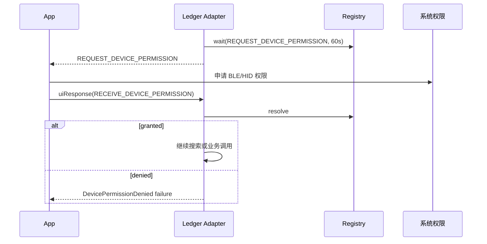

# `hwk-*` Adapter 公共事件（Adapter → App）

> - 文档状态：当前 Adapter 事件契约
> - 最后代码核验：2026-07-15
> - 适用范围：`@onekeyfe/hwk-adapter-core` 与当前 `@onekeyfe/hwk-ledger-adapter`
> - 事实来源：Adapter 公共类型、`UiRequestRegistry` 和 Ledger Adapter 实现

`hwk-*` 是面向多厂商硬件钱包的新 Adapter 公共事件契约。它使用类型化的具体事件名、统一的 `{ type, payload }` 事件对象，以及带超时和取消能力的 UI 请求注册表。

这些事件由 Adapter 或厂商 Connector 归一化后交给 App，不等同于设备直接返回的 protobuf/APDU 消息。三层事件边界见 [SDK 事件文档](./README.md)。

它与 [OneKey `hd-*` SDK 公共事件](./events.md) 是两套独立契约：

| 维度          | `hd-*`                                           | `hwk-*`                               |
| ------------- | ------------------------------------------------ | ------------------------------------- |
| 事件名示例    | `ui-request_pin`                                 | `ui-request-pin`                      |
| 监听方式      | UI 聚合事件和具体事件并存                        | 主要按具体事件类型监听                |
| listener 数据 | 聚合监听收到完整消息，具体监听通常只收到 payload | 始终收到 `{ type, payload }` 事件对象 |
| UI 等待       | Core 全局 `_uiPromises`                          | 每个 Adapter 的 `UiRequestRegistry`   |
| 超时          | 无独立 UI 超时                                   | 默认 10 分钟，可按请求覆盖            |
| 同类型并发    | 依赖 Core 调用串行化                             | 同类型单槽，新请求会抢占旧请求        |

## 类型化监听模型

`IHardwareWallet` 通过 `HardwareEventMap` 约束事件名与 payload：

```ts
hw.on(UI_REQUEST.REQUEST_DEVICE_PERMISSION, event => {
  console.log(event.type);
  console.log(event.payload.transportType);
});

hw.on(DEVICE.CONNECT, event => {
  console.log(event.payload.connectId);
});

hw.on('ui-event', event => {
  console.log(event.type, event.payload);
});
```

Adapter 不会额外发出一个类似旧 `UI_EVENT` 的公共聚合消息。订阅方应按具体事件名或 `ui-event` 通道监听。

## 四类公共事件

| 公共事件类型   | 主要生成方                                | 是否是设备协议消息                   |
| -------------- | ----------------------------------------- | ------------------------------------ |
| `DEVICE.*`     | Connector 设备生命周期，经 Adapter 归一化 | 否                                   |
| `UI_REQUEST.*` | Adapter 业务流程                          | 否；可能由设备状态或业务前置条件触发 |
| `ui-event`     | Connector / Adapter 交互阶段              | 否；是归一化后的阶段通知             |
| `SDK.*`        | Adapter SDK 状态检测                      | 否                                   |

### 设备事件

| 事件                | 公共含义         | 当前 Ledger 实现                         |
| ------------------- | ---------------- | ---------------------------------------- |
| `DEVICE.CONNECT`    | 发现或连接设备   | 已触发，payload 为标准 `DeviceInfo`      |
| `DEVICE.DISCONNECT` | 设备断开         | 已触发，payload 为 `{ connectId }`       |
| `DEVICE.CHANGED`    | 已知设备信息变化 | 契约已定义，当前 Ledger 未找到 emit 入口 |

Ledger Adapter 会把 connector 的 `device-connect`、`device-disconnect` 转换成公共事件，并同步维护设备缓存和 Session 映射。这些是 Connector 生命周期，不是 Ledger APDU 消息。

### 等待应用响应的 `UI_REQUEST`

这类事件由 Adapter 根据当前业务前置条件生成。Adapter 会先在 `UiRequestRegistry` 注册等待项，再向应用 emit；应用通过 `hw.uiResponse()` 回传。

### `ui-event` 设备交互通知

`ui-event` 表示设备、设备 App 或 connector 正在执行的归一化交互阶段，不使用 `uiResponse()`。它不保证与某一条底层 APDU 或硬件协议消息一一对应：

| `EConnectorInteraction` | 应用含义                                         |
| ----------------------- | ------------------------------------------------ |
| `Searching`             | Adapter 正在查找设备                             |
| `ConfirmOpenApp`        | 用户需要在设备上打开指定链 App                   |
| `UnlockDevice`          | 用户需要解锁设备                                 |
| `ConfirmOnDevice`       | 用户需要在设备屏幕确认签名或操作                 |
| `InteractionComplete`   | 前一个设备交互完成，应清理提示                   |
| `AppInstallProgress`    | Ledger OS App 安装进度，`progress` 范围为 0 到 1 |

除 `AppInstallProgress` 外，当前 connector 事件携带内部 `sessionId`。Ledger Adapter 在转发安装进度时会把 `sessionId` 映射为公共 `connectId`；若映射已在断开过程中消失，该进度事件会被丢弃。

### SDK 状态事件

公共契约定义了：

- `SDK.DEVICE_INTERACTION`
- `SDK.DEVICE_STUCK`
- `SDK.DEVICE_UNRESPONSIVE`
- `SDK.DEVICE_RECOVERED`

这些事件用于跨厂商状态归一化。当前 Ledger Adapter 没有找到对应 emit 入口，因此接入方不能假设它们已经可用于生产状态机。

## UI 请求和响应对照

| UI 请求                                  | 主要生成方             | UI 响应                          | 公共用途                                      | 当前 Ledger |
| ---------------------------------------- | ---------------------- | -------------------------------- | --------------------------------------------- | ----------- |
| `REQUEST_PIN`                            | 具体厂商 Adapter       | `RECEIVE_PIN`                    | 软件 PIN 输入                                 | 预留        |
| `REQUEST_PASSPHRASE`                     | 具体厂商 Adapter       | `RECEIVE_PASSPHRASE`             | Passphrase 输入                               | 预留        |
| `REQUEST_PASSPHRASE_ON_DEVICE`           | 具体厂商 Adapter       | `RECEIVE_PASSPHRASE_ON_DEVICE`   | 确认切换为设备端输入                          | 预留        |
| `REQUEST_QR_DISPLAY` / `REQUEST_QR_SCAN` | 具体厂商 Adapter       | `RECEIVE_QR_RESPONSE`            | QR 硬件显示或扫描                             | 预留        |
| `REQUEST_SELECT_DEVICE`                  | Adapter 搜索流程       | `RECEIVE_SELECT_DEVICE`          | 从搜索结果中选择设备                          | 预留        |
| `REQUEST_DEVICE_CONNECT`                 | Ledger Adapter         | `RECEIVE_DEVICE_CONNECT`         | 设备未找到或未解锁时确认重试                  | 已使用      |
| `REQUEST_DEVICE_PERMISSION`              | Adapter / 系统前置条件 | `RECEIVE_DEVICE_PERMISSION`      | 申请 BLE/HID 等系统权限                       | 已使用      |
| `REQUEST_BTC_HIGH_INDEX_CONFIRM`         | Ledger Adapter 策略    | `RECEIVE_BTC_HIGH_INDEX_CONFIRM` | BTC account index 大于等于 100 时确认显示地址 | 已使用      |
| `REQUEST_INSTALL_APP`                    | Ledger Adapter 策略    | `RECEIVE_INSTALL_APP`            | 缺少 Ledger App 时确认自动安装                | 已使用      |

`UI_RESPONSE.CANCEL` 不映射到单个请求类型。不要用 `uiResponse({ type: CANCEL })` 代替 `hw.cancel()`；当前 Registry 会忽略没有请求映射的响应。Adapter 的取消入口才会取消当前 Job 和 Registry 中的等待项。

## `UiRequestRegistry` 生命周期

### 先注册，再 emit

Adapter 必须先调用 `wait()` 创建等待项，再发出 UI 请求：

```ts
const waitPromise = registry.wait(UI_REQUEST.REQUEST_DEVICE_CONNECT);
emitter.emit(UI_REQUEST.REQUEST_DEVICE_CONNECT, event);
const response = await waitPromise;
```

这个顺序保证同进程 listener 即使同步调用 `uiResponse()`，响应也不会因为等待项尚未创建而丢失。

### 按请求类型单槽匹配

Registry 以 `requestType` 为 key，每种请求同时只能有一个等待项：

- 新的同类型 `wait()` 会拒绝旧等待项，并标记为 `UiRequestPreempted`。
- 不同类型请求可以各自存在等待项，但当前 Ledger 业务 Job 仍通过全局 FIFO 队列串行执行。
- 没有映射关系或没有等待项的响应会被静默忽略，`uiResponse()` 不抛错。

### 超时

| 场景                | 超时                  |
| ------------------- | --------------------- |
| 默认人工交互请求    | 600000 ms，即 10 分钟 |
| Ledger 系统设备权限 | 60000 ms，即 1 分钟   |

超时会删除等待项并以 `UiRequestTimeout` 拒绝 Promise。Adapter 再根据业务场景映射为取消、权限错误或调用失败。

### 取消和重置

- `cancel(requestType)`：只取消一个类型。
- `cancel()`：取消所有等待项。
- `reset()`：等价于取消所有等待项，Adapter reset/dispose 时调用。
- AbortSignal 会取消对应 Registry 等待，防止旧响应落入未来请求。
- 等待失败时，Ledger Adapter 通常发出 `CLOSE_UI_WINDOW`，要求应用清理对话框。

### QR 响应的动态匹配

`RECEIVE_QR_RESPONSE` 同时服务 `REQUEST_QR_DISPLAY` 和 `REQUEST_QR_SCAN`。Registry 会优先检查当前究竟存在显示还是扫描等待项，再解析对应请求。

## 当前 Ledger 典型流程

### 系统设备权限



```ts
hw.uiResponse({
  type: UI_RESPONSE.RECEIVE_DEVICE_PERMISSION,
  payload: {
    granted: true,
  },
});
```

### 设备未连接或未解锁

Ledger WebUSB 在设备锁定时可能无法枚举设备。Adapter 发出 `REQUEST_DEVICE_CONNECT`，payload 包含 `vendor`、稳定的 `reason` 和英文 fallback message。

```ts
hw.uiResponse({
  type: UI_RESPONSE.RECEIVE_DEVICE_CONNECT,
  payload: { confirmed: true },
});
```

用户确认后 Adapter 等待设备状态稳定并重新搜索。当前最多允许三个确认轮次，仍找不到设备时返回 `DeviceNotFound`。

### BTC 高账户索引确认

Ledger BTC App 对 account index 大于等于 100 的公钥请求要求 `showOnDevice=true`。Adapter 每个实例只询问一次：

1. 发出 `REQUEST_BTC_HIGH_INDEX_CONFIRM`，提供 path 和 accountIndex。
2. 用户确认后把本次参数提升为 `showOnDevice=true`。
3. 同一 Session 后续高索引调用不再询问，但设备仍会逐次要求屏幕确认。

### 自动安装 Ledger App

当业务方法设置 `autoInstallApp` 且目标链 App 未安装时：

1. 发出 `REQUEST_INSTALL_APP`。
2. 用户确认后执行安装。
3. 安装过程通过 `ui-event/AppInstallProgress` 上报。
4. 安装完成后原业务操作只重试一次。
5. 取消或失败时发出 `CLOSE_UI_WINDOW` 并返回失败。

## Job Queue 与并发边界

Ledger Adapter 使用一个全局 FIFO `DeviceJobQueue`：

- USB 无法安全并行读取多个设备，BLE 并行收益也不足以承担协调成本。
- 新任务排到队尾，不会自动打断当前任务。
- UI 如果需要“中断当前任务”，必须显式调用取消能力。
- Registry 的同类型抢占是防御性机制，不是主要的任务调度方式。
- `cancel()` 会中断活动连接/业务流程、取消 UI 等待，并清理队列状态。

## 当前实现与公共契约的边界

`hwk-adapter-core` 面向多厂商，因此导出的事件多于 Ledger 当前实际事件：

| 状态                             | 事件                                                                                                                   |
| -------------------------------- | ---------------------------------------------------------------------------------------------------------------------- |
| Ledger 当前实际触发              | `DEVICE.CONNECT`、`DEVICE.DISCONNECT`、设备权限、设备连接确认、BTC 高索引确认、安装 App、`CLOSE_UI_WINDOW`、`ui-event` |
| 公共契约已定义但 Ledger 暂未触发 | PIN、Passphrase、QR、选择设备、`DEVICE.CHANGED`、`SDK.*` 状态事件                                                      |

新增厂商 Adapter 时应复用公共事件名和响应类型，但必须在厂商文档中明确实际支持的子集。

## 从 `hd-*` 迁移时的注意点

1. 不要复用旧事件字符串；下划线和连字符版本不是别名。
2. 新 listener 收到完整事件对象，不是单独 payload。
3. 不再监听 `UI_EVENT` 聚合通道，应监听具体 `UI_REQUEST.*`。
4. `ui-event` 是设备交互通知，不等同于旧 `UI_REQUEST.REQUEST_BUTTON`。
5. 新 Registry 有超时、取消和同类型抢占，应用必须处理等待失败后的 UI 清理。
6. 根据具体 Adapter 的实际事件子集接入，不要仅根据 `hwk-adapter-core` 类型声明推断运行时行为。

## 接入检查清单

1. 为实际使用的 Adapter 注册具体 UI 请求 listener。
2. listener 内根据 `{ type, payload }` 处理，不假设只收到 payload。
3. 先完成系统权限，再继续搜索或连接设备。
4. 对所有等待型请求保证调用 `uiResponse()` 或取消。
5. 监听 `CLOSE_UI_WINDOW` 并执行幂等 UI 清理。
6. 用 `ui-event` 展示设备 App、解锁、确认和安装进度。
7. 不把公共预留事件误认为 Ledger 当前一定会触发。
