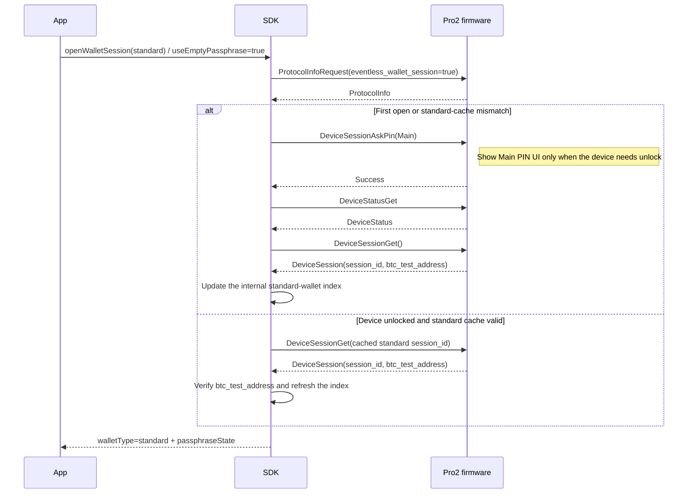
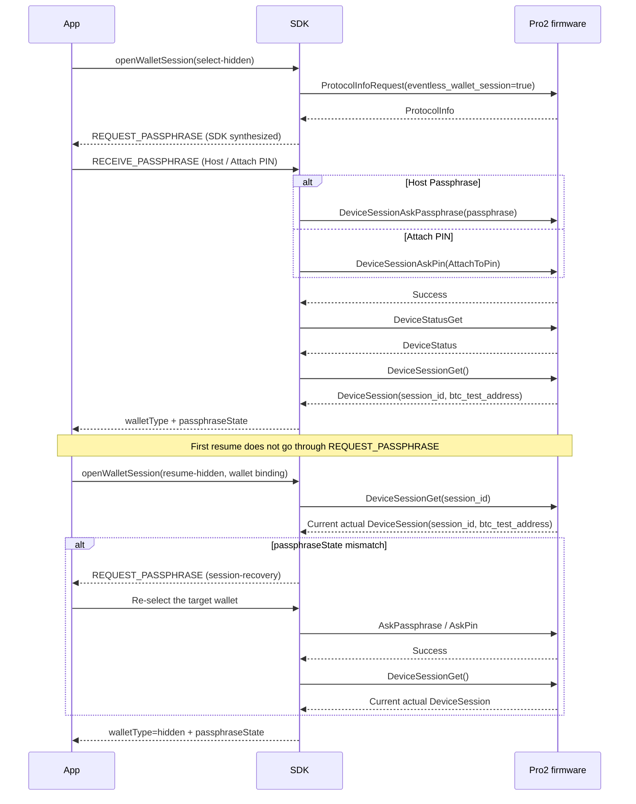

# Pro2 eventless firmware UI: SDK / App / firmware migration checklist

> Document type: migration plan
> Audience: firmware, SDK Core, and App hardware-integration maintainers
> Status: current implementation
> Code scope: `submodules/firmware-pro2`, `packages/core`, App Hardware UI
> Last code review: 2026-07-30
> Read first: [SDK Core runtime](./core-runtime.md), [Wallet Session and security](../device/wallet-session-and-security.md)

> Current contract: firmware-pro2 `main` already implements the split
> `DeviceSessionAskPin` / `DeviceSessionAskPassphrase` / `DeviceSessionGet` APIs and
> `ProtocolInfoRequest.eventless_wallet_session`. Current behavior follows
> [SDK Core runtime](./core-runtime.md) and [Pro2 field migration](./pro2-field-migration.md).
> This document is the SDK/App migration checklist.

Product and protocol design index:
[Pro2 eventless firmware UI design index](../superpowers/specs/2026-07-16-pro2-eventless-index.md).

## One-page summary

This migration does not remove events between SDK and App. It removes Pro2 firmware UI messages that were sent in the middle of a business request and waited for a Host ACK:

- `PassphraseRequest` / `PassphraseAck`
- `ButtonRequest` / `ButtonAck`
- `PinMatrixRequest` / `PinMatrixAck`

Current layering:

```text
App
  Keep listening to SDK UI events and call uiResponse() for blocking selection

hardware-js-sdk
  Synthesize events from API params, Session state, and DeviceLocked
  Convert the user choice into explicit Protocol V2 commands

firmware-pro2
  Show device UI after receiving an explicit command
  Send no UI intermediate messages; return only the final business result
```

Classic Pro / Protocol V1 keeps the existing firmware Event + ACK flow. The App can keep the same public Event UI. The SDK chooses event source and follow-up action from the protocol version.

### This is not protocol-message renaming

The new Session requests are not a rename of `PassphraseAck`:

- `PassphraseAck` replies to firmware `PassphraseRequest` and only encodes three hidden-wallet entry paths: Host Passphrase, on-device Passphrase, or Attach PIN.
- `DeviceSessionAskPassphrase` and `DeviceSessionAskPin` complete verification and wallet switch and return `Success`. The former uses required `on_device` to distinguish on-device vs Host input. Host input also carries a non-empty `passphrase`. On-device input carries no plaintext. Attach-to-PIN always uses `DeviceSessionAskPin(AttachToPin)`.
- `DeviceSessionGet({ session_id, btc_test_address })` takes over Session-resume semantics from `Initialize(session_id, passphrase_state)`. V2 carries `seed_domains` only on AskPassphrase: opening a wallet uses `[Standard]`; Cardano uses `[Standard, Cardano]`. Get does not carry that field. Attach PIN plus Cardano sends an empty Host-passphrase AskPassphrase. That is not an original `PassphraseAck` capability.
- `ButtonRequest` / `ButtonAck` are not renamed. They are removed from the V2 firmware state machine. Device pages are opened by explicit Ask commands. Stage hints to the App are synthesized by the SDK.

```text
PassphraseAck(passphrase)                -> DeviceSessionAskPassphrase({ on_device: false, passphrase, seed_domains }) -> Success -> DeviceSessionGet()
PassphraseAck(on_device)                 -> DeviceSessionAskPassphrase({ on_device: true, seed_domains }) -> Success -> DeviceSessionGet()
PassphraseAck(on_device_attach_pin)      -> DeviceSessionAskPin(AttachToPin) -> Success
                                         -> [Cardano: empty AskPassphrase({ passphrase: '', on_device: false, seed_domains: [Standard, Cardano] })]
                                         -> DeviceSessionGet()
Initialize(session_id, passphrase_state) -> DeviceSessionGet({ session_id, btc_test_address })
```

## Out of deletion scope

- USB/BLE request-response and BLE notifications
- File, firmware, resource, and Portfolio progress
- Transaction-data fragment Request/Ack
- Device connect, state, and capability events
- SDK-generated checking, processing, progress, and UI events
- `CLOSE_UI_WINDOW` / `CLOSE_UI_PIN_WINDOW`

## Module migration table

| Module | SDK → App | App response | SDK → firmware | Firmware behavior |
| --- | --- | --- | --- | --- |
| Wallet Session | Blocking `REQUEST_PASSPHRASE` selection | `RECEIVE_PASSPHRASE` | Switch: `AskPassphrase` / `AskPin`; get/resume: `DeviceSessionGet` | Ask returns Success; Get returns the actual Session |
| PIN / unlock | Non-blocking `REQUEST_PIN` hint | None | `DeviceSessionAskPin(type)` | Local PIN/fingerprint as needed; success or failure |
| Address / public key | Non-blocking `REQUEST_BUTTON` hint | None | Original address/public-key method | Local confirm; return final data |
| Signing | Non-blocking generic `REQUEST_BUTTON` hint | None | Original signing method + data handshake | Complete every confirm page locally |
| Device management | Non-blocking `REQUEST_BUTTON` hint | None | Page command or final operation command | Local settings / dangerous-operation UI |
| Onboarding | Optional non-blocking stage notice | None | Status query / page command | Local flow; status query is the source of truth |
| Cancel | Closing UI can cancel the current call | cancel API / call cancel | `Cancel` | Close the current page and end the original request |

## Wallet Session: keep the existing App Event UI

### Current App path

app-monorepo already handles hardware-wallet selection through:

- `HardwareUiStateContainer.tsx` listening to `REQUEST_PASSPHRASE`
- `HardwareEnterPhase.tsx` showing Passphrase / Hidden Wallet PIN entry
- `ServiceHardwareUI.ts` returning the choice via `UI_RESPONSE.RECEIVE_PASSPHRASE`
- `ServiceAccount.createHWHiddenWallet()` still identifying hidden wallets with `passphraseState`

Pro2 still enters this Event UI, but the payload must declare:

```ts
{
  device: KnownDevice,
  source: 'wallet-session-coordinator',
  passphraseState: expectedPassphraseState,
  existsAttachPinUser: boolean,
  reason: 'open-wallet' | 'session-recovery',
  expectedPassphraseState?: string,
}
```

The App Pro2 branch still returns the existing choice shapes:

- App-entered Passphrase (sent to Pro2 through the optional field)
- `passphraseOnDevice=true`
- `attachPinOnDevice=true` with `existsAttachPinUser=true`
- User cancel

The SDK converts the response to `DeviceSessionAskPassphrase` or `DeviceSessionAskPin(AttachToPin)`. Ask returns only `Success`, then empty-param `DeviceSessionGet` reads the actual Session. No `PassphraseAck` is sent. Explicit `resume-hidden` with a cache first tries `DeviceSessionGet` with `session_id`. If there is no cache, the handle is invalid, or firmware's actual wallet state does not match, the SDK synthesizes one `REQUEST_PASSPHRASE` so the user can re-enter the target wallet. A security error is raised only if it still mismatches. `session_id` is only a resume hint. Wallet identity is the `deviceId + passphraseState` check.

### Protocol V2 current sequence

Standard wallet create and reuse:



The standard index only locates the Session firmware actually returned. Visiting hidden wallet B and then running several standard-wallet business calls does not delete B's `deviceKey + passphraseState` cache. B can still be resumed independently.

Hidden wallet create and resume:



## SDK public Event adaptation

### Protocol V1

Keep the current DeviceCommands and Core handlers:

```text
firmware Request -> Core Event -> App uiResponse -> firmware Ack
```

### Protocol V2

- `_filterCommonTypes()` does not consume Pro2 `ButtonRequest` / `PinMatrixRequest` / `PassphraseRequest`.
- Receiving those messages is a protocol regression: log it and end the request. Do not silently ACK.
- Do not remove public `REQUEST_PIN` / `REQUEST_PASSPHRASE` / `REQUEST_BUTTON` listeners.
- Events are emitted by method lifecycle, the unlock coordinator, or the wallet Session coordinator.
- Event payloads carry `source/reason`. The App must not assume "the event always comes from firmware".

### Blocking vs non-blocking

```text
Blocking selection event
  emit -> create a controlled UI wait -> uiResponse -> explicit business command

Non-blocking hint event
  emit -> send the business command immediately -> wait for the final result
```

Current Core `_uiPromises` match only by `UI_RESPONSE` type. New synthesized blocking events must stay serial, or add requestId/connectId correlation, and must be cleaned up on cancel, timeout, disconnect, and method end.

## Auto unlock

```text
Business request
  -> Wallet business or an explicitly protected management method: fresh Status -> verify device identity -> unlock if needed
  -> Wallet Session -> method.run() once
  -> DeviceLocked during the business phase: fail immediately; do not unlock or replay
```

- The App does not send PIN back and does not resend the business request.
- Pro2 `REQUEST_PIN` is a non-blocking device hint.
- Wallet business auto-enters pre-call unlock via `useDevicePassphraseState=true` and does not maintain a method-name allowlist. Non-wallet management methods that firmware requires to unlock use `unlock-before-run` explicitly. There is no `retry-on-locked`.
- An all-network root and its inner sub-methods share one Status/Unlock preflight. Each child chain still resumes Wallet Session independently.
- bootloader / romloader skip Status/Unlock. Protocol V1 keeps its original flow.
- `uploadPortfolio` disables wallet Session handling and uses `unlockPolicy='none'`. The default `uiMode='silent'` maps to `protocolV2UiMode='none'`; `uiMode='progress'` maps to `protocolV2UiMode='auto'` only to expose transfer progress and lifecycle close events. Neither mode emits `DeviceSessionAskPin`, and the file-write/apply sequence runs only once.

## Address, public key, signing, and device management

These scenes use one SDK-synthesized non-blocking `REQUEST_BUTTON`:

- Address / public key: emit only when `showOnOneKey=true`.
- Signing: emit one generic hint when entering device signing interaction. Do not recreate output / fee / risk Button codes page by page.
- Device management: emit from page navigation or a dangerous operation. Distinguish "page accepted" from "operation completed".
- Change PIN: public `deviceChangePin(remove=false)` on Pro2 routes to `DeviceSettingsPageShow(DevicePinChange)`. Success means the page was accepted. `remove=true` is not currently supported.
- Wipe: public `deviceWipe()` on Pro2 routes to `DeviceSettingsPageShow(DeviceReset)`. Success means the wipe confirmation page opened. V1 keeps `WipeDevice` final-operation semantics.

The App keeps showing the existing device-confirm UI and does not call `uiResponse()`. Close uniformly on success, failure, cancel, timeout, and disconnect.

Portfolio is the exception: firmware `PortfolioUpdate` validates and applies data, then returns the final result without opening a confirm page. The SDK synthesizes no interaction event. File-chunk progress events are sent only when `uiMode='progress'`.

## Onboarding security boundary

- Pro2 forbids `WordRequest` / `WordAck` and `EntropyRequest` / `EntropyAck`.
- The SDK must not synthesize these sensitive-data requests for App compatibility.
- `OnboardingStatus` is the source of truth.
- The SDK may emit stage notices that contain no sensitive data, but the App must be able to recover by query.

## Cancel and UI lifecycle

Event UI remains a valid cancel entry:

- Closing a blocking wallet-selection UI ends the UI Promise and also sends `Cancel` if a device command has already started.
- Closing a non-blocking device-hint UI cancels the current API call and sends `Cancel`.
- Ordinary close of onboarding / progress state notices does not cancel background work by default.
- `CLOSE_UI_WINDOW` is SDK → App. After receiving it, the App must not fire a second Cancel.

Cancel must bind the current device and Transport source. On disconnect, clean up requests, UI Promises, and hint state.

## firmware-pro2 checklist

- Implement `DeviceSessionAskPassphrase`, `DeviceSessionAskPin` with `Any` / `Main` / `AttachToPin`, and `DeviceSessionGet` with optional `session_id`.
- Ask only switches or establishes wallet context and returns `Success`. `DeviceSessionGet` is the only interface that returns `session_id + btc_test_address`.
- `DeviceSessionGet()` returns the current actual Session. `DeviceSessionGet(session_id)` tries to resume the target Session, but always returns the final actual Session. Normal expiry or mismatch is not encoded as `InvalidSession`.
- Remove Passphrase/Button Host ACK state from the seed session.
- `DeviceSessionAskPin` shows the device PIN/fingerprint page directly.
- Address, public key, signing, settings, and dangerous operations show local UI directly.
- Locked errors return before method side effects.
- Keep signing business-data Request/Ack.
- `Cancel` can close the current source's page and clear sensitive state.
- Maintain `attach_to_pin_enabled`, `unlocked_by_attach_to_pin`, and onboarding query state correctly.
- Do not send `WordRequest` / `EntropyRequest`.

## hardware-js-sdk checklist

- Add and uniformly use a wallet Session coordinator.
- Standard-wallet public responses always return `passphraseState=null`. Hidden wallets return a non-empty `passphraseState`. Wallet classification still uses only `walletType`. Do not infer the underlying protocol from whether `passphraseState` is empty.
- Host Passphrase maps to `DeviceSessionAskPassphrase({ passphrase, on_device: false, seed_domains })`. On-device Passphrase maps to `DeviceSessionAskPassphrase({ on_device: true, seed_domains })`. Attach PIN maps to `DeviceSessionAskPin(AttachToPin)`. After Ask succeeds, always call empty-param `DeviceSessionGet()`. Get does not carry `seed_domains`. Attach PIN plus Cardano then sends empty Host-passphrase `AskPassphrase`.
- NFKD-normalize Host Passphrase first and require 1–50 UTF-8 bytes with no NUL.
- `DeviceWalletSessionStore` keeps real wallet mappings by `deviceKey + passphraseState` and maintains one internal index per device that points at the real standard-wallet record. That index is read only by explicit standard-wallet intent.
- The store does not implement LRU or a firmware-capacity mirror. Session create, capacity, and eviction are owned by hardware. The SDK only clears a record when firmware rejects the handle or wallet-identity check fails.
- If Get state does not match business expectation, recover once: standard wallets go AskMain; hidden wallets go unified wallet selection. A second mismatch throws `DeviceCheckPassphraseStateError`.
- Reuse the public UI Event layer. Do not forge Transport protobuf Requests.
- Report a protocol error if V2 receives a firmware UI intermediate message.
- Give synthesized events a stable `source/reason/device` payload.
- Distinguish blocking selection events from non-blocking hint events.
- On-device Passphrase must synthesize one `REQUEST_PASSPHRASE_ON_DEVICE`. Attach PIN must synthesize one device PIN stage hint compatible with the current App.
- Auto unlock happens only before the business command is sent. Business callbacks and multi-step operations that have already started are not replayed.
- Keep signing data handshake, progress, Transport, and lifecycle events.
- Unify UI Promise and Event cleanup for cancel / timeout / disconnect.
- After `DeviceSessionGet({ session_id })`, verify `btc_test_address`. On mismatch, do not continue the business call.

## app-monorepo checklist

- Keep the existing Hardware UI Event container and `uiResponse()` channel.
- `source/reason` remains optional copy enhancement.
- Pro2 main PIN and Hidden Wallet PIN are on-device only. Passphrase may be entered in the App or on the device.
- The Hidden Wallet PIN entry is gated by `existsAttachPinUser`.
- Pro2 non-blocking `REQUEST_BUTTON` / `REQUEST_PIN` scenes do not send `uiResponse()`.
- Closing the hardware-interaction UI cancels the current call. `CLOSE_UI_WINDOW` only dismisses idempotently.
- The App still stores `passphraseState`. `openWalletSession()` no longer returns firmware `session_id`, and the App database must not persist that internal value.
- Existing Apps may keep using `getPassphraseState()`. Pro2 protocol split is done in Core. New flows should prefer `openWalletSession()` to express standard, select-hidden, or resume-hidden explicitly.
- Do not treat onboarding stage events as the only state source.

## Regression tests

### Event source and compatibility

- V1 still triggers events from firmware UI messages and completes ACK.
- V2 App receives the same public events, but firmware produces no UI intermediate messages.
- V2 event payload can distinguish coordinator vs method-lifecycle source.
- Unexpected firmware UI Requests on V2 end as a protocol error.

### Wallet and unlock

- Standard wallets negotiate `eventless_wallet_session=true` first. First open or cache mismatch calls `AskPin(Main) -> Get()`. A valid cache calls `DeviceSessionGet(session_id)`. Standard wallets also return a non-empty `passphraseState`, but `sessionId` stays inside Core.
- Standard-wallet Session update, expiry, or address-check failure must not clear hidden-wallet Sessions on the same device.
- Host Passphrase, on-device Passphrase, and Attach PIN hidden-wallet choices all return the correct wallet identity.
- First hidden wallet, Session resume, and Session-expiry reselection keep the original API call and do not replay it.
- Passphrase and the matching Attach PIN return the same `btc_test_address`.
- Wallet-identity mismatch terminates the business call.
- After locked: hint, AskPin, and at most one internal retry. Cancel does not retry.

### Non-blocking hints

- Address / public key hints only when `showOnOneKey=true`.
- Each signing emits the expected number of generic hints, and data Request/Ack still works.
- Settings-page accepted is not confused with final-operation completed.
- Non-blocking events do not create a `uiResponse` wait item.

### Lifecycle and security

- UI cancel, device cancel, timeout, and disconnect all end the App wait state.
- `CLOSE_UI_WINDOW` does not trigger a duplicate Cancel.
- Multi-device, USB/BLE, and same-type UI responses do not cross wires.
- PIN, mnemonic, entropy, and full transactions do not enter event payloads or logs. App-entered Passphrase exists only in `RECEIVE_PASSPHRASE` and the current Session-open request. It does not enter logs or persisted state.
