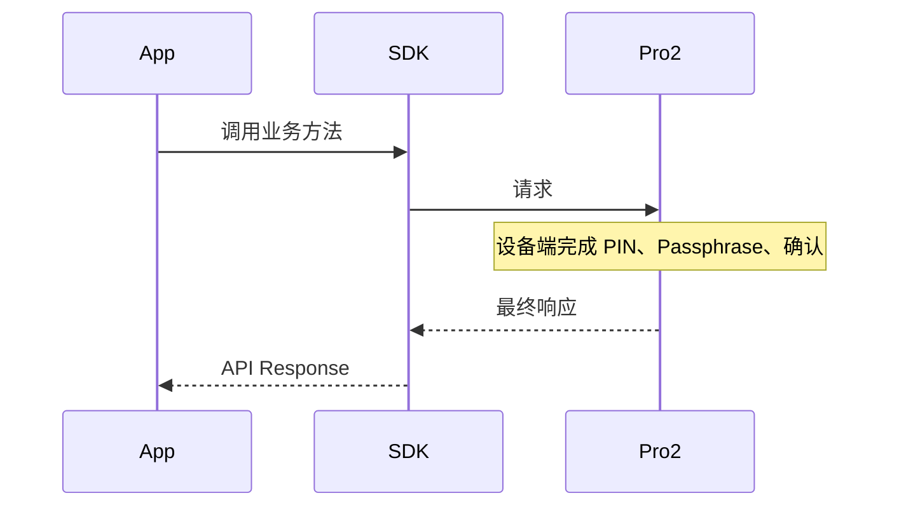

# Pro2 无硬件交互 Event 迁移调研

## 目标与边界

目标是将 Pro2 调整为单向业务调用模型：SDK 发起请求，设备在本机完成 PIN、Passphrase、确认等交互，最后返回成功或失败；SDK 不再依赖硬件中间消息驱动 App UI。

这里的“硬件 Event”实际是请求中的同步中间响应：`ButtonRequest`、`PinMatrixRequest`、`PassphraseRequest`、`WordRequest` 和 `EntropyRequest`，不是独立异步推送。

以下内容不属于删除范围：Transport 连接/断开、BLE notification、SDK 生成的 `FEATURES/SUPPORT_FEATURES`、固件/文件进度、设备选择事件和最终业务响应。

## 链路变化



## SDK Event 分类

| SDK Event | 来源 | Pro2 处理 |
| --- | --- | --- |
| `DEVICE.PIN` | `PinMatrixRequest` | 停止注册 |
| `DEVICE.BUTTON` | `ButtonRequest` | 停止注册 |
| `DEVICE.PASSPHRASE` | `PassphraseRequest` | 停止注册 |
| `DEVICE.PASSPHRASE_ON_DEVICE` | `ButtonRequest_PassphraseEntry` | 停止注册 |
| `DEVICE.FEATURES` | SDK 请求后更新缓存 | 保留 |
| `DEVICE.SUPPORT_FEATURES` | SDK 能力计算 | 保留 |
| `DEVICE.CONNECT/DISCONNECT` | Transport 生命周期 | 保留 |
| 固件设备选择 Event | SDK 升级流程 | 保留 |

SDK 主入口位于 `packages/core/src/core/index.ts`。`AllNetworkGetAddressBase` 还有一套独立的 Button/PIN/Passphrase 监听，Pro2 同样需要跳过。

## firmware-pro2/dev 当前仍依赖 Host ACK 的位置

| 场景 | 当前消息 | 固件位置 | 目标行为 |
| --- | --- | --- | --- |
| seed session 解锁 | `ButtonRequest_PinEntry` → `ButtonAck` | `seed_session_manager.c` | 直接打开设备 PIN 页 |
| Passphrase 钱包选择 | `PassphraseRequest` → `PassphraseAck` | `seed_session_manager.c` | 设备端完成钱包选择 |
| 设备端 Passphrase | `ButtonRequest_PassphraseEntry` → `ButtonAck` | `seed_session_manager.c` | 直接打开输入页 |
| 使用 Attach PIN | `ButtonRequest_AttachPin` → `ButtonAck` | `seed_session_manager.c` | 直接打开 Attach PIN 或增加显式命令 |
| 地址确认 | `ButtonRequest_Address` → `ButtonAck` | `task_foreground.c` | 直接显示地址确认页 |
| 公钥确认 | `ButtonRequest_PublicKey` → `ButtonAck` | `task_foreground.c` | 直接显示公钥确认页 |

`DeviceSessionAskPin` 已符合目标模型：设备直接显示 PIN 页面并返回最终 `Success/Failure`。

## 必须兼容的模块

### Attach-to-PIN

最终状态继续读取 `DeviceStatus.attach_to_pin_enabled` 和 `unlocked_by_attach_to_pin`，并使用 `DeviceSession.btc_test_address` 校验实际钱包。

主要缺口是设备已通过主 PIN 解锁后如何切换到 Attach PIN 钱包。当前入口来自 `PassphraseRequest` 的 `on_device_attach_pin`。删除 Event 后建议新增显式“切换钱包/请求 Attach PIN”命令，由设备完成全部 UI。

### 标准钱包与隐藏钱包

当前 `PassphraseAck` 可选择空 Passphrase、App 输入、设备输入或 Attach PIN。单向流下敏感输入应只在设备进行，但 SDK/协议仍需表达标准钱包、隐藏钱包、Attach PIN 三种意图，并从最终响应取得可验证的钱包标识。

### PIN 与自动解锁

保留错误驱动流程：

```text
业务请求 -> DeviceLocked -> DeviceSessionAskPin -> 重试业务请求一次
```

该流程不依赖任何硬件 UI Event。

### App UI

Pro2 不再产生 `ui-request_pin`、`ui-button`、`ui-request_passphrase`、`ui-request_passphrase_on_device`。这些 UI 继续供 Protocol V1 使用。Pro2 的等待提示应由业务调用主动展示，而不是等待硬件中间消息。

### 取消、超时和 BLE

用户在设备取消时必须返回明确失败；SDK 取消需要设备结束当前 UI；长交互继续使用方法级超时。BLE notification 是请求响应传输通道，不能删除。

### 地址、公钥、签名和进度

地址与公钥当前还发送 ButtonRequest；签名确认主要已经由设备内部 UIVIEW 完成。`FIRMWARE_PROCESSING`、`FIRMWARE_PROGRESS`、`FIRMWARE_TIP`、`DEVICE_PROGRESS` 是 SDK 主动生成的 UI，继续保留。Portfolio 已单独静默。

## 迁移顺序

1. SDK 对 Pro2 停止注册四类硬件交互 UI Event，Protocol V1 保持不变。
2. 固件 seed session 改为设备端直接处理 PIN、Passphrase、Attach PIN。
3. 固件地址、公钥确认删除 ButtonRequest/ButtonAck 前置握手。
4. 为标准钱包、隐藏钱包、Attach PIN 定义显式命令或完整设备端选择语义。
5. App 对 Pro2 停止依赖四类 UI_REQUEST，同时保留 V1 UI。
6. 回归 USB、BLE、取消、超时、自动解锁和钱包一致性。

## 风险

- 只改 SDK、不改固件时，`ButtonRequest` 仍会被协议层 ACK，但 `PinMatrixRequest` 和 `PassphraseRequest` 会因没有监听器而失败。
- Attach PIN 没有新入口时，用户可能无法从已解锁主钱包切换到 Attach PIN 钱包。
- 误删连接/断开或 BLE notification 会直接破坏通讯。

## ADR

状态：迁移中。

决策：Pro2 不注册硬件交互 UI Event；敏感交互全部在设备端完成。SDK 只消费最终响应和状态，并保留错误驱动自动解锁。

后果：SDK/App 状态机显著简化，但固件必须补齐钱包选择、Attach PIN、取消和超时语义；迁移期间必须严格区分固件版本。
