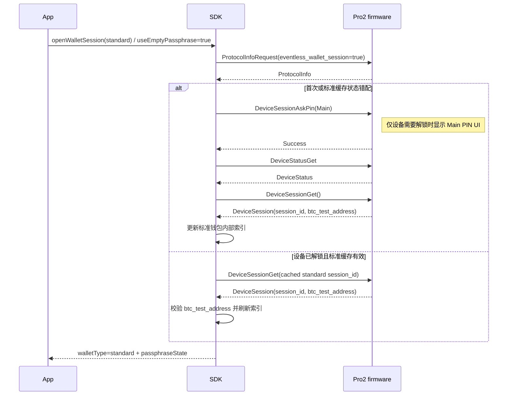
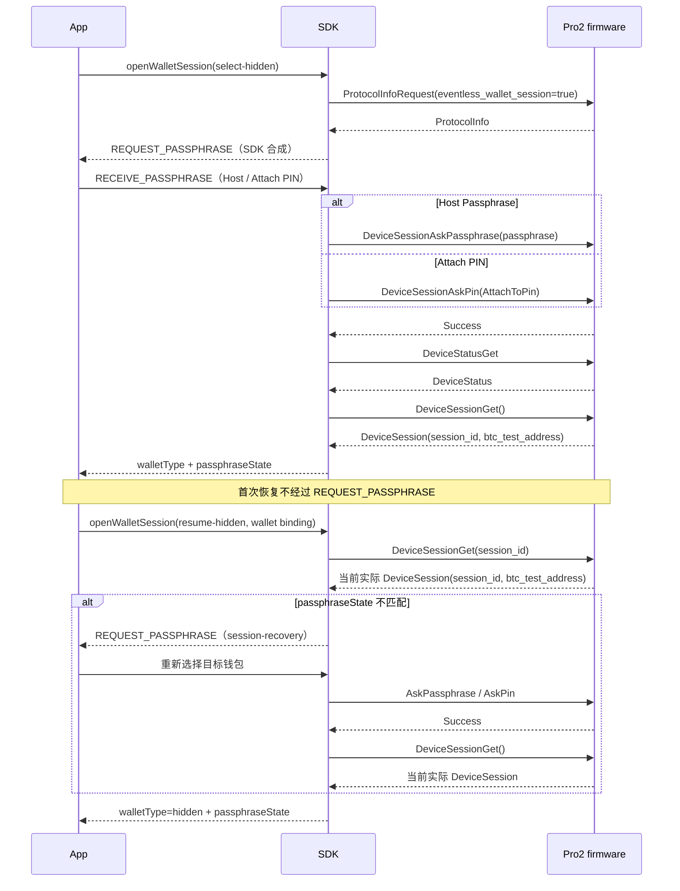

# Pro2 无固件中间 Event：SDK / App / firmware 迁移清单

> 文档类型：迁移方案
> 适用读者：firmware、SDK Core 与 App 硬件接入维护者
> 内容状态：当前实现
> 代码范围：`submodules/firmware-pro2`、`packages/core`、App Hardware UI
> 最后代码核验：2026-07-30
> 前置阅读：[SDK Core 运行时](./core-runtime.md)、[钱包 Session 与安全](../device/wallet-session-and-security.md)

> 当前契约：firmware-pro2 `main` 已实现拆分后的
> `DeviceSessionAskPin/DeviceSessionAskPassphrase/DeviceSessionGet` 与
> `ProtocolInfoRequest.eventless_wallet_session`。当前实现以
> [SDK Core 运行时](./core-runtime.md) 和 [Pro2 字段迁移](./pro2-field-migration.md)
> 为准；本文作为 SDK/App 迁移清单。

产品与协议总设计见：
[Pro2 无固件中间 Event 设计索引](../superpowers/specs/2026-07-16-pro2-eventless-index.md)。

## 一页结论

本次迁移不删除 SDK 与 App 之间的 Event。删除的是 Pro2 firmware 在业务请求中间发送并等待 Host ACK
的 UI 消息：

- `PassphraseRequest / PassphraseAck`。
- `ButtonRequest / ButtonAck`。
- `PinMatrixRequest / PinMatrixAck`。

当前分层是：

```text
App
  继续监听 SDK UI Event，并在阻塞选择场景调用 uiResponse()

hardware-js-sdk
  根据 API 参数、Session 状态和 DeviceLocked 合成 Event
  将用户选择转换为显式 Protocol V2 命令

firmware-pro2
  收到显式命令后直接显示设备 UI
  不发送 UI 中间消息，只返回最终业务结果
```

原 Pro / Protocol V1 保持现有 firmware Event + ACK 流程。App 可以继续使用同一套公共 Event UI，
SDK 内部根据协议版本选择 Event 来源和后续动作。

### 不是协议消息改名

新的 Session 请求不是 `PassphraseAck` 的简单改名：

- `PassphraseAck` 是对 firmware `PassphraseRequest` 的中间回复，只表达 Host Passphrase、设备
  Passphrase 或 Attach PIN 三种隐藏钱包进入方式。
- `DeviceSessionAskPassphrase` 与 `DeviceSessionAskPin` 完成验证和钱包切换并返回 `Success`；
  前者通过必填 `on_device` 区分设备输入与 Host 输入。Host 输入同时携带非空 `passphrase`；
  设备输入不携带明文。Attach-to-PIN 始终使用 `DeviceSessionAskPin(AttachToPin)`。
- `DeviceSessionGet({ session_id, btc_test_address })` 承接原
  `Initialize(session_id, passphrase_state)` 的 Session 恢复语义。V2 只在 AskPassphrase 上携带
  `seed_domains`：开钱包为 `[Standard]`，Cardano 为 `[Standard, Cardano]`。Get 不携带该字段。
  Attach PIN 补 Cardano 发送空 Host passphrase 的 AskPassphrase。
  这不是 `PassphraseAck` 原有能力。
- `ButtonRequest/ButtonAck` 不改名；它们从 V2 firmware 状态机中删除，设备页面由显式 Ask 命令
  打开，对 App 的阶段提示由 SDK 合成。

```text
PassphraseAck(passphrase)                -> DeviceSessionAskPassphrase({ on_device: false, passphrase, seed_domains }) -> Success -> DeviceSessionGet()
PassphraseAck(on_device)                 -> DeviceSessionAskPassphrase({ on_device: true, seed_domains }) -> Success -> DeviceSessionGet()
PassphraseAck(on_device_attach_pin)      -> DeviceSessionAskPin(AttachToPin) -> Success
                                         -> [Cardano: empty AskPassphrase({ passphrase: '', on_device: false, seed_domains: [Standard, Cardano] })]
                                         -> DeviceSessionGet()
Initialize(session_id, passphrase_state) -> DeviceSessionGet({ session_id, btc_test_address })
```

## 不在删除范围

- USB/BLE 请求响应与 BLE notification。
- 文件、固件、资源和 Portfolio 进度。
- 交易数据分片 Request/Ack。
- 设备连接、状态和能力事件。
- SDK 生成的 checking、processing、progress 和 UI Event。
- `CLOSE_UI_WINDOW/CLOSE_UI_PIN_WINDOW`。

## 模块迁移总表

| 模块         | SDK → App                       | App 响应             | SDK → firmware                                              | firmware 行为                          |
| ------------ | ------------------------------- | -------------------- | ----------------------------------------------------------- | -------------------------------------- |
| 钱包 Session | `REQUEST_PASSPHRASE` 阻塞选择   | `RECEIVE_PASSPHRASE` | 切换：`AskPassphrase/AskPin`；获取/恢复：`DeviceSessionGet` | Ask 返回 Success，Get 返回实际 Session |
| PIN / 解锁   | `REQUEST_PIN` 非阻塞提示        | 无                   | `DeviceSessionAskPin(type)`                                 | 本地按需 PIN/指纹，返回成功或失败      |
| 地址 / 公钥  | `REQUEST_BUTTON` 非阻塞提示     | 无                   | 原地址/公钥方法                                             | 本地确认，返回最终数据                 |
| 签名         | `REQUEST_BUTTON` 非阻塞通用提示 | 无                   | 原签名方法 + 数据握手                                       | 本地完成所有确认页                     |
| 设备管理     | `REQUEST_BUTTON` 非阻塞提示     | 无                   | 页面命令或最终操作命令                                      | 本地设置/危险操作 UI                   |
| Onboarding   | 可选非阻塞阶段通知              | 无                   | 状态查询/页面命令                                           | 本地流程；状态查询为事实来源           |
| Cancel       | 关闭 UI 可取消当前调用          | cancel API/调用取消  | `Cancel`                                                    | 关闭当前页面并结束原请求               |

## 钱包 Session：兼容现有 App Event UI

### App 现有链路

app-monorepo 已通过以下模块处理硬件钱包选择：

- `HardwareUiStateContainer.tsx` 监听 `REQUEST_PASSPHRASE`。
- `HardwareEnterPhase.tsx` 展示 Passphrase/Hidden Wallet PIN 进入方式。
- `ServiceHardwareUI.ts` 通过 `UI_RESPONSE.RECEIVE_PASSPHRASE` 返回选择。
- `ServiceAccount.createHWHiddenWallet()` 继续使用 `passphraseState` 标识隐藏钱包。

Pro2 继续进入这套 Event UI，但 payload 必须声明：

```ts
{
  device: KnownDevice,
  source: 'wallet-session-coordinator',
  passphraseState: expectedPassphraseState,
  existsAttachPinUser: boolean,
  reason: 'open-wallet' | 'session-recovery',
  expectedPassphraseState?: string,
}
```

App 的 Pro2 分支继续返回现有三种选择形状：

- App 输入 Passphrase（通过可选字段发送给 Pro2）。
- `passphraseOnDevice=true`。
- `attachPinOnDevice=true`，且 `existsAttachPinUser=true`。
- 用户取消。

SDK 将响应转换为 `DeviceSessionAskPassphrase` 或 `DeviceSessionAskPin(AttachToPin)`；Ask 只返回
`Success`，之后用空参数 `DeviceSessionGet` 获取实际 Session，不发送 `PassphraseAck`。
显式 `resume-hidden` 有缓存时先通过带 `session_id` 的 `DeviceSessionGet` 尝试恢复。没有缓存、
句柄失效或固件返回的实际钱包状态不匹配时，SDK 合成一次 `REQUEST_PASSPHRASE` 让用户重新进入
目标钱包；最终仍不匹配才报安全错误。`session_id` 只作为恢复提示，钱包身份以
`deviceId + passphraseState` 校验结果为准。

### Protocol V2 当前时序

标准钱包创建与复用：



这里的标准索引只定位固件真实返回的 Session。先访问隐藏钱包 B、再执行多次标准钱包业务调用，
不会删除 B 的 `deviceKey + passphraseState` 缓存；之后仍可独立恢复 B。

隐藏钱包创建与恢复：



## SDK 公共 Event 适配

### Protocol V1

保留当前 DeviceCommands 和 Core handler：

```text
firmware Request -> Core Event -> App uiResponse -> firmware Ack
```

### Protocol V2

- `_filterCommonTypes()` 不消费 Pro2 `ButtonRequest/PinMatrixRequest/PassphraseRequest`。
- 收到这些消息时记录协议回归并结束请求，不能静默 ACK。
- 不删除公共 `REQUEST_PIN/REQUEST_PASSPHRASE/REQUEST_BUTTON` listener。
- Event 改由 method lifecycle、unlock coordinator 或 wallet session coordinator 发出。
- Event payload 带 `source/reason`，App 不应依赖“Event 必然来自 firmware”。

### 阻塞与非阻塞

```text
阻塞选择 Event
  emit -> 建立受控 UI 等待 -> uiResponse -> 显式业务命令

非阻塞提示 Event
  emit -> 直接发送业务命令 -> 等待最终结果
```

当前 Core `_uiPromises` 只按 `UI_RESPONSE` 类型匹配。新增合成阻塞 Event 时必须继续串行，或增加
requestId/connectId 关联，并在取消、超时、断连和方法结束时清理。

## 自动解锁

```text
业务请求
  -> 钱包业务或显式受保护管理方法：fresh Status -> 校验设备身份 -> 按需解锁
  -> Wallet Session -> method.run() 一次
  -> 业务阶段 DeviceLocked：直接失败，不解锁、不重放
```

- App 不回传 PIN，也不重发业务请求。
- Pro2 `REQUEST_PIN` 是非阻塞设备提示。
- 钱包业务由 `useDevicePassphraseState=true` 自动进入调用前解锁，不维护方法名白名单；非钱包但
  固件要求解锁的管理方法显式使用 `unlock-before-run`。不存在 `retry-on-locked`。
- all-network root 与内部子方法共享一次 Status/Unlock preflight，每个子链仍独立恢复 Wallet Session。
- bootloader/romloader 跳过 Status/Unlock，Protocol V1 保持原流程。
- `uploadPortfolio` disables wallet Session handling and uses `unlockPolicy='none'`. The default
  `uiMode='silent'` maps to `protocolV2UiMode='none'`; `uiMode='progress'` maps to
  `protocolV2UiMode='auto'` only to expose transfer progress and lifecycle close events. Neither mode
  emits `DeviceSessionAskPin`, and the file-write/apply sequence runs only once.

## 地址、公钥、签名和设备管理

这些场景统一使用 SDK 合成的非阻塞 `REQUEST_BUTTON`：

- 地址/公钥：仅 `showOnOneKey=true` 时发送。
- 签名：进入设备签名交互时发送一次通用提示，不逐页复刻输出/费用/风险 Button code。
- 设备管理：根据页面导航或危险操作发送；明确区分“页面已接受”和“操作已完成”。
- Change PIN：公共 `deviceChangePin(remove=false)` 在 Pro2 上路由到
  `DeviceSettingsPageShow(DevicePinChange)`，成功表示页面已接受；`remove=true` 当前不支持。
- Wipe：公共 `deviceWipe()` 在 Pro2 上路由到 `DeviceSettingsPageShow(DeviceReset)`，成功表示擦除确认页
  已打开；V1 仍保留 `WipeDevice` 最终操作语义。

App 继续展示现有设备确认 UI，不调用 `uiResponse()`。成功、失败、取消、超时和断连时统一关闭。

Portfolio 是例外：firmware 的 `PortfolioUpdate` 直接校验并应用数据后返回最终结果，不打开确认页面；
SDK 不合成交互 Event，也不发送文件分片进度 Event。

## Onboarding 安全边界

- Pro2 禁止 `WordRequest/WordAck` 与 `EntropyRequest/EntropyAck`。
- SDK 不得为兼容 App 而合成这些敏感数据请求。
- `OnboardingStatus` 是事实来源。
- SDK 可以发不含敏感信息的阶段通知，但 App 必须能通过查询恢复。

## Cancel 与 UI 生命周期

Event UI 仍是有效取消入口：

- 阻塞钱包选择 UI 关闭：结束 UI Promise；设备命令已开始时同时发送 `Cancel`。
- 非阻塞设备提示 UI 关闭：取消当前 API 调用并发送 `Cancel`。
- Onboarding/进度等状态通知普通关闭：不默认取消后台任务。
- `CLOSE_UI_WINDOW` 是 SDK → App 的关闭通知，App 收到后不得反向触发第二次 Cancel。

Cancel 必须绑定当前设备和 Transport source；断连时清理请求、UI Promise 和提示状态。

## firmware-pro2 实施清单

- 实现 `DeviceSessionAskPassphrase`、带 `Any/Main/AttachToPin` 类型的 `DeviceSessionAskPin`，
  以及可选 `session_id` 的 `DeviceSessionGet`。
- Ask 请求只负责切换或建立钱包上下文并返回 `Success`；`DeviceSessionGet` 是唯一返回
  `session_id + btc_test_address` 的接口。
- `DeviceSessionGet()` 返回当前实际 Session；`DeviceSessionGet(session_id)` 尝试恢复目标 Session，
  但无论是否命中，都返回最终实际 Session，不把正常过期或错配编码为 `InvalidSession`。
- 删除 seed session 中 Passphrase/Button Host ACK 状态。
- `DeviceSessionAskPin` 直接显示设备 PIN/指纹页面。
- 地址、公钥、签名、设置和危险操作直接显示本地 UI。
- locked 错误在方法副作用前返回。
- 保留签名业务数据 Request/Ack。
- `Cancel` 能关闭当前 source 的页面并清理敏感状态。
- 正确维护 `attach_to_pin_enabled`、`unlocked_by_attach_to_pin` 和 onboarding 查询状态。
- 不发送 `WordRequest/EntropyRequest`。

## hardware-js-sdk 实施清单

- 增加并统一使用钱包 Session coordinator。
- 标准钱包公共响应固定返回 `passphraseState=null`；隐藏钱包返回非空 `passphraseState`。
  钱包分类仍只使用 `walletType`，不得根据 `passphraseState` 是否为空反推底层协议。
- Host Passphrase 映射到
  `DeviceSessionAskPassphrase({ passphrase, on_device: false, seed_domains })`；设备端 Passphrase 映射到
  `DeviceSessionAskPassphrase({ on_device: true, seed_domains })`；Attach PIN 映射到
  `DeviceSessionAskPin(AttachToPin)`。Ask 成功后统一调用空参数 `DeviceSessionGet()`；Get 不携带
  `seed_domains`。Attach PIN 补 Cardano 再发送空 Host passphrase 的 `AskPassphrase`。
- Host Passphrase 先做 NFKD 规范化，并校验为 1–50 个 UTF-8 字节且不含 NUL。
- `DeviceWalletSessionStore` 以 `deviceKey + passphraseState` 保存真实钱包映射，并为每台设备维护
  一个指向真实标准钱包记录的内部索引；该索引只由显式标准钱包意图读取。
- Store 不实现 LRU 或固件容量镜像；Session 的创建、容量和淘汰由硬件管理，SDK 只在固件拒绝句柄
  或钱包身份校验失败时清理对应记录。
- Get 返回状态与业务预期不匹配时只恢复一次：标准钱包走 AskMain，隐藏钱包走统一钱包选择；
  第二次仍不匹配才抛出 `DeviceCheckPassphraseStateError`。
- 复用公共 UI Event 层，不伪造 Transport protobuf Request。
- V2 收到 firmware UI 中间消息时报告协议错误。
- 为合成 Event 增加稳定 `source/reason/device` payload。
- 区分阻塞选择 Event 与非阻塞提示 Event。
- 设备 Passphrase 必须合成一次 `REQUEST_PASSPHRASE_ON_DEVICE`；Attach PIN 必须合成一次兼容现有
  App 的设备 PIN 阶段提示。
- 自动解锁只发生在业务发送前；业务 callback 和已开始的多步骤操作都不重放。
- 保留签名数据握手、进度、Transport 和生命周期事件。
- 统一 cancel/timeout/disconnect 的 UI Promise 和 Event 清理。
- `DeviceSessionGet({ session_id })` 后校验 `btc_test_address`，不匹配时禁止继续业务。

## app-monorepo 实施清单

- 保留现有 Hardware UI Event 容器和 `uiResponse()` 通道。
- `source/reason` 仍只作为可选文案增强。
- Pro2 主 PIN 与 Hidden Wallet PIN 只在设备端输入；Passphrase 可在 App 或设备端输入。
- Hidden Wallet PIN 入口由 `existsAttachPinUser` 决定。
- `REQUEST_BUTTON/REQUEST_PIN` 的 Pro2 非阻塞场景不发送 `uiResponse()`。
- 用户关闭硬件交互 UI 时取消当前调用；收到 `CLOSE_UI_WINDOW` 时只幂等收起。
- App 继续保存 `passphraseState`；`openWalletSession()` 不再返回 firmware `session_id`，
  App 数据库也不得保存该内部值。
- 现有 App 可继续使用 `getPassphraseState()`；Pro2 的协议分流由 Core 完成。新流程优先使用
  `openWalletSession()` 显式表达标准、选择隐藏钱包或恢复隐藏钱包。
- 不把 onboarding 阶段 Event 当成唯一状态来源。

## 回归测试

### Event 来源与兼容

- V1 仍由 firmware UI 消息触发 Event 并完成 ACK。
- V2 App 收到同类公共 Event，但 firmware 不产生 UI 中间消息。
- V2 Event payload 能区分 coordinator/method lifecycle 来源。
- V2 收到意外 firmware UI Request 时以协议错误结束。

### 钱包与解锁

- 标准钱包先协商 `eventless_wallet_session=true`；首次或缓存错配时调用
  `AskPin(Main) -> Get()`，缓存存在时调用 `DeviceSessionGet(session_id)`。标准钱包也返回
  非空 `passphraseState`，但 `sessionId` 只保留在 Core 内部。
- 标准钱包 Session 更新、失效或地址校验失败不得清除同设备下的隐藏钱包 Session。
- Host Passphrase、设备 Passphrase、Attach PIN 三种隐藏钱包选择都返回正确钱包标识。
- 首次隐藏钱包、Session 恢复、Session 失效重选保持原 API 调用不重放。
- Passphrase 与对应 Attach PIN 返回相同 `btc_test_address`。
- 钱包标识不一致时终止业务。
- locked 后提示、AskPin、内部重试最多一次；取消时不重试。

### 非阻塞提示

- 地址/公钥仅在 `showOnOneKey=true` 时提示。
- 每次签名只发预期数量的通用提示，数据 Request/Ack 正常。
- 设置页 accepted 与最终操作 completed 不混淆。
- 非阻塞 Event 不创建 `uiResponse` 等待项。

### 生命周期与安全

- UI 取消、设备取消、超时和断连都能结束 App 等待状态。
- `CLOSE_UI_WINDOW` 不触发重复 Cancel。
- 多设备、USB/BLE 和同类型 UI 响应不串线。
- PIN、助记词、熵和完整交易不进入 Event payload 或日志；App 输入的 Passphrase 只存在于
  `RECEIVE_PASSPHRASE` 与当前 Session 打开请求中，不进入日志或持久化状态。
