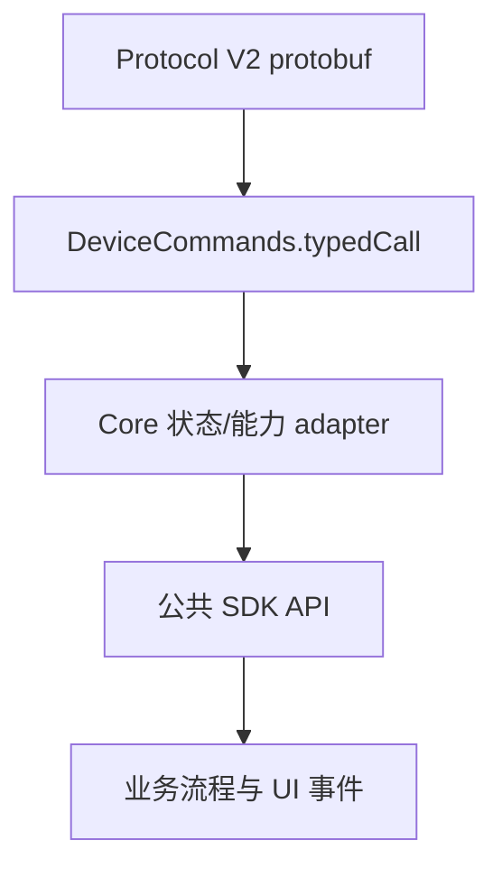

# Protocol V2 的 Core 适配

> - 文档状态：当前 Core 映射
> - 最后核验：2026-07-15
> - 适用范围：`packages/core`

本页描述“协议消息如何进入 SDK 公共能力”，不重复壁纸、设备设置、固件升级等完整用户流程。

Pro 2 的字段迁移、拆分和 Feature 缺口见 [Pro 2 字段迁移与职责拆分](./pro2-field-migration/README.md)。传输帧、协议探测和 USB/BLE 实现见 [传输协议文档](../../protocol/README.md)。

## 适配层级



## 设备信息与 Features

V2 不支持传统 `GetFeatures`。Core 在初始化时发送默认范围的 `DeviceInfoGet`，由 `buildProtocolV2FeaturesPayload` 构建 Device 内部的标准 `Features`。只有 `getDeviceInfo` API 会进一步调用 `deviceProfile` 模块生成 `DeviceProfile`。

| 调用                 | 语义                                                                            |
| -------------------- | ------------------------------------------------------------------------------- |
| 初始化 adapter       | 请求 hw、fw、coprocessor、status 的基础字段，并更新 Device 内唯一 Features 缓存 |
| `getDeviceInfo`      | 按 basic/verify/full 范围构建标准 `DeviceProfile`，可刷新缓存                   |
| 原始 `deviceInfoGet` | 按调用方 targets/types 返回未加工 `DeviceInfo`，不构建 Profile，不更新缓存      |

这三条路径不能在文档中合并成“DeviceInfoGet API”，否则会掩盖缓存和输出差异。

## 状态与 PIN 解锁

- 轻量运行状态通常由 `DeviceInfoGet` 的 status target 合并进标准 Features。
- 需要独立状态消息时使用 `DeviceStatusGet`。
- V2 PIN 解锁使用 `DeviceSessionAskPin -> DeviceSessionPinResult`，Core 将 `unlocked`、`unlocked_attach_pin`、`passphrase_protection` 合并回标准 Features。
- 受保护方法是否允许单次解锁后重试，由方法显式声明；Transport 不重放业务请求。

详见 [Attach-to-PIN](../../device/security/attach-to-pin.md) 和 [ADR-004](../../architecture/decisions/004-protected-method-unlock-retry.md)。

## 钱包 Session

内部钱包 Session 流程会把缓存的 `session_id` 传给 `DeviceSessionGet`：

```text
DeviceSessionGet(session_id?)
  -> PassphraseRequest / PassphraseAck（需要时）
  -> DeviceSession(session_id, btc_test_address)
```

缓存 session 返回 `Failure_InvalidSession` 时，Core 清理当前钱包缓存并用空 session 重试一次。`btc_test_address` 被映射为 `passphraseState`，用于确认打开的是预期钱包上下文。

原始公共方法 `deviceSessionGet` 当前发送空参数，适合协议调试；它不替代内部钱包 Session 管理。

详见 [Passphrase 与钱包 Session](../../device/session/pro-passphrase-session.md) 和 [ADR-003](../../architecture/decisions/003-wallet-session-ownership.md)。

## 文件能力

公共文件 API 在 V2 设备上使用 `Filesystem*`：

- 读：`FilesystemPathInfoQuery` + 分块 `FilesystemFileRead`。
- 写：helper 按 WebUSB/BLE 上限切分 `FilesystemFileWrite`，根据设备返回的 `processed_byte` 推进。
- 目录：`FilesystemDirList/Make/Remove`。
- 维护：`FilesystemPermissionFix`、`FilesystemFormat`。

文件分片属于 Core 的业务编排，不属于 wire protocol；Transport 只发送已经编码好的单个请求帧。

## 固件更新

需要区分两层 API：

| 层级                        | 职责                                                                                      |
| --------------------------- | ----------------------------------------------------------------------------------------- |
| 原始 `deviceFirmwareUpdate` | 规范化 targets，发送 `DeviceFirmwareUpdateRequest`，接收中间 `DeviceFirmwareUpdateStatus` |
| 高层固件升级                | 校验包、创建目录、分块暂存 resource/bootloader/firmware、触发安装、轮询、处理断连与重连   |

“功能拆分”应记录在本适配页和对应业务文档，不能写进帧格式或 Transport 文档。

完整流程见 [Pro2 固件升级](../../business/firmware-update/pro2.md)。

## 其他 Protocol V2 专属能力

Core 还提供设备设置、设置页、壁纸、工厂信息、重启和文件系统维护等 V2 专属方法。它们统一通过 `requireProtocolV2` 做设备守卫；面向用户的行为分别记录在：

- [设备设置](../../business/device-settings.md)
- [壁纸上传](../../business/device-customization/wallpaper.md)
- [设备方法支持矩阵](../../device/capabilities/method-support.md)
