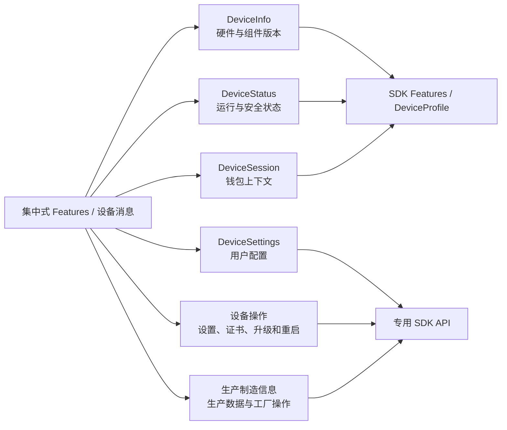

# Pro 2 字段迁移与职责拆分

> - 文档状态：当前实现
> - 最后代码核验：2026-07-15
> - 适用范围：Pro 2 Protocol V2 protobuf 与 Hardware JS SDK Core 适配
> - 维护要求：设备相关 protobuf 或 `packages/core/src/deviceProfile` 映射变化后同步更新

本文档组说明 Pro 2 的设备字段如何从集中式设备信息迁移到 Protocol V2 中不同用途的消息，以及 SDK 如何把其中一部分重新转换为公共设备信息。

如果需要一篇不依赖其他页面、可以直接复制到 Confluence 的完整说明，请阅读 [Pro 2 Protocol V2 字段迁移完整总结](./confluence-summary.md)。

这里的“迁移”包含四种情况：

- **移动**：语义不变，但字段进入新的消息模块，例如 `device_id` 进入 `DeviceStatus`。
- **重命名**：固件字段名与 SDK 公共字段名不同，例如 `passphrase_enabled` 映射为 `passphraseProtection`。
- **拆分**：原本可从一次初始化获得的内容，改为通过信息、状态、设置或 Session API 分别读取。
- **不再归一化**：Protocol V2 已有独立来源，但 SDK 不再把它塞回标准 `Features`，调用方应使用专用 API。

## 为什么要拆分

Protocol V1 的 `Initialize -> Features` 同时承担设备身份、版本、运行状态、用户设置和钱包上下文等职责。Pro 2 的 Protocol V2 按变化频率和安全边界拆开这些数据：

拆分后的核心原则是：静态信息和动态状态可以在 SDK 初始化时进行有限归一化；用户设置、钱包 Session、工厂信息和控制操作保留独立 API，不再扩张 `DeviceInfo`。

## 按用途分类

| 内容分类                                                  | protobuf 文件                                                    | 主要职责                                                      | SDK 入口                                               |
| --------------------------------------------------------- | ---------------------------------------------------------------- | ------------------------------------------------------------- | ------------------------------------------------------ |
| [设备信息](./device-info.md)                              | `messages_device_info.proto`                                     | 型号、序列号、主控、协处理器、SE 版本与校验信息               | 初始化 adapter、`getDeviceInfo`、`deviceInfoGet`       |
| [设备状态](./device-status.md)                            | `messages_device_status.proto`                                   | 初始化、解锁、备份、Passphrase、Attach-to-PIN、onboarding     | `deviceStatusGet`、Device 内部状态刷新                 |
| [设备设置](./device-settings.md)                          | `messages_device_control.proto`                                  | label、语言、蓝牙、显示、锁屏、触觉等用户配置                 | `deviceSettingsGet/Set/PageShow`                       |
| [钱包 Session](./device-session.md)                       | `messages_device_session.proto`                                  | 钱包 Session 恢复、钱包标识、PIN 解锁结果                     | 内部钱包 Session、`deviceSessionGet`                   |
| [设备操作与生产制造信息](./device-control-and-factory.md) | `messages_device_control.proto`、`messages_device_factory.proto` | 重启、证书、固件安装、生产信息与工厂操作                      | 对应 Protocol V2 专用方法                              |
| [SDK 归一化](./sdk-normalization.md)                      | Core adapter                                                     | 原始 protobuf 到标准 `Features`、`DeviceProfile` 的映射与缺口 | `buildProtocolV2FeaturesPayload`、`buildDeviceProfile` |

## 总迁移矩阵

| 旧的集中式语义               | Protocol V2 新归属                                                | SDK 当前处理                            | 迁移类型      |
| ---------------------------- | ----------------------------------------------------------------- | --------------------------------------- | ------------- |
| 设备型号、序列号             | `DeviceInfo.hw`                                                   | 进入 `Features` 与 `DeviceProfile`      | 移动          |
| 主控、BLE、SE 版本           | `DeviceInfo.fw/coprocessor/se1..se4`                              | 按请求 scope 读取并归一化               | 拆分 + 结构化 |
| `device_id`                  | `DeviceStatus.device_id`                                          | 映射为 `Features.deviceId`              | 移动          |
| 初始化、解锁、备份状态       | `DeviceStatus`                                                    | 进入标准状态字段                        | 移动          |
| Passphrase 是否启用          | `DeviceStatus.passphrase_enabled`                                 | 映射为 `passphraseProtection`           | 重命名        |
| Attach-to-PIN 状态           | `DeviceStatus.attach_to_pin_enabled`、`unlocked_by_attach_to_pin` | 映射为标准 Attach-to-PIN 字段           | 重命名        |
| label、语言、蓝牙开关        | `DeviceSettings`                                                  | 保留专用设置 API，不进入当前 V2 Profile | 拆分          |
| 自动锁屏、自动关机、触觉反馈 | `DeviceSettings`                                                  | 保留专用设置 API                        | 拆分          |
| 钱包上下文                   | `DeviceSession`                                                   | 由 Core 内部 Session 管理持有           | 拆分          |
| PIN 解锁结果                 | `DeviceSessionPinResult`                                          | 合并回 Device 的标准状态缓存            | 拆分 + 回写   |
| 固件安装目标和进度           | `DeviceFirmware*`                                                 | 由高层升级流程编排                      | 独立能力      |
| 工厂序列号和生产状态         | `DeviceFactoryInfo`                                               | 不与普通设备信息混用                    | 隔离          |

## 阅读和维护规则

1. 查询“字段现在属于哪个 protobuf 消息”时，以本目录的分类文档和 firmware-pro2 `latest` proto 为准。
2. 查询“应用最终能从哪个 SDK API 获得字段”时，再看 [SDK 归一化](./sdk-normalization.md)。
3. `DeviceInfo` 没有某字段，不等于整个 Protocol V2 没有该能力；先检查 `DeviceStatus`、`DeviceSettings` 和 `DeviceSession`。
4. 已经有独立消息和 API 的字段，不应为了兼容旧 `Features` 再重复加入 `DeviceInfo`。
5. proto 变化后先运行 `yarn update-protobuf`，再同步检查 hd-transport 生成类型、Core adapter 和本文档组。

## 事实来源

- protobuf：`submodules/firmware-pro2/sys/protobuf/onekey_protocol/latest/messages_device_*.proto`
- 生成 schema：`packages/hd-transport/messages-protocol-v2.json`
- 初始化与查询范围：`packages/core/src/protocols/protocol-v2/features.ts`
- 标准 Features：`packages/core/src/deviceProfile/buildDeviceFeatures.ts`
- DeviceProfile：`packages/core/src/deviceProfile/buildDeviceProfile.ts`
- Session 与状态刷新：`packages/core/src/protocols/protocol-v2/walletSession.ts`
