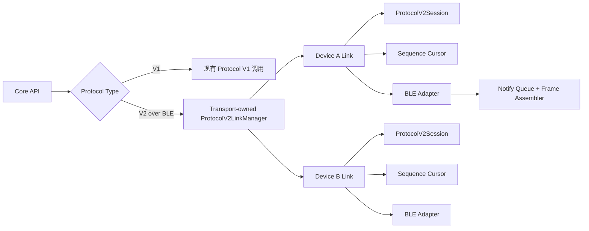
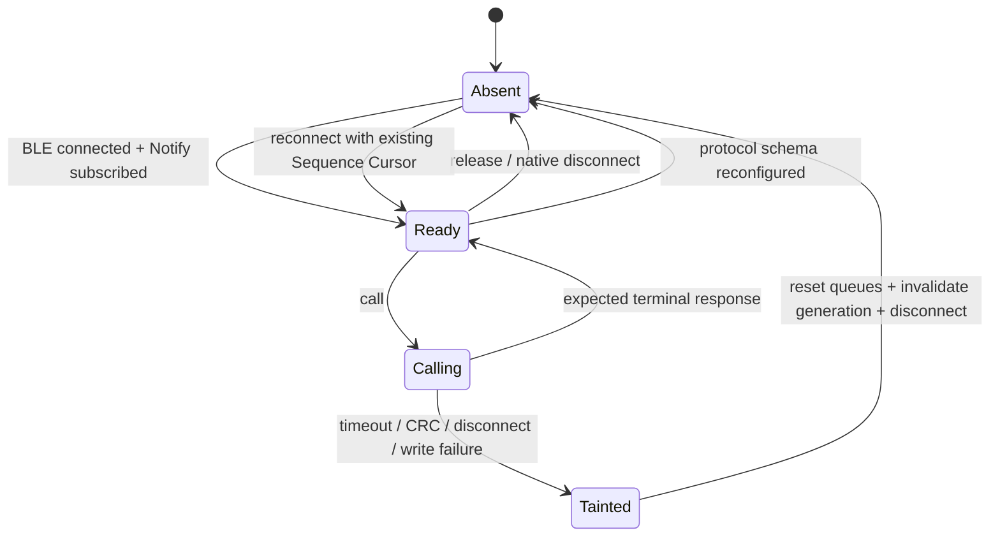

# Protocol V2 BLE Link Manager 设计

## 背景

本设计解决 Protocol V2 设备通过 BLE 连续调用时的 Session 与 SEQ 生命周期问题。真机 `Pro2 6136` 已复现以下行为：

- 单独发送 low-level `Ping` 成功，往返约 94 ms。
- 单独发送 low-level `DeviceInfoGet` 成功，往返约 65 ms。
- 同一连接中通过当前 BLE Transport 依次发送 `Ping` 与 `DeviceInfoGet` 时，两次请求都使用 `seq=1`，第二次请求超时。
- 同一连接复用单个 `ProtocolV2Session` 后，请求使用 `seq=1`、`seq=2`，两次调用均在约 60 ms 内成功。

问题位于 SDK 的 Protocol V2 BLE 传输层，不修改 Pro2 主 MCU 固件、蓝牙协处理器固件或 protobuf 协议。

## 术语

- **Protocol V2 Session**：负责 Protocol V2 帧编码、发送 SEQ 分配、单设备调用串行化、响应类型匹配和中间进度消息处理。
- **Link**：某个 Transport 实例与一个设备之间当前可用的逻辑 Protocol V2 连接。
- **Connection generation**：某个设备每次建立新原生连接或 Notify 订阅时递增的代数，用于隔离旧连接的迟到通知。
- **Sequence Cursor**：某个 Transport 实例内、按设备保存的发送 SEQ 状态，范围为 1–255，跳过 0。
- **Adapter**：由具体 BLE Transport 提供的帧读写、队列、Assembler 和连接清理实现。

## 目标

### 功能目标

- Protocol V2 over BLE 在同一逻辑连接中复用 Session，连续递增发送 SEQ。
- 同一设备严格串行调用，不同设备可以并行。
- BLE 短暂重连后重新创建 Link，但继续使用该设备的 Sequence Cursor。
- 超时、断连、帧损坏或原生连接变化后，旧 Link 不得继续接收或发送数据。
- Lowlevel/Noble BLE、React Native BLE 和 Electron BLE 使用相同的 Link 生命周期语义。
- Protocol V1、Node USB 和 WebUSB 的现有行为保持不变。

### 非功能目标

- 不引入跨 Transport 的进程级全局状态。
- 支持一个进程中的多个设备和多个 Transport 实例。
- 固件升级高吞吐写入参数与现有行为一致。
- 所有清理操作有界，不能因原生 `unsubscribe` 或 `disconnect` 不回调而永久阻塞。
- 日志能够定位 device key、generation、TX SEQ、命令名和 Link 失效原因，但不输出敏感 protobuf payload。

## 非目标

- 不修改 Pro2 固件、蓝牙固件或设备端重复过滤规则。
- 不修改 Protocol V1 帧格式与调用模型。
- 本轮不把 Node USB 或 WebUSB 迁移到新的 Link Manager。
- 不增加 Protocol V2 请求 ID，也不以响应 SEQ 关联请求。
- 不在本轮支持同一设备多个并发在途 Protocol V2 请求。

## 现状分析

### Protocol V1

Protocol V1 使用既有分包与消息调用路径，不创建 `ProtocolV2Session`，没有本设计讨论的 1–255 Session SEQ 生命周期。因此改造条件应是 `protocolType === 'V2' && transport === BLE`，不能按 `deviceType === 'pro2'` 硬编码。

### Node USB 与 WebUSB

Node USB 与 WebUSB 已经按设备路径缓存 `ProtocolV2Session`：

- 同一路径的多个 API 调用复用 Session。
- Session 内部保持连续 SEQ。
- release、连接重置或 schema 重新配置时删除 Session。

这两条 Transport 当前没有真机复现的 SEQ 重置问题。

### 三种 BLE Transport

以下 BLE Transport 当前都在每次 `callProtocolV2()` 时创建新的 `ProtocolV2Session`：

- `@onekeyfe/hd-transport-lowlevel`
- `@onekeyfe/hd-transport-react-native`
- Electron BLE Transport

由于 `ProtocolV2Session` 的内部 SEQ 从 0 开始，每次临时 Session 的首个请求都会编码为 `seq=1`。协议探测 Ping、设备初始化 DeviceInfoGet 和后续业务调用因此可能在同一设备连接中重复使用相同 SEQ。

### ble_tools 参考

`ble_tools` 使用进程级 `_proto_seq`，所有命令共享递增 SEQ，因此连续 Ping、DeviceInfoGet 和 FileWrite 不会反复从 1 开始。这证明连续发送 SEQ 是正确方向，但进程级全局变量不适用于多设备 SDK。

### 蓝牙固件参考

`bluetooth-firmware-pro2` 的 Proto Link 将 SEQ 定义为发送端链路序号，并实现重复过滤、可选 ACK 与重传。该实现用于蓝牙协处理器与主 MCU 之间的 UART 外层链路，不能直接等同于 SDK 到设备的 BLE 内层协议。

本轮只借鉴其生命周期原则：SEQ 属于发送方向的链路状态，不属于单次 API 方法。SDK 不新增或改变设备端 ACK 行为。

## 方案对比

### 方案 A：每个 BLE Transport 自行缓存 Session

每个 BLE Transport 新增 `Map<deviceKey, ProtocolV2Session>`，模仿 Node USB 与 WebUSB。

优点：

- 改动较小。
- 能直接修复连续调用重复 `seq=1`。

缺点：

- 三种 BLE Transport 会重复实现生命周期、generation、超时失效和 Sequence Cursor 逻辑。
- 容易继续出现行为差异。

### 方案 B：共享 Link Manager，每个 Transport 独立实例

在 `@onekeyfe/hd-transport` 中提供共享 `ProtocolV2LinkManager<Key>`、`ProtocolV2Link` 和 `ProtocolV2SequenceCursor`。每个 BLE Transport 持有独立 Manager 实例，并注入自己的 I/O Adapter。

优点：

- Session、SEQ、串行化和失效语义统一。
- 连接状态仍由具体 Transport 隔离管理。
- 易于单元测试和后续复用。

缺点：

- 需要定义明确的 Adapter 和错误边界。
- 首次改造量高于单纯添加 Session Map。

### 方案 C：全局 Sequence Generator

保留每次调用新建 Session，只把 SEQ 提升为进程级或模块级变量。

优点：改动最少。

缺点：

- 无法隔离多个设备与多个 SDK 实例。
- 不能解决并发串行化、迟到回包、超时 receiver 和连接 generation 问题。
- 全局回调可能引用已销毁的原生连接。

### 结论

采用方案 B：共享 Link Manager 抽象，每个 Transport 独立实例，本轮只接入三种 BLE Transport。

## 总体架构



共享 Manager 不拥有具体原生 BLE 对象。具体 Transport 继续负责扫描、连接、Characteristic、Notify 和物理断开。

## 共享组件设计

### ProtocolV2SequenceCursor

```ts
class ProtocolV2SequenceCursor {
  private current = 0;

  next(): number {
    this.current = this.current >= 255 ? 1 : this.current + 1;
    return this.current;
  }
}
```

规则：

- 范围为 1–255。
- 0 永不用于正常请求。
- Cursor 按设备 key 隔离。
- 活动 Link 销毁后 Cursor 继续保留，直到 Transport 实例 dispose。
- 继续使用较大的 SEQ 不依赖设备握手状态，设备重启后也不会产生兼容问题。

### ProtocolV2CallContext

```ts
type ProtocolV2CallContext = {
  messageName: string;
  timeoutMs?: number;
  highVolume: boolean;
  generation: number;
};
```

`ProtocolV2Session` 在调用 `writeFrame` 与 `readFrame` 时传入该上下文。现有只接收一个参数的 USB/WebUSB callback 可以忽略新增参数，保持兼容。

共享 `ProtocolV2SessionOptions` 中的上下文参数保持可选；BLE `ProtocolV2LinkAdapter` 中的上下文参数为必选。这样可以让现有 USB/WebUSB callback 不改代码，同时保证新 BLE Adapter 必须显式处理 generation 与 high-volume 信息。

`highVolume` 用于 React Native BLE 的 `FilesystemFileWrite` pacing，不能在创建持久 Session 时通过单次调用闭包捕获。

### ProtocolV2LinkAdapter

```ts
interface ProtocolV2LinkAdapter {
  router: number;
  maxFrameBytes?: number;
  generation: number;

  prepareCall(context: ProtocolV2CallContext): Promise<void> | void;
  writeFrame(frame: Uint8Array, context: ProtocolV2CallContext): Promise<void>;
  readFrame(context: ProtocolV2CallContext): Promise<Uint8Array>;
  reset(reason: string): Promise<void> | void;
}
```

职责：

- `prepareCall` 在没有请求在途时清除已经排队的迟到完整帧，并重置不完整的旧 Assembler 状态。
- `writeFrame` 完成具体 Transport 的分包、pacing 与原生写入。
- `readFrame` 只返回当前 device key、当前 generation 的完整帧。
- `reset` 取消 pending receiver、清理通知队列和 Assembler。

### ProtocolV2LinkManager

```ts
type ProtocolV2LinkManagerOptions<Key> = {
  getSchemas: () => {
    protocolV1: ParsedMessages;
    protocolV2: ParsedMessages;
  };
  classifyError: (error: unknown) => 'link-fatal' | 'recoverable';
  onLinkInvalidated?: (key: Key, reason: string) => Promise<void> | void;
};
```

- `getSchemas` 在创建 Link 时读取当前 schema，避免 Session 捕获过期配置。
- `classifyError` 由 Transport 将超时、断连、写入失败和帧错误标记为 `link-fatal`。
- `onLinkInvalidated` 由 Transport 执行物理断开或原生资源清理；Manager 本身不保存 Peripheral、Device 或 Characteristic。

```ts
class ProtocolV2LinkManager<Key> {
  constructor(options: ProtocolV2LinkManagerOptions<Key>);

  call(
    key: Key,
    createAdapter: () => ProtocolV2LinkAdapter,
    name: string,
    data: Record<string, unknown>,
    options?: TransportCallOptions
  ): Promise<MessageFromOneKey>;

  invalidateLink(key: Key, reason: string): Promise<void>;
  invalidateAllLinks(reason: string): Promise<void>;
  dispose(reason: string): Promise<void>;
}
```

Manager 内部维护：

```ts
links: Map<Key, ProtocolV2Link>;
sequences: Map<Key, ProtocolV2SequenceCursor>;
```

- `invalidateLink` 删除活动 Link，保留该设备 Cursor。
- `invalidateAllLinks` 用于 schema 重新配置等场景，保留 Cursor。
- `dispose` 删除所有 Link 与 Cursor。
- Link 内的 `ProtocolV2Session` 使用 Manager 提供的 Cursor。
- 同一 key 的调用通过 Session 串行；不同 key 互不阻塞。
- `call` 捕获 `link-fatal` 错误后，先等待 `invalidateLink` 与 `onLinkInvalidated` 完成，再向上抛出，确保下一次重试不会复用旧 reader 或旧连接。

## SEQ 与响应匹配规则

SEQ 是发送端链路帧序号，不是请求与响应的关联 ID。设备响应使用设备自己的发送 SEQ，因此 SDK 不要求 `rxSeq === txSeq`。

响应匹配依赖：

- 同一设备只有一个在途调用。
- `expectedTypes` 标识终态响应。
- `intermediateTypes` 标识进度响应。
- 当前 connection generation 隔离旧连接通知。

现有 `seq differs` 调试日志应改为中性表述，避免将正常的双向独立 SEQ 误判为协议异常。

## Link 生命周期



### 创建

Link 在原生 BLE 连接完成且 Notify 订阅完成后创建。Protocol V2 协议探测必须通过该 Link 执行，因此探测 Ping 与后续 DeviceInfoGet 使用同一 Session：

```text
Protocol probe Ping  seq=1
DeviceInfoGet        seq=2
业务调用             seq=3
```

### 正常释放

显式 release 或原生断连时：

- 递增或失效 connection generation。
- 删除活动 Link。
- 清理当前设备 Notify 队列、pending receiver 与 Assembler。
- 保留 Sequence Cursor。

### Schema 重新配置

`configureProtocolV2()` 后已创建 Session 捕获的 schema 不再可信，因此所有活动 Link 必须失效。Sequence Cursor 与 protobuf schema 无关，可以保留。

### Transport dispose

Transport 实例 dispose 时清除所有 Link、Cursor、队列、监听器和原生连接引用。

## 错误处理

### 不污染 Link 的结果

能够正确解码并作为当前调用终态返回的 `Failure` 属于应用层结果，不表示 BLE 链路损坏，Link 可以继续使用。

设备返回的 `Failure` 应作为已解码响应返回，而不是由 `classifyError` 标记为 `link-fatal`。只有 protobuf 解码失败、Transport I/O 失败或连接状态失效才进入链路错误处理。

### 必须使 Link 失效的错误

- 响应超时。
- BLE Notify 断开或 monitor token 变化。
- GATT 写入失败。
- 帧长度、头 CRC 或尾 CRC 非法。
- Frame Assembler 状态异常。
- 当前原生连接 generation 与 Link generation 不一致。
- Transport 无法取消旧 pending receiver。

失效处理必须在下一次调用前完成：

1. 标记 Link 为 tainted。
2. 使旧 generation 的通知失效。
3. 取消或释放 pending receiver。
4. 清空通知队列与 Assembler。
5. 断开原生 BLE 连接。
6. 删除 Link，保留 Sequence Cursor。
7. 由现有上层重连策略创建新 Link。

由于协议没有 request ID，同类型迟到响应无法可靠区分。超时后禁止在旧连接上直接发送下一条命令。

## 三种 BLE Transport 接入

### Lowlevel/Noble BLE

- `LowlevelTransport` 持有独立 `ProtocolV2LinkManager<string>`。
- `callProtocolV2` 委托 Manager，不再创建临时 Session。
- 协议探测、设备初始化和业务调用共用 Link。
- `release`、探测重置和连接错误调用 `invalidateLink`。
- Noble 插件通知状态从全局队列改为按 UUID 隔离。
- `receive` 增加 device key，pending receiver 只消费对应设备通知。
- `unsubscribe` 与 `disconnect` 使用有界超时，超时后仍清理 JS 状态。

### React Native BLE

- `ReactNativeBleTransport` 持有独立 Manager。
- Protocol V2 调用不再使用 Transport 全局 `runPromise` 作为主串行化机制；V1 保留原有逻辑。
- V2 同设备串行化由 Link/Session 负责。
- `writeFrame` 根据 `ProtocolV2CallContext.highVolume` 动态选择 pacing。
- 持久 Link 不捕获旧 Characteristic；每次写入按 UUID 获取当前原生连接。
- Notify 帧绑定 monitor token 与 generation，旧连接数据直接丢弃。
- release、原生断连和 monitor token 变化时使 Link 失效。

### Electron BLE

- Electron BLE Transport 持有独立 Manager。
- Protocol V2 不再使用 Transport 全局 `runPromise` 作为主串行化机制；V1 保留原有逻辑。
- `cleanupDeviceState` 同步使对应 Link 失效。
- Notification token 与 Link generation 绑定。
- 写入时按 UUID 获取当前连接，避免重连后引用旧对象。
- Protocol V1 保持现有 runPromise 与缓冲逻辑。

## Lowlevel/Noble 通知队列设计

当前 Noble 插件使用进程级 `notificationQueue` 和 `pendingReceivers`，无法隔离多个设备。改为：

```ts
type NobleNotificationState = {
  generation: number;
  queue: string[];
  pendingReceivers: Set<Receiver>;
};

notificationStates: Map<string, NobleNotificationState>;
```

- Notify listener 必须绑定 UUID 和订阅 generation。
- 只向同 UUID、同 generation 的 receiver 投递。
- disconnect 只清理目标设备状态，不影响其他 BLE 设备。
- receiver 在 resolve、reject、timeout 或 abort 后必须从集合移除。

## WebUSB 接入评估

### 是否存在同类问题

WebUSB 已经按设备 path 复用 `ProtocolV2Session`，连续调用不会重复从 `seq=1` 开始，因此不存在本次真机复现的直接故障。Node USB 也采用相同模式。

### 是否本轮迁移

本轮不迁移 WebUSB，原因如下：

- WebUSB 当前 Session 生命周期已经正确。
- 固件升级 USB 路径是现有稳定路径，重构会扩大回归面。
- WebUSB 的 transfer-in 可取消与 BLE Notify generation 模型不同，强行同步实现细节没有收益。
- 本轮目标是恢复三种 BLE Transport 的一致性，而不是重写所有 V2 Transport。

### 共享组件兼容要求

虽然 WebUSB 不接入 Manager，共享层改动必须满足：

- `ProtocolV2Session` 未注入 Cursor 时继续创建内部 Cursor。
- 现有单参数 `writeFrame/readFrame` callback 继续工作。
- WebUSB 与 Node USB 的 Session Map、release、schema reset 和 timeout 行为不变。
- 现有 USB Protocol V2 测试全部通过。

### 后续迁移条件

只有出现以下需求时，才单独评估 WebUSB 接入：

- 需要统一跨 Transport 的 Link 观测指标。
- WebUSB 出现与迟到读取或 generation 相关的真实故障。
- USB/WebUSB 重复实现的生命周期逻辑产生维护问题。

在此之前，保持现状的风险低于统一重构。

## 安全与隐私

- 日志只记录命令名、帧长度、router、generation 和 SEQ。
- 不输出完整帧 payload、PIN、passphrase、seed、签名输入或其他敏感 protobuf 字段。
- Manager 不跨 Transport 实例共享设备 key 或原生回调。
- dispose 后不得保留 Characteristic、Peripheral、Device 或 Notify callback 引用。

## 测试设计

### 共享层单元测试

- 同一 Link 连续调用使用 `1,2,3...255,1`，永不产生 0。
- Link 重建后复用同一设备 Sequence Cursor。
- 不同 key 的 Cursor 相互隔离。
- 同设备并发调用严格按提交顺序执行。
- 不同设备调用可并行。
- 有效终态 Failure 不使 Link 失效。
- timeout、CRC 错误、写入失败和 generation 变化使 Link 失效。
- 旧 generation 帧不能进入新 Link。
- dispose 清除 Link、Cursor 和 Adapter 引用。
- 未注入外部 Cursor 时保持原 Session SEQ 行为。

### Lowlevel/Noble 测试

- Protocol V2 probe 使用 `seq=1`，紧接的业务调用使用 `seq=2`。
- 同一设备连续 Ping 与 DeviceInfoGet 不重复 SEQ。
- 两台设备的通知队列完全隔离。
- 超时 receiver 被移除，不能吞掉下一连接响应。
- `unsubscribe` 不回调时，清理在限定时间内结束。
- V1 Initialize 和现有分包测试不变。

### React Native BLE 测试

- 连续 V2 调用复用同一 Link。
- `FilesystemFileWrite` 保持 high-volume pacing。
- Ping、DeviceInfoGet 不使用 high-volume pacing。
- 透明重连后写入使用当前 Characteristic。
- 旧 monitor token/generation 通知被丢弃。
- Protocol V1 runPromise 行为不变。

### Electron BLE 测试

- 连续 V2 调用复用同一 Link。
- `cleanupDeviceState` 删除活动 Link。
- 重连后旧 notification callback 不能投递数据。
- 不同 UUID 的通知和 Session 相互隔离。
- Protocol V1 调用不变。

### USB/WebUSB 回归测试

- Node USB 与 WebUSB 现有 Protocol V2 Session 测试通过。
- 同一路径连续调用继续递增 SEQ。
- release 与 schema reconfigure 继续删除 USB Session。
- 不出现 USB 固件升级吞吐或超时行为变化。

### 真机验收

目标设备：`Pro2 6136`。

1. 连续执行 100 轮 `Ping → DeviceInfoGet`，要求零超时、零错误响应串线。
2. 快速断开并重连，验证新 Link 继续使用该设备 Cursor。
3. 连续执行多轮 `FilesystemFileWrite`，确认 processed byte 与 offset 单调正确。
4. 使用 `/Users/caikaisheng/Downloads/pro2-dev` 完整执行 BLE `firmwareUpdateV4`。
5. 记录 transfer、install、total 时间与 KiB/s。
6. 升级后重新搜索设备并读取 DeviceInfo，确认设备恢复正常工作。

## 验收标准

- 三种 BLE Transport 不再为每次 V2 调用创建临时 Session。
- 协议探测 Ping 后的 DeviceInfoGet 使用下一个 SEQ。
- 同设备只有一个 V2 调用在途，不同设备状态隔离。
- 超时后旧 receiver 与迟到 Notify 不影响新连接。
- Protocol V1 行为不变。
- WebUSB 与 Node USB 不接入 Manager，但所有现有测试通过。
- `Pro2 6136` 完成 100 轮连续调用测试。
- `firmwareUpdateV4` 使用指定本地固件完成升级并输出速率指标。

## 实施顺序

1. 在 `hd-transport` 增加 Sequence Cursor、Call Context 和 Link Manager，并完成共享层测试。
2. 接入 Lowlevel/Noble BLE，使用 CLI 与 `Pro2 6136` 验证连续调用。
3. 接入 React Native BLE 并验证高吞吐写入参数。
4. 接入 Electron BLE 并验证 notification generation。
5. 运行 Protocol V1、USB、WebUSB 与 BLE 回归测试。
6. 执行完整 BLE `firmwareUpdateV4` 升级和测速。

## 风险与缓解

| 风险                        | 影响                 | 缓解措施                                                              |
| --------------------------- | -------------------- | --------------------------------------------------------------------- |
| 持久 Session 捕获旧原生连接 | 重连后写入失败或串线 | Adapter 按 device key 动态获取当前连接，并校验 generation             |
| 超时 read 继续等待          | 吞掉下一次调用响应   | timeout 使 Link tainted，清理 receiver 并强制重连                     |
| 高吞吐上下文丢失            | 固件升级速度下降     | Call Context 显式传递 `highVolume`                                    |
| Manager 引入全局状态        | 多 SDK 实例互相污染  | 每个 Transport 实例独立创建 Manager                                   |
| Cursor 长期保留             | 少量 Map 状态积累    | 只为实际连接过的设备创建，Transport dispose 时全部清除                |
| 共享 Session 修改影响 USB   | 稳定 USB 路径回归    | 默认内部 Cursor 与 callback 兼容，USB/WebUSB 本轮不迁移并运行完整回归 |

## ADR-001：按 Transport 实例持有共享 Link Manager

### 状态

已接受。

### 决策

在 `hd-transport` 提供共享 `ProtocolV2LinkManager` 抽象，每个 BLE Transport 创建独立实例，不使用跨 Transport 全局单例。

### 结果

- BLE Session 语义统一。
- 物理连接状态保持隔离。
- 多设备和多 SDK 实例可测试、可清理。
- 三种 BLE Transport 需要接入相同生命周期接口。

## ADR-002：SEQ Cursor 生命周期长于活动 Link

### 状态

已接受。

### 决策

连接断开时销毁 Link，但在 Transport 实例内继续保留该设备的 Sequence Cursor；Transport dispose 时统一清除。

### 结果

- BLE 快速重连不会立即重新使用低位 SEQ。
- Session 可以安全重建。
- 每个连接过的设备增加一个轻量 Cursor 状态。

## ADR-003：本轮不迁移 WebUSB

### 状态

已接受。

### 决策

WebUSB 与 Node USB 保留现有按 path 缓存 Session 的实现，只验证共享层兼容性和回归测试。

### 结果

- 避免扩大稳定 USB 固件升级路径的回归面。
- BLE 获得统一实现，USB 保持现状。
- 后续可按真实需求单独迁移 WebUSB。
