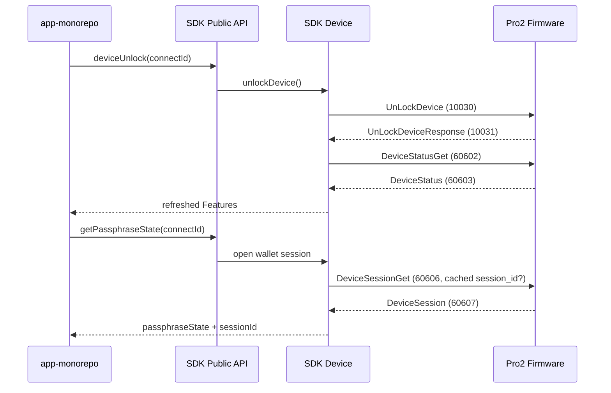

# Protocol V2 解锁与钱包 Session 接入设计

## 1. 背景

SDK 已从 `firmware-pro2/dev` 重新生成 Protocol V2 protobuf JSON 与 TypeScript 类型，并接入最新的 `DeviceStatusGet/DeviceStatus`、`DeviceSessionGet/DeviceSession` 消息。

当前固件仓库存在一个已确认的迁移中间态：

- `UnLockDevice/UnLockDeviceResponse` 的消息结构仍存在；
- `10030/10031` 在当前 `messages.proto` 中被注释；
- 部分旧生成产物仍保留这两个 ID；
- 当前 `dev` 的 handler 注册尚未恢复；
- 硬件侧后续会恢复相同的 `10030/10031` wire ID。

SDK 需要先完成稳定的公共 API 和内部职责划分，使 app-monorepo 可以保持原有调用顺序，并在固件恢复 handler 后直接工作。

## 2. 术语

- **设备解锁**：通过 `UnLockDevice(10030)` 触发设备 PIN 解锁流程，并接收 `UnLockDeviceResponse(10031)`。
- **钱包 Session**：设备已经解锁后，通过 `DeviceSessionGet(60606)` 打开或恢复安全芯片 Session，并接收 `DeviceSession(60607)`。
- **Passphrase State**：`DeviceSession.btc_test_address`，用于标识主钱包或隐藏钱包。
- **Transport Link Session**：BLE/USB `ProtocolV2LinkManager` 管理的通讯链路状态，与本设计的钱包 Session 完全不同。

为避免混淆，本设计中的共享组件命名为 `ProtocolV2WalletSessionHelper`，不使用泛化的 `SessionManager` 名称。

## 3. 目标

### 3.1 功能目标

- SDK 临时恢复 Protocol V2 的 `UnLockDevice=10030` 和 `UnLockDeviceResponse=10031` schema 映射。
- 新增底层 `deviceStatusGet`、`deviceSessionGet` 公共 API。
- Pro2 `deviceUnlock` 使用 `UnLockDevice -> DeviceStatusGet`，不调用 `DeviceSessionGet`。
- Pro2 `getPassphraseState` 使用 `DeviceSessionGet`，不再使用旧 `GetPassphraseState(10028)`。
- 集中管理 `session_id`、`btc_test_address`、缓存复用和状态刷新。
- Protocol V1 的 unlock、passphrase 与 session 逻辑保持不变。
- app-monorepo 保持“先解锁、后获取钱包 Session”的调用顺序。

### 3.2 非功能目标

- 不修改 `firmware-pro2` 协议或 handler。
- 不在日志中输出 `session_id`、`btc_test_address` 或 passphrase。
- 不允许主钱包请求隐式复用隐藏钱包 Session。
- 临时 protobuf 覆盖必须集中、可检测、可删除，不能手工修改生成 JSON。
- Raw API 保持低副作用；缓存和 Features 更新由高层 helper 负责。

## 4. 非目标

- 本轮不实现 app-monorepo 调用代码。
- 本轮不修复当前固件缺失的 `UnLockDevice` handler。
- 不恢复 `GetPassphraseState/PassphraseState` 的 `10028/10029` wire ID。
- 不改变 Transport Link 的 SEQ、连接 generation 或通讯 Session 设计。
- 不自动轮询用户手动解锁，也不使用 `DeviceSessionGet` 模拟解锁。

## 5. 方案对比

### 方案 A：临时恢复 `10030/10031`，保持原有解锁 API

SDK 生成 Protocol V2 schema 时，仅在固件源尚未启用对应 ID 的情况下，将注释中的 `10030/10031` 恢复到临时聚合 proto。业务层继续调用 `UnLockDevice`。

优点：

- app-monorepo 不需要改变解锁模型；
- 固件恢复相同 ID 后 SDK 代码无需迁移；
- unlock 与钱包 Session 职责清晰。

缺点：

- 当前未补齐 handler 的固件会返回 unknown message；
- SDK 需要维护一段有明确删除条件的临时 schema 覆盖。

### 方案 B：等待固件合入后再接入

SDK 不增加临时覆盖，直到固件正式启用 `10030/10031`。

优点：协议源完全单一。

缺点：SDK 与 app 接口无法提前完成，阻塞并行开发。

### 方案 C：用 `DeviceSessionGet` 替代解锁

优点：不需要临时协议覆盖。

缺点：违反固件前置条件；设备锁定时 `DeviceSessionGet` 必须失败，职责错误。

### 决策

采用方案 A。方案 C 明确禁止。

## 6. 总体调用流程



## 7. Protobuf 临时兼容覆盖

修改 `packages/hd-transport/scripts/protobuf-build.sh` 的 Protocol V2 临时聚合 proto 处理逻辑：

1. 检查 `MessageType_UnLockDevice` 与 `MessageType_UnLockDeviceResponse` 是否已作为有效枚举存在。
2. 如果已经存在，不做任何修改。
3. 如果不存在，但存在预期的注释行和消息 body，则仅在临时 proto 中恢复：
   - `MessageType_UnLockDevice = 10030`
   - `MessageType_UnLockDeviceResponse = 10031`
4. 如果注释行、消息 body 或 ID 与预期不一致，生成过程失败，禁止静默猜测。
5. `GetPassphraseState/PassphraseState(10028/10029)` 保持缺失。

生成结果继续同步到：

- `packages/hd-transport/messages-protocol-v2.json`
- `packages/core/src/data/messages/messages-protocol-v2.json`
- `packages/hd-transport/src/types/messages.ts`

删除临时覆盖的条件：`firmware-pro2/dev` 同时恢复有效的 `10030/10031` enum、handler 注册和 response encoder。固件源恢复 enum 后，覆盖逻辑必须自动变为 no-op。

## 8. 底层 Raw API

### 8.1 deviceStatusGet

新增 `packages/core/src/api/protocol-v2/DeviceStatusGet.ts`：

- 仅支持 Protocol V2；
- 调用 `typedCall('DeviceStatusGet', 'DeviceStatus', {})`；
- 返回原始 `DeviceStatus`；
- 不更新 Device Features，避免 raw API 隐式修改缓存。

公共签名：

```ts
deviceStatusGet(connectId: string, params?: CommonParams): Response<DeviceStatus>;
```

### 8.2 deviceSessionGet

新增 `packages/core/src/api/protocol-v2/DeviceSessionGet.ts`：

- 仅支持 Protocol V2；
- 接受可选 `sessionId`，映射为 `session_id`；
- 返回原始 `DeviceSession`；
- 不自动调用 unlock；
- 不写入钱包 Session 缓存。

公共签名：

```ts
type DeviceSessionGetParams = CommonParams & {
  sessionId?: string;
};

deviceSessionGet(
  connectId: string,
  params?: DeviceSessionGetParams
): Response<DeviceSession>;
```

`sessionId` 在 SDK 公共接口中保持 protobuf bytes 的现有字符串表示，不在本轮改变编码格式。

## 9. ProtocolV2WalletSessionHelper

新增：

`packages/core/src/protocols/protocol-v2/walletSession.ts`

职责：

- 请求并返回 `DeviceStatus`；
- 将 `DeviceStatus` 字段级合并到现有 Features；
- 从现有安全缓存规则中读取当前钱包的 `session_id`；
- 调用 `DeviceSessionGet`；
- 将响应中的 `session_id` 与 `btc_test_address` 写回当前钱包缓存；
- 返回统一的 `passphraseState/newSession/unlockedAttachPin` 数据。

不负责：

- 发送 `UnLockDevice`；
- 管理 Transport Link；
- 自动选择主钱包或隐藏钱包；
- 跨设备共享 Session。

安全约束延续现有行为：

- 没有 `passphraseState` 时，不扫描 `${deviceId}@*` 缓存；
- 缓存 key 继续由 device key 与 passphrase state 组成；
- `initSession` 先清理当前钱包 Session；
- 设备返回新的 `btc_test_address` 时，以返回值作为钱包标识。

## 10. 高层 API 行为

### 10.1 deviceUnlock

Protocol V1：保持现有实现和版本门槛。

Protocol V2：

1. 发送 `UnLockDevice`；
2. 接收 `UnLockDeviceResponse`；
3. 调用 `DeviceStatusGet`；
4. 使用真实 `DeviceStatus` 刷新 Features；
5. 返回刷新后的 Features。

不使用 `UnLockDeviceResponse` 作为最终状态源。该响应用于确认解锁命令完成，最终状态以 `DeviceStatus` 为准。

当前固件未注册 handler 时，SDK 不回退到 `DeviceSessionGet`。unknown message 应转换为明确的“不支持当前固件”错误。

### 10.2 getPassphraseState

Protocol V1：保留 `GetPassphraseState/PassphraseState`、GetAddress fallback 与 attach-to-pin 逻辑。

Protocol V2：

1. 如果缓存状态明确显示设备锁定，返回设备锁定错误；
2. 通过 `ProtocolV2WalletSessionHelper` 获取缓存 Session；
3. 调用 `DeviceSessionGet`；
4. 返回 `btc_test_address` 作为 `passphraseState`；
5. 返回 `session_id` 作为 `sessionId`；
6. 更新对应钱包 Session 缓存；
7. 必要时刷新 DeviceStatus。

## 11. app-monorepo 调用契约

标准顺序：

```ts
await sdk.deviceUnlock(connectId);

const { payload } = await sdk.getPassphraseState(connectId, {
  useEmptyPassphrase,
  passphraseState,
});
```

app-monorepo 不应直接依赖 `DeviceSessionGet` 来触发 PIN 页面。底层 `deviceSessionGet` 仅用于调试、协议验证或明确掌握设备状态的调用方。

## 12. 错误处理

- `UnLockDevice` unknown message：转换为当前固件不支持解锁协议，不进行 Session fallback。
- `DeviceSessionGet` 在锁定状态失败：向上返回设备锁定错误，不自动调用 unlock。
- `DeviceStatusGet` 失败：不使用旧缓存伪装成功；unlock 方法整体失败。
- Session 响应缺少 `session_id`：允许返回 passphrase state，但不写缓存。
- Session 响应缺少 `btc_test_address`：不生成伪造 passphrase state。
- 缓存 Session 被设备拒绝：本轮不对所有 ProcessError 自动重试；等待固件提供可区分的 invalid-session 错误。

## 13. 测试设计

### protobuf 与生成测试

- V2 schema 包含 `UnLockDevice=10030`、`UnLockDeviceResponse=10031`；
- V2 schema 不包含 `GetPassphraseState=10028`、`PassphraseState=10029`；
- `DeviceStatus/DeviceSession` ID 与固件一致；
- transport/core 两份 V2 JSON 完全一致；
- 固件未来启用 `10030/10031` 后，临时覆盖不会生成重复 enum。

### Raw API 测试

- `deviceStatusGet` 发送正确 request/response 类型；
- `deviceSessionGet` 正确转换 `sessionId -> session_id`；
- 两个 Raw API 在 Protocol V1 上返回不支持错误；
- Raw API 不修改 Features 或钱包缓存。

### Session helper 测试

- 相同钱包复用缓存 `session_id`；
- 主钱包不会扫描或复用隐藏钱包 Session；
- DeviceSession 响应更新 `session_id` 与 `btc_test_address`；
- `initSession` 清理旧 Session；
- 状态刷新字段级合并，不丢失固件版本、SE 和 BLE 信息。

### V1/V2 分流测试

- V1 `deviceUnlock` 仍使用原有路径；
- V2 `deviceUnlock` 使用 `UnLockDevice -> DeviceStatusGet`；
- V1 `getPassphraseState` 行为不变；
- V2 `getPassphraseState` 只使用 `DeviceSessionGet`；
- V2 锁定状态不会调用 `DeviceSessionGet`。

## 14. ADR-001：临时恢复 Protocol V2 Unlock wire ID

### 状态

Accepted

### 上下文

SDK 与 app 需要并行完成 Pro2 解锁接口，但当前 `firmware-pro2/dev` 尚未完整恢复 `UnLockDevice` 的 enum 和 handler。硬件侧确认后续继续使用既有 `10030/10031`。

### 决策

SDK protobuf 生成阶段临时恢复 `UnLockDevice=10030` 与 `UnLockDeviceResponse=10031`，业务 API 保持原有名称和语义。覆盖只作用于临时聚合 proto，不修改 firmware 子模块或手工编辑生成 JSON。

### 正面影响

- SDK、app 与 firmware 可以并行开发；
- app 调用模型不变；
- 固件恢复相同 ID 后无需业务迁移。

### 负面影响

- 当前未补齐 handler 的固件无法通过真机解锁测试；
- SDK 暂时存在一个协议兼容覆盖，需要明确清理。

### 备选方案

- 等待固件合入：阻塞 SDK 与 app 开发。
- 使用 DeviceSessionGet 解锁：违反协议前置条件。

### 清理条件

固件 `dev` 同时启用 `10030/10031` enum、handler 注册和 response encoder 后，删除临时覆盖及对应“覆盖生效”测试，保留最终协议 ID 测试。
