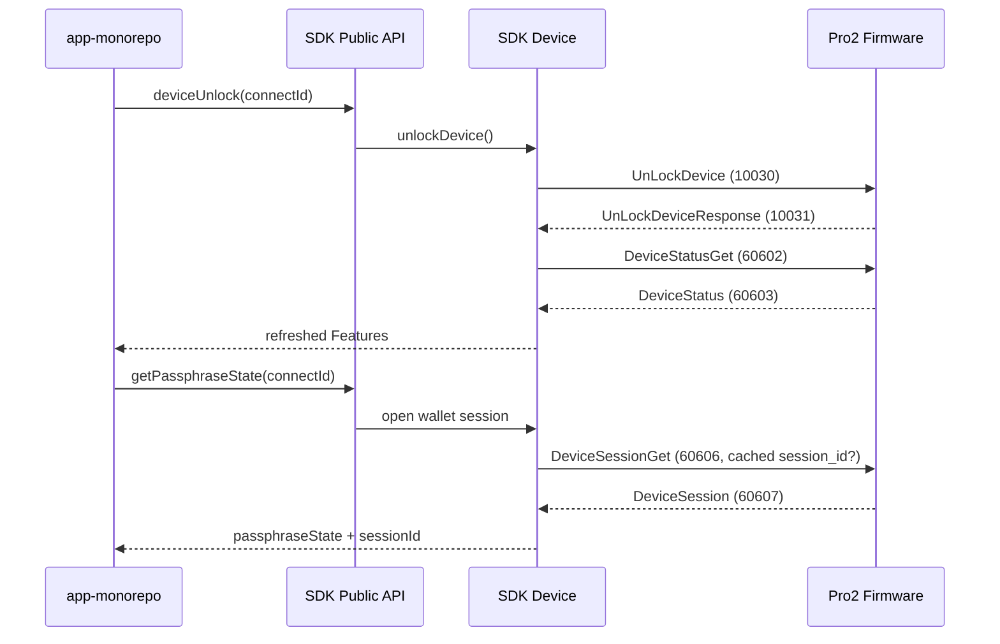

# Protocol V2 解锁与钱包 Session 接入设计

## 1. 背景

SDK 已从 `firmware-pro2/dev` 重新生成 Protocol V2 protobuf JSON 与 TypeScript 类型，并接入最新的 `DeviceStatusGet/DeviceStatus`、`DeviceSessionGet/DeviceSession` 消息。

当前固件仓库存在一个已确认的迁移中间态：

- `UnLockDevice/UnLockDeviceResponse` 的消息结构仍存在；
- `10030/10031` 在当前 `messages.proto` 中被注释；
- 部分旧生成产物仍保留这两个 ID；
- 当前 `dev` 的 handler 注册尚未恢复；
- 硬件侧后续会恢复相同的 `10030/10031` wire ID。

SDK 需要先完成稳定的公共 API 和内部职责划分，使 app-monorepo 可以保持原有调用顺序，并在固件恢复 handler 后直接工作。

## 2. 术语

- **设备解锁**：通过 `UnLockDevice(10030)` 触发设备 PIN 解锁流程，并接收 `UnLockDeviceResponse(10031)`。
- **钱包 Session**：设备已经解锁后，通过 `DeviceSessionGet(60606)` 打开或恢复安全芯片 Session，并接收 `DeviceSession(60607)`。
- **Passphrase State**：`DeviceSession.btc_test_address`，用于标识主钱包或隐藏钱包。
- **Transport Link Session**：BLE/USB `ProtocolV2LinkManager` 管理的通讯链路状态，与本设计的钱包 Session 完全不同。

为避免混淆，本设计中的共享组件命名为 `ProtocolV2WalletSessionHelper`，不使用泛化的 `SessionManager` 名称。

## 3. Pro1 现状与跨仓库结论

### 3.1 hardware-js-sdk 当前的 Pro1 Session 模型

Protocol V1 已经形成了一套可复用的职责边界：

- `Device.initialize()` 从 SDK 内部缓存读取 `session_id`，并作为 `Initialize` 请求参数发送给设备；
- 支持新 passphrase 协议的 Pro1 设备通过 `getPassphraseState()` 获得 `passphraseState + sessionId`；
- `Device.updateInternalState()` 将 `sessionId` 绑定到 `deviceId + passphraseState`；
- 后续地址、签名等调用只接收 `passphraseState`，SDK 根据它查找对应的 `sessionId`；
- 没有 `passphraseState` 时禁止扫描其他隐藏钱包缓存，避免主钱包请求误用隐藏钱包 Session；
- `initSession`、钱包状态不匹配和安全检查失败时，由 SDK 清理对应缓存。

这说明 Pro1 的核心模型不是“App 管理 Session”，而是：

> App 持有钱包身份 `passphraseState`，SDK 持有设备会话句柄 `sessionId`。

### 3.2 app-monorepo 当前行为

对 `app-monorepo` 的只读检查确认：

- `IDBWallet.passphraseState` 会持久化钱包对应的 `passphraseState`；
- `ServiceAccount.getWalletDeviceParams()` 在地址、签名和预初始化调用中持续传入 `passphraseState/useEmptyPassphrase`；
- `ServiceHardware.getPassphraseState()` 只消费 SDK 的标准 payload；
- App 没有调用 `preloadSessionCache`，也没有在 Realm、Jotai 或硬件服务中持久化 OneKey `sessionId`；
- App 使用长生命周期的 SDK 实例，当前运行期的 `sessionId` 由 SDK 内存缓存承担；
- 只有短生命周期的 `hd-cli` 会将 `passphraseState + sessionId` 写入系统密钥链，再调用 `preloadSessionCache` 恢复缓存。

因此 app-monorepo 接入 Pro2 时不应新增第二套 App Session Manager，也不应把 `sessionId` 写入钱包数据库。

### 3.3 设计结论

Pro2 延续 Pro1 的外部契约，但整理 SDK 内部实现：

- V1 与 V2 共享一个 SDK 内部钱包 Session 存储组件；
- V1 保持现有协议流程和行为不变；
- V2 使用独立 helper 编排 `DeviceStatusGet/DeviceSessionGet`；
- 钱包 Session 存储在实际运行 core 的 JavaScript runtime 内共享、与 Transport 无关；
- BLE/USB 的 `ProtocolV2LinkManager` 仍然是每个 Transport 独立实例，不能与钱包 Session 合并。

## 4. 目标

### 4.1 功能目标

- SDK 临时恢复 Protocol V2 的 `UnLockDevice=10030` 和 `UnLockDeviceResponse=10031` schema 映射。
- 新增底层 `deviceStatusGet`、`deviceSessionGet` 公共 API。
- Pro2 `deviceUnlock` 使用 `UnLockDevice -> DeviceStatusGet`，不调用 `DeviceSessionGet`。
- Pro2 `getPassphraseState` 使用 `DeviceSessionGet`，不再使用旧 `GetPassphraseState(10028)`。
- 集中管理 `session_id`、`btc_test_address`、缓存复用和状态刷新。
- 抽出现有 V1/V2 共用的钱包 Session 存储规则，避免 Pro2 建立平行缓存。
- Protocol V1 的 unlock、passphrase 与 session 逻辑保持不变。
- app-monorepo 保持“先解锁、后获取钱包 Session”的调用顺序。

### 4.2 非功能目标

- 不修改 `firmware-pro2` 协议或 handler。
- 不在日志中输出 `session_id`、`btc_test_address` 或 passphrase。
- 不允许主钱包请求隐式复用隐藏钱包 Session。
- 临时 protobuf 覆盖必须集中、可检测、可删除，不能手工修改生成 JSON。
- Raw API 保持低副作用；缓存和 Features 更新由高层 helper 负责。
- App 无需感知协议消息 ID、Session 缓存 key 或状态刷新细节。

## 5. 非目标

- 本轮不实现 app-monorepo 调用代码。
- 本轮不修复当前固件缺失的 `UnLockDevice` handler。
- 不恢复 `GetPassphraseState/PassphraseState` 的 `10028/10029` wire ID。
- 不改变 Transport Link 的 SEQ、连接 generation 或通讯 Session 设计。
- 不自动轮询用户手动解锁，也不使用 `DeviceSessionGet` 模拟解锁。
- 不让 SDK 持久化 `sessionId` 到磁盘、Realm、AsyncStorage 或浏览器存储。
- 不让 SDK 感知 `walletId`、账户选择、页面路由或用户交互流程。

## 6. 方案对比

### 方案 A：临时恢复 `10030/10031`，保持原有解锁 API

SDK 生成 Protocol V2 schema 时，仅在固件源尚未启用对应 ID 的情况下，将注释中的 `10030/10031` 恢复到临时聚合 proto。业务层继续调用 `UnLockDevice`。

优点：

- app-monorepo 不需要改变解锁模型；
- 固件恢复相同 ID 后 SDK 代码无需迁移；
- unlock 与钱包 Session 职责清晰。

缺点：

- 当前未补齐 handler 的固件会返回 unknown message；
- SDK 需要维护一段有明确删除条件的临时 schema 覆盖。

### 方案 B：等待固件合入后再接入

SDK 不增加临时覆盖，直到固件正式启用 `10030/10031`。

优点：协议源完全单一。

缺点：SDK 与 app 接口无法提前完成，阻塞并行开发。

### 方案 C：用 `DeviceSessionGet` 替代解锁

优点：不需要临时协议覆盖。

缺点：违反固件前置条件；设备锁定时 `DeviceSessionGet` 必须失败，职责错误。

### 决策

采用方案 A。方案 C 明确禁止。

## 7. 总体调用流程



## 8. Protobuf 临时兼容覆盖

修改 `packages/hd-transport/scripts/protobuf-build.sh` 的 Protocol V2 临时聚合 proto 处理逻辑：

1. 检查 `MessageType_UnLockDevice` 与 `MessageType_UnLockDeviceResponse` 是否已作为有效枚举存在。
2. 如果已经存在，不做任何修改。
3. 如果不存在，但存在预期的注释行和消息 body，则仅在临时 proto 中恢复：
   - `MessageType_UnLockDevice = 10030`
   - `MessageType_UnLockDeviceResponse = 10031`
4. 如果注释行、消息 body 或 ID 与预期不一致，生成过程失败，禁止静默猜测。
5. `GetPassphraseState/PassphraseState(10028/10029)` 保持缺失。

生成结果继续同步到：

- `packages/hd-transport/messages-protocol-v2.json`
- `packages/core/src/data/messages/messages-protocol-v2.json`
- `packages/hd-transport/src/types/messages.ts`

删除临时覆盖的条件：`firmware-pro2/dev` 同时恢复有效的 `10030/10031` enum、handler 注册和 response encoder。固件源恢复 enum 后，覆盖逻辑必须自动变为 no-op。

## 9. 底层 Raw API

### 9.1 deviceStatusGet

新增 `packages/core/src/api/protocol-v2/DeviceStatusGet.ts`：

- 仅支持 Protocol V2；
- 调用 `typedCall('DeviceStatusGet', 'DeviceStatus', {})`；
- 返回原始 `DeviceStatus`；
- 不更新 Device Features，避免 raw API 隐式修改缓存。

公共签名：

```ts
deviceStatusGet(connectId: string, params?: CommonParams): Response<DeviceStatus>;
```

### 9.2 deviceSessionGet

新增 `packages/core/src/api/protocol-v2/DeviceSessionGet.ts`：

- 仅支持 Protocol V2；
- 接受可选 `sessionId`，映射为 `session_id`；
- 返回原始 `DeviceSession`；
- 不自动调用 unlock；
- 不写入钱包 Session 缓存。

公共签名：

```ts
type DeviceSessionGetParams = CommonParams & {
  sessionId?: string;
};

deviceSessionGet(
  connectId: string,
  params?: DeviceSessionGetParams
): Response<DeviceSession>;
```

`sessionId` 在 SDK 公共接口中保持 protobuf bytes 的现有字符串表示，不在本轮改变编码格式。

## 10. DeviceWalletSessionStore

将当前 `Device.ts` 中的模块级 `deviceSessionCache` 抽到独立内部组件：

`packages/core/src/device/DeviceWalletSessionStore.ts`

该组件只负责钱包 Session 的安全存储和生命周期，不发送协议消息。内部接口包含：

- `get(deviceKey, passphraseState)`；
- `set(deviceKey, passphraseState, sessionId)`；
- `delete(deviceKey, passphraseState)`；
- `deleteDevice(deviceKey)`；
- `clear()`；
- `preload(deviceKey, passphraseState, sessionId)`。

约束：

- `passphraseState` 缺失时不读取隐藏钱包 Session；
- 不扫描 `${deviceKey}@*` 或尝试“最近使用”的 Session；
- 不在日志、错误对象或调试快照中输出 `sessionId`；
- V1 的 `Initialize/GetPassphraseState` 继续通过该 Store 读写，协议行为不变；
- V2 的 `ProtocolV2WalletSessionHelper` 使用同一个 Store，不建立第二份缓存；
- Store 是同一 JavaScript runtime 内共享、Transport 无关的缓存，因为钱包 Session 属于设备协议状态，不属于 BLE/USB 链路状态；跨进程或页面重载不保证保留。
- `deviceKey` 优先使用稳定的 `features.deviceId`；初始化早期只能使用 descriptor path/id 时，获得稳定 deviceId 后必须迁移别名，避免 BLE/USB 路径差异产生重复缓存。

现有模块级 `preloadSessionCache(deviceId, passphraseState, sessionId)` 保持兼容，内部改为调用 Store，继续服务直接运行 core 的 Node/hd-cli 场景。

App 侧需要的清理能力必须通过 `CoreApi` 路由到真正持有 Store 的 low-level core，不能只增加模块级函数。新增无设备本地控制方法：

```ts
type ClearSessionCacheParams = {
  deviceId?: string;
  passphraseState?: string;
};

clearSessionCache(params?: ClearSessionCacheParams): Response<{ cleared: true }>;
```

该方法对应的 BaseMethod 设置 `useDevice = false`、`useDevicePassphraseState = false`，不搜索、连接或初始化设备，只通过现有 top-level/low-level 通道在实际 core runtime 中清理 Store。

清理语义：

- `deviceId + passphraseState`：清理指定钱包；
- 仅 `deviceId`：清理该设备所有钱包；
- 无参数：清理实际 core runtime 内全部钱包 Session。

不暴露 Store 的查询或枚举 API，避免 App 依赖缓存内部结构。当前不为 app-monorepo 增加 routed preload API，因为 App 不持久化 `sessionId`；如果未来 Web 宿主需要跨页面恢复 Session，应新增同样经过 CoreApi 路由的 preload 方法，不能直接假设模块导出与 low-level core 处于同一 realm。

## 11. ProtocolV2WalletSessionHelper

新增：

`packages/core/src/protocols/protocol-v2/walletSession.ts`

职责：

- 请求并返回 `DeviceStatus`；
- 将 `DeviceStatus` 字段级合并到现有 Features；
- 从现有安全缓存规则中读取当前钱包的 `session_id`；
- 调用 `DeviceSessionGet`；
- 将响应中的 `session_id` 与 `btc_test_address` 写回当前钱包缓存；
- 返回统一的 `passphraseState/newSession/unlockedAttachPin` 数据。

不负责：

- 发送 `UnLockDevice`；
- 管理 Transport Link；
- 自动选择主钱包或隐藏钱包；
- 跨设备共享 Session。

安全约束延续现有行为：

- 没有 `passphraseState` 时，不扫描 `${deviceId}@*` 缓存；
- 缓存 key 继续由 device key 与 passphrase state 组成；
- `initSession` 先清理当前钱包 Session；
- 设备返回新的 `btc_test_address` 时，以返回值作为钱包标识。

Helper 与 Store 的关系：

- Helper 负责 Protocol V2 命令顺序、响应验证和 Features 刷新；
- Store 负责 V1/V2 共用的 `sessionId` 缓存规则；
- Helper 不直接访问 App 数据库，也不接收 `walletId`。

## 12. 高层 API 行为

### 12.1 deviceUnlock

Protocol V1：保持现有实现和版本门槛。

Protocol V2：

1. 发送 `UnLockDevice`；
2. 接收 `UnLockDeviceResponse`；
3. 调用 `DeviceStatusGet`；
4. 使用真实 `DeviceStatus` 刷新 Features；
5. 返回刷新后的 Features。

不使用 `UnLockDeviceResponse` 作为最终状态源。该响应用于确认解锁命令完成，最终状态以 `DeviceStatus` 为准。

当前固件未注册 handler 时，SDK 不回退到 `DeviceSessionGet`。unknown message 应转换为明确的“不支持当前固件”错误。

### 12.2 getPassphraseState

Protocol V1：保留 `GetPassphraseState/PassphraseState`、GetAddress fallback 与 attach-to-pin 逻辑。

Protocol V2：

1. 如果缓存状态明确显示设备锁定，返回设备锁定错误；
2. 通过 `ProtocolV2WalletSessionHelper` 获取缓存 Session；
3. 调用 `DeviceSessionGet`；
4. 返回 `btc_test_address` 作为 `passphraseState`；
5. 返回 `session_id` 作为 `sessionId`；
6. 更新对应钱包 Session 缓存；
7. 必要时刷新 DeviceStatus。

## 13. SDK 与 app-monorepo 职责边界

| 能力                                    | hardware-js-sdk                       | app-monorepo                                                          |
| --------------------------------------- | ------------------------------------- | --------------------------------------------------------------------- |
| Protocol V1/V2 分流和消息 ID            | 负责                                  | 不感知                                                                |
| unlock/status/session 命令顺序          | 负责                                  | 只调用高层 API                                                        |
| `sessionId` 内存缓存与缓存 key          | 负责                                  | 不实现                                                                |
| `passphraseState -> sessionId` 安全校验 | 负责                                  | 传入当前钱包的 `passphraseState`                                      |
| 钱包选择、`walletId` 和账户业务         | 不负责                                | 负责                                                                  |
| PIN/passphrase 页面与交互编排           | 发送 SDK UI 事件                      | 负责展示、响应和错误提示                                              |
| `passphraseState` 持久化                | 不负责                                | 作为钱包身份标识写入现有 `IDBWallet`；它不是用户输入的明文 passphrase |
| `sessionId` 持久化                      | 默认不负责                            | app-monorepo 不持久化；短进程宿主可选择安全存储                       |
| Transport 切换                          | 不决定业务策略；缓存与 Transport 解耦 | 决定 BLE/USB 切换时机                                                 |
| Session 清理时机                        | 提供按钱包/设备/全局清理能力          | 在退出登录、清空钱包等业务边界触发                                    |
| 固件不支持提示                          | 归一化错误                            | 转换为升级固件或重试提示                                              |

### 13.1 正常调用契约

标准顺序：

```ts
if (features.unlocked === false) {
  await sdk.deviceUnlock(connectId);
}

const { payload } = await sdk.getPassphraseState(connectId, {
  useEmptyPassphrase,
  passphraseState,
});
```

app-monorepo 不应直接依赖 `DeviceSessionGet` 来触发 PIN 页面。底层 `deviceSessionGet` 仅用于调试、协议验证或明确掌握设备状态的调用方。

### 13.2 钱包创建与后续调用

创建隐藏钱包：

1. App 根据 Features 判断是否需要调用 `deviceUnlock`；
2. App 调用 `getPassphraseState({ initSession: true })`；
3. SDK 完成设备交互、创建钱包 Session 并缓存 `sessionId`；
4. App 只将返回的 `passphraseState` 写入 `IDBWallet`；
5. App 后续地址/签名调用持续传入该 `passphraseState`；
6. SDK 根据 `deviceId + passphraseState` 复用并校验 `sessionId`。

标准钱包继续使用现有 `useEmptyPassphrase: true` 语义。App 不应为了标准钱包从 SDK 缓存中猜测或读取隐藏钱包 Session。

### 13.3 App 生命周期与持久化

- app-monorepo 的 SDK 实例在同一 JavaScript runtime 内是长生命周期实例，正常情况下只需要 SDK 内存缓存，不需要持久化 `sessionId`；
- App 的 transport reset 不应复制、转换或迁移 `sessionId`；同一 core runtime 内由 SDK 继续复用缓存，如果切换导致 runtime 重建，则按缓存未命中重新建立钱包 Session；
- 设备是 Session 有效性的最终权威，缓存值被拒绝时由 SDK 清理对应项并返回可识别错误；
- App 退出登录或全量清空钱包时通过当前 SDK 实例调用 `clearSessionCache()`；
- App 删除单个硬件钱包时通过当前 SDK 实例调用 `clearSessionCache({ deviceId, passphraseState })`；
- App 数据库、Redux/Jotai、日志和埋点不得保存 `sessionId`。

`hd-cli` 是明确的例外：进程每次命令都会退出，因此可以在系统密钥链中保存 `passphraseState + sessionId`，并通过 `preloadSessionCache` 恢复。该能力是宿主层可选策略，不改变 SDK 默认不落盘的原则。

### 13.4 app-monorepo 后续最小改动

SDK 发布后，app-monorepo 只需要：

1. 保持现有 `wallet.passphraseState -> deviceCommonParams.passphraseState` 数据流；
2. 保持 `deviceUnlock -> getPassphraseState` 高层调用顺序；
3. 不新增 App Session Manager，不调用 raw `deviceSessionGet`；
4. 固件恢复 handler 后，删除 `getFeaturesWithUnlock()` 中对 Pro2 跳过 `deviceUnlock` 的临时绕过；
5. 在 `ServiceHardware` 封装 `clearSessionCache`，并在退出登录、清空钱包和删除硬件钱包流程调用；
6. 为不支持 `UnLockDevice` 的旧 Pro2 固件展示明确升级提示。

## 14. 错误处理

- `UnLockDevice` unknown message：转换为当前固件不支持解锁协议，不进行 Session fallback。
- `DeviceSessionGet` 在锁定状态失败：向上返回设备锁定错误，不自动调用 unlock。
- `DeviceStatusGet` 失败：不使用旧缓存伪装成功；unlock 方法整体失败。
- Session 响应缺少 `session_id`：允许返回 passphrase state，但不写缓存。
- Session 响应缺少 `btc_test_address`：不生成伪造 passphrase state。
- 缓存 Session 被设备拒绝：只在固件返回可识别的 invalid-session/locked 状态时清理对应 Store 项；不对所有 ProcessError 盲目重试。
- App 传入的 `passphraseState` 与设备返回的 `btc_test_address` 不一致：清理指定钱包缓存并返回安全错误，不自动切换钱包。

## 15. 测试设计

### protobuf 与生成测试

- V2 schema 包含 `UnLockDevice=10030`、`UnLockDeviceResponse=10031`；
- V2 schema 不包含 `GetPassphraseState=10028`、`PassphraseState=10029`；
- `DeviceStatus/DeviceSession` ID 与固件一致；
- transport/core 两份 V2 JSON 完全一致；
- 固件未来启用 `10030/10031` 后，临时覆盖不会生成重复 enum。

### Raw API 测试

- `deviceStatusGet` 发送正确 request/response 类型；
- `deviceSessionGet` 正确转换 `sessionId -> session_id`；
- 两个 Raw API 在 Protocol V1 上返回不支持错误；
- Raw API 不修改 Features 或钱包缓存。

### Session helper 测试

- 相同钱包复用缓存 `session_id`；
- 主钱包不会扫描或复用隐藏钱包 Session；
- DeviceSession 响应更新 `session_id` 与 `btc_test_address`；
- `initSession` 清理旧 Session；
- 状态刷新字段级合并，不丢失固件版本、SE 和 BLE 信息。

### DeviceWalletSessionStore 测试

- V1 与 V2 使用同一份 Store，不建立重复缓存；
- 缓存 key 严格包含 `deviceKey + passphraseState`；
- 缺少 `passphraseState` 时读取失败，不扫描其他钱包；
- `preloadSessionCache` 保持兼容并写入 Store；
- `clearSessionCache` 支持单钱包、单设备和全局清理；
- `clearSessionCache` 通过 top-level/low-level 调用链在实际 core runtime 执行，且不触发设备连接；
- descriptor fallback key 在获得稳定 deviceId 后正确迁移；
- transport reset 不改变缓存 key，也不把 Link Session 写入 Store；
- 日志和错误快照不包含 `sessionId`。

### V1/V2 分流测试

- V1 `deviceUnlock` 仍使用原有路径；
- V2 `deviceUnlock` 使用 `UnLockDevice -> DeviceStatusGet`；
- V1 `getPassphraseState` 行为不变；
- V2 `getPassphraseState` 只使用 `DeviceSessionGet`；
- V2 锁定状态不会调用 `DeviceSessionGet`。

### app-monorepo 接入回归项

- 隐藏钱包创建只持久化 `passphraseState`，不持久化 `sessionId`；
- 后续签名继续从 `wallet.passphraseState` 构造 `deviceCommonParams`；
- Pro2 解锁后再调用 `getPassphraseState`；
- 删除钱包和退出登录触发对应的 SDK Session 清理；
- App 不直接调用 `deviceStatusGet/deviceSessionGet`；
- 删除临时 Pro2 unlock 绕过后，旧固件错误被转换为升级提示。

## 16. 分阶段实施顺序

1. 先为现有 V1 Session 行为补充特征测试，再将 `deviceSessionCache` 无行为变化地迁移到 `DeviceWalletSessionStore`；
2. 增加 routed `CoreApi.clearSessionCache`，验证现有模块级 `preloadSessionCache` 与 hd-cli 行为不变；
3. 增加 Protocol V2 `deviceStatusGet/deviceSessionGet` raw API；
4. 实现 `ProtocolV2WalletSessionHelper`，接入 Store、状态刷新与一致性校验；
5. 接入 V2 `getPassphraseState` 和 `deviceUnlock`，保持 V1 分支不变；
6. 重新生成临时恢复 `10030/10031` 的协议产物，完成 core/transport 构建与测试；
7. SDK 发布后再单独修改 app-monorepo，移除临时 Pro2 unlock 绕过并接入业务生命周期清理。

## 17. ADR-001：临时恢复 Protocol V2 Unlock wire ID

### 状态

Accepted

### 上下文

SDK 与 app 需要并行完成 Pro2 解锁接口，但当前 `firmware-pro2/dev` 尚未完整恢复 `UnLockDevice` 的 enum 和 handler。硬件侧确认后续继续使用既有 `10030/10031`。

### 决策

SDK protobuf 生成阶段临时恢复 `UnLockDevice=10030` 与 `UnLockDeviceResponse=10031`，业务 API 保持原有名称和语义。覆盖只作用于临时聚合 proto，不修改 firmware 子模块或手工编辑生成 JSON。

### 正面影响

- SDK、app 与 firmware 可以并行开发；
- app 调用模型不变；
- 固件恢复相同 ID 后无需业务迁移。

### 负面影响

- 当前未补齐 handler 的固件无法通过真机解锁测试；
- SDK 暂时存在一个协议兼容覆盖，需要明确清理。

### 备选方案

- 等待固件合入：阻塞 SDK 与 app 开发。
- 使用 DeviceSessionGet 解锁：违反协议前置条件。

### 清理条件

固件 `dev` 同时启用 `10030/10031` enum、handler 注册和 response encoder 后，删除临时覆盖及对应“覆盖生效”测试，保留最终协议 ID 测试。

## 18. ADR-002：SDK 与 App 的钱包 Session 所有权

### 状态

Proposed

### 上下文

Pro1 已由 SDK 缓存 `sessionId`，App 只持久化和回传 `passphraseState`。Pro2 新增 `DeviceSessionGet` 后，如果 App 直接管理 `sessionId`，会复制 SDK 的缓存、安全校验和 Transport 适配逻辑，并使 V1/V2 行为分裂。

### 决策

- SDK 拥有钱包 Session 协议、内存缓存、安全校验和清理实现，并通过 routed CoreApi 暴露业务生命周期清理能力；
- App 拥有钱包身份、用户交互和业务生命周期；
- App 默认只持久化 `passphraseState`，不持久化 `sessionId`；
- 短生命周期宿主可以使用安全存储和 `preloadSessionCache`，但不能依赖 Store 内部结构；
- V1/V2 共用 `DeviceWalletSessionStore`，Protocol V2 由 `ProtocolV2WalletSessionHelper` 编排。

### 正面影响

- 延续 Pro1 已验证的 SDK 接口模型；
- app-monorepo 改动小，不需要理解 Protocol V2 细节；
- BLE/USB 切换不会产生两份钱包 Session 管理器；
- Session 安全校验集中，减少主钱包/隐藏钱包串用风险。

### 负面影响

- SDK 需要补充明确的 Store 生命周期和清理 API；
- 短生命周期宿主如果要跨进程复用，需要自行选择安全存储；
- App 与 SDK 必须共同维护退出登录、钱包删除等清理调用契约；Web/iframe 场景还需要确保调用路由到实际 low-level core。

### 备选方案

- App 全量管理 `sessionId`：职责重复，协议泄漏，拒绝。
- Pro2 建立独立缓存：V1/V2 行为分裂，拒绝。
- SDK 自行落盘：跨平台安全存储策略不可控，拒绝。
