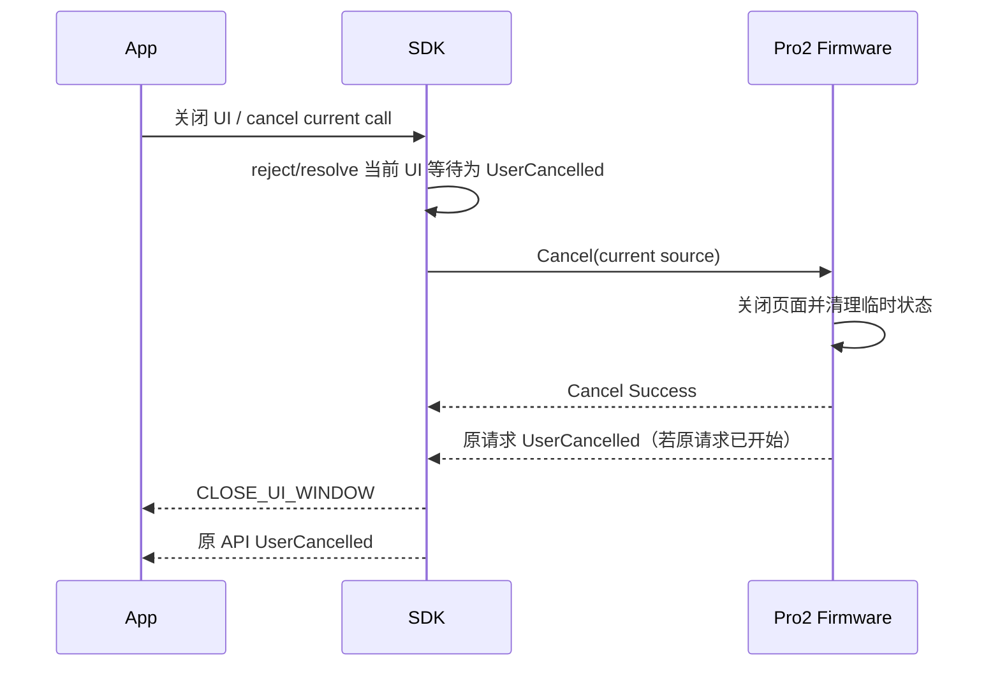

# Pro2 无固件中间 Event 交互生命周期设计

## 一页结论

SDK → App 的 Event UI 仍然存在，因此用户关闭 Event 对话框仍可以取消当前硬件调用。删除的只是
firmware 等待 `ButtonAck/PassphraseAck/PinMatrixAck` 的中间状态，不是 App 的取消入口。

```text
App 关闭 Event UI / 点击取消
  -> SDK 结束阻塞 UI 等待（如有）
  -> SDK 发送 Cancel 给当前设备和 Transport source
  -> 原 API Promise 以 UserCancelled 结束
  -> SDK 发 CLOSE_UI_WINDOW 并清理所有等待项
```

## Event 类型与取消

| Event 类型       | 示例                                     | App 关闭时 SDK 行为                                        |
| ---------------- | ---------------------------------------- | ---------------------------------------------------------- |
| 阻塞选择 Event   | 钱包 Passphrase / Hidden Wallet PIN 选择 | 以取消结束 UI Promise；若设备命令已开始则同时发送 `Cancel` |
| 非阻塞提示 Event | PIN、地址确认、签名、设备管理            | 直接取消当前 API 调用并向设备发送 `Cancel`                 |
| 状态通知 Event   | Onboarding 阶段、进度                    | 关闭展示不默认取消；只有明确“取消任务”动作才调用取消 API   |
| 关闭通知         | `CLOSE_UI_WINDOW/CLOSE_UI_PIN_WINDOW`    | App 幂等收起 UI，不反向触发第二次取消                      |

App 必须区分“用户主动取消”和“收到 SDK 关闭通知”，避免关闭回调形成 cancel 循环。

## 单请求规则

同一设备、同一 Transport source 同时只允许一个前台交互请求：

- 已有交互时，新交互返回 `Busy`。
- 非交互状态查询可以按 firmware 并发能力决定是否允许。
- USB Cancel 不能取消 BLE 请求，BLE Cancel 也不能取消 USB 请求。
- 取消不能自动选择另一台同型号设备继续原请求。

## 主动取消时序



没有活动设备交互时，`Cancel` 应幂等成功。SDK 也必须允许在“Event 已发出、设备命令尚未发送”的窗口
内只取消本地 UI 等待，而不制造无归属的设备请求。

## 超时与等待项清理

- 删除所有等待 firmware `ButtonAck/PassphraseAck/PinMatrixAck` 的超时。
- 保留 SDK 阻塞选择 Event 的 UI 超时/取消策略、设备页面超时、SE 超时、传输超时和方法级超时。
- 方法超时后，SDK 尝试向当前 source 发送 `Cancel`，并清理请求队列和 UI Promise。
- 当前 Core `_uiPromises` 仅按 `UI_RESPONSE` 类型匹配；新增合成阻塞 Event 前必须保证串行，或引入
  requestId/connectId 关联，防止多设备同类型响应串线。
- 取消、超时、断连和调用结束必须清理同一等待项；清理操作应幂等。
- 迟到的 `uiResponse()` 或设备响应不能绑定到下一个调用。

## 断连与重连

- 断连立即结束当前请求、阻塞 Event 等待和非阻塞提示 UI。
- 不允许自动选择另一台设备继续原请求。
- 重连后通过状态查询和 Session 恢复重新开始，不复用未完成交互。
- firmware 重启导致的预期断连由升级、擦除等具体方法状态机识别。

## 产品行为

用户仍可从原有硬件 Event 对话框取消操作。交互层面的变化很小：取消不再需要先解除 firmware 的
UI ACK 等待，而是直接取消当前显式业务命令。对 App 来说，成功、失败、取消、断连都继续通过同一
UI 生命周期收口。

## 验收项

- Passphrase、Attach PIN、PIN、地址确认、签名和设备管理 Event UI 都能取消当前调用。
- 阻塞 Event 在设备命令发送前取消时，不会继续执行 select。
- 非阻塞 Event 取消时，当前设备页面和原 API 都结束。
- 状态通知 UI 的普通关闭不会误取消后台任务。
- `CLOSE_UI_WINDOW` 不会反向触发重复 Cancel。
- Cancel 不跨 Transport source，重复 Cancel 幂等。
- Busy 不导致第二个设备页面打开。
- 方法超时或断连后，下一个请求和同类型 `uiResponse()` 不串线。
