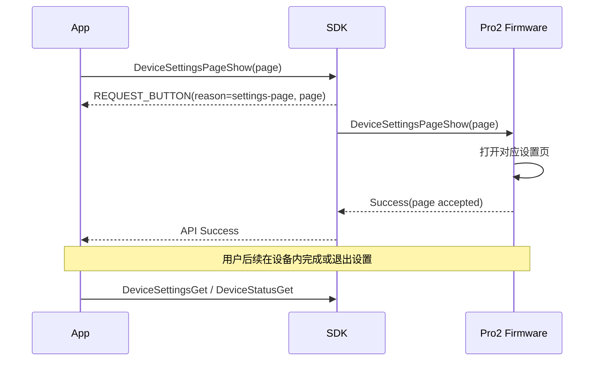
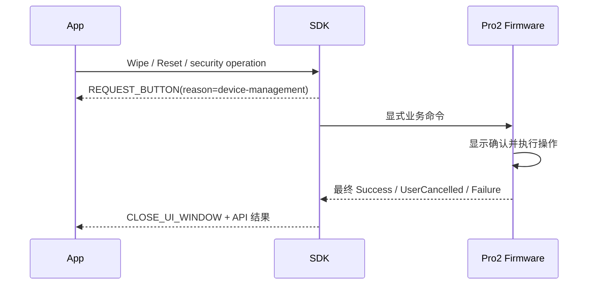

# Pro2 设备管理无固件中间 Event 设计

## 一页结论

设备管理继续通过 SDK Event 告知 App“请在设备上操作”，但 Event 由 SDK 根据显式页面命令或危险
操作生命周期合成。firmware 直接打开设备页面，不再发送 Reset、Wipe、ProtectCall 等 ButtonRequest。

必须区分两类命令：

```text
页面导航命令
  Success = 页面已接受并打开，不代表用户已完成设置

最终操作命令
  Success/Failure = 擦除、重置或安全变更已经完成/取消
```

## 新旧映射

| 原字段/流程                            | Pro2 处理             | SDK → App                          |
| -------------------------------------- | --------------------- | ---------------------------------- |
| `ButtonRequest_ResetDevice/WipeDevice` | firmware 删除         | SDK 在危险操作开始时发非阻塞 Event |
| `ButtonRequest_ProtectCall`            | firmware 删除         | 各方法显式声明解锁和确认策略       |
| `ButtonRequest_Warning/Success`        | firmware 删除 UI 用法 | 使用方法结果和必要的 SDK 状态通知  |
| `DeviceSettingsPageShow`               | 显式页面导航命令      | SDK 发通用设备操作 Event           |

## 页面导航



页面命令的 API Promise 可以在页面打开后结束，但 App 不应把该 Success 当成设置值已经修改。App 在
页面退出、设备重连或用户返回时重新查询状态。

## 最终操作



## SDK/App 职责

- SDK 根据方法元数据合成非阻塞设备操作 Event，不等待 `uiResponse()`。
- payload 包含设备、`source=method-lifecycle`、稳定 `reason` 和可选页面/操作类型。
- locked 方法使用统一自动解锁流程，但破坏性操作本身取消后不得自动重试。
- App 继续复用通用设备操作等待 UI，并支持取消当前 SDK 调用。
- App 必须区分“页面已打开”和“操作已完成”。
- 操作结束或重连后刷新 `DeviceStatus`、`DeviceSettings` 和 Features。

## firmware-pro2 职责

- 每个设置页和危险操作直接创建本地 UI。
- 不发送 Reset/Wipe/ProtectCall 等 UI `ButtonRequest`，不等待 `ButtonAck`。
- 设置成功后持久化状态并保证下一次查询可见。
- 擦除/重置成功后安全重启；Host 断连应被具体方法识别为预期状态变化。
- 用户取消返回稳定失败，不使用超时模拟取消。

## 产品行为

App 仍会提示用户去设备操作。设置页导航的等待提示可以在页面打开后收起；擦除、重置等最终操作则
保持到成功、取消、失败或预期断连。用户体验不需要因为 firmware Event 被删除而改成 App 猜测页面。

## 验收项

- Passphrase、蓝牙、Airgap、壁纸等设置页能直接打开。
- 页面导航只表示 accepted，App 通过查询确认最终状态。
- locked 设置请求走统一解锁提示和内部重试。
- Wipe/Reset 必须在设备确认，取消后不得自动重试。
- firmware 不产生设备管理 UI `ButtonRequest`，SDK 不发送 `ButtonAck`。
- 设置完成后查询值正确。
- 重启/断连不会让 App 永久停留在处理中。
