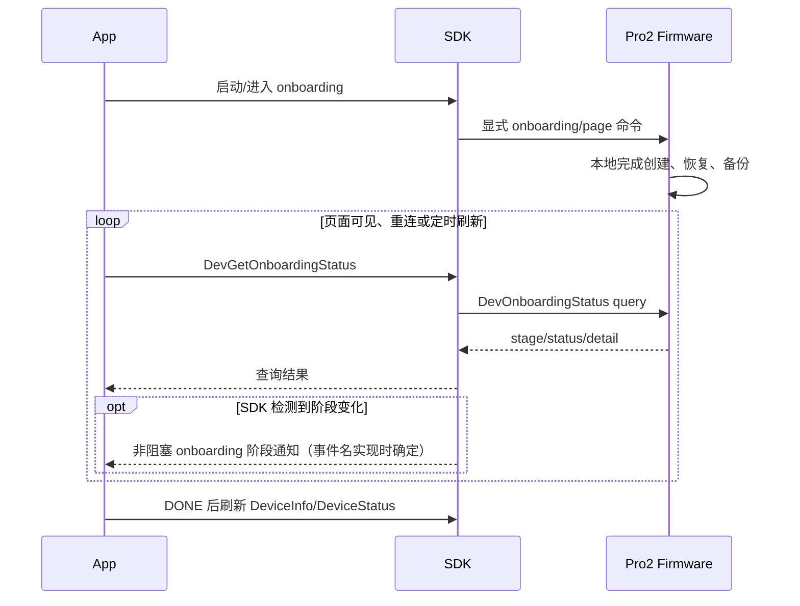

# Pro2 Onboarding 与恢复无固件中间 Event 设计

## 一页结论

Onboarding 是通用“SDK 合成 Event”原则的安全例外：SDK 可以向 App 发出不含敏感信息的阶段通知，
但绝不能合成 `WordRequest`、`EntropyRequest`，也不能让 App 提供助记词或钱包熵。

设备状态的事实来源始终是 `DevOnboardingStatus` 查询：

```text
firmware 本地推进 onboarding
  -> 持久更新 DevOnboardingStatus
  -> SDK 查询并可选 emit 阶段通知
  -> App 展示通用阶段 UI
```

阶段 Event 只用于提升实时体验；重连、App 重启或 Event 丢失后，必须依靠查询恢复。

## 新旧映射

| 原字段/流程                                  | Pro2 处理          | SDK → App                              |
| -------------------------------------------- | ------------------ | -------------------------------------- |
| `ButtonRequest_MnemonicWordCount`            | firmware 删除      | 可选阶段通知，不包含具体选择           |
| `ButtonRequest_MnemonicInput`                | firmware 删除      | 可选“请在设备继续”提示                 |
| `WordRequest/WordAck`                        | Pro2 禁止          | 不合成、不转发、不兼容                 |
| `EntropyRequest/EntropyAck`                  | Pro2 禁止          | 不合成、不转发、不兼容                 |
| `ButtonRequest_ConfirmWord/RecoveryHomepage` | firmware 删除      | 可选稳定阶段通知，不镜像具体页面       |
| `DevOnboardingStatus`                        | 保留并作为事实来源 | SDK 查询结果；可映射成非阻塞阶段 Event |

## 产品流程



App 不接收助记词、不提供熵，也不根据 Event 判断用户输入到第几个词。

## 状态语义

`DevOnboardingStatus.stage` 是设备流程事实来源，覆盖：

- Safety Check。
- Personalization。
- Select Setup Method。
- New Device。
- Restore Mnemonic/SeedCard。
- Wallet Ready。
- Backup。
- Done。

`status_code/detail_code` 表达当前阶段的结果或细节，不应错误解码成其他 protobuf 消息。

`DEV_ONBOARDING_STAGE_DONE` 表示设备 onboarding 已完成。App 必须继续执行最终状态刷新和钱包创建，
不能等待另一个 Button Event。

## SDK/App 职责

- SDK 提供稳定的 `deviceGetOnboardingStatus()` 查询。
- SDK 可以在已知状态变化时发出非阻塞阶段 Event，但 Event 不能成为唯一事实来源。
- Event payload 只包含设备、稳定 stage/status/detail、`source=onboarding-status`，不包含助记词、熵或
  页面输入内容。
- App 在连接、重连、页面恢复和 Event 丢失时重新查询。
- App 只展示阶段级状态，不镜像设备内部每个页面。
- DONE 后刷新 Features、DeviceStatus 和钱包 Session。
- 未识别 stage 保守展示处理中，并记录非敏感原始状态码。

## firmware-pro2 职责

- 所有创建、助记词恢复和 SeedCard 流程在设备完成。
- 不发送 `WordRequest/EntropyRequest` 或 onboarding UI `ButtonRequest`。
- 每次阶段变化都更新可查询状态。
- DONE 状态在重启或 App 重连后仍可正确读取。
- 失败、取消和重试使用稳定 status/detail code。

## 产品行为

App 仍可实时展示“正在创建、恢复、备份”等阶段，但不会显示或收集敏感词汇。即使 App 错过 Event，
重新进入页面后也能通过查询恢复到正确阶段，因此产品体验比依赖一次性 firmware Event 更可靠。

## 验收项

- 新设备创建、助记词恢复、SeedCard 恢复均无需 Host 输入敏感信息。
- SDK/App 不产生或消费 Pro2 `WordRequest/EntropyRequest` 兼容路径。
- 阶段 Event 不含敏感数据，并且丢失后可由查询恢复。
- App 在任意阶段重启后能恢复显示。
- DONE 后能继续完成 App 钱包创建。
- 未知状态不会造成错误 protobuf 解码或无限等待。
