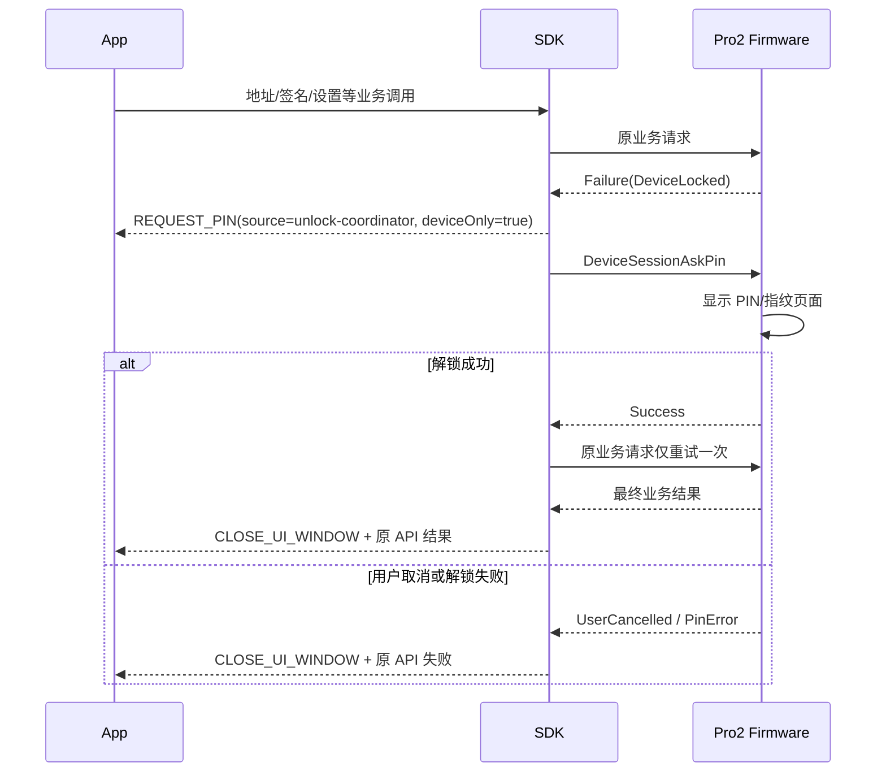

# Pro2 PIN 与自动解锁无固件中间 Event 设计

## 一页结论

PIN 仍然只在设备输入。变化是 `REQUEST_PIN` 不再由 firmware 的 `PinMatrixRequest` 触发，而由 SDK
在捕获 `DeviceLocked` 后合成，用于通知 App 展示“请在设备上解锁”。

```text
原 Pro / V1
  PinMatrixRequest -> SDK REQUEST_PIN -> App uiResponse -> PinMatrixAck

Pro2 / V2
  业务返回 DeviceLocked
    -> SDK emit REQUEST_PIN（非阻塞提示）
    -> SDK DeviceSessionAskPin
    -> 解锁成功后内部重试原方法一次
```

Pro2 的 `REQUEST_PIN` 不等待 `RECEIVE_PIN`；App 不显示软件 PIN 输入框，也不负责重试业务请求。

## 新旧映射

| 原字段/流程                     | Pro2 处理                              | App 影响                                    |
| ------------------------------- | -------------------------------------- | ------------------------------------------- |
| `ButtonRequest_PinEntry`        | firmware 删除                          | 不再作为 Event 来源                         |
| `ButtonAck`                     | firmware/SDK 删除                      | App 无感知                                  |
| `PinMatrixRequest/PinMatrixAck` | firmware/SDK 删除                      | App 不输入或回传 PIN                        |
| `REQUEST_PIN`                   | SDK 合成为非阻塞设备提示               | 继续复用现有 PIN/设备等待 UI，但隐藏输入框  |
| 业务内部解锁                    | `DeviceLocked -> AskPin -> retry once` | 原 API Promise 保持 pending，App 不重发请求 |

## 时序



## SDK 职责

1. 将 firmware 的统一 locked subcode 映射为 `HardwareErrorCode.DeviceLocked`。
2. 只有声明 `unlockPolicy='retry-on-locked'` 的方法才进入自动解锁。
3. 在调用 `DeviceSessionAskPin` 前发出非阻塞 `REQUEST_PIN`；payload 至少包含设备、
   `source=unlock-coordinator`、`deviceOnly=true` 和 `reason`。
4. 不为 Pro2 创建 `RECEIVE_PIN` 等待项，不接受 App PIN 明文或“切换为设备输入”的响应。
5. 解锁成功后刷新 `DeviceStatus`，并只重试原 `method.run()` 一次。
6. 用户取消、PIN 错误、次数耗尽或第二次仍 locked 时，不再重试。
7. 多个并发调用共享同一设备的串行解锁任务，不能打开多个 PIN 页面。
8. 任意退出路径都幂等关闭 UI，并清理解锁协调状态。

## firmware-pro2 职责

1. 需要解锁的业务必须在产生副作用前返回 `DeviceLocked`。
2. `DeviceSessionAskPin` 直接显示设备 PIN/指纹页面。
3. 成功时完成安全状态、活动计时器和 SE 状态同步后返回 `Success`。
4. 用户取消、PIN 错误和次数耗尽返回稳定 subcode。
5. 不发送 `ButtonRequest_PinEntry`、`PinMatrixRequest`，也不等待 ACK。

“副作用前返回 locked”是 SDK 安全重试的前提。如果 firmware 可能先执行部分写入再返回 locked，SDK
重试会造成重复操作，相关方法不得启用自动重试。

## 产品行为

- 用户仍会看到与原流程一致的“请在设备上解锁”提示。
- 用户始终在 Pro2 上输入 PIN 或使用指纹，App 不出现 PIN 键盘。
- 解锁完成后原操作自动继续，不需要用户再次点击地址、签名或设置操作。
- 取消后关闭等待页，原操作以取消结束。

## 验收项

- locked 地址、签名、设置和 Session 请求使用同一自动解锁路径。
- App 收到一次可识别来源的 `REQUEST_PIN`，但无需 `uiResponse()`。
- firmware 不产生 `ButtonRequest_PinEntry/PinMatrixRequest`。
- SDK 不发送 `ButtonAck/PinMatrixAck`。
- PIN 取消后原业务不重试。
- 连续返回 `DeviceLocked` 时最多解锁并重试一次。
- 非幂等方法只有在“locked 发生于副作用前”的契约成立时才允许重试。
- USB/BLE 和多设备场景不串设备。
