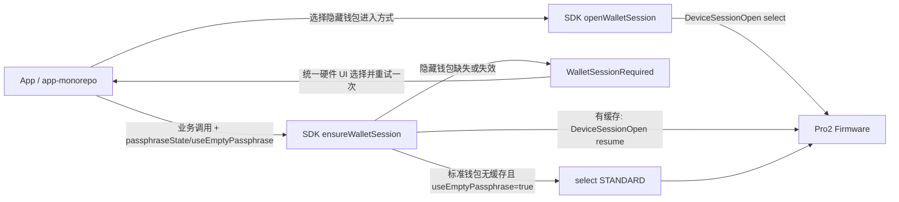

# Pro2 Passphrase 与 Attach-to-PIN 无 Event 设计

## 目标

Pro2 删除 Passphrase 和 Attach-to-PIN 相关的硬件中间 Event，同时保持原 Pro 的产品能力：

- 用户可以进入标准钱包。
- 用户可以在设备输入 Passphrase 进入隐藏钱包。
- 已存在 Attach PIN 绑定时，用户可以输入 Hidden Wallet PIN 进入对应隐藏钱包。
- App 仍保存并校验 `passphraseState`。
- Pro2 Passphrase 明文只存在于设备，不进入 App、SDK、Host 协议帧或日志。
- 原 Pro / Protocol V1 继续保持 `Initialize`、`GetPassphraseState` 和硬件 Event 流程，上层公共参数
  `passphraseState`、`useEmptyPassphrase` 保持兼容。
- Pro2 的隐藏钱包选择由 App/SDK 显式发起；普通地址、公钥和签名调用只允许恢复已有隐藏钱包
  Session，不得在失败后静默切换为交互式钱包选择。标准钱包由 `useEmptyPassphrase=true` 明确表达，
  SDK 可以在无缓存时无歧义地打开标准钱包。

Pro2 仍在开发阶段，本设计不处理旧 Pro2 固件兼容。原 Pro 继续使用原来的 Event 流程。

## 核心消息映射

完整变更如下：

| 原字段/流程                                | 原作用                                                                 | 修改后                                                                              | 修改原因                                                                         |
| ------------------------------------------ | ---------------------------------------------------------------------- | ----------------------------------------------------------------------------------- | -------------------------------------------------------------------------------- |
| `PassphraseRequest.exists_attach_pin_user` | 告诉 App 是否存在 Attach PIN 绑定，决定是否显示 Hidden Wallet PIN 入口 | `DeviceStatus.attach_to_pin_enabled`                                                | 删除 `PassphraseRequest` 后，App 需要在发起 Session 前主动获取该状态             |
| `PassphraseRequest`                        | 通知 SDK/App 选择隐藏钱包进入方式                                      | 删除                                                                                | 改为 App 主动选择，不再由硬件 Event 驱动                                         |
| `PassphraseAck.on_device=true`             | 告诉固件在设备输入 Passphrase                                          | `DeviceSessionOpen(select HIDDEN, PASSPHRASE)`                                      | SDK 主动表达进入方式，固件直接打开设备 Passphrase 页面                           |
| `PassphraseAck.on_device_attach_pin=true`  | 告诉固件使用已有 Attach PIN                                            | `DeviceSessionOpen(select HIDDEN, ATTACH_PIN)`                                      | SDK 主动表达使用 Hidden Wallet PIN                                               |
| `PassphraseAck.passphrase`                 | 将 App 输入的 Passphrase 发送给固件                                    | 删除                                                                                | Pro2 只允许在设备输入 Passphrase                                                 |
| `ButtonRequest_PassphraseEntry`            | 通知 App 即将进入设备 Passphrase 页面，并等待 `ButtonAck`              | 删除                                                                                | 固件收到 `DeviceSessionOpen(select HIDDEN, PASSPHRASE)` 后直接打开页面           |
| `ButtonRequest_AttachPin`                  | 通知 App 即将进入 Attach PIN 页面，并等待 `ButtonAck`                  | 删除                                                                                | 固件收到 `DeviceSessionOpen(select HIDDEN, ATTACH_PIN)` 后直接打开页面           |
| `ButtonAck`                                | 允许固件继续显示 Passphrase/Attach PIN 页面                            | 删除                                                                                | 新流程不需要 Host 确认                                                           |
| `DeviceSession.btc_test_address`           | 标识当前钱包上下文                                                     | 保持不变；隐藏钱包映射为 App `passphraseState`，标准钱包作为 SDK 内部 `walletState` | 已能稳定区分和校验钱包，无需增加新协议字段                                       |
| `DeviceSessionGet`                         | 当前同时承担首次创建和按 ID 恢复，空请求语义不清晰                     | 删除，由统一 `DeviceSessionOpen` 的 `resume/select` 两种必选模式替代                | 消除空请求歧义，同时保持与 V1“创建或恢复钱包上下文”的抽象兼容                    |
| 新增 `DeviceSessionOpen.select`            | 原来不存在                                                             | 主动选择并打开标准或隐藏钱包 Session                                                | 替代整个 `PassphraseRequest -> PassphraseAck -> ButtonRequest -> ButtonAck` 流程 |
| 新增 `DeviceSessionOpen.resume`            | 原 `DeviceSessionGet(session_id)`                                      | 无 UI 恢复已有 Session                                                              | 普通隐藏钱包业务调用只允许进入该模式，失效时不得自动降级为 `select`              |

这不是简单改消息名称，而是把流程控制权从“硬件 Event 驱动 Host”改成“App/SDK 主动表达意图，
硬件执行并返回最终结果”。

## 原流程

### 普通隐藏钱包

```text
业务请求或 GetPassphraseState
  -> 固件需要 seed session
  -> PassphraseRequest(exists_attach_pin_user)
  -> SDK 转成 REQUEST_PASSPHRASE
  -> App 让用户选择输入方式
  -> PassphraseAck(on_device=true)
  -> ButtonRequest_PassphraseEntry
  -> SDK 自动 ButtonAck
  -> 固件显示设备 Passphrase 页面
  -> 用户输入 Passphrase
  -> DeviceSession / PassphraseState
```

### 使用已有 Attach PIN

```text
业务请求或 GetPassphraseState
  -> PassphraseRequest(exists_attach_pin_user=true)
  -> App 显示“输入 Hidden Wallet PIN”
  -> PassphraseAck(on_device_attach_pin=true)
  -> ButtonRequest_AttachPin
  -> SDK 自动 ButtonAck
  -> 固件显示 Attach PIN 页面
  -> 用户输入 Attach PIN
  -> SE 恢复绑定的 Passphrase
  -> DeviceSession / PassphraseState
```

原流程中：

- `exists_attach_pin_user` 只在固件已经发出 `PassphraseRequest` 后才到达 App。
- `PassphraseAck` 承担用户选择和输入方式回传。
- `ButtonRequest_AttachPin` 是固件请求 Host 允许继续显示 Attach PIN 页面。
- App 必须等待硬件 Event 才知道下一步应该展示什么。

## 新流程总览

```text
App 读取 DeviceStatus
  -> 根据 attach_to_pin_enabled 决定可展示的隐藏钱包进入方式
  -> 用户选择标准钱包、设备 Passphrase 或 Hidden Wallet PIN
  -> SDK 发送 DeviceSessionOpen(select)
  -> 固件直接完成设备认证和设备 UI
  -> 固件返回最终 DeviceSession 或 Failure
  -> SDK 使用 btc_test_address 更新或校验 walletState

后续地址、公钥或签名请求
  -> SDK 根据 useEmptyPassphrase/passphraseState 查找对应 session_id
  -> 命中缓存：发送 DeviceSessionOpen(resume)，校验 btc_test_address 后执行业务命令
  -> 标准钱包未命中：根据 useEmptyPassphrase=true 发送 DeviceSessionOpen(select STANDARD)
  -> 隐藏钱包未命中或 resume 失效：返回 WalletSessionRequired，由 App 显式 select 后重试一次
```

### 架构职责



### 架构决策 ADR

**决策**：App/SDK 生命周期采用“显式选择、无交互恢复”的责任边界；Protocol V2 使用一个带必选
`resume/select oneof` 的 `DeviceSessionOpen` 命令表达两种模式。

**备选方案**：

- 使用独立 `DeviceSessionOpen` 和 `DeviceSessionResume` 两个协议命令。职责最直观，但增加消息类型，
  与现有 V1“同一初始化抽象内创建或恢复”的适配距离更大。
- 允许 SDK 在 resume 失败后自动 select。App 改动较少，但隐藏钱包进入方式不明确，普通签名请求也
  可能突然打开设备交互页面。

**结果**：

- 协议只增加一个入口，同时通过 `oneof` 消除原 `DeviceSessionGet {}` 的空请求歧义。
- SDK 可以在统一协调层适配 V1/V2；App 继续保存 `passphraseState` 和使用 `useEmptyPassphrase`。
- 隐藏钱包 Session 失效需要一次明确的 App 交互；这是避免错误钱包和意外设备 UI 的必要成本。

新流程不再出现：

- `PassphraseRequest`
- `PassphraseAck`
- `ButtonRequest_PassphraseEntry`
- `ButtonRequest_AttachPin`
- 对应的 `ButtonAck`
- Pro2 的 `REQUEST_PASSPHRASE` 和 `REQUEST_PASSPHRASE_ON_DEVICE` App Event

## 迁移一：`exists_attach_pin_user`

### 原语义

当前 firmware-pro2 在建立 seed session 时查询 SE 的 Passphrase PIN 空间：

```text
SEED_SESSION_STATE_PASSPHRASE_SPACE
  -> space < PASSPHRASE_MAX_SPACE
  -> g_exists_attach_pin_user = true
  -> PassphraseRequest.exists_attach_pin_user = true
```

SDK 收到后将其转换为：

```text
REQUEST_PASSPHRASE {
  existsAttachPinUser: true
}
```

App 再决定是否展示“输入 Hidden Wallet PIN”。

### 新位置

该状态迁移为：

```protobuf
message DeviceStatus {
  optional bool attach_to_pin_enabled = 11;
}
```

确定语义：

```text
attach_to_pin_enabled = SE 中至少存在一个 Attach PIN -> Passphrase 绑定
```

该字段属于解锁后可读取的私有状态：

- `true`：至少存在一个绑定。
- `false`：已经完成查询，并确认不存在绑定。
- 字段缺失：状态未知，通常表示设备尚未解锁或查询未完成；SDK/App 必须先解锁并重新读取，不能把
  缺失值当成 `false`。

它不是：

- 当前是否通过 Attach PIN 解锁。
- Attach-to-PIN 功能代码是否存在。
- 当前 wallet session 是否为隐藏钱包。

当前是否通过 Attach PIN 完成认证继续由下面的字段表达：

```protobuf
optional bool unlocked_by_attach_to_pin = 12;
```

### 当前实现缺口

协议和 SDK 已经存在 `attach_to_pin_enabled`：

- firmware protobuf：`messages_device_status.proto`
- SDK 类型：`DeviceStatus.attach_to_pin_enabled`
- SDK Features 映射：`attachToPinEnabled`

但当前 firmware-pro2 的 `devinfo_fill_status()` 只填充：

- `passphrase_enabled`
- `unlocked_by_attach_to_pin`

还没有填充 `attach_to_pin_enabled`。

硬件侧需要：

1. 提供可靠的“是否存在至少一个绑定”查询。
2. 在 `DeviceInfo` 和 `DeviceStatusGet` 返回的 `DeviceStatus` 中填充该字段。
3. 创建、更新或删除 Attach PIN 后立即刷新内部缓存。
4. App 从设备设置页返回后重新读取状态，不能继续使用旧值。
5. SDK 映射时保留 `true/false/unknown` 三态，不使用 `?? false` 抹掉未知状态。

### 新产品触发点

App 不再等待 `PassphraseRequest` 才知道是否存在 Attach PIN。

```text
连接并解锁设备
  -> 读取 DeviceStatus.attach_to_pin_enabled
  -> false：隐藏钱包直接进入设备 Passphrase 流程
  -> true：展示“设备 Passphrase / Hidden Wallet PIN”选择
```

## 迁移二：`PassphraseAck`

### 原职责

原 `PassphraseAck` 可能表达三种不同意图：

```text
PassphraseAck { passphrase: "..." }
PassphraseAck { on_device: true }
PassphraseAck { on_device_attach_pin: true }
```

Pro2 只允许设备输入 Passphrase，因此第一种 Host 明文输入路径直接删除。

### 新命令

删除 `DeviceSessionGet`，统一使用 `DeviceSessionOpen`。命令必须通过 `oneof mode` 明确选择
“恢复已有 Session”或“选择并打开钱包”，不允许空 payload，也不允许固件自行猜测调用意图：

```protobuf
enum DeviceWalletType {
  DEVICE_WALLET_TYPE_STANDARD = 0;
  DEVICE_WALLET_TYPE_HIDDEN = 1;
}

enum DeviceHiddenWalletAccess {
  DEVICE_HIDDEN_WALLET_ACCESS_PASSPHRASE = 0;
  DEVICE_HIDDEN_WALLET_ACCESS_ATTACH_PIN = 1;
}

message DeviceSessionResume {
  required bytes session_id = 1;
}

message DeviceWalletSelect {
  required DeviceWalletType wallet_type = 1;
  optional DeviceHiddenWalletAccess hidden_wallet_access = 2;
}

message DeviceSessionOpen {
  oneof mode {
    DeviceSessionResume resume = 1;
    DeviceWalletSelect select = 2;
  }
}
```

`select` 的有效组合：

| 用户意图               | DeviceSessionOpen                                                   |
| ---------------------- | ------------------------------------------------------------------- |
| 标准钱包               | `select.wallet_type=STANDARD`，不携带 `hidden_wallet_access`        |
| 在设备输入 Passphrase  | `select.wallet_type=HIDDEN, select.hidden_wallet_access=PASSPHRASE` |
| 输入 Hidden Wallet PIN | `select.wallet_type=HIDDEN, select.hidden_wallet_access=ATTACH_PIN` |

`resume` 的唯一有效组合：

```text
resume.session_id = SDK 已缓存的 32 字节 Session ID
```

无效组合必须返回参数错误：

- `mode` 缺失或同时携带 `resume/select`。
- `resume.session_id` 缺失、为空或长度错误。
- `select: STANDARD + PASSPHRASE`。
- `select: STANDARD + ATTACH_PIN`。
- `select: HIDDEN` 但没有进入方式。
- 未知的 wallet type 或 access type

两种模式具有不可混用的行为约束：

| 模式     | 是否允许设备钱包 UI | 是否允许创建 Session | Session 无效时行为               |
| -------- | ------------------- | -------------------- | -------------------------------- |
| `resume` | 否                  | 否                   | 返回 `InvalidSession`            |
| `select` | 是                  | 是                   | 根据明确的钱包选择建立新 Session |

### 控制权变化

原流程：

```text
固件发现需要 Passphrase
  -> 固件发送 PassphraseRequest
  -> App 被动选择
  -> SDK 发送 PassphraseAck
```

新流程：

```text
App 已经知道用户选择
  -> SDK 主动发送 DeviceSessionOpen(select)
  -> 固件直接执行对应流程
```

因此准确的迁移关系是：

```text
PassphraseRequest + PassphraseAck
  => DeviceSessionOpen(select)
```

不是只将 `PassphraseAck` 改名为 `DeviceSessionOpen`。`DeviceSessionOpen(resume)` 则承接原
`DeviceSessionGet(session_id)` 的无交互恢复职责。

## 迁移三：`ButtonRequest_AttachPin`

### 原职责

固件消费 `PassphraseAck.on_device_attach_pin=true` 后，并不会立即显示 Attach PIN 页面，而是：

```text
固件发送 ButtonRequest_AttachPin
  -> SDK/App 显示“请在设备输入 Hidden Wallet PIN”
  -> SDK 自动发送 ButtonAck
  -> 固件显示 Attach PIN 页面
```

`ButtonRequest_AttachPin` 同时承担：

- 告知 App 当前进入 Attach PIN 阶段。
- 等待 Host ACK 后才启动设备页面。

### 新职责分配

App 已经在调用前知道用户选择了 Hidden Wallet PIN，因此不再需要固件通知 App。

```text
App：用户选择 Hidden Wallet PIN
  -> App：立即显示设备处理中/请在设备输入
  -> SDK：DeviceSessionOpen(select HIDDEN, ATTACH_PIN)
  -> 固件：直接显示 Attach PIN 页面
  -> 固件：返回最终 DeviceSession 或 Failure
```

这里“由 SDK 触发”的准确含义是：

- SDK 发送 `DeviceSessionOpen(select HIDDEN, ATTACH_PIN)` 业务命令。
- 固件收到业务命令后直接创建 Attach PIN UI。
- SDK 不发送新的 `ButtonRequest` 或 `ButtonAck`。
- App 的等待提示由用户动作和 API 生命周期主动维护，不依赖硬件 Event。

### 普通设备 Passphrase 同样处理

`ButtonRequest_PassphraseEntry` 使用相同方式删除：

```text
DeviceSessionOpen(select HIDDEN, PASSPHRASE)
  -> 固件直接显示 Passphrase 页面
  -> 不发送 ButtonRequest_PassphraseEntry
  -> 不等待 ButtonAck
```

## 新的三条完整流程

### 标准钱包

```text
App 选择标准钱包
  -> DeviceSessionOpen(select STANDARD)
  -> 固件必要时完成主设备认证
  -> 固件加载空 Passphrase seed
  -> DeviceSession(session_id, btc_test_address)
```

### 隐藏钱包：设备 Passphrase

```text
App 选择隐藏钱包
  -> attach_to_pin_enabled=false 时直接进入
     或用户选择“在设备输入 Passphrase”
  -> DeviceSessionOpen(select HIDDEN, PASSPHRASE)
  -> 固件必要时完成主设备认证
  -> 固件直接显示 Passphrase 页面
  -> 用户在设备输入 Passphrase
  -> 固件加载隐藏钱包 seed
  -> DeviceSession(session_id, btc_test_address)
```

### 隐藏钱包：Attach PIN

```text
DeviceStatus.attach_to_pin_enabled=true
  -> App 展示 Hidden Wallet PIN 入口
  -> 用户选择 Hidden Wallet PIN
  -> DeviceSessionOpen(select HIDDEN, ATTACH_PIN)
  -> 固件直接显示 Attach PIN 页面
  -> 用户在设备输入 Attach PIN
  -> SE 恢复绑定的 Passphrase
  -> 固件加载隐藏钱包 seed
  -> DeviceSession(session_id, btc_test_address)
```

## Session 响应与钱包校验

继续使用现有响应：

```protobuf
message DeviceSession {
  optional bytes session_id = 1;
  optional string btc_test_address = 2;
}
```

不增加新的钱包标识字段。

确定语义：

```text
DeviceSession.btc_test_address == SDK 内部 walletState

隐藏钱包：walletState == App passphraseState
标准钱包：walletState 仅保存在 SDK 标准钱包缓存槽，App 继续使用 useEmptyPassphrase=true
```

要求：

- `DeviceSessionOpen(select/resume)` 成功时，`session_id` 与 `btc_test_address` 必须同时非空。
- 新建隐藏钱包时，App 保存 `btc_test_address` 为 `passphraseState`。
- 进入已有隐藏钱包时，SDK 校验返回值与预期 `passphraseState` 相同。
- 标准钱包不新增 App 数据库字段；SDK 在标准钱包缓存槽中同时保存 `session_id` 和
  `btc_test_address`，后续 `resume` 时必须校验二者对应的钱包标识。
- 同一隐藏钱包通过 Passphrase 和对应 Attach PIN 进入时，必须返回相同的 `btc_test_address`。
- 不同 Passphrase 必须返回不同的 `btc_test_address`。
- 校验失败时禁止继续获取地址、公钥或签名。

隐藏钱包继续使用现有缓存键，标准钱包增加独立的内部缓存槽：

```text
隐藏钱包：deviceKey + passphraseState -> { session_id, walletState }
标准钱包：deviceKey + STANDARD      -> { session_id, walletState }
```

`deviceKey` 继续优先使用 seed `deviceId`；Pro2 尚未获得 seed 身份时，沿用当前物理设备临时键和
后续迁移机制。`STANDARD` 是 SDK 内部保留键，不写入 App 数据库，也不作为公开 `passphraseState`
返回。

## `DeviceSessionOpen(resume)` 的边界

`DeviceSessionOpen(resume)` 只恢复已有 session：

- 不打开 Passphrase 页面。
- 不打开 Attach PIN 页面。
- 不选择标准钱包或隐藏钱包。
- 不发送任何硬件 UI Event。

```text
DeviceSessionOpen(resume.session_id)
  -> 有效：返回 DeviceSession，并校验 btc_test_address
  -> 无效：返回 InvalidSession
  -> SDK 清理对应缓存
  -> 标准钱包：SDK 可以根据 useEmptyPassphrase=true 自动调用 select STANDARD
  -> 隐藏钱包：SDK 返回 WalletSessionRequired，由 App 决定 PASSPHRASE 或 ATTACH_PIN
```

禁止在同一次普通地址、公钥或签名调用中，从隐藏钱包 `resume` 失败后静默降级为 `select`。否则
一个本应无交互的业务请求会突然打开 Passphrase/Attach PIN 页面，而且 SDK 无法知道用户希望
使用哪种进入方式。

`initSession=true` 在 Protocol V1 继续保持原语义。Pro2 新流程不再依赖它表达钱包选择：

- 兼容包装 API 可以将它解释为“不复用旧 Session，重新执行一次明确的 select”。
- 新 App 应直接调用 `openWalletSession()`，不再通过 `initSession` 间接触发钱包选择。

## Attach PIN 管理不属于本命令

必须区分：

```text
管理 Attach PIN 绑定
  !=
使用 Attach PIN 进入隐藏钱包
```

创建、更新和删除绑定继续由设备设置页负责：

```text
DeviceSettingsPageShow(DevicePassphrase)
  -> 设备验证主 PIN
  -> 设备输入/确认 Passphrase
  -> 设备创建、更新或删除 Attach PIN 绑定
  -> App 重新读取 DeviceStatus.attach_to_pin_enabled
```

`DeviceSessionOpen(select HIDDEN, ATTACH_PIN)` 只使用已有绑定，不创建或修改绑定。

## App 改动

### 原 Pro

继续保留：

- `REQUEST_PASSPHRASE` 对话框。
- App 输入 Passphrase。
- 设备输入 Passphrase 切换按钮。
- `existsAttachPinUser` 控制的 Hidden Wallet PIN 按钮。
- `uiResponse(RECEIVE_PASSPHRASE)`。

### Pro2

不再进入上述 Event UI 分支。

App 主动打开隐藏钱包的流程：

1. 解锁设备并读取 `DeviceStatus.attach_to_pin_enabled`；字段缺失时不得继续猜测。
2. 用户选择隐藏钱包；存在绑定时展示 Passphrase/Hidden Wallet PIN 二选一。
3. 立即显示设备处理中提示。
4. 调用 `openWalletSession({ walletType: HIDDEN, hiddenWalletAccess })`。
5. SDK 发送 `DeviceSessionOpen(select)` 并返回 `passphraseState`。
6. App 按现有数据模型保存 `wallet.passphraseState`。
7. 根据最终成功、取消或失败关闭提示。

Pro2 页面不提供 App Passphrase 输入框。

标准钱包继续由现有 `useEmptyPassphrase=true` 表达明确意图。SDK 没有可恢复的标准钱包 Session 时，
可以自动执行 `DeviceSessionOpen(select STANDARD)`；该路径没有 Passphrase/Attach PIN 二选一，不会把
普通业务调用切换到隐藏钱包。

### app-monorepo 集中恢复

app-monorepo 当前已经在 `ServiceHardware.getPassphraseStateBase()` 集中创建隐藏钱包状态，并通过
`ServiceAccount.getWalletDeviceParams()` 向所有链业务统一注入：

```text
隐藏钱包：passphraseState = wallet.passphraseState
标准钱包：useEmptyPassphrase = true
```

该数据模型保持不变，不要求各链 Keyring 理解 Pro2 Session 协议。新增的失效恢复必须放在
`ServiceHardware` / `ServiceHardwareUI` 的统一硬件调用层，而不是散落到 EVM、BTC、Solana 等签名实现。

隐藏钱包普通业务调用的完整流程：

```text
App/Keyring 发起地址、公钥或签名请求(passphraseState=A)
  -> SDK 查找 A 对应的 session_id=S1
  -> DeviceSessionOpen(resume S1)
  -> 成功且 btc_test_address=A：继续业务命令
  -> InvalidSession：SDK 清理 A 的缓存并返回 WalletSessionRequired
  -> app-monorepo 统一硬件层展示进入方式选择
  -> 调 openWalletSession(select HIDDEN, PASSPHRASE/ATTACH_PIN, expected=A)
  -> 返回 A 对应的新 Session
  -> 原业务请求最多重试一次
```

重试要求：

- 仅 `WalletSessionRequired` 可以进入该恢复流程。
- 用户取消、钱包不匹配、设备断连和 `AttachPinUnavailable` 不自动重试原业务。
- 同一个业务请求最多重试一次，避免设备或缓存异常造成循环。
- 重试必须继续绑定原 `connectId + deviceId + passphraseState`，禁止切换到其他设备或钱包。

## SDK 改动

1. 删除 Protocol V2 `DeviceSessionGet` 类型，增加带 `resume/select oneof` 的
   `DeviceSessionOpen` 类型。
2. 增加公开 `openWalletSession()` API；隐藏钱包支持可选 `expectedPassphraseState`，用于重新进入已有
   钱包后的强校验。
3. 将 App 参数转换为有效的 wallet type/access type 组合。
4. 将当前 `getProtocolV2WalletSession()` 拆分为显式 select 与无交互 resume 两条内部路径。
5. `resume` 失败时删除当前自动发送空 payload 重试的逻辑；隐藏钱包返回
   `WalletSessionRequired`，标准钱包按明确的 `useEmptyPassphrase` 意图重新 select。
6. 保持隐藏钱包 `btc_test_address -> passphraseState` 映射；标准钱包的地址标识只保存在 SDK
   `STANDARD` 缓存槽中。
7. Pro2 不注册 `DEVICE.PASSPHRASE` 和 `DEVICE.PASSPHRASE_ON_DEVICE`。
8. Pro2 收到 `PassphraseRequest`、`ButtonRequest_PassphraseEntry` 或
   `ButtonRequest_AttachPin` 时按协议错误处理，不自动 ACK。
9. 统一处理取消、`InvalidSession`、`WalletSessionRequired`、钱包不匹配和设备断连。
10. 在 `hd-shared` 增加稳定的 `WalletSessionRequired` 错误码；app-monorepo 将它映射为非 Toast 的
    可恢复硬件错误，由统一硬件 UI 流程消费。

### SDK 公共 API 兼容

Protocol V1 的 `getPassphraseState()`、`Initialize`、`useEmptyPassphrase` 和 Event UI 行为完全不变。

为支持 SDK 与 app-monorepo 分阶段升级，Pro2 暂时保留 `getPassphraseState()` 兼容包装：

| 旧调用                                                | Pro2 兼容映射                                  |
| ----------------------------------------------------- | ---------------------------------------------- |
| `getPassphraseState({ useEmptyPassphrase: true })`    | `openWalletSession(select STANDARD)`           |
| `getPassphraseState()` 或 `useEmptyPassphrase: false` | `openWalletSession(select HIDDEN, PASSPHRASE)` |
| `getPassphraseState({ initSession: true, ... })`      | 不复用旧缓存，重新执行上述明确 select          |

兼容包装默认使用设备 Passphrase，不自动选择 Attach PIN。支持新流程的 app-monorepo 必须使用
`openWalletSession()`，才能在读取 `attach_to_pin_enabled` 后显式选择 Attach PIN。

协议适配矩阵：

| SDK 钱包意图 | Protocol V1                                         | Protocol V2 / Pro2                         |
| ------------ | --------------------------------------------------- | ------------------------------------------ |
| 打开标准钱包 | `GetPassphraseState/Initialize` 的 main-wallet 语义 | `DeviceSessionOpen(select STANDARD)`       |
| 打开隐藏钱包 | `PassphraseRequest -> PassphraseAck` Event 流程     | `DeviceSessionOpen(select HIDDEN, access)` |
| 恢复已有钱包 | `Initialize(session_id, passphraseState)`           | `DeviceSessionOpen(resume session_id)`     |

### Session 缓存生命周期

app-monorepo 继续只持久化隐藏钱包 `passphraseState`，不新增 device `session_id` 数据库字段。SDK 进程
重启、设备断连或缓存被清理后：

- 标准钱包可以根据 `useEmptyPassphrase=true` 自动重新 select。
- 隐藏钱包必须返回 `WalletSessionRequired`，让用户重新选择设备 Passphrase 或 Hidden Wallet PIN。
- 不允许仅凭 `passphraseState` 在设备端扫描或认领任意当前 Session；否则多隐藏钱包场景可能恢复到
  错误钱包。

CLI 等受控短生命周期场景可以继续成对持久化 `passphraseState + session_id` 并预热 SDK 缓存，但
恢复后仍必须通过 `DeviceSessionOpen(resume)` 校验 `btc_test_address`。

## firmware-pro2 改动

1. 在 `DeviceStatus` 中正确填充 `attach_to_pin_enabled`。
2. 删除 `DeviceSessionGet` handler，实现 `DeviceSessionOpen` 的 `resume/select` 分支。
3. `resume` 只打开指定 Session、派生并返回钱包标识；不得创建 Session 或显示钱包选择 UI。
4. `select` 将 STANDARD、HIDDEN+PASSPHRASE、HIDDEN+ATTACH_PIN 映射到三条设备本地状态机。
5. 删除 `seed_session_send_passphrase_request()`。
6. 删除 `PassphraseAck` 解析和等待状态。
7. 删除 `ButtonRequest_PassphraseEntry/AttachPin` 发送与 `ButtonAck` 等待状态。
8. `resume/select` 成功后都返回 `session_id + btc_test_address`。
9. 用户取消 select 时返回最终 `UserCancelled`。
10. 没有 Attach PIN 绑定时返回 `AttachPinUnavailable`。
11. 临时 Passphrase、PIN 和 seed 数据在成功、失败、取消、超时后都必须清零。

## 错误处理

| 错误                    | SDK/App 行为                                                                                            |
| ----------------------- | ------------------------------------------------------------------------------------------------------- |
| `UserCancelled`         | 关闭等待 UI，返回上一步，不自动重试                                                                     |
| `InvalidSession`        | SDK 清理对应缓存；标准钱包可按 `useEmptyPassphrase` 重新 select，隐藏钱包转换为 `WalletSessionRequired` |
| `WalletSessionRequired` | SDK 层错误，不由固件返回；app-monorepo 统一硬件层让用户选择进入方式，成功后原业务最多重试一次           |
| `AttachPinUnavailable`  | 刷新 DeviceStatus，隐藏或禁用 Hidden Wallet PIN 入口                                                    |
| `PassphraseDisabled`    | 提示在设备设置中开启 Passphrase                                                                         |
| `WalletMismatch`        | 清缓存并终止业务                                                                                        |
| `Busy`                  | 不并发打开第二个设备交互页面                                                                            |
| `DeviceDisconnected`    | 清理等待状态，不将请求切换到其他设备                                                                    |

SDK 主动取消继续使用通用 `Cancel`。只有 `DeviceSessionOpen(select)` 会拥有 Passphrase/Attach PIN
页面；固件收到 Cancel 后关闭页面、清理临时状态，并让原调用以 `UserCancelled` 结束。
`DeviceSessionOpen(resume)` 不产生设备页面，取消只终止当前恢复操作。

## 验收清单

### 状态迁移

- `DeviceStatus.attach_to_pin_enabled=false` 时 App 不显示 Hidden Wallet PIN。
- 至少存在一个绑定时字段为 true。
- 创建或删除绑定后重新查询能立即得到新值。
- `unlocked_by_attach_to_pin` 与 `attach_to_pin_enabled` 语义不混用。

### Passphrase

- `DeviceSessionOpen(select HIDDEN, PASSPHRASE)` 直接显示设备 Passphrase 页面。
- Host 不出现 Passphrase 明文。
- 不产生 `PassphraseRequest/PassphraseAck`。
- 不产生 `ButtonRequest_PassphraseEntry/ButtonAck`。

### Attach PIN

- `DeviceSessionOpen(select HIDDEN, ATTACH_PIN)` 直接显示设备 Attach PIN 页面。
- 不产生 `ButtonRequest_AttachPin/ButtonAck`。
- 没有绑定时返回 `AttachPinUnavailable`。
- Passphrase 和对应 Attach PIN 返回相同 `btc_test_address`。

### Session

- 标准钱包、隐藏钱包都返回非空 `session_id + btc_test_address`。
- `resume` 必须携带合法 session_id，空 payload 被拒绝。
- `resume` 不产生 Passphrase/Attach PIN 页面，也不创建新 Session。
- 隐藏钱包恢复时校验 `btc_test_address == passphraseState`。
- 标准钱包恢复时校验 `btc_test_address == SDK STANDARD 缓存中的 walletState`。
- 隐藏钱包 session 失效时，普通业务调用返回 `WalletSessionRequired`，不自动 select。
- app-monorepo 完成显式 select 后，原业务最多重试一次。
- Protocol V1 的初始化、Passphrase Event 和现有 App UI 不受影响。
- USB 和 BLE 行为一致。
