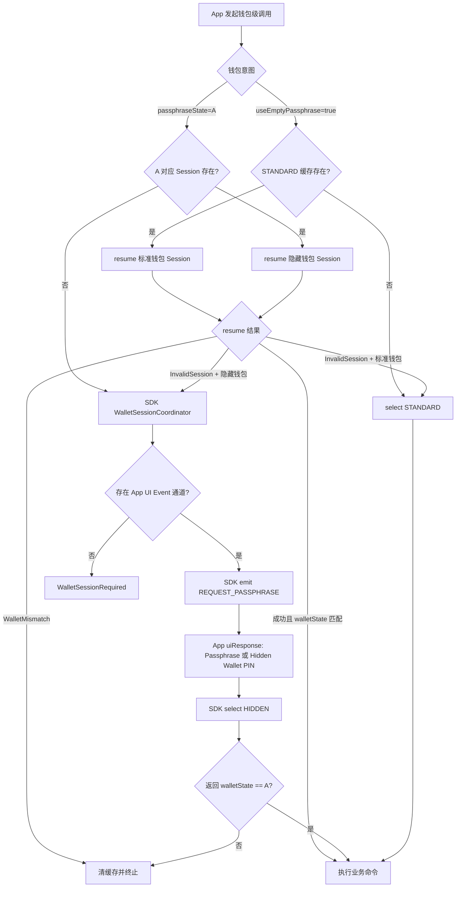
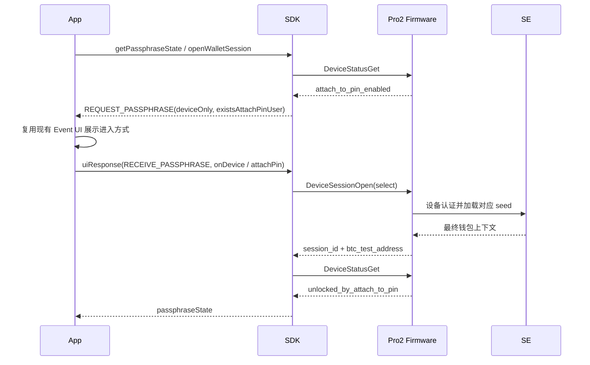
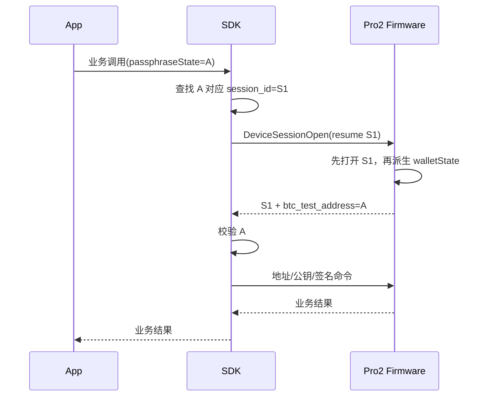
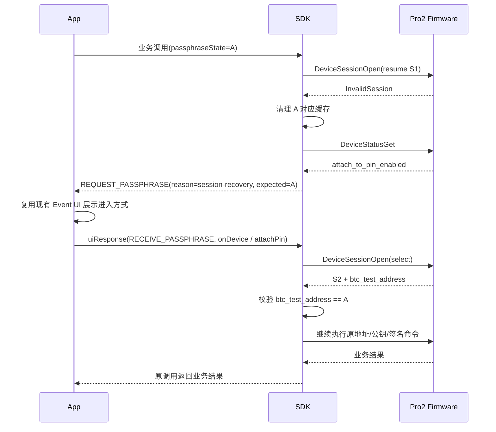

# Pro2 Passphrase 与 Attach-to-PIN 无固件中间 Event 设计

## 0. 一页结论

### 0.1 核心决策

```text
select = 建立或切换钱包上下文，允许打开设备钱包 UI
resume = 按 session_id 恢复已有钱包上下文，禁止打开设备钱包 UI

隐藏钱包 resume 失败
  -> SDK WalletSessionCoordinator 发出合成 UI Event
  -> App 使用现有 Event UI 让用户选择 Passphrase 或 Hidden Wallet PIN
  -> SDK 收到 uiResponse 后执行 select
  -> 钱包校验成功后继续原业务调用，不重放业务请求

标准钱包没有可用 Session
  -> useEmptyPassphrase=true 已明确表达标准钱包意图
  -> SDK 可以直接 select STANDARD
```

Protocol V2 只保留一个 `DeviceSessionOpen` 命令，通过必选的 `resume/select oneof` 区分两种模式。
原 `DeviceSessionGet {}` 被删除，不再允许空请求同时承担“查询、创建、切换钱包”多种语义。

### 0.2 不变项

- 原 Pro / Protocol V1 的 `Initialize`、`GetPassphraseState`、Passphrase Event UI 保持不变。
- app-monorepo 继续保存隐藏钱包 `passphraseState`，标准钱包继续使用 `useEmptyPassphrase=true`。
- App 继续使用 Event 形式处理硬件 UI；Pro2 Event 由 SDK 合成，不再来自 firmware 协议消息。
- `DeviceSession.btc_test_address` 继续作为钱包上下文标识，不新增协议钱包 ID。
- Pro2 Passphrase 明文只存在于设备，不进入 App、SDK、Host 帧或日志。

### 0.3 新旧语义映射

| 用户意图            | 原 Pro/V1 流程                                                                | Pro2 新流程                                    |
| ------------------- | ----------------------------------------------------------------------------- | ---------------------------------------------- |
| 标准钱包            | 明确使用空 Passphrase 上下文                                                  | `DeviceSessionOpen(select STANDARD)`           |
| 设备输入 Passphrase | `PassphraseRequest -> PassphraseAck(on_device) -> ButtonRequest -> ButtonAck` | `DeviceSessionOpen(select HIDDEN, PASSPHRASE)` |
| Hidden Wallet PIN   | `PassphraseAck(on_device_attach_pin) -> ButtonRequest_AttachPin -> ButtonAck` | `DeviceSessionOpen(select HIDDEN, ATTACH_PIN)` |
| 复用已有钱包        | `Initialize/DeviceSessionGet(session_id)`                                     | `DeviceSessionOpen(resume session_id)`         |
| Session 失效        | 固件 Event 触发重新选择，原业务等待后继续                                     | SDK 合成 UI Event，select 成功后原业务原地继续 |

新旧流程的产品结果和 App Event 交互形式都可以保持一致；变化发生在 Event 来源：从“固件协议 Event”
变为“SDK 根据钱包 Session 状态合成 UI Event”。

### 0.4 通用 Event 删除原则

后续删除其他硬件中间 Event 时，统一采用以下分层：

```text
Firmware Protocol Event
  -> 可以删除，改为明确的业务命令和最终响应

SDK UI Event
  -> 可以保留，作为 App 的稳定交互契约
  -> SDK 根据业务状态主动发出
  -> App 继续通过 uiResponse 返回用户选择
```

目标不是删除所有 Event，而是删除“固件必须等待 Host ACK 才能继续设备状态机”的协议耦合。

## 1. 总状态机



必须保持的边界：

- `resume` 不得创建 Session、选择钱包或打开 Passphrase/Attach PIN 页面。
- 隐藏钱包 `resume` 失败后，SDK 只能在获得 App `uiResponse` 的明确选择后执行 `select`。
- 标准钱包可以自动 `select`，因为 `useEmptyPassphrase=true` 已明确表达唯一意图。
- 有 UI Event 通道时，Session 恢复在原业务调用内完成，不重放地址、公钥或签名请求。
- CLI/headless 或明确禁用交互时，SDK 才返回 `WalletSessionRequired`。
- 钱包身份始终通过 `btc_test_address` 校验，不能只相信本地缓存或设备当前页面。

## 2. 三条核心时序

### 2.1 首次打开隐藏钱包



### 2.2 后续地址、公钥或签名调用



### 2.3 隐藏钱包 Session 失效



## 3. 模块职责

| 模块               | 负责                                                                  | 不负责                                            |
| ------------------ | --------------------------------------------------------------------- | ------------------------------------------------- |
| App / app-monorepo | 继续处理稳定的 SDK UI Event、维护等待 UI、保存 `passphraseState`      | 理解 session_id、处理 firmware 协议消息或 ACK     |
| SDK                | V1/V2 适配、Session 缓存、UI Event 合成、select/resume 调度和钱包校验 | 在没有 App `uiResponse` 时猜测隐藏钱包进入方式    |
| firmware-pro2      | 设备认证、设备页面、seed/Session 状态机、返回最终结果                 | 要求 Host ACK 后才显示 Passphrase/Attach PIN 页面 |
| SE                 | Session、Passphrase、Attach PIN 与 seed 安全状态                      | App UI 和 Host 协议流程                           |

## 4. Protocol V2 协议

### 4.1 命令定义

```protobuf
enum DeviceWalletType {
  DEVICE_WALLET_TYPE_STANDARD = 0;
  DEVICE_WALLET_TYPE_HIDDEN = 1;
}

enum DeviceHiddenWalletAccess {
  DEVICE_HIDDEN_WALLET_ACCESS_PASSPHRASE = 0;
  DEVICE_HIDDEN_WALLET_ACCESS_ATTACH_PIN = 1;
}

message DeviceSessionResume {
  required bytes session_id = 1;
}

message DeviceWalletSelect {
  required DeviceWalletType wallet_type = 1;
  optional DeviceHiddenWalletAccess hidden_wallet_access = 2;
}

message DeviceSessionOpen {
  oneof mode {
    DeviceSessionResume resume = 1;
    DeviceWalletSelect select = 2;
  }
}

message DeviceSession {
  optional bytes session_id = 1;
  optional string btc_test_address = 2;
}
```

`oneof mode` 是业务必填项，固件必须拒绝缺少有效模式的请求。

### 4.2 有效组合

| 模式              | 参数                                                         | 是否允许钱包 UI             | 结果                                       |
| ----------------- | ------------------------------------------------------------ | --------------------------- | ------------------------------------------ |
| 恢复              | `resume.session_id`                                          | 否                          | 恢复已有 Session 或返回 `InvalidSession`   |
| 标准钱包          | `select.wallet_type=STANDARD`                                | 否 Passphrase/Attach PIN UI | 创建标准钱包 Session                       |
| 设备 Passphrase   | `select.wallet_type=HIDDEN, hidden_wallet_access=PASSPHRASE` | 是                          | 设备输入 Passphrase 并创建隐藏钱包 Session |
| Hidden Wallet PIN | `select.wallet_type=HIDDEN, hidden_wallet_access=ATTACH_PIN` | 是                          | 使用已有绑定创建隐藏钱包 Session           |

必须拒绝：

- mode 缺失。
- `resume.session_id` 缺失、为空或长度错误。
- `STANDARD` 携带 `hidden_wallet_access`。
- `HIDDEN` 缺少 `hidden_wallet_access`。
- 未知 wallet/access 枚举值。

### 4.3 resume 执行顺序

```text
验证 session_id
  -> 打开指定 Session
  -> 确认该 Session 的 seed 上下文有效
  -> 在该上下文派生 btc_test_address
  -> 返回 session_id + btc_test_address
```

禁止在打开指定 Session 之前使用设备“当前钱包”派生地址。否则返回值可能来自错误钱包，失去
`resume` 的安全意义。

### 4.4 响应约束

- `select/resume` 成功时，`session_id` 与 `btc_test_address` 必须同时非空。
- 隐藏钱包返回的 `btc_test_address` 映射为 App `passphraseState`。
- 标准钱包的 `btc_test_address` 只作为 SDK 内部 `walletState`。
- 同一 Passphrase 通过 Passphrase 和对应 Attach PIN 进入时，必须返回相同的钱包标识。
- SDK 校验失败后禁止继续地址、公钥或签名操作。

## 5. DeviceStatus

```protobuf
message DeviceStatus {
  optional bool attach_to_pin_enabled = 11;
  optional bool unlocked_by_attach_to_pin = 12;
}
```

| 字段                        | 语义                                               |
| --------------------------- | -------------------------------------------------- |
| `attach_to_pin_enabled`     | SE 中是否至少存在一个 Attach PIN → Passphrase 绑定 |
| `unlocked_by_attach_to_pin` | 最近一次交互式钱包选择是否通过 Attach PIN 完成     |

`attach_to_pin_enabled` 是三态：

- `true`：确认至少存在一个绑定。
- `false`：确认不存在绑定。
- 字段缺失：未知；App 必须先解锁并重新读取，不能当成 false。

每次 `select` 成功后，SDK 必须刷新 DeviceStatus：

- `select HIDDEN, ATTACH_PIN` → `unlocked_by_attach_to_pin=true`。
- `select STANDARD` 或 `select HIDDEN, PASSPHRASE` → `false`。
- `resume` 的钱包身份不依赖该字段，只依赖 `btc_test_address`。

当前 firmware-pro2 的 `devinfo_fill_status()` 尚未正确填充 `attach_to_pin_enabled`，实现时必须补齐，
并在创建、更新或删除 Attach PIN 绑定后立即刷新内部状态。

## 6. SDK 设计

### 6.1 对外 API

```ts
type OpenWalletSessionParams =
  | {
      walletType: 'standard';
    }
  | {
      walletType: 'hidden';
      hiddenWalletAccess: 'passphrase' | 'attach-pin';
      expectedPassphraseState?: string;
    };

openWalletSession(connectId, params): HardwareResponse<string | undefined>;
```

- `openWalletSession()` 是显式 API，适合新调用方、CLI 或已经自行完成选择的 App 流程。
- 现有 app-monorepo 可以继续调用 `getPassphraseState()` 并通过 SDK UI Event 完成选择。
- 新建隐藏钱包不传 `expectedPassphraseState`，成功后保存返回值。
- 重新进入已有隐藏钱包必须传预期 state，返回不一致时终止。
- SDK 不向 App 暴露 device `session_id`。

### 6.2 内部协调

```text
ensureWalletSession(useEmptyPassphrase, passphraseState)
  -> 标准钱包
     -> 有 STANDARD 缓存：resume
     -> 无缓存或 InvalidSession：select STANDARD
  -> 隐藏钱包
     -> 有 passphraseState 对应缓存：resume
     -> 无缓存或 InvalidSession：requestWalletAccessFromApp(expectedState)

requestWalletAccessFromApp(expectedState)
  -> DeviceStatusGet
  -> SDK emit REQUEST_PASSPHRASE {
       source: wallet-session-coordinator,
       deviceOnly: true,
       existsAttachPinUser,
       reason: open-wallet | session-recovery,
       expectedPassphraseState
     }
  -> await App uiResponse
  -> passphraseOnDevice=true: select HIDDEN, PASSPHRASE
  -> attachPinOnDevice=true: select HIDDEN, ATTACH_PIN
  -> CANCEL: UserCancelled
```

SDK 应抽取统一的 `requestWalletAccessFromApp()`，供两种来源调用：

- Protocol V1 的真实 `PassphraseRequest` handler。
- Protocol V2 的 `WalletSessionCoordinator`。

Pro2 不应伪造 Transport 返回的 `PassphraseRequest`，而应直接调用 SDK UI 交互层。Event payload 必须
携带来源，避免日志和业务代码误认为它来自 firmware。

SDK UI Event 分为两类：

- 阻塞选择 Event：`REQUEST_PASSPHRASE`，SDK 等待 `RECEIVE_PASSPHRASE`。
- 非阻塞状态 Event：例如 `REQUEST_PASSPHRASE_ON_DEVICE` 或 Attach PIN 设备输入提示，仅用于更新
  App 等待界面，不要求 firmware ACK。

实现前应核对 app-monorepo 当前是否已经在选择按钮回调中主动显示设备输入页；同一个提示只能由
App 主动切换或 SDK 状态 Event 触发一次，避免重复弹窗。

Pro2 对 `uiResponse` 的限制：只接受设备 Passphrase、Attach PIN 或取消；收到 App Passphrase 明文时
必须拒绝。

### 6.3 缓存

```text
隐藏钱包：deviceKey + passphraseState -> { session_id, walletState }
标准钱包：deviceKey + STANDARD      -> { session_id, walletState }
```

- `deviceKey` 优先使用 seed `deviceId`；不可用时沿用当前物理设备临时键和迁移机制。
- `STANDARD` 是 SDK 内部保留键，不写入 App 数据库。
- App/SDK 进程重启后，隐藏钱包不得只凭 `passphraseState` 扫描或认领设备当前 Session。
- CLI 可以成对持久化 `passphraseState + session_id`，但恢复后仍必须 resume 并校验。

### 6.4 错误转换

- firmware `InvalidSession` 必须使用稳定协议错误码，SDK 不解析错误文本。
- 交互式 App 环境中，隐藏钱包 `InvalidSession` 进入 SDK UI Event 协调流程，原业务调用保持 pending。
- CLI/headless、未注册 UI Event、UI 超时或调用方明确禁止交互时，SDK 才返回
  `WalletSessionRequired`。
- `WalletMismatch` 清缓存并终止，不能再次请求用户输入。

### 6.5 兼容 API

Protocol V1 行为完全不变。Pro2 暂时保留 `getPassphraseState()` 包装：

| 旧调用                                               | Pro2 映射                           |
| ---------------------------------------------------- | ----------------------------------- |
| `getPassphraseState({ useEmptyPassphrase: true })`   | `select STANDARD`                   |
| `getPassphraseState()` 或 `useEmptyPassphrase:false` | SDK UI Event -> 用户选择 -> select  |
| `getPassphraseState({ initSession:true, ... })`      | 不复用缓存，重新进入上述 Event 流程 |

因此旧 App 可以继续使用现有 Event UI，同时获得 Pro2 Attach PIN 选择能力。

## 7. app-monorepo 设计

### 7.1 保持现有数据模型

```text
隐藏钱包：wallet.passphraseState
标准钱包：useEmptyPassphrase=true
```

不新增钱包数据库 `session_id` 或标准钱包 `walletState` 字段。

### 7.2 隐藏钱包创建

当前 `ServiceHardware.getPassphraseStateBase()` 对 Pro2 改为：

```text
继续调用 getPassphraseState()
  -> SDK 发出 REQUEST_PASSPHRASE UI Event
  -> App 复用现有弹窗并 uiResponse
  -> SDK select HIDDEN
  -> 保存返回的 passphraseState
```

### 7.3 Event UI 兼容

app-monorepo 不需要新增 `WalletSessionRequired -> 重放业务` 状态机，也不需要修改各链 Keyring。
继续复用现有 `REQUEST_PASSPHRASE` 事件处理，只需识别以下扩展信息：

```ts
{
  source: 'wallet-session-coordinator',
  deviceOnly: true,
  existsAttachPinUser: boolean,
  reason: 'open-wallet' | 'session-recovery',
  expectedPassphraseState?: string,
}
```

App 要求：

- Pro2 不显示 App Passphrase 明文输入框。
- 继续提供“在设备输入 Passphrase”和“Hidden Wallet PIN”选项。
- 继续通过现有 `uiResponse()` 返回用户选择或取消。
- `reason=session-recovery` 可以只调整提示文案，不改变交互组件。
- 不重放地址、公钥或签名请求；原 SDK 调用在 Session 恢复期间保持 pending。

## 8. firmware-pro2 实现要求

### select

- STANDARD：完成必要主设备认证，加载空 Passphrase seed。
- HIDDEN + PASSPHRASE：直接显示设备 Passphrase 页面。
- HIDDEN + ATTACH_PIN：直接显示 Attach PIN 页面并恢复绑定 Passphrase。
- 不发送 `PassphraseRequest`、`ButtonRequest_PassphraseEntry/AttachPin`，不等待 `ButtonAck`。

### resume

- 只打开指定 Session，不创建新 Session。
- 不显示 Passphrase/Attach PIN 页面。
- Session 不存在、无法打开或已失效时返回稳定 `InvalidSession`。
- 必须在成功打开 Session 后派生 `btc_test_address`。

### 通用要求

- `select/resume` 成功均返回最终 `session_id + btc_test_address`。
- 用户取消 select 时返回 `UserCancelled`。
- 无 Attach PIN 绑定时返回 `AttachPinUnavailable`。
- `Cancel` 关闭当前 select 页面并清理临时状态。
- Passphrase、PIN、seed 临时数据在成功、失败、取消和超时后都必须清零。
- 并发钱包交互返回 `Busy`，不能同时打开第二个设备页面。

## 9. Attach PIN 管理边界

```text
管理 Attach PIN 绑定
  !=
使用 Attach PIN 进入隐藏钱包
```

创建、更新和删除绑定继续使用设备设置页：

```text
DeviceSettingsPageShow(DevicePassphrase)
  -> 设备验证主 PIN
  -> 设备输入/确认 Passphrase
  -> 创建、更新或删除绑定
  -> App 重新读取 attach_to_pin_enabled
```

`select HIDDEN, ATTACH_PIN` 只使用已有绑定，不创建或修改绑定。

## 10. 错误矩阵

| 错误                    | SDK/App 行为                                                                    |
| ----------------------- | ------------------------------------------------------------------------------- |
| `UserCancelled`         | 关闭等待 UI，原调用以取消结束                                                   |
| `InvalidSession`        | SDK 清缓存；标准钱包重新 select，交互式隐藏钱包进入 SDK UI Event 协调流程       |
| `WalletSessionRequired` | 仅无 UI/headless/禁止交互时返回，由调用方决定何时显式调用 `openWalletSession()` |
| `AttachPinUnavailable`  | 刷新 DeviceStatus，隐藏或禁用 Hidden Wallet PIN 入口                            |
| `PassphraseDisabled`    | 提示在设备设置中开启 Passphrase                                                 |
| `WalletMismatch`        | 清缓存并终止原业务，不再次请求用户输入                                          |
| `Busy`                  | 不并发打开第二个设备交互页面                                                    |
| `DeviceDisconnected`    | 清理等待状态，不切换到其他设备                                                  |

## 11. 验收清单

### 协议

- `DeviceSessionGet` 已删除，`DeviceSessionOpen` 必须明确携带 resume 或 select。
- resume 空 Session、错误长度和失效 Session 均返回明确错误。
- resume 本身不产生 firmware 协议 Event；失败后的 SDK Coordinator 可以发出 SDK UI Event。
- select/resume 成功均返回非空 `session_id + btc_test_address`。

### 标准钱包

- `useEmptyPassphrase=true` 无缓存时可以 select STANDARD。
- 标准钱包 Session 使用独立 `STANDARD` 缓存槽。
- resume 返回的钱包标识必须与缓存 walletState 一致。

### Passphrase

- select HIDDEN + PASSPHRASE 直接显示设备 Passphrase 页面。
- Host 不出现 Passphrase 明文。
- firmware 不产生 `PassphraseRequest/PassphraseAck/ButtonRequest/ButtonAck`；SDK 仍可产生
  `REQUEST_PASSPHRASE` UI Event。

### Attach PIN

- `attach_to_pin_enabled` 正确表达是否存在绑定，字段缺失不等于 false。
- select HIDDEN + ATTACH_PIN 直接显示 Attach PIN 页面。
- Attach PIN 与对应 Passphrase 返回相同 `btc_test_address`。
- Attach PIN select 后 `unlocked_by_attach_to_pin=true`，其他 select 后为 false。

### Session 安全

- resume 先打开指定 Session，再派生钱包标识。
- 隐藏钱包恢复时校验 `btc_test_address == passphraseState`。
- 交互式 App 中隐藏钱包失效时，SDK 发出合成 UI Event，获得 `uiResponse` 后执行 select。
- 无 UI/headless 场景才返回 `WalletSessionRequired`。
- WalletMismatch 不继续地址、公钥或签名操作。
- Session 恢复发生在业务命令执行前，原地址、公钥或签名请求不会被重放。
- USB 与 BLE 行为一致。

### 兼容

- Protocol V1 初始化、Passphrase Event 和 App UI 不受影响。
- app-monorepo 继续使用 `passphraseState/useEmptyPassphrase`。
- app-monorepo 继续处理 `REQUEST_PASSPHRASE + uiResponse`，无需新增业务重试状态机。
- 旧 Pro2 `getPassphraseState()` 调用可通过兼容包装工作。

## 附录 A：被删除的 Pro2 Event 流程

### 设备 Passphrase

```text
业务请求或 GetPassphraseState
  -> PassphraseRequest
  -> App 选择设备输入
  -> PassphraseAck(on_device=true)
  -> ButtonRequest_PassphraseEntry
  -> SDK ButtonAck
  -> 设备显示 Passphrase 页面
  -> PassphraseState / DeviceSession
```

### Attach PIN

```text
业务请求或 GetPassphraseState
  -> PassphraseRequest(exists_attach_pin_user=true)
  -> App 选择 Hidden Wallet PIN
  -> PassphraseAck(on_device_attach_pin=true)
  -> ButtonRequest_AttachPin
  -> SDK ButtonAck
  -> 设备显示 Attach PIN 页面
  -> PassphraseState / DeviceSession
```

删除的是 firmware 协议 Event。SDK 在需要用户选择时主动发出兼容 UI Event，App 返回选择后 SDK 才
发送 select，因此固件不需要再次通知或等待 Host ACK。

## 附录 B：架构决策记录

### 决策

协议层采用“显式 select、无交互 resume”；SDK 保留 Event 形式的 App UI 契约，通过
`WalletSessionCoordinator` 合成 Event 并等待 `uiResponse`；Protocol V2 使用一个带必选 oneof 的
`DeviceSessionOpen` 命令。

### 备选方案

- 两个协议命令：`DeviceSessionOpen + DeviceSessionResume`。职责直观，但增加消息类型，与 V1 的统一
  Session 抽象距离更大。
- resume 失败后 SDK 自动 select。App 改动少，但隐藏钱包进入方式不明确，普通签名请求可能突然打开
  设备交互页面。
- SDK 返回 `WalletSessionRequired`，由 App 捕获后重放原业务。SDK 简单，但 app-monorepo 需要新增
  恢复状态机，并可能重放签名调用。

### 结果

- 消除 `DeviceSessionGet {}` 空请求歧义。
- 保留 V1/V2 的 SDK 统一钱包 Session 抽象。
- App 继续使用现有 Event UI，主要改动限制在 Pro2 device-only 和 Event 来源标识。
- Session 恢复在业务命令执行前完成，不要求 App 重放地址、公钥或签名请求。
