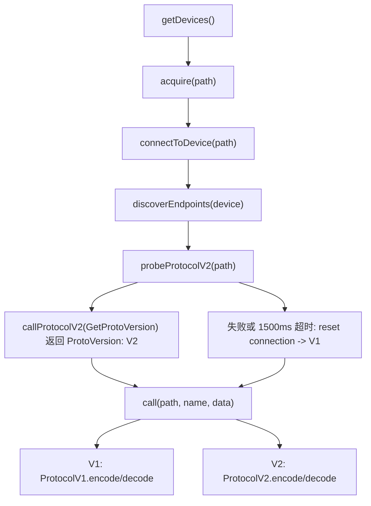
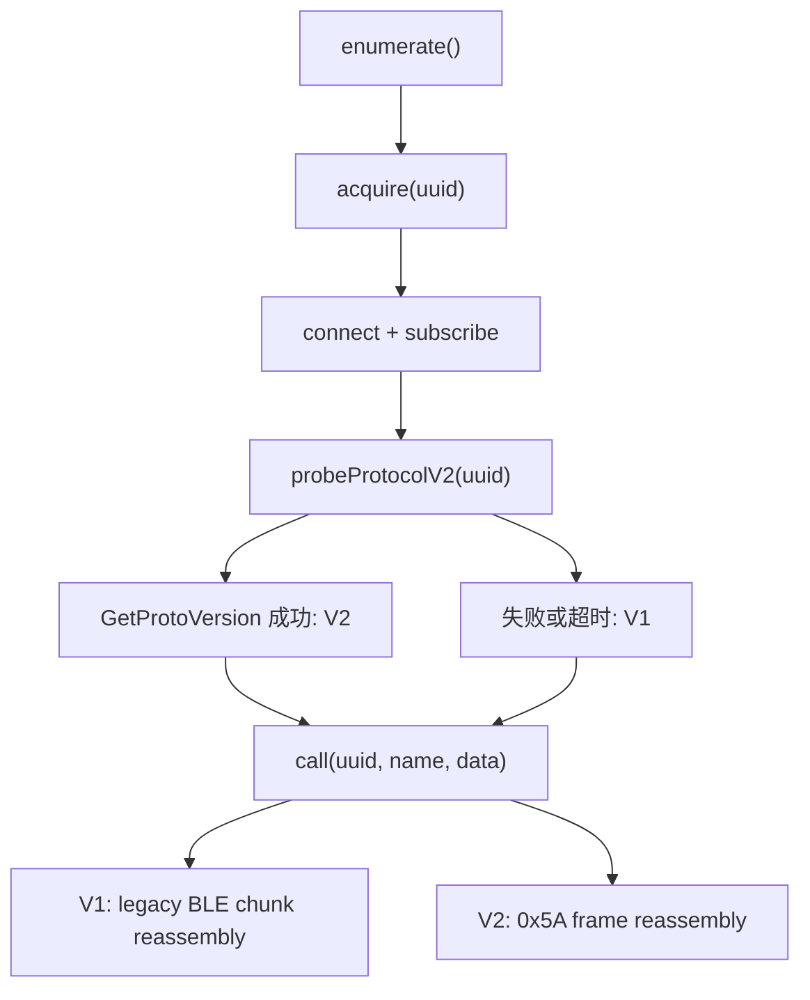
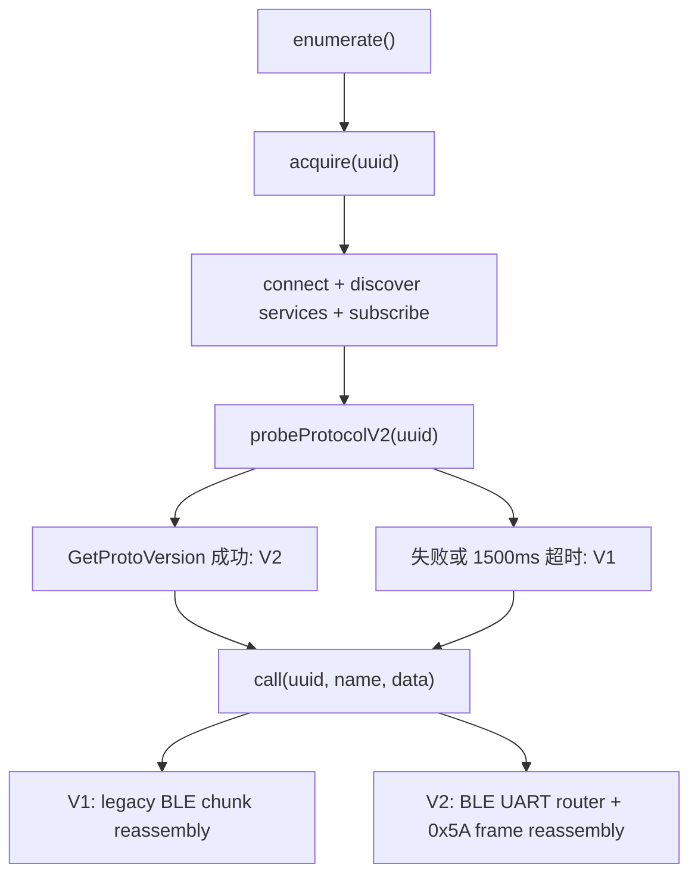
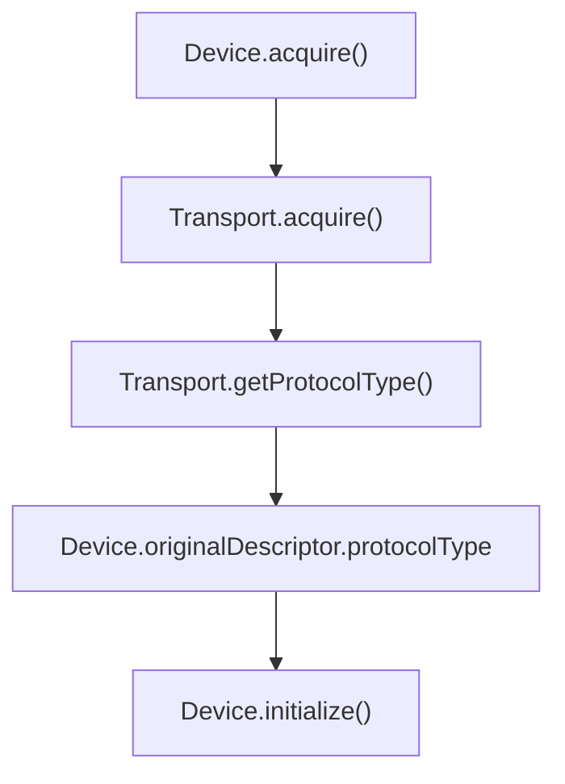
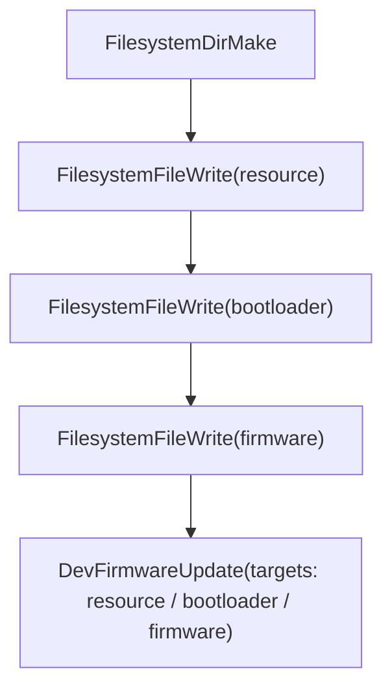

# OneKey Hardware SDK 传输层设计

## 两句话总结

- Protocol V1 服务现有 Classic / Mini / Touch / Pro 等设备，USB 和 BLE 都使用旧的分包协议，并通过 `Initialize -> Features` 建立设备上下文。
- Protocol V2 服务 Pro2，USB 和 BLE 都使用 `0x5A` 帧协议；SDK 在连接后主动发送 `GetProtoVersion` 探测，成功才切换到 V2，失败回落 V1。

## 协议差异

| 项目       | Protocol V1                     | Protocol V2                                          |
| ---------- | ------------------------------- | ---------------------------------------------------- |
| 设备       | Classic / Mini / Touch / Pro 等 | Pro2                                                 |
| 传输       | USB、BLE、Bridge                | WebUSB、Electron BLE、React Native BLE               |
| 帧头       | `0x3F` 分包，payload 内含 `##`  | `0x5A` 完整帧                                        |
| message id | big-endian                      | little-endian                                        |
| 完整性校验 | 无额外 CRC                      | header CRC8 + frame CRC8                             |
| 初始化     | `Initialize -> Features`        | `GetProtoVersion` 探测，`Ping` 初始化                |
| schema     | `messages.json`                 | `messages-pro2.json`，必要时可 fallback 到 V1 schema |

## WebUSB 流程

WebUSB 不再使用 PID 判断协议。当前流程是：



`discoverEndpoints()` 只用于找到 USB interface 和 endpoint，不参与协议判断。

## Electron BLE 流程

Electron BLE 的默认入口是 `desktop-web-ble`。它内部同时支持 V1 和 V2：



调用方只需要选择 `desktop-web-ble`。Electron BLE transport 会在连接后自动判断 V1/V2，不再提供按设备型号拆分的 env alias。

## React Native BLE 流程

移动端 BLE 入口是 `packages/hd-transport-react-native`，由 `hd-ble-sdk` 在 `react-native` env 下使用。它和 Electron BLE 使用同一套主动探测原则：



移动端 descriptor 主要使用 `id` 作为连接标识，因此 `Device.acquire()` 在 BLE 环境下会用 descriptor `id` 查询 transport 探测到的 protocol type。

## schema 配置

初始化 transport 时会配置两份 schema：

```ts
transport.configure(messagesV1);
transport.configureProtocolV2(messagesPro2);
```

Protocol V2 encode/decode 的 schema 选择规则：

| 阶段   | 规则                                                  |
| ------ | ----------------------------------------------------- |
| encode | 优先在 V2 schema 查找消息名；找不到则回退 V1 schema   |
| decode | `msgType >= 60000` 使用 V2 schema，否则使用 V1 schema |

这样 Protocol V2 系统消息进入 typedCall 类型面，同时不会破坏 V1 业务消息的类型。

## Protocol Session 层

V2 协议公共能力放在 `packages/hd-transport/src/protocol-session.ts`：

| 能力                       | 职责                                                       |
| -------------------------- | ---------------------------------------------------------- |
| `ProtocolV2Session`        | 统一执行 V2 encode、写 frame、读 frame、decode、超时和日志 |
| `ProtocolV2FrameAssembler` | 根据 `0x5A` frame length 重组 USB/BLE 分片，并校验最大长度 |
| `probeProtocolV2()`        | 连接后发送 `GetProtoVersion`，成功返回 V2，失败走回退钩子 |

具体 transport 只提供平台相关能力：

| Transport        | 保留职责                                              |
| ---------------- | ----------------------------------------------------- |
| WebUSB           | USB 设备授权、endpoint discovery、transferIn/out retry |
| Electron BLE     | noble 连接、订阅、hex 写入、BLE 错误映射              |
| React Native BLE | BLE PLX 连接、service/characteristic 发现、base64 写入 |

这个层级让后续新增协议或新增传输方式时只扩展 session/channel 边界，不把协议细节继续散落到每个 transport 实现里。

## Device 生命周期

`Device.acquire()` 会在 transport 探测完成后调用 `getProtocolType(path/id)`，并把结果写入 `originalDescriptor.protocolType`。



初始化分支：

- `V1`：执行传统 `Initialize`，写入真实 `Features`，再按 features 重新选择 schema。
- `V2`：执行 `Ping` 验证链路，通过 `DevGetDeviceInfo` 获取 Protocol V2 设备信息，再由 `Protocol V2 feature adapter` 归一化为 `Features`。如果早期固件暂时没有返回完整 device info，会回退到 descriptor 生成最小 `Features`，并保留 `serial_no/onekey_serial_no/device_id` 作为 connectId/uuid 来源。

## 固件更新流程

Protocol V2 固件更新分为两个阶段：



resource 和 bootloader 写入后必须进入 `targets`，SDK 不依赖固件端隐式扫描。

## 兼容性边界

- V1 设备无法响应 V2 `GetProtoVersion`，探测失败后会回落 V1。
- V2 设备不支持传统 `Initialize/GetFeatures`，因此初始化必须走 Protocol V2 分支。
- 协议选择不暴露给应用层；应用层继续使用 connectId 和原有 API。
- V2 文件写入使用 `FilesystemFileWrite`，返回 `FilesystemFile`，不能继续使用旧的 `FileWrite/File` 名称。
