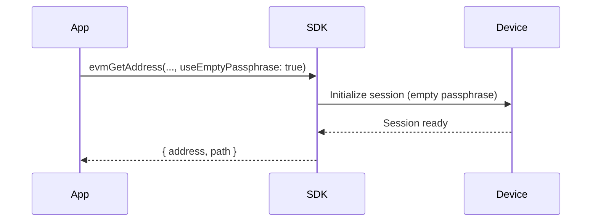
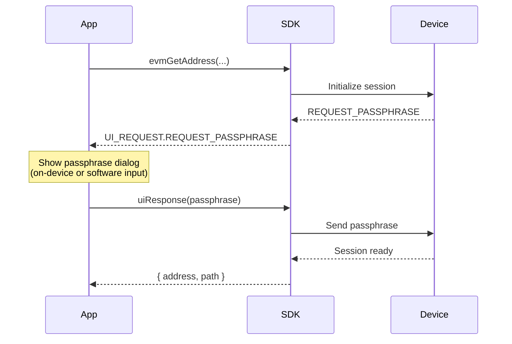
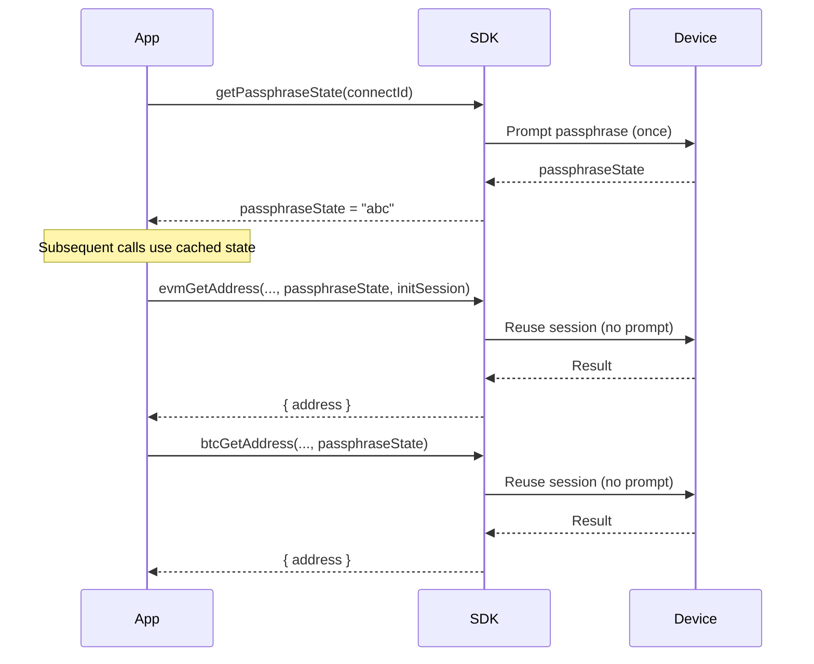

# Passphrase

Rules and best practices for handling passphrases (hidden wallets).

## Core concepts

- **Standard wallet** = seed + empty passphrase; **hidden wallet** = seed + non-empty passphrase (case-sensitive).
- Every different passphrase generates a completely different wallet — even a single character change.
- Passphrases cannot be recovered; back them up securely.
- Force the standard wallet by setting `useEmptyPassphrase: true`.

## Device support

| Device | On-device input | Software input (host) |
|--------|----------------|----------------------|
| Classic | Yes | Yes |
| Classic 1S | Yes | Yes |
| Mini | Yes | Yes |
| Touch | Yes (touch keyboard) | Yes |
| Pro | Yes (touch keyboard) | Yes |

All OneKey devices support passphrase and session caching (`passphraseState`).

## Interaction flow

### Proactive strategy (recommended)

The simplest approach — explicitly choose the standard wallet to avoid accidental hidden wallet prompts.



```ts
await HardwareSDK.evmGetAddress(connectId, deviceId, {
  path: "m/44'/60'/0'",
  useEmptyPassphrase: true,
});
```

### Reactive strategy (event-driven)

Listen for the passphrase request event and let the user choose input method.



```ts
// Option A: On-device input
HardwareSDK.uiResponse({
  type: UI_RESPONSE.RECEIVE_PASSPHRASE,
  payload: { passphraseOnDevice: true, value: '' },
});

// Option B: Software input (optionally cache for this session)
HardwareSDK.uiResponse({
  type: UI_RESPONSE.RECEIVE_PASSPHRASE,
  payload: { value: userInput, passphraseOnDevice: false, save: true },
});
```

### Hidden wallet with session caching

Reduce repeated passphrase prompts across multiple calls.



```ts
// Step 1: Get passphrase state (prompts user once)
const state = await HardwareSDK.getPassphraseState(connectId);
const passphraseState = state.payload.passphrase_state;

// Step 2: Use passphraseState in subsequent calls (no more prompts)
const commonParams = {
  initSession: true,
  passphraseState,
};

await HardwareSDK.evmGetAddress(connectId, deviceId, {
  path: "m/44'/60'/0'/0/0",
  ...commonParams,
});

await HardwareSDK.btcGetAddress(connectId, deviceId, {
  path: "m/84'/0'/0'/0/0",
  coin: 'btc',
  ...commonParams,
});
```

### Session ownership

Applications persist only `deviceId + passphraseState`. The SDK keeps the
ephemeral `session_id` in its in-memory wallet-session store and restores it
automatically while the SDK process and device session remain valid.

Do not read, persist, or pass a `sessionId` through application APIs. After a
process restart, device lock, or invalid session, open the wallet again and let
the user complete the normal passphrase flow.

## Security tips

- **Never log or persist** passphrases in plain text.
- Use `useEmptyPassphrase: true` to prevent accidental hidden wallet creation.
- Pro/Touch devices: PIN must be entered on-device; passphrase can be entered on-device or via software.

## FAQ

### What happens if I forget my passphrase?

Funds in the hidden wallet become permanently inaccessible. There is no way to recover a forgotten passphrase. Always keep a secure backup.

### Is the passphrase the same as the PIN?

No. The PIN protects physical access to the device. The passphrase creates an entirely different wallet from the same seed. They serve different security purposes:

| | PIN | Passphrase |
|---|-----|-----------|
| Purpose | Device access protection | Hidden wallet creation |
| Recovery | Can be reset via device wipe + seed recovery | Cannot be recovered |
| Storage | Stored on device | Never stored anywhere |
| Case-sensitive | N/A (numeric) | Yes |

### Can I have multiple hidden wallets?

Yes. Each unique passphrase creates a distinct hidden wallet. You can have as many hidden wallets as you want — one per unique passphrase.

### Does the device validate my passphrase?

No. The device accepts any passphrase and derives a wallet from it. If you mistype your passphrase, you'll get a valid but different (empty) wallet. There is no "wrong passphrase" error.

### What's the difference between `passphraseOnDevice` and software input?

- **On-device**: The passphrase is entered directly on the hardware device's screen/keyboard. It never leaves the device.
- **Software input**: The passphrase is typed in your app and sent to the device via SDK.

See also: [Common Params](/en/hardware-sdk/core-api-guide#common-params), [Events & UI Wiring](/en/hardware-sdk/core-api-guide#events-ui).
