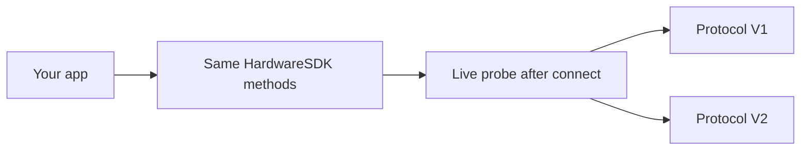

# Protocol V1 and V2

Hardware SDK 1.2.0 talks two on-wire protocols. Integrators keep one JavaScript API. Do not branch on USB PID, BLE name, or product string.



| | Protocol V1 | Protocol V2 |
| --- | --- | --- |
| Devices today | Classic, Mini, Touch, Pro | Pro 2, Neo |
| How the SDK finds it | Live response after connect | Live `Ping` / protocol probe after connect |
| Public methods | Existing Hardware SDK methods | Same methods, mapped inside Core |
| Call rule | Serialize per device in practice | Serialize per device; required |
| Firmware update | `firmwareUpdateV2` / `firmwareUpdateV3` | `firmwareUpdateV4` |
| Chain methods | V1+V2 families plus V1-only families | V1+V2 families only |
| Device snapshot | [`getDeviceState`](/en/hardware-sdk/basic-api/get-device-state) (`getFeatures` is deprecated) | Same |

Stellar, Alephium, Nexa, Dynex, Nervos, SCDO, Benfen, and Neo chain are V1-only. They are not supported on Pro 2 / Neo. Full matrix: [Chain Support](/en/hardware-sdk/concepts/chain-support). Device USB / BLE / Air-Gap: [Devices](/en/hardware-sdk/concepts/devices).

## Detection

The SDK confirms the protocol from the **active connection**. Do not infer V1/V2 from:

- USB PID / VID
- BLE advertised name
- Product string or housing

If you persist a previous result, bind it **per `connectId`** (USB and BLE of the same unit are different endpoints). The public field is `connectProtocol` on the device object.

Passing `connectProtocol` on a call is a strict expectation: the SDK will not silently fall back to the other protocol.

## What stays the same

- `HardwareSDK.init({ env })` still selects the **transport** (USB / BLE / low-level), not Protocol V1 vs V2.
- `searchDevices` → `connectId` → `getDeviceState` → chain methods.
- PIN, passphrase, and button confirmation still arrive as `UI_EVENT`. Respond only with `uiResponse` on input requests. See the [Core API Guide](/en/hardware-sdk/core-api-guide).

## What you must not do

- Do not overlap two business calls on the same device.
- Do not automatically replay signing, wipe, or firmware update after a disconnect or timeout.
- Do not read firmware `session_id` out of responses and store it. Wallet identity is `deviceId + passphraseState`. See [Wallet Sessions](/en/hardware-sdk/concepts/wallet-session).
- Do not call Protocol V2 internals (`DeviceSessionGet`, `DeviceInfoGet`, …). They are not public `CoreApi`.

## Device state

Use [`getDeviceState`](/en/hardware-sdk/basic-api/get-device-state). `getFeatures` is deprecated; existing apps may keep it. On Protocol V2 the SDK still maps the live device into a compatibility Features object.

```ts
const state = await HardwareSDK.getDeviceState(connectId);
if (!state.success) throw new Error(state.payload.error);
```

Use `scope: 'settings'` or `scope: 'firmware'` only when you need those partitions refreshed. The return value is still a full snapshot.

## Next

- [Devices](/en/hardware-sdk/concepts/devices)
- [Get Device State](/en/hardware-sdk/basic-api/get-device-state)
- [firmwareUpdateV4](/en/hardware-sdk/device-api/firmwareupdatev4)
