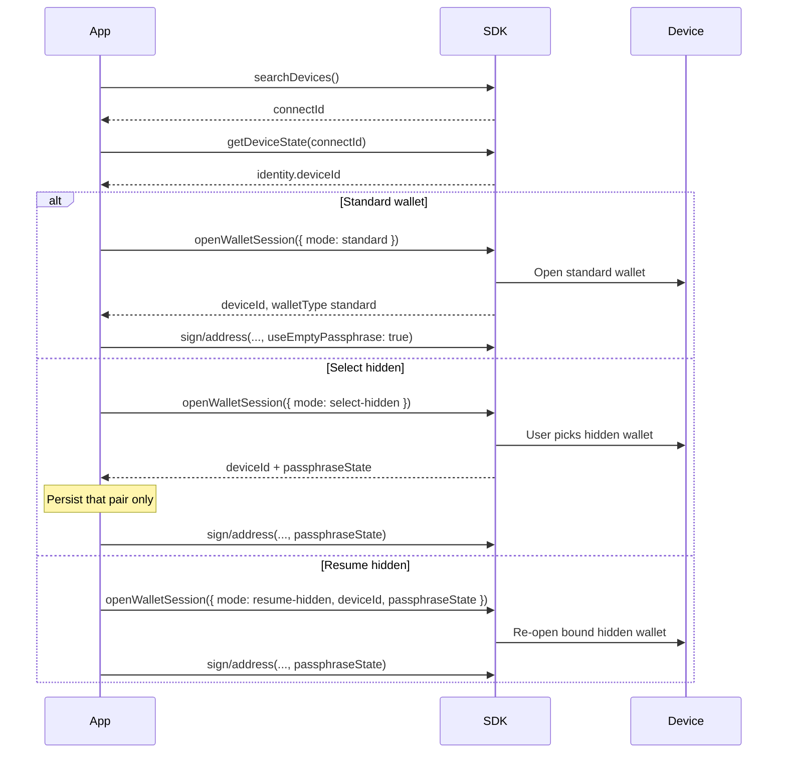

# Wallet Sessions

This page is the **hardware** wallet session: which seed / passphrase context is unlocked on the device.

It is not [Agent Wallet Session](/en/agent-wallet/wallet-session). Agent Wallet is a product on top of OneKey GUI. Hardware sessions exist on Classic / Pro / Pro 2 / Neo whether or not Agent Wallet is involved.

## Public identity

Persist only this pair as a wallet binding:

| Field | Meaning | Persist? |
| --- | --- | --- |
| `deviceId` | Current seed lifetime (`device_id` from Features / DeviceState) | Yes |
| `passphraseState` | Hidden-wallet fingerprint. `null` on the standard wallet | Yes, if hidden |
| firmware `session_id` | Device-side unlock handle | **No.** Core keeps it internally |

If you skip `passphraseState` on a hidden wallet, address and signing APIs may succeed on the **standard** wallet with no error. Always pass `useEmptyPassphrase: true` or a real `passphraseState`.

## Preferred API (1.2.0)



New integrations should open or switch wallets with [`openWalletSession`](/en/hardware-sdk/basic-api/open-wallet-session):

```ts
import { OpenWalletSessionMode } from '@onekeyfe/hd-core';

// Standard wallet
const standard = await HardwareSDK.openWalletSession(connectId, {
  mode: OpenWalletSessionMode.Standard,
});

// User picks a hidden wallet on the device
const hidden = await HardwareSDK.openWalletSession(connectId, {
  mode: OpenWalletSessionMode.SelectHidden,
});

// Re-open a hidden wallet you already bound
const resumed = await HardwareSDK.openWalletSession(connectId, {
  mode: OpenWalletSessionMode.ResumeHidden,
  deviceId: hidden.payload.deviceId,
  passphraseState: hidden.payload.passphraseState,
});
```

Store `payload.deviceId`, `payload.walletType`, and `payload.passphraseState`. Then keep using those values on address / signing calls. Do not call `openWalletSession` before every signer.

## Deprecated compatibility API

[`getPassphraseState`](/en/hardware-sdk/basic-api/get-passphrase-state) is deprecated. Existing apps may keep it plus `initSession` / `useEmptyPassphrase` / `passphraseState` on each call. Core still maps that path onto Protocol V1 and V2. New code should use `openWalletSession`.

Do not mix `openWalletSession({ mode })` with `useEmptyPassphrase` / `initSession` on the same call.

## Attach-to-PIN

Some Pro / Pro 2 units can bind a hidden wallet to a dedicated PIN. The public API still returns `walletType: 'hidden'` and a `passphraseState`. You do not implement a second session protocol for Attach-to-PIN.

If the SDK returns `DeviceCheckUnlockTypeError`, the current unlock type cannot reach the wallet you asked for. Lock the device and let the user unlock with the intended PIN; do not retry the same binding in a loop.

## Next

- [openWalletSession](/en/hardware-sdk/basic-api/open-wallet-session)
- [Identifiers](/en/hardware-sdk/concepts/identifiers)
- [Passphrase](/en/hardware-sdk/concepts/passphrase)
