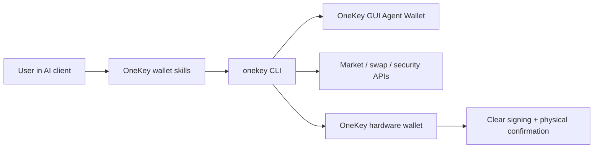

# OneKey Agent Wallet

OneKey Agent Wallet 是面向 AI Agent 的钱包能力层：Agent 可以执行真实链上动作、读取行情上下文，并把关键签名控制权交还给用户。Agent 能读取钱包状态、生成收款地址、查询历史、研究 token、报价和准备 swap、执行安全检查，并将高风险操作交给 OneKey GUI 或硬件钱包确认。

构建 AI Agent、Skills、MCP 工具、自动化脚本或命令行钱包工作流时读这一组文档；直接接入 OneKey 设备传输和底层签名 API 时再读 Hardware SDK。

## Agent 能做什么

| 范围 | Agent 能力 | 用户会怎么说 |
| --- | --- | --- |
| Wallet | 查余额、展示收款地址、查询历史、准备转账、派生 BTC 地址类型 | `Show my ETH balance and receiving address.` |
| Swap & bridge | 报价、构建、执行、跟踪 swap，处理 BTC sign-only PSBT，发现跨链网络 | `Swap 1 ETH to USDC after showing me the quote.` |
| Market & research | 搜索 token、价格、trending、K 线、流动性、持仓、快速或深度研究 | `What Solana tokens are trending right now?` |
| Security | Token audit、交易模拟、授权风险、链和地址不匹配、假合约识别 | `Is this token safe before I buy it?` |
| Hardware control | 连接 OneKey 设备、验证真伪、使用 passphrase mode、敏感操作 clear signing | `Use my hardware wallet for this transfer.` |
| Session control | 通过 App Transfer 配对 GUI 管理的 Agent Wallet，或切换到硬件会话 | `Connect my OneKey Agent Wallet.` |

## 工作方式

Agent 通过 `onekey-wallet-skills` 和 `onekey` CLI 调用 OneKey 能力。用户通过 OneKey GUI、keyless 账号绑定，以及可选的硬件确认保持控制权。

## 从这里开始

| 读者 | 先读 | 目标 |
| --- | --- | --- |
| 开发者 | [能力地图](/zh/agent-wallet/capabilities) 和 [Wallet Skills](/zh/agent-wallet/wallet-skills) | 把产品能力映射到 schema-backed CLI 命令和回答契约。 |
| Vibe coding 新手 | [快速开始](/zh/agent-wallet/quickstart) 和 [场景示例](/zh/agent-wallet/recipes) | 先复制自然语言 prompt，再理解背后的命令。 |
| 安全审查或钱包 owner | [安全规则](/zh/agent-wallet/safety) 和 [硬件控制](/zh/agent-wallet/hardware-control) | 明确 agent 能读什么、能执行什么、什么时候必须交给硬件确认。 |
| 产品或支持同学 | [Agent Wallet 会话](/zh/agent-wallet/wallet-session) 和 [Keyless Binding](/zh/agent-wallet/keyless-binding) | 理解 GUI 管理的 Agent Wallet、keyless 绑定和活动会话模型。 |

## 当前实现

公开入口是外部 [`onekey-wallet-skills`](https://github.com/OneKeyHQ/onekey-wallet-skills) 仓库。Skills 支持 Claude Code、Codex、Cursor、OpenCode 和 OpenClaw，并把自然语言请求路由到 wallet、swap、market 和 security 工作流。

`@onekeyfe/cli` 仍然是 skills 背后的实现层。Skills 会通过实时 schema 发现支持的命令和参数，配对 App Transfer 或硬件会话，并保持结构化回答，而不是把原始终端输出暴露给用户。
