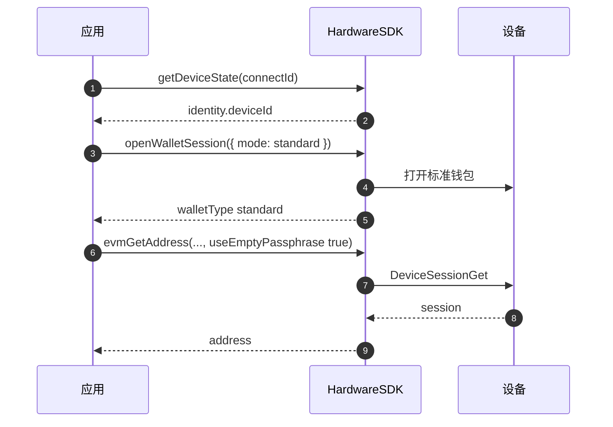
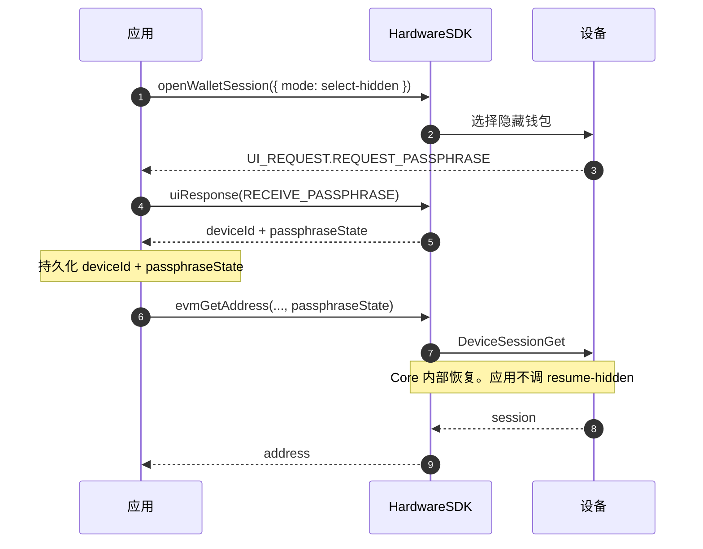

# Passphrase（核心指南）

处理 OneKey 设备 Passphrase（隐藏钱包）的基本规则与最佳实践。

## 关键要点

- **标准钱包** = 助记词 + 空 Passphrase；**隐藏钱包** = 助记词 + 非空 Passphrase（区分大小写）。
- 每个不同的 Passphrase 都会生成完全不同的钱包——即使只差一个字符。
- Passphrase 遗忘后无法恢复，请妥善备份。
- 设置 `useEmptyPassphrase: true` 可强制使用标准钱包。

## 设备支持

| 设备 | 设备端输入 | 软件端输入（主机） |
|------|----------|-----------------|
| Classic | 是 | 是 |
| Classic 1S | 是 | 是 |
| Mini | 是 | 是 |
| Touch | 是（触屏键盘） | 是 |
| Pro | 是（触屏键盘） | 是 |
| Pro 2 | 是 | 是 |
| Neo | 是 | 是 |

所有 OneKey 设备均支持 Passphrase。只持久化 `deviceId + passphraseState`，不要存固件 `session_id`。

## 交互流程

Hardware SDK 1.2.x：`searchDevices` → `getDeviceState` → `openWalletSession` → 地址 / 签名带 `deviceId` + `passphraseState`（或 `useEmptyPassphrase: true`）。开钱包前先订阅 `UI_EVENT`。见 [钱包会话](/zh/hardware-sdk/concepts/wallet-session)。

### 标准钱包



```ts
const state = await HardwareSDK.getDeviceState(connectId);
if (!state.success) throw new Error(state.payload.error);
const deviceId = state.payload.identity.deviceId;

await HardwareSDK.openWalletSession(connectId, { mode: 'standard' });

await HardwareSDK.evmGetAddress(connectId, deviceId, {
  path: "m/44'/60'/0'/0/0",
  useEmptyPassphrase: true,
});
```

### 隐藏钱包（开一次，复用指纹）



```ts
import { UI_EVENT, UI_REQUEST, UI_RESPONSE } from '@onekeyfe/hd-core';

HardwareSDK.on(UI_EVENT, async (message) => {
  if (message.type === UI_REQUEST.REQUEST_PASSPHRASE) {
    await HardwareSDK.uiResponse({
      type: UI_RESPONSE.RECEIVE_PASSPHRASE,
      payload: { passphraseOnDevice: true, value: '' },
    });
  }
});

const opened = await HardwareSDK.openWalletSession(connectId, {
  mode: 'select-hidden',
});
const deviceId = opened.payload.deviceId;
const passphraseState = opened.payload.passphraseState;

await HardwareSDK.evmGetAddress(connectId, deviceId, {
  path: "m/44'/60'/0'/0/0",
  passphraseState,
});
await HardwareSDK.btcGetAddress(connectId, deviceId, {
  path: "m/84'/0'/0'/0/0",
  coin: 'btc',
  passphraseState,
});
```

设备端 vs 软件输入：

```ts
// 设备端
payload: { passphraseOnDevice: true, value: '' }

// 软件
payload: { value: userInput, passphraseOnDevice: false, save: true }
```

### 之后的进程 / 重连

只持久化 `deviceId + passphraseState`。**不要**存固件 `session_id`。读出绑定，带到下一笔地址 / 签名即可。Core 会在那笔方法里恢复。`openWalletSession` 没有 resume mode。

```ts
import { OpenWalletSessionMode } from '@onekeyfe/hd-core';

// 进程 1 — 用户选完隐藏钱包
const opened = await HardwareSDK.openWalletSession(connectId, {
  mode: OpenWalletSessionMode.SelectHidden,
});
saveBinding({
  deviceId: opened.payload.deviceId,
  passphraseState: opened.payload.passphraseState,
});

// 进程 2 — 之后另一次进程
const { deviceId, passphraseState } = loadBinding();

await HardwareSDK.evmGetAddress(connectId, deviceId, {
  path: "m/44'/60'/0'/0/0",
  passphraseState,
});
```

`preloadSessionCache` 只给旧 App/CLI Keychain 记录做兼容。新接入不要调用它，也不要存 `session_id`。

两次进程之间如果设备锁屏了，PIN 会在第一笔受保护调用里再走一遍。见 [钱包会话](/zh/hardware-sdk/concepts/wallet-session)。

### 先解锁模式（CLI）

```ts
const state = await HardwareSDK.getDeviceState(connectId);
if (!state.success) throw new Error(state.payload.error);

if (!state.payload.status.unlocked) {
  await HardwareSDK.deviceUnlock(connectId, {});
}

await HardwareSDK.evmGetAddress(connectId, savedDeviceId, {
  path: "m/44'/60'/0'/0/0",
  passphraseState: savedPassphraseState,
});
```

## 注意事项

- **不要记录或持久化** Passphrase 明文。
- 使用 `useEmptyPassphrase: true` 防止意外创建隐藏钱包。
- Pro/Touch 设备：PIN 必须在设备上输入；Passphrase 可在设备或软件端输入。

## 常见问题

### 忘记 Passphrase 会怎样？

隐藏钱包中的资金将永久无法访问。没有任何方式可以恢复遗忘的 Passphrase。请务必保留安全备份。

### Passphrase 和 PIN 是同一个东西吗？

不是。PIN 保护设备的物理访问。Passphrase 从同一个助记词创建完全不同的钱包。它们有不同的安全用途：

| | PIN | Passphrase |
|---|-----|-----------|
| 用途 | 设备访问保护 | 隐藏钱包创建 |
| 恢复 | 可通过擦除设备 + 恢复助记词重置 | 无法恢复 |
| 存储 | 存储在设备上 | 不存储在任何地方 |
| 区分大小写 | 不适用（纯数字） | 是 |

### 可以有多个隐藏钱包吗？

可以。每个不同的 Passphrase 创建一个独立的隐藏钱包。你可以拥有任意数量的隐藏钱包——每个 Passphrase 对应一个。

### 设备会验证我的 Passphrase 吗？

不会。设备接受任何 Passphrase 并从中派生钱包。如果你输入了错误的 Passphrase，你会得到一个有效但不同的（空的）钱包。不会出现"Passphrase 错误"的提示。

### `passphraseOnDevice` 和软件输入有什么区别？

- **设备端输入**：Passphrase 直接在硬件设备的屏幕/键盘上输入，永远不会离开设备。
- **软件输入**：Passphrase 在你的应用中输入后通过 SDK 发送到设备。

另请参阅：[通用参数](/zh/hardware-sdk/concepts/common-params)，[事件配置](/zh/hardware-sdk/core-api-guide#events-ui)。
