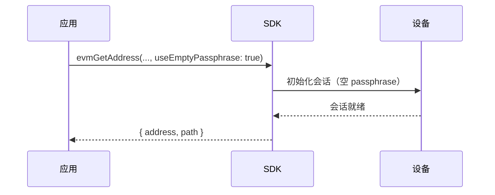
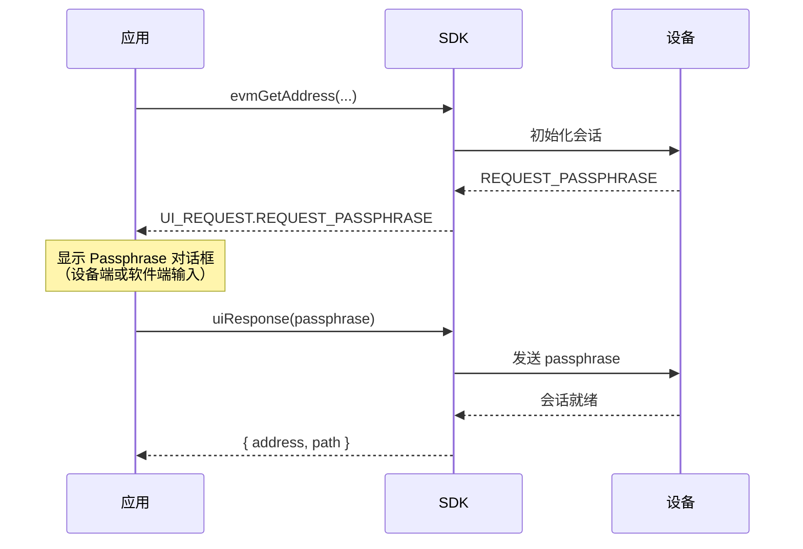
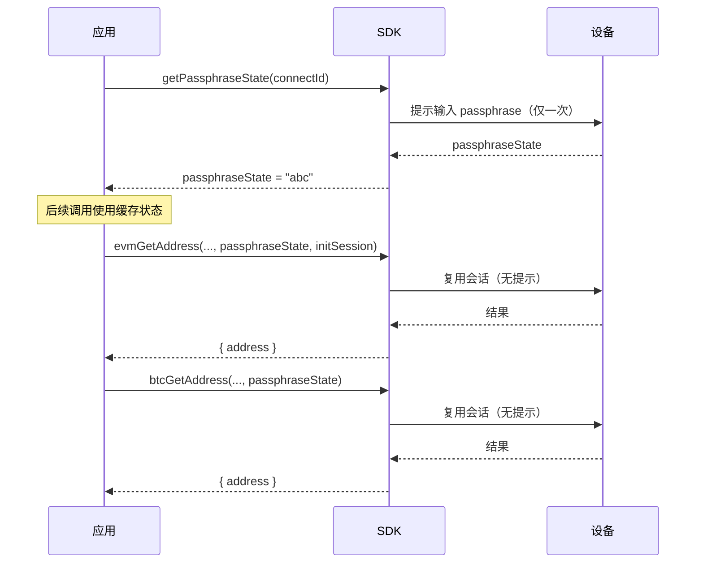

# Passphrase（核心指南）

处理 OneKey 设备 Passphrase（隐藏钱包）的基本规则与最佳实践。

## 关键要点

- **标准钱包** = 助记词 + 空 Passphrase；**隐藏钱包** = 助记词 + 非空 Passphrase（区分大小写）。
- 每个不同的 Passphrase 都会生成完全不同的钱包——即使只差一个字符。
- Passphrase 遗忘后无法恢复，请妥善备份。
- 设置 `useEmptyPassphrase: true` 可强制使用标准钱包。

## 设备支持

| 设备 | 设备端输入 | 软件端输入（主机） |
|------|----------|-----------------|
| Classic | 是 | 是 |
| Classic 1S | 是 | 是 |
| Mini | 是 | 是 |
| Touch | 是（触屏键盘） | 是 |
| Pro | 是（触屏键盘） | 是 |

所有 OneKey 设备均支持 Passphrase 和会话缓存（`passphraseState`）。

## 交互流程

### 主动策略（推荐）

最简单的方式——显式选择标准钱包，避免意外的隐藏钱包提示。



```ts
await HardwareSDK.evmGetAddress(connectId, deviceId, {
  path: "m/44'/60'/0'",
  useEmptyPassphrase: true,
});
```

### 响应式策略（事件驱动）

监听 Passphrase 请求事件，让用户选择输入方式。



```ts
// 选项 A：在设备上输入
HardwareSDK.uiResponse({
  type: UI_RESPONSE.RECEIVE_PASSPHRASE,
  payload: { passphraseOnDevice: true, value: '' },
});

// 选项 B：软件输入（可选择为会话缓存）
HardwareSDK.uiResponse({
  type: UI_RESPONSE.RECEIVE_PASSPHRASE,
  payload: { value: userInput, passphraseOnDevice: false, save: true },
});
```

### 隐藏钱包的会话缓存

通过会话缓存减少重复的 Passphrase 输入提示。



```ts
// 步骤 1：获取 passphrase 状态（仅提示用户一次）
const state = await HardwareSDK.getPassphraseState(connectId);
const passphraseState = state.payload.passphrase_state;

// 步骤 2：后续调用使用 passphraseState（不再提示）
const commonParams = {
  initSession: true,
  passphraseState,
};

await HardwareSDK.evmGetAddress(connectId, deviceId, {
  path: "m/44'/60'/0'/0/0",
  ...commonParams,
});

await HardwareSDK.btcGetAddress(connectId, deviceId, {
  path: "m/84'/0'/0'/0/0",
  coin: 'btc',
  ...commonParams,
});
```

### 跨进程会话复用（CLI / 脚本）

对于短生命周期的进程（CLI 工具、自动化脚本），可以使用 `preloadSessionCache` 持久化并恢复会话。

```ts
import { preloadSessionCache } from '@onekeyfe/hd-core';

// 启动时：从持久化存储恢复会话
const { deviceId, passphraseState, sessionId } = loadFromStorage();
preloadSessionCache(deviceId, passphraseState, sessionId);

// 后续 SDK 调用使用此 passphraseState，跳过 passphrase 提示
await HardwareSDK.evmGetAddress(connectId, deviceId, {
  path: "m/44'/60'/0'/0/0",
  passphraseState,
});
```

> **重要：设备锁定会使会话失效。** 所有 OneKey 设备在锁定时（无论是自动锁屏、手动锁定还是 USB 断开）都会清除 passphrase 会话。锁定后缓存的 `session_id` 失效，用户必须在解锁（输入 PIN）后重新输入 passphrase。会话复用仅在设备保持解锁状态时有效。

### 先解锁模式（CLI 推荐）

对于可能自动锁屏的设备（Touch/Pro），始终先解锁再尝试会话复用：

```ts
// 1. 检查设备是否锁定
const features = await HardwareSDK.getFeatures(connectId);

// 2. 如需要则解锁（设备上输入 PIN）
let wasLocked = false;
if (!features.payload.unlocked) {
  wasLocked = true;
  await HardwareSDK.deviceUnlock(connectId, {});
}

// 3. 仅在设备原本就是解锁状态时复用缓存会话
if (!wasLocked) {
  // 从持久化存储加载 preloadSessionCache
  preloadSessionCache(deviceId, savedPassphraseState, savedSessionId);
} else {
  // 设备曾锁定 → 旧会话失效 → 需要重新输入 passphrase
}
```

## 注意事项

- **不要记录或持久化** Passphrase 明文。
- 使用 `useEmptyPassphrase: true` 防止意外创建隐藏钱包。
- Pro/Touch 设备：PIN 必须在设备上输入；Passphrase 可在设备或软件端输入。

## 常见问题

### 忘记 Passphrase 会怎样？

隐藏钱包中的资金将永久无法访问。没有任何方式可以恢复遗忘的 Passphrase。请务必保留安全备份。

### Passphrase 和 PIN 是同一个东西吗？

不是。PIN 保护设备的物理访问。Passphrase 从同一个助记词创建完全不同的钱包。它们有不同的安全用途：

| | PIN | Passphrase |
|---|-----|-----------|
| 用途 | 设备访问保护 | 隐藏钱包创建 |
| 恢复 | 可通过擦除设备 + 恢复助记词重置 | 无法恢复 |
| 存储 | 存储在设备上 | 不存储在任何地方 |
| 区分大小写 | 不适用（纯数字） | 是 |

### 可以有多个隐藏钱包吗？

可以。每个不同的 Passphrase 创建一个独立的隐藏钱包。你可以拥有任意数量的隐藏钱包——每个 Passphrase 对应一个。

### 设备会验证我的 Passphrase 吗？

不会。设备接受任何 Passphrase 并从中派生钱包。如果你输入了错误的 Passphrase，你会得到一个有效但不同的（空的）钱包。不会出现"Passphrase 错误"的提示。

### `passphraseOnDevice` 和软件输入有什么区别？

- **设备端输入**：Passphrase 直接在硬件设备的屏幕/键盘上输入，永远不会离开设备。
- **软件输入**：Passphrase 在你的应用中输入后通过 SDK 发送到设备。

另请参阅：[通用参数](/zh/hardware-sdk/core-api-guide#common-params)，[事件配置](/zh/hardware-sdk/core-api-guide#events-ui)。
