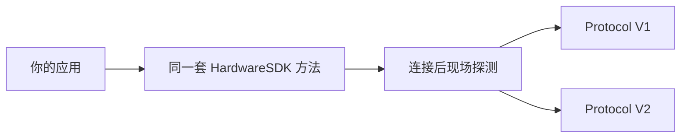

# Protocol V1 与 V2

Hardware SDK 1.2.0 在设备侧使用两套传输协议，对接入方仍然是同一套 JavaScript API。不要用 USB PID、蓝牙名或产品字符串判断协议。



| | Protocol V1 | Protocol V2 |
| --- | --- | --- |
| 当前机型 | Classic、Mini、Touch、Pro | Pro 2、Neo |
| SDK 如何识别 | 连接后的实时响应 | 连接后的实时 `Ping` / 协议探测 |
| 公开方法 | 现有 Hardware SDK 方法 | 同样的方法，由 Core 做映射 |
| 调用规则 | 实践上必须按设备串行 | 必须按设备串行 |
| 固件升级 | `firmwareUpdateV2` / `firmwareUpdateV3` | `firmwareUpdateV4` |
| 链方法 | V1+V2 系列 + 仅 V1 系列 | 只有 V1+V2 系列 |
| 设备快照 | [`getDeviceState`](/zh/hardware-sdk/basic-api/get-device-state)（`getFeatures` 已废弃） | 相同 |

Stellar、Alephium、Nexa、Dynex、Nervos、SCDO、Benfen、Neo 链是仅 V1。Pro 2 / Neo 不支持。完整矩阵：[链支持](/zh/hardware-sdk/concepts/chain-support)。机型 USB / BLE / Air-Gap：[设备](/zh/hardware-sdk/concepts/devices)。

## 如何识别协议

SDK 只认**当前连接**上的实时响应。不要用下面这些东西判断 V1 / V2：

- USB PID / VID
- BLE 广播名
- 产品字符串或外观

如果要持久化上次结果，必须按 `connectId` 分别绑定（同一台设备的 USB 和 BLE 是两个端点）。公开字段是设备对象上的 `connectProtocol`。

在调用上传入 `connectProtocol` 表示严格期望：SDK 不会悄悄切到另一种协议。

## 什么没变

- `HardwareSDK.init({ env })` 选的是**传输**（USB / BLE / 底层插件），不是 Protocol V1 / V2。
- `searchDevices` → `connectId` → `getDeviceState` → 链方法。
- PIN、passphrase、按键确认仍然走 `UI_EVENT`。只有输入类请求才调用 `uiResponse`。见 [Core API Guide](/zh/hardware-sdk/core-api-guide)。

## 不要做的事

- 不要在同一设备上重叠两个业务调用。
- 断开或超时后，不要自动重放签名、擦除或固件升级。
- 不要从响应里取出固件 `session_id` 并存下来。钱包身份是 `deviceId + passphraseState`。见 [钱包会话](/zh/hardware-sdk/concepts/wallet-session)。
- 不要调用 Protocol V2 内部命令（`DeviceSessionGet`、`DeviceInfoGet` 等）。它们不是公开 `CoreApi`。

## 设备状态

请用 [`getDeviceState`](/zh/hardware-sdk/basic-api/get-device-state)。`getFeatures` 只支持 Protocol V1（Classic / Mini / Touch / Pro）；Pro 2 / Neo 会在兼容投影之前被协议门禁拒绝。`getDeviceState` 在 V1 和 V2 上仍会带一份 Features 形状的快照。

```ts
const state = await HardwareSDK.getDeviceState(connectId);
if (!state.success) throw new Error(state.payload.error);
```

只有需要刷新设置或固件分区时才传 `scope: 'settings'` 或 `scope: 'firmware'`。返回值始终是完整快照。

## 下一步

- [设备](/zh/hardware-sdk/concepts/devices)
- [获取设备状态](/zh/hardware-sdk/basic-api/get-device-state)
- [firmwareUpdateV4](/zh/hardware-sdk/device-api/firmwareupdatev4)
