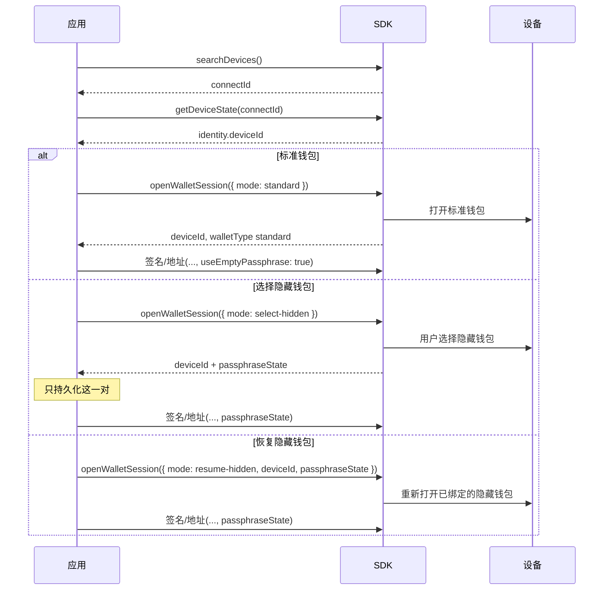

# 钱包会话

本页说的是**硬件**钱包会话：设备当前解锁的是哪一套种子 / passphrase 上下文。

它不是 [Agent Wallet 会话](/zh/agent-wallet/wallet-session)。Agent Wallet 是 OneKey GUI 上的产品。Classic / Pro / Pro 2 / Neo 都有硬件会话，和是否使用 Agent Wallet 无关。

## 公开身份

钱包绑定只持久化这一对字段：

| 字段 | 含义 | 能否持久化 |
| --- | --- | --- |
| `deviceId` | 当前种子生命周期（Features / DeviceState 里的 `device_id`） | 可以 |
| `passphraseState` | 隐藏钱包指纹。标准钱包为 `null` | 隐藏钱包需要 |
| 固件 `session_id` | 设备侧已解锁句柄 | **不要存。** Core 内部持有 |

如果在隐藏钱包上漏传 `passphraseState`，地址和签名 API 可能在**标准钱包**上成功，而且不报错。要么显式传 `useEmptyPassphrase: true`，要么传真正的 `passphraseState`。

## 1.2.0 推荐 API



新接入请用 [`openWalletSession`](/zh/hardware-sdk/basic-api/open-wallet-session) 打开或切换钱包：

```ts
import { OpenWalletSessionMode } from '@onekeyfe/hd-core';

// 标准钱包
const standard = await HardwareSDK.openWalletSession(connectId, {
  mode: OpenWalletSessionMode.Standard,
});

// 用户在设备上选择隐藏钱包
const hidden = await HardwareSDK.openWalletSession(connectId, {
  mode: OpenWalletSessionMode.SelectHidden,
});

// 重新打开已经绑定过的隐藏钱包
const resumed = await HardwareSDK.openWalletSession(connectId, {
  mode: OpenWalletSessionMode.ResumeHidden,
  deviceId: hidden.payload.deviceId,
  passphraseState: hidden.payload.passphraseState,
});
```

保存 `payload.deviceId`、`payload.walletType`、`payload.passphraseState`。之后的地址 / 签名调用带上这些值即可。不要在每次签名前都再开一次 Session。

## 已废弃的兼容 API

[`getPassphraseState`](/zh/hardware-sdk/basic-api/get-passphrase-state) 已废弃。现有应用可以继续用它，并在每次调用上带 `initSession` / `useEmptyPassphrase` / `passphraseState`。Core 仍会映射到 Protocol V1 和 V2。新代码请用 `openWalletSession`。

不要在同一次调用里混用 `openWalletSession({ mode })` 和 `useEmptyPassphrase` / `initSession`。

## Attach-to-PIN

部分 Pro / Pro 2 可以把隐藏钱包绑到专用 PIN。公开 API 仍然返回 `walletType: 'hidden'` 和 `passphraseState`。不要为 Attach-to-PIN 再实现一套会话协议。

如果 SDK 返回 `DeviceCheckUnlockTypeError`，当前解锁方式到不了你要的钱包。先锁上设备，让用户用目标 PIN 解锁；不要对着同一绑定死循环重试。

## 下一步

- [openWalletSession](/zh/hardware-sdk/basic-api/open-wallet-session)
- [标识符](/zh/hardware-sdk/concepts/identifiers)
- [Passphrase](/zh/hardware-sdk/concepts/passphrase)
