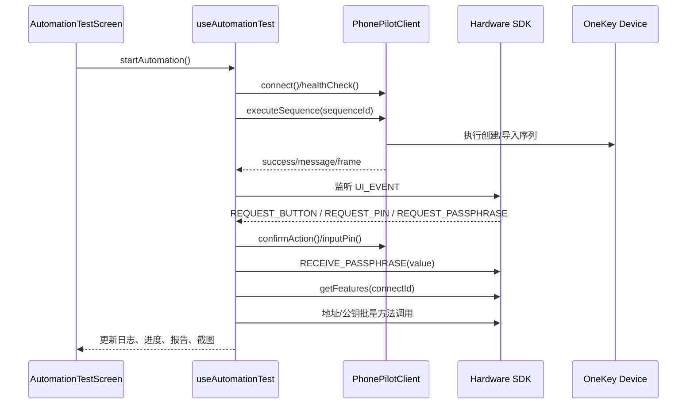

# 硬件钱包自动化测试系统设计文档

## 概述

本文档描述 `expo-example` 当前已经落地的 auto-test 方案。当前实现不再使用早期的 `prepare-device` / `mnemonic` 注入模型，而是统一切换为：

- `PhonePilot execute-sequence` 负责把设备走到目标状态
- `expo-example` 负责 SDK 连接、UI_EVENT 协调、结果校验与报告生成
- 场景配置以 `scenarioIds` 驱动，而不是以本地助记词或 `mnemonicGroups` 驱动
- 只有 `OK-40090` 的 `SLIP39 import` 场景会继续执行 SDK 批量校验

这份文档以当前代码为准，覆盖以下实现文件：

- `packages/connect-examples/expo-example/src/services/phonePilotMcp/index.ts`
- `packages/connect-examples/expo-example/src/services/phonePilotMcp/types.ts`
- `packages/connect-examples/expo-example/src/testTools/automationTest/scenarioCatalog.ts`
- `packages/connect-examples/expo-example/src/testTools/automationTest/scenarioResolver.ts`
- `packages/connect-examples/expo-example/src/testTools/automationTest/useAutomationTest.ts`
- `packages/connect-examples/expo-example/src/atoms/automationAtoms.ts`
- `packages/connect-examples/expo-example/src/views/AutomationTestScreen.tsx`

---

## 1. 核心设计原则

### 1.1 职责分离

| 模块 | 职责 |
|------|------|
| `PhonePilot` | 通过 `execute-sequence` 驱动设备完成创建/导入；在运行中响应确认按钮、PIN 输入、截图、停止等物理操作 |
| `expo-example` | 负责场景选择、测试编排、SDK 调用、UI_EVENT 处理、SLIP39 数据映射、测试报告输出 |
| `scenarioCatalog` | 维护 Jira 场景矩阵、`sequenceId`、suite 支持范围、SLIP39 数据集映射 |
| `scenarioResolver` | 将 `PassphraseVariantId` 解析为 literal，并把 `slip39DatasetId` 映射到现有地址/公钥数据集 |

### 1.2 当前方案边界

当前方案明确不做以下事情：

- 不在 runtime 保存 BIP39 / SLIP39 的导入 seed 数据
- 不通过 `run-scenario` 动态注入创建结果或导入数据
- 不做 Desktop 黑盒验证
- 不再保留旧的 `mnemonicGroups`、`prepare-device`、`screenConfig` 模型

也就是说，设备初始化的唯一业务入口是 `PhonePilot execute-sequence(sequenceId)`。

---

## 2. 系统架构

### 2.1 总体关系

```text
+---------------------+        MCP / HTTP        +---------------------+
|     expo-example    | <----------------------> |      PhonePilot     |
|  场景选择 / Runner   |                          |  机械臂 / 序列执行    |
|  SDK 校验 / 报告     |                          |  confirm / pin / 图像 |
+----------+----------+                          +----------+----------+
           |                                                |
           | SDK / UI_EVENT                                 | 物理操作
           v                                                v
+---------------------+                           +---------------------+
| hardware-js-sdk API |                           |   OneKey Hardware   |
+---------------------+                           +---------------------+
```

### 2.2 运行分层

1. `AutomationTestScreen` 提供连接、场景选择、suite 选择、日志与报告 UI
2. `automationAtoms` 持有配置、进度、日志、截图与报告状态
3. `useAutomationTest` 负责执行主流程
4. `PhonePilotClient` 负责 MCP 通信与工具调用
5. `scenarioCatalog` / `scenarioResolver` 负责场景元数据和 SDK 数据解析

---

## 3. 场景模型

### 3.1 场景字段

当前自动化不再以助记词数组直接驱动，而是以 `AutomationScenario` 作为最小执行单元：

```ts
export interface AutomationScenario {
  id: AutomationScenarioId;
  jiraKey: JiraIssueKey;
  title: string;
  flowType: 'create' | 'import';
  walletType: 'bip39' | 'slip39';
  caseLabel: string;
  wordCount: number;
  shareCount?: number;
  threshold?: number;
  phonePilotSequenceId: string;
  supportedSuites: TestSuiteType[];
  slip39DatasetId?: Slip39DatasetId;
}
```

关键点：

- `phonePilotSequenceId` 是执行时唯一的设备流入口
- `supportedSuites` 决定场景可执行哪些 suite
- `slip39DatasetId` 只在 `OK-40090` 场景下使用，用于映射现有 `slip39Test` 数据
- 不再存在 `importArtifact`、`ScenarioArtifact` 等 seed 载荷字段

### 3.2 当前 Jira 场景矩阵

当前共 15 个 concrete case：

| Jira | 场景 | scenarioId | sequenceId | suites | dataset |
|------|------|------------|------------|--------|---------|
| `OK-26053` | BIP39 create 12 | `ok26053_bip39_create_12` | `bip39-create-12` | `deviceFlow` | - |
| `OK-26053` | BIP39 create 18 | `ok26053_bip39_create_18` | `bip39-create-18` | `deviceFlow` | - |
| `OK-26053` | BIP39 create 24 | `ok26053_bip39_create_24` | `bip39-create-24` | `deviceFlow` | - |
| `OK-26054` | BIP39 import 12 | `ok26054_bip39_import_12` | `bip39-import-12` | `deviceFlow` | - |
| `OK-26054` | BIP39 import 18 | `ok26054_bip39_import_18` | `bip39-import-18` | `deviceFlow` | - |
| `OK-26054` | BIP39 import 24 | `ok26054_bip39_import_24` | `bip39-import-24` | `deviceFlow` | - |
| `OK-5504` | SLIP39 create 20(1-1) | `ok5504_slip39_create_20_1of1` | `slip39-create-20-1of1` | `deviceFlow` | - |
| `OK-5504` | SLIP39 create 20(2-2) | `ok5504_slip39_create_20_2of2` | `slip39-create-20-2of2` | `deviceFlow` | - |
| `OK-5504` | SLIP39 create 20(8-8) | `ok5504_slip39_create_20_8of8` | `slip39-create-20-8of8` | `deviceFlow` | - |
| `OK-5504` | SLIP39 create 20(16-2) | `ok5504_slip39_create_20_16of2` | `slip39-create-20-16of2` | `deviceFlow` | - |
| `OK-40090` | SLIP39 import 20(1-1) | `ok40090_slip39_import_20_1of1` | `slip39-import-20-1of1` | `deviceFlow + sdkAddressBatch + sdkPubkeyBatch` | `count20_one` |
| `OK-40090` | SLIP39 import 20(3-2) | `ok40090_slip39_import_20_3of2` | `slip39-import-20-3of2` | `deviceFlow + sdkAddressBatch + sdkPubkeyBatch` | `count20_two` |
| `OK-40090` | SLIP39 import 20(16-16) | `ok40090_slip39_import_20_16of16` | `slip39-import-20-16of16` | `deviceFlow + sdkAddressBatch + sdkPubkeyBatch` | `count20_three` |
| `OK-40090` | SLIP39 import 33(1-1) | `ok40090_slip39_import_33_1of1` | `slip39-import-33-1of1` | `deviceFlow + sdkAddressBatch + sdkPubkeyBatch` | `count33_one` |
| `OK-40090` | SLIP39 import 33(2-3) | `ok40090_slip39_import_33_2of3` | `slip39-import-33-2of3` | `deviceFlow + sdkAddressBatch + sdkPubkeyBatch` | `count33_two` |

### 3.3 Test suite 定义

当前只保留 3 个真正可执行的 suite：

```ts
export type TestSuiteType = 'deviceFlow' | 'sdkAddressBatch' | 'sdkPubkeyBatch';
```

含义如下：

| suite | 说明 |
|------|------|
| `deviceFlow` | 调用 `PhonePilot execute-sequence`，验证设备端流程是否成功 |
| `sdkAddressBatch` | 基于 `slip39Test/addressData` 执行地址批量校验 |
| `sdkPubkeyBatch` | 基于 `slip39Test/pubKeyData` 执行公钥批量校验 |

---

## 4. PhonePilot 接口约定

### 4.1 当前实际使用的能力

`PhonePilotClient` 当前面向 auto-test 暴露以下能力：

```ts
class PhonePilotClient {
  async connect(): Promise<boolean>;
  async disconnect(): Promise<void>;
  async healthCheck(): Promise<HealthCheckResponse | null>;

  async armConnect(): Promise<ArmConnectResult>;
  async armDisconnect(): Promise<ArmDisconnectResult>;
  async armMove(x: number, y: number, captureFrame?: boolean): Promise<ArmMoveResult>;
  async armClick(depth?: number, captureFrame?: boolean): Promise<ArmClickResult>;
  async captureFrame(): Promise<CaptureFrameResult>;

  async confirmAction(): Promise<ActionResult>;
  async cancelAction(): Promise<ActionResult>;
  async inputPin(pin: string): Promise<ActionResult>;
  async executeSequence(sequenceId: string): Promise<ExecuteSequenceResult>;
  async stopSequence(): Promise<ActionResult>;
}
```

### 4.2 当前与 auto-test 有关的 MCP tools

| Tool | 用途 | 是否关键路径 |
|------|------|-------------|
| `execute-sequence` | 执行 Jira 对应创建/导入设备流 | 是 |
| `confirm-action` | 响应 SDK 的确认按钮请求 | 是 |
| `input-pin` | 响应 SDK 的 PIN 输入请求 | 是 |
| `stop-sequence` | 用户点击“停止执行”时中断 PhonePilot 当前流程 | 是 |
| `capture-frame` | 获取最近截图并显示在页面 | 否 |
| `arm-connect` / `arm-disconnect` | 机械臂连接和断开 | 否 |
| `arm-move` / `arm-click` | 调试用原子能力 | 否 |

### 4.3 不再使用的旧接口

以下接口已经不属于当前方案，不应再作为设计目标：

- `prepare-device`
- `input-passphrase`
- `run-scenario`
- `screenConfig`
- `mnemonicGroups`
- 本地 seed / artifact 注入

### 4.4 execute-sequence 返回要求

Runner 依赖 `execute-sequence` 至少返回：

```ts
export interface ExecuteSequenceResult {
  success: boolean;
  message: string;
  sequenceId?: string;
  sequenceName?: string;
  stepsCompleted?: number;
  totalSteps?: number;
  frame?: string;
}
```

其中：

- `success` / `message` 用于判定 `deviceFlow` 成败
- `sequenceId` / `stepsCompleted` / `totalSteps` 会被写入测试报告元数据
- `frame` 会被展示为自动化页面中的最近一帧

---

## 5. Runner 执行流程

### 5.1 启动条件

`useAutomationTest` 启动自动化前需要满足：

- `PhonePilot` 已连接
- `SDK` 已初始化
- `selectedDevice.connectId` 可用
- 至少选择 1 个 `scenarioId`
- 至少选择 1 个 `testSuite`

### 5.2 主流程



### 5.3 关键执行逻辑

#### 第一步：设备流执行

每个场景先执行 `deviceFlow`：

```ts
await client.executeSequence(scenario.phonePilotSequenceId);
```

行为说明：

- 成功时生成一条 `Device Flow` suite 结果
- 失败时该场景直接失败，其余 SDK suites 标记为 skipped
- 如果返回 `frame`，立即更新页面截图

#### 第二步：UI_EVENT 协调

当前 `UI_EVENT` 处理策略如下：

| UI_EVENT | 当前处理方式 |
|----------|-------------|
| `REQUEST_BUTTON` | 调 `PhonePilot confirmAction()` |
| `REQUEST_PIN` | 调 `PhonePilot inputPin('1111')`，再回 `RECEIVE_PIN` |
| `REQUEST_PASSPHRASE` | 不通过 PhonePilot 输入，直接用 SDK `RECEIVE_PASSPHRASE` 回传 literal |

这里有一个重要差异：

- `PIN` 仍由 PhonePilot 进行设备侧物理输入
- `Passphrase` 当前由 runner 通过 SDK 直接返回 literal，不走 PhonePilot 工具

#### 第三步：SLIP39 SDK 校验

只有带 `slip39DatasetId` 的 `OK-40090` 场景会跑 SDK batch：

1. 先 `sdk.getFeatures(connectId)` 读取最新 `deviceId`
2. 再按 `scenarioResolver` 解析出的地址/公钥 case 列表逐个执行
3. 按 `passphraseVariants` 过滤要跑的隐藏钱包变体

如果 `deviceFlow` 失败，或 `deviceId` 获取失败，则后续 SDK suites 直接失败或跳过。

---

## 6. 数据解析策略

### 6.1 BIP39 策略

BIP39 当前只保留场景级元数据，不在 runtime 存储导入助记词：

- `OK-26053`：只执行创建流程的 `deviceFlow`
- `OK-26054`：只执行导入流程的 `deviceFlow`
- 具体导入词组由 PhonePilot 原生 sequence 自己维护

这样可以避免：

- 在 `expo-example` runtime 打进整份 seed 数据
- 设计文档与 PhonePilot 真正执行的词组发生漂移
- 本地测试代码继续依赖已废弃的 seed 注入机制

### 6.2 SLIP39 策略

SLIP39 的设备导入流程也由 PhonePilot sequence 负责，但 SDK 校验仍复用仓库里的现有数据：

- 地址数据：`testTools/slip39Test/addressData`
- 公钥数据：`testTools/slip39Test/pubKeyData`

`scenarioResolver` 通过 `slip39DatasetId` 组装 case id：

```ts
count20_one + passphrase_2 -> count20_one_passphrase_2
count33_two + normal -> count33_two_normal
```

### 6.3 Passphrase literal 映射

当前隐藏钱包密码短语映射如下：

#### BIP39

| variant | literal |
|---------|---------|
| `normal` | `undefined` |
| `passphrase_empty` | `''` |
| `passphrase_1` | `asdfg7890` |
| `passphrase_2` | `1234567890qwertyuiopasdfghjklzxcvbnm` |

#### SLIP39

| variant | literal |
|---------|---------|
| `normal` | `undefined` |
| `passphrase_empty` | `''` |
| `passphrase_1` | `12345` |
| `passphrase_2` | `onekey` |

页面会在配置区明确提示：

- 报告展示 literal
- `SLIP39` 的 `passphrase_1 = 12345`
- `SLIP39` 的 `passphrase_2 = onekey`

---

## 7. 配置与状态管理

### 7.1 AutomationTestConfig

当前配置模型如下：

```ts
export interface AutomationTestConfig {
  scenarioIds: AutomationScenarioId[];
  testSuites: TestSuiteType[];
  passphraseVariants: PassphraseVariantId[];
  phonePilotUrl: string;
  stopOnFirstError: boolean;
  retryCount: number;
  delayBetweenTests: number;
}
```

默认值：

```ts
{
  scenarioIds: ['ok26054_bip39_import_12', 'ok40090_slip39_import_20_1of1'],
  testSuites: ['deviceFlow', 'sdkAddressBatch', 'sdkPubkeyBatch'],
  passphraseVariants: ['normal', 'passphrase_2'],
  phonePilotUrl: process.env.EXPO_PUBLIC_PHONEPILOT_URL || 'http://localhost:3847',
  stopOnFirstError: false,
  retryCount: 1,
  delayBetweenTests: 500,
}
```

### 7.2 Jotai atoms

当前页面实际使用的 atoms：

| atom | 作用 |
|------|------|
| `phonePilotConnectionStateAtom` | PhonePilot 连接状态 |
| `cameraFrameAtom` | 最近一帧截图 |
| `automationConfigAtom` | 自动化配置 |
| `automationProgressAtom` | 运行进度 |
| `automationReportAtom` | 最终报告 |
| `automationLogsAtom` | 实时日志 |
| `isAutomationRunningAtom` | 是否处于运行中 |
| `canStartAutomationAtom` | 是否满足启动条件 |
| `progressPercentageAtom` | suite 级进度百分比 |

### 7.3 Progress 与 Report 结构

#### Progress

```ts
export interface TestProgress {
  currentScenarioId: AutomationScenarioId | null;
  currentScenarioTitle: string | null;
  currentPassphrase: string | null;
  currentTestSuite: TestSuiteType | null;
  currentTestIndex: number;
  totalTests: number;
  completedScenarios: number;
  totalScenarios: number;
  completedSuites: number;
  totalSuites: number;
  status: 'idle' | 'preparing-device' | 'running' | 'paused' | 'done' | 'error';
  errorMessage?: string;
}
```

#### Report

```ts
export interface TestReport {
  startTime: number;
  endTime: number;
  duration: number;
  totalScenarios: number;
  passedScenarios: number;
  failedScenarios: number;
  skippedScenarios: number;
  scenarioResults: ScenarioReportResult[];
}
```

报告按 `scenario -> suite -> case` 三层组织，页面直接按这个结构展示。

---

## 8. UI 设计要点

`AutomationTestScreen` 当前页面包含 5 个主区域：

1. `PhonePilot 连接`
   - 输入 MCP 地址
   - 连接 / 断开
   - 获取截图
2. `Jira 场景矩阵`
   - 按 Jira key 分组勾选 concrete case
   - 每条场景展示 `sequenceId` 和支持的 suite
3. `执行 suite`
   - 选择 `deviceFlow` / `sdkAddressBatch` / `sdkPubkeyBatch`
4. `隐藏钱包密码短语变体`
   - 选择 `normal` / `passphrase_empty` / `passphrase_1` / `passphrase_2`
5. `Runner 行为 / 进度 / 日志 / 报告`
   - 停错策略、重试次数、间隔时间
   - 进度卡片
   - 运行日志
   - 场景级报告

页面不再出现：

- Desktop 配置区
- Desktop suite
- mnemonic group 勾选区
- prepare-device 相关文案

---

## 9. 失败策略与重试

### 9.1 重试

`runWithRetry()` 会对关键操作按 `retryCount` 重试，当前主要用于：

- `execute-sequence`
- 其他关键 SDK 校验步骤中的异常恢复

### 9.2 stopOnFirstError

当前语义是：

- 默认关闭时，按 suite 粒度继续执行，能跑的尽量继续跑
- 打开时，只要某个场景下有 suite 失败，就停止后续场景

### 9.3 suite 失败联动

| 情况 | 行为 |
|------|------|
| `deviceFlow` 失败 | 当前场景标记 failed，其余 SDK suites 标记 skipped |
| `deviceId` 获取失败 | SDK suites 标记 failed |
| 某个 SDK case 失败 | 当前 suite failed；是否继续跑后续 suite 取决于 `stopOnFirstError` |

---

## 10. 当前非目标与后续扩展

### 10.1 当前非目标

以下内容不在本期设计范围内：

- Desktop 黑盒验证
- 创建场景返回 artifact 并做本地派生校验
- Jest 兜底校验本地 seed 数据
- 在文档中维护导入助记词明文

### 10.2 可扩展方向

后续如果需要增强，可以在当前模型上继续扩展：

1. 给 `scenarioCatalog` 增加更多 Jira 场景
2. 给 `supportedSuites` 增加新 suite 类型
3. 把 `execute-sequence` 扩展为返回更细粒度步骤信息
4. 为报告增加导出能力或历史记录

---

## 附录

### A. 当前 PhonePilot 相关工具清单

| Tool | 描述 |
|------|------|
| `execute-sequence` | 执行设备创建/导入完整序列 |
| `confirm-action` | 执行设备确认 |
| `input-pin` | 输入设备 PIN |
| `stop-sequence` | 停止当前序列 |
| `capture-frame` | 获取截图 |
| `arm-connect` | 连接机械臂 |
| `arm-disconnect` | 断开机械臂 |
| `arm-move` | 移动机械臂 |
| `arm-click` | 执行点击 |

### B. 相关资源

- [PhonePilot 项目](../../../../../PhonePilot)
- [hardware-js-sdk 文档](https://developer.onekey.so/)
- [MCP Protocol 规范](https://modelcontextprotocol.io/)
